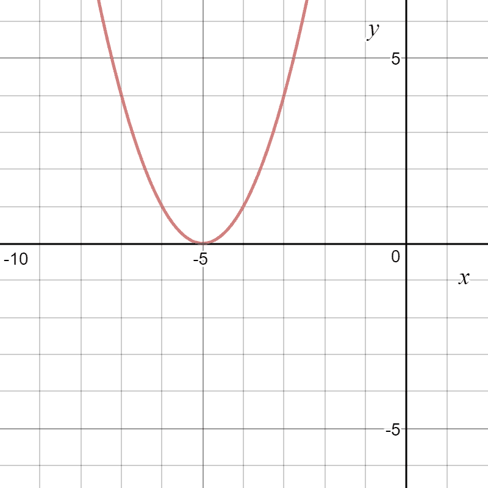
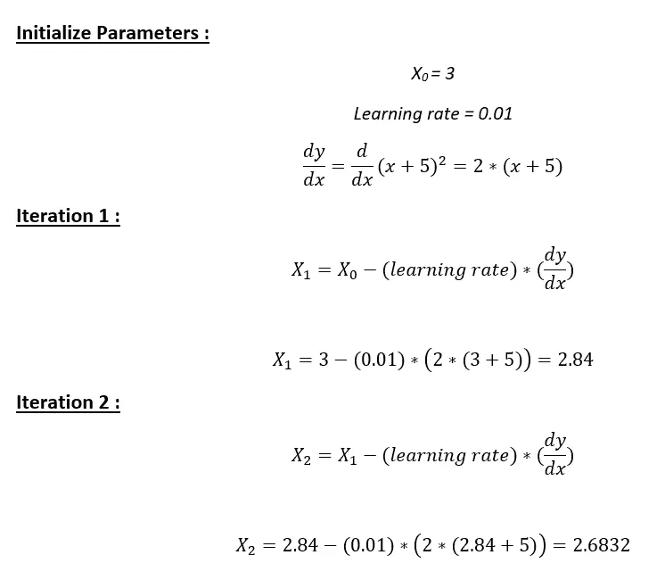
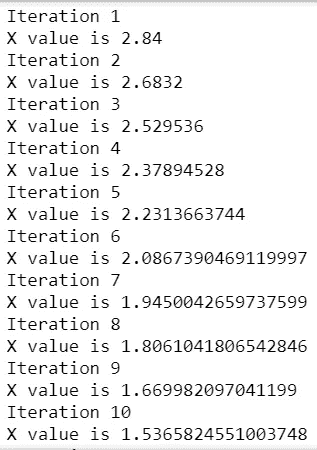

# 在 Python 中实现梯度下降

> 原文：<https://towardsdatascience.com/implement-gradient-descent-in-python-9b93ed7108d1?source=collection_archive---------0----------------------->

# **什么是梯度下降？**

这是一种寻找函数最小值的优化算法。我们从函数上的一个随机点开始，沿着函数的**梯度的**负方向**移动，到达**局部/全局最小值**。**


Homer descending !

# **手动示例:**

**问题**:求从点 x=3 开始的函数 y=(x+5)的局部极小值



**解法:**我们只要看图就知道答案了。当 x = -5 时，y = (x+5)达到最小值(即当 x=-5，y=0 时)。因此 x=-5 是函数的局部和全局最小值。

现在，让我们看看如何使用梯度下降获得相同的数值。

**第一步**:初始化 x =3。然后，求函数的梯度，dy/dx = 2*(x+5)。

**第二步**:向渐变的负方向移动([为什么？](https://www.khanacademy.org/math/multivariable-calculus/multivariable-derivatives/gradient-and-directional-derivatives/v/why-the-gradient-is-the-direction-of-steepest-ascent))。但是等等，要移动多少？为此，我们需要一个学习率。让我们假设**学习率→ 0.01**

**步骤 3** :让我们执行 2 次梯度下降迭代



**第四步**:我们可以观察到 X 值在慢慢减小，应该收敛到-5(局部最小值)。然而，我们应该执行多少次迭代呢？

让我们在算法中设置一个精度变量，用于计算两个连续“x”值之间的差值。如果连续两次迭代的 x 值之差小于我们设置的精度，停止算法！

# **Python 中的渐变下降:**

**第一步**:初始化参数

```
cur_x = 3 # The algorithm starts at x=3
rate = 0.01 # Learning rate
precision = 0.000001 #This tells us when to stop the algorithm
previous_step_size = 1 #
max_iters = 10000 # maximum number of iterations
iters = 0 #iteration counter
df = lambda x: 2*(x+5) #Gradient of our function 
```

**步骤 2** :运行一个循环执行梯度下降:

I .当两次连续迭代的 x 值之差小于 0.000001 或迭代次数超过 10，000 时，停止循环

```
while previous_step_size > precision and iters < max_iters:
    prev_x = cur_x #Store current x value in prev_x
    cur_x = cur_x - rate * df(prev_x) #Grad descent
    previous_step_size = abs(cur_x - prev_x) #Change in x
    iters = iters+1 #iteration count
    print("Iteration",iters,"\nX value is",cur_x) #Print iterations

print("The local minimum occurs at", cur_x)
```

**输出**:从下面的输出中，我们可以观察到前 10 次迭代的 x 值——这可以与我们上面的计算进行交叉检查。该算法在终止之前运行 595 次迭代。下面嵌入了代码和解决方案以供参考。



在 [LinkedIn](https://www.linkedin.com/in/rohan-joseph-b39a86aa/) 上连接。