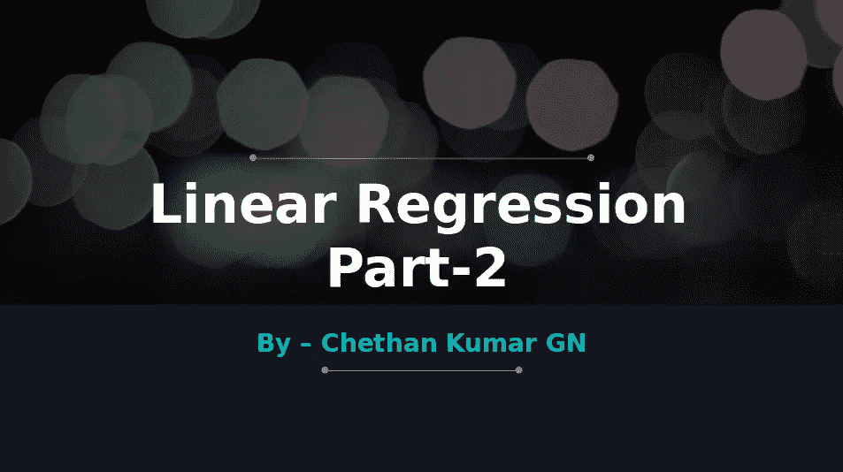
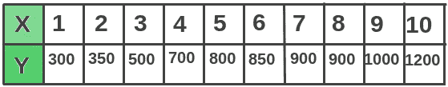
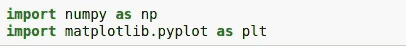
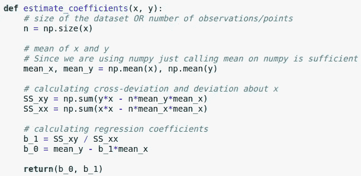
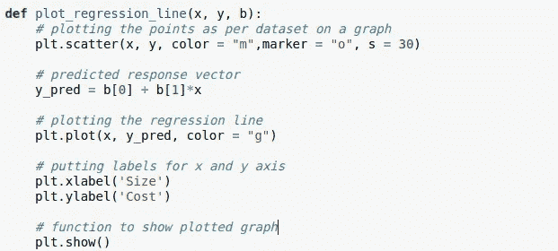
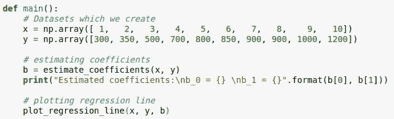
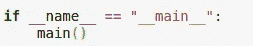
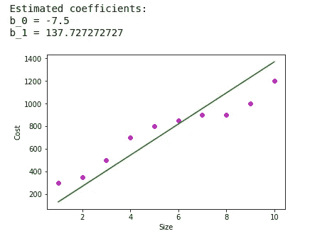

# 线性回归(第 2 部分):用 python 实现，从头开始的例子。

> 原文：<https://towardsdatascience.com/implementation-linear-regression-in-python-in-5-minutes-from-scratch-f111c8cc5c99?source=collection_archive---------5----------------------->

5 分钟机器学习实现示例。用 python 实现多元线性回归模型(第 3 部分)。

Linear Regression

> **先决条件:** [***【线性回归(第一部分)***](/linear-regression-part-1-types-examples-gradient-descent-example-2e8c22b05f61)

既然理论已经讨论过了，现在让我们从实际的实现开始。有不同的数据集可用，但让我们用自己的数据集来实现它。简单的线性回归有因变量(Y)和自变量(X)。

# 步骤 1:准备数据集

dataset to be used

*   X —房子大小从 1K 平方英尺到 10K 平方英尺。
*   Y —从 30 万到 120 万的房价。

所以我们的数据集已经准备好了，因为它是一个简单的线性回归，所以我们只有一个因素:房子的大小影响房子的价格。在多元线性回归的情况下，我们会有更多的因素影响房价，如位置、房间数量等。(这将在线性回归 ie 的下一部分中实现。第三部分)。

Plotted data on a graph

现在我们需要找到**回归线**(在上面的散点图中最符合的一条**线，这样我们就可以预测响应 **y** (即。房子的成本)为任何新的价值 **x** (即。房子的大小)。**

# 第二步:让我们开始编码吧！！！

> ***导入所需库***

1.  Numpy 是 Python 编程语言的一个库。我们在机器学习中使用它，因为我们必须在机器学习中处理大量数据，这比普通数组更快。(习惯了 numpy 数组，我们在哪里都会用到)。有关安装说明[，请点击此处](https://askubuntu.com/questions/868599/how-to-install-scipy-and-numpy-on-ubuntu-16-04)。
2.  Matplotlib : Matplotlib 是 Python 编程语言及其数字数学扩展 NumPy 的绘图库。基本上，这有助于绘制图表。

这里我们使用了“numpy as np”和“matplotlib.pyplot as plt ”,这样做是为了将庞大的名称重命名为较小的名称(便于使用)。而不是写 **1** 。***numpy . array()***简称为 **np.array()
2。 *matplotlib.pyplot.plot(x，y)*** 简称为 **plt.plot(x，y)**这些都是为了便于编码。

如何知道自己是否安装正确？？运行上面两行的文件，如果没有发现错误，就可以运行了。

> ***定义所需功能***

***Function1:*** 这是一个确定或估计系数的函数，其中 x 和 y 值被传递到该函数中。

**步骤包括:**

1.  计算 n
2.  计算 x 和 y 数组的平均值。
3.  计算交叉偏差和偏差:记住这里我们计算的是 SS_xy 和 SS_xx，它们是误差平方和。如前文所述 [***【线性回归(第一部分)***](/linear-regression-part-1-types-examples-gradient-descent-example-2e8c22b05f61) ***。***
4.  计算回归系数:回归线需要移动的量或值。

**功能 2** :根据计算值绘制图形的功能。

**步骤包括:**

1.  绘制点:" **plt.scatter** "在图上绘制点，其中

*   “ **x 和 y** 是图上点的位置
*   **颜色**是标绘点的颜色，将其更改为红色或绿色或橙色，并尝试更多可能的颜色 [**点击此处**](https://matplotlib.org/api/_as_gen/matplotlib.pyplot.scatter.html) **。**
*   **【马克笔】**是点的形状像一个圆或者其他什么符号代表不同类型的马克笔 [***在这里找到***](https://matplotlib.org/api/markers_api.html#module-matplotlib.markers) ***。***

2.**预测回归线值**:取可能的最小误差，回归线在此决定。

3.**绘制回归线**

4.标签放在这里，而不仅仅是 x 和 y，即 x 和 y 的名称放在这里的图表上。

5.**显示绘制的图形**

**功能 3** :主功能

**步骤包括:**

1.  收集 ie 所需的数据集。x 和 y。
2.  计算所需的系数。回归线在 x 和 y 方向上的移动值。
3.  绘制图表

最后，编写 main 并调用 main 函数:

所以最终结果，

因此，如果在这里询问 7Ksq 英尺大小的房子的价格，答案将是 92 万左右，而实际价值将是 90 万左右，因此误差为 2 万。

在 [GitHub](https://github.com/chethangn/SimpleLinearRegression) 上找到代码，链接如下:
[https://github.com/chethangn/SimpleLinearRegression](https://github.com/chethangn/SimpleLinearRegression)

> **更多参考资料:**

1.  [***人工智能是真实存在的还是只是这十年的炒作？？***](https://becominghuman.ai/artificial-intelligence-real-or-is-it-just-an-hype-of-this-decade-fear-what-learn-history-go-game-ac4476badf1b)
2.  [***人工智能:定义、类型、实例、技术***](https://medium.com/@chethankumargn/artificial-intelligence-definition-types-examples-technologies-962ea75c7b9b)
3.  [***人工智能 vs 机器学习***](https://medium.com/@chethankumargn/artificial-intelligence-vs-machine-learning-3c599637ecdd)
4.  [***机器学习为什么要实现人工智能？***](https://medium.com/@chethankumargn/why-machine-learning-for-achieving-artificial-intelligence-the-need-for-machine-learning-c69667b4a51f)
5.  *[***机器学习类型和算法***](https://becominghuman.ai/machine-learning-types-and-algorithms-d8b79545a6ec)*
6.  *[***【线性回归部分-1】***](/linear-regression-part-1-types-examples-gradient-descent-example-2e8c22b05f61)*

> *接下来是 ***线性回归(第 3 部分),我们将实现多元线性回归。****

*请务必关注我的****，**[**LinkedIn**](http://www.linkedin.com/in/chethankumargn)**，**[**Twitter**](https://twitter.com/chethan1gn)**，**[**insta gram**](https://www.instagram.com/data_science_by_chethan/)**获取更多更新。如果你喜欢这篇文章，请鼓掌并分享它。*****

*****在这里加入我们的 [**WhatsApp**](https://chat.whatsapp.com/LLwBIyYYcABEV31ZFI7QR3) 社区。*****