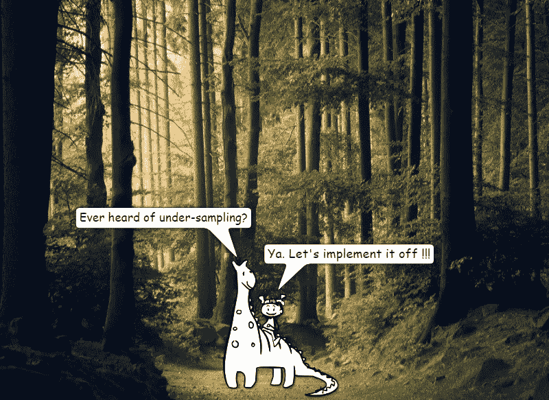
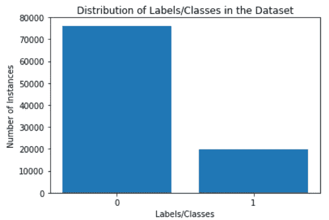

# 基于聚类质心的多数欠采样技术在 Python 中的实现

> 原文：<https://towardsdatascience.com/implementation-of-cluster-centroid-based-majority-under-sampling-technique-ccmut-in-python-f006a96ed41c?source=collection_archive---------7----------------------->



在机器学习和深度学习中，**数据不平衡**分别是许多分类算法和深度神经网络性能下降的主要原因。**不平衡数据**是指属于不同类或类别的实例或样本数量不相等，差异显著。二进制不平衡数据的一个这样的例子是 19668 个，其中有 2 个类，但包含不相等数量的实例，76，090 个实例带有标签“0 ”,而 76，090 个实例带有标签“1 ”:



**Binary Imbalanced Data**

为了最小化不平衡的程度，必须将**数据挖掘**和**特征空间几何**整合到解决机器学习分类问题的经典方法中。有许多用于数据平衡的数据挖掘方法。一种重要的方法是**基于聚类质心的多数欠采样技术** ( **CCMUT** )。

在多数欠采样中，不重要(或不那么重要)的实例在多数样本中被移除。在 CCMUT 中，重要和不重要实例的划分是通过使用特征空间几何上的**聚类**概念来完成的。

聚类是一种无监督的学习方法。但是 CCMUT 仅使用寻找聚类质心的概念(聚类是围绕属于多数类的数据点创建的)，因为实例已经被标记。通过在属于特征空间中多数类的数据点上获得所有特征的平均特征向量**来找到聚类质心。**

在找到多数类的聚类质心之后，在特征空间中距离聚类质心**最远的属于该聚类(多数类)的实例**被认为是最不重要的实例。相反，属于多数类的实例，即在特征空间中最接近聚类质心的实例**，**被认为是最重要的实例。

因此，在 CCMUT 中，属于多数类的实例根据其重要性被删除，欠采样的样本数取决于欠采样或 CCMUT 的 **%。**

**CCMUT 的 Python 实现:**

从实现角度来看，特征空间几何中的所有距离都被认为是**欧几里德距离**。

下面以函数 CCMUT()的形式给出了 CCMUT 的 Python 实现，它采用:

1.  多数样本矩阵= X
2.  CCMUT 或欠采样的百分比= f

作为自变量，并返回欠采样后的多数样本矩阵= X_f。

```
import numpy as np
from math import sqrtdef **CCMUT**(X,f):
    # 1\. finding cluster centroid....
    cluster_centroid = np.sum(X,axis=0)/X.shape[0]
    # 2\. finding **Euclidean Distance** from cluster centroid to samples
    euclidean = [None]*X.shape[0]
    for i in range(0,X.shape[0]):
        euclidean[i] = sqrt(sum((cluster_centroid-X[i])**2))
    # 3\. tracking indices of samples in descending order of distance
    indices = list(reversed(sorted(range(len(euclidean)), 
    key = lambda j: euclidean[j])))
    # 4\. removing the instances or under-sampling order-wise....
    X_f = np.delete(X, indices[:int(f/100*X.shape[0])], axis=0)
    # 5\. returning the under-sampled Majority Sample Matrix
    return X_f
```

因此，使用多数样本矩阵和%欠采样调用 CCMUT()，将获得欠采样多数样本矩阵。显然，在欠采样之后，它不会以大幅度或差异被称为**多数。**

此后，欠采样的多数样本矩阵可以与少数样本矩阵连接(在 CCMUT 之前被分离),并被混洗以用于使用机器学习的预测分析或预测分类模型开发。

也有许多可用的研究，其中 CCMUT 已被直接应用或经过某些修正。

1.  使用 AdaBoost 改进说话人确认决策的基于聚类的欠采样技术*IAPR 模式识别统计技术国际联合研讨会(SSPR)* 。施普林格，柏林，海德堡，2004。
2.  甄子丹、秀珍和李月诗。"不平衡数据分布的基于聚类的欠采样方法."*专家系统与应用*36.3(2009):5718–5727。
3.  拉赫曼、莫斯塔菲祖尔和戴维斯。“不平衡心血管数据的基于聚类的欠采样。”世界工程大会会议录。第三卷。2013.
4.  Sobhani，Parinaz，Herna Viktor 和 Stan Matwin。“使用集成方法和基于聚类的欠采样从不平衡数据中学习。”*采矿复杂模式新前沿国际研讨会*。施普林格，查姆，2014 年。
5.  Srividhya 和 R. Mallika。"基于欠采样的聚类同心圆处理不平衡数据."*中东科学研究杂志*24(2016):314–319。
6.  阿奴拉达、那伽苏里和 g .帕萨萨拉迪瓦尔玛。"基于抽样技术聚类的非平衡数据分类方法."*印度科技期刊* 10.18 (2017)。
7.  阿拉法特，医学博士亚希尔，萨贝拉霍克，和万德医学博士法里德。“基于聚类的欠采样随机森林多类不平衡分类。” *2017 第十一届软件、知识、信息管理与应用国际会议(SKIMA)* 。IEEE，2017。