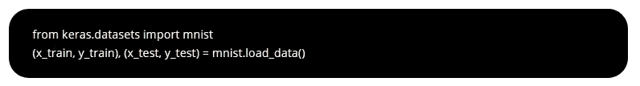
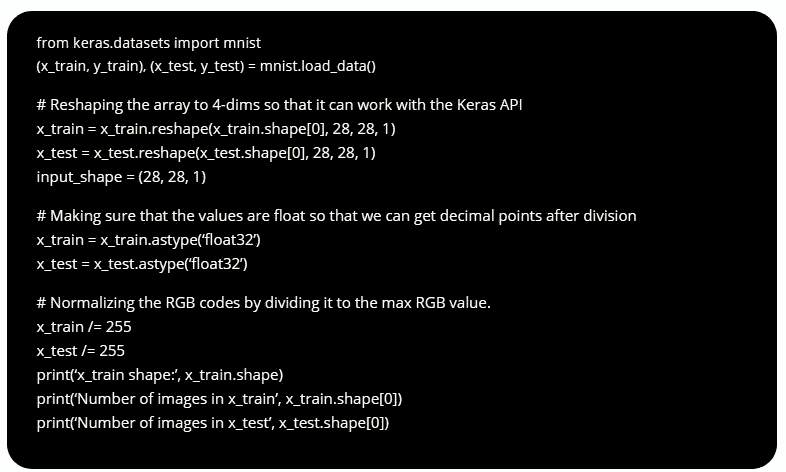
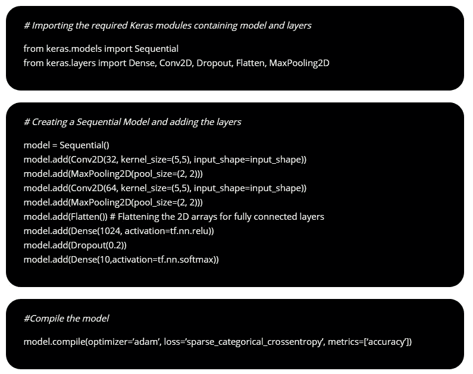
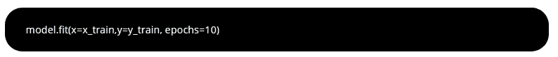
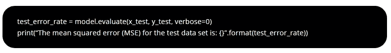
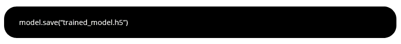
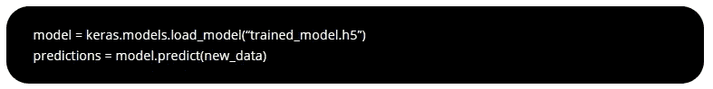

# 用 Keras 实现卷积神经网络

> 原文：<https://towardsdatascience.com/implementation-of-convolutional-neural-network-using-keras-9ace67916c07?source=collection_archive---------13----------------------->

在本文中，我们将看到在 MNIST 数据集上使用 Keras 实现卷积神经网络(CNN ),然后将结果与常规神经网络进行比较。强烈建议在继续学习 CNN 实现之前，先阅读文章[“卷积神经网络—简而言之”](https://engmrk.com/convolutional-neural-network-3/)，以培养对 CNN 的直觉。

# 1-简介

MNIST 数据集最常用于影像分类研究。MNIST 数据库包含美国人口普查局雇员和美国高中生手写的数字图像，从 0 到 9。分为 6 万张训练图像和 1 万张测试图像。Tensorflow 和 Keras 都允许我们使用 API 直接下载 MNIST 数据集。

# 2-使用 API 下载数据集

我们将只使用两行代码来导入 TensorFlow 并在 Keras API 下下载 MNIST 数据集。我们将把数据分配到训练集和测试集中。x_train 和 x_test 部分包含灰度 RGB 代码(从 0 到 255 ),而 y_train 和 y_test 部分包含从 0 到 9 的标签。
我们将使用‘matplotlib’库可视化图像。

需要强调的是，MNIST 数据集中的每幅图像大小为 28 X 28 像素，这意味着 x_train 的形状为(60000，28，28 ),其中 60，000 是样本数。作为通过 Keras API 进行处理的要求，我们必须将 x_train 从 3 维重塑为 4 维。此外，我们必须标准化我们的数据，否则我们的计算成本将非常高。我们可以通过将 RGB 代码划分为 255 来实现，如下所示:

# 3-卷积神经网络结构

首先，我们将卷积神经网络架构定义如下:

1-第一个隐藏层是一个卷积层，称为卷积 2D。我们将使用 32 个尺寸为 5×5 的过滤器。

2-然后是池大小为 2×2 的最大池层。

3-具有 64 个滤波器的另一个卷积层，每个滤波器的大小为 5×5。

4-然后是池大小为 2×2 的最大池层。

5-然后下一步是扁平化层，在建立完全连接的层之前，将 2D 矩阵数据转换为 1D 矢量。

6-之后，我们将使用一个具有 1024 个神经元和 relu 激活功能的全连接层。

7-然后我们将使用一个正则化层称为辍学。它被配置为随机排除该层中 20%的神经元，以减少过度拟合。

8-最后，输出层，其具有用于 10 个类别的 10 个神经元和用于输出每个类别的概率状预测的 softmax 激活函数。

决定上述内容后，我们可以用如下几行代码建立一个神经网络模型:

> ***注:***
> 
> *–注释带有' # '来解释命令。*
> 
> *–您可以下载* [*iPython 笔记本*](https://estore.engmrk.com/product/module-22-cnn-using-keras/) *并在您的 PC 上训练模型，或者只是复制并粘贴这些代码。py 文件。*

**步骤 1 —创建模型:**

Keras 首先创建一个模型对象的新实例，然后一个接一个地向其添加层。它被称为顺序模型 API。我们可以通过调用 model.add 并传入我们想要添加的层的类型来向神经网络添加层。最后，我们将用两个重要信息编译模型，损失函数和成本优化算法。

一旦我们执行了上面的代码，Keras 将在幕后构建一个 TensorFlow 模型。

**步骤 2 —训练模型:**

我们可以通过调用 model.fit 并传入训练数据和预期输出来训练模型。Keras 将运行培训过程，并将进度打印到控制台。训练完成后，它将报告训练数据达到的最终准确度。

**步骤 3 —测试模型:**

我们可以通过调用 model.evaluate 并传入测试数据集和预期输出来测试模型。

**步骤 4 —保存并加载模型:**

一旦达到最佳结果，我们可以使用 model.save 保存模型，并传入文件名。这个文件将包含我们在另一个程序中使用我们的模型所需要的一切。

您的模型将以扩展名为. h5 的分层数据格式(HDF)保存。它包含科学数据的多维数组。

我们可以通过调用 load model 函数并传入一个文件名来加载之前训练好的模型。然后，我们调用 predict 函数并传入新数据进行预测。

**总结**

*   我们学习了如何加载 MNIST 数据集并对其进行归一化。
*   我们学习了使用 Keras 实现 CNN。
*   我们看到了如何保存训练好的模型并在以后加载它进行预测。
*   准确率超过 98%,这比我们用常规神经网络实现的准确率高得多。