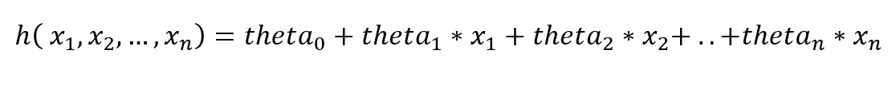
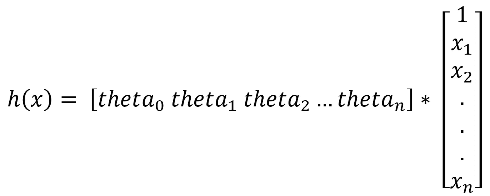
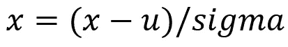
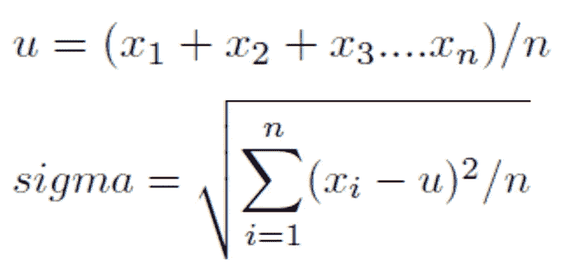
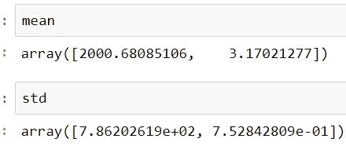
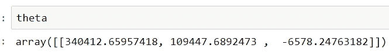
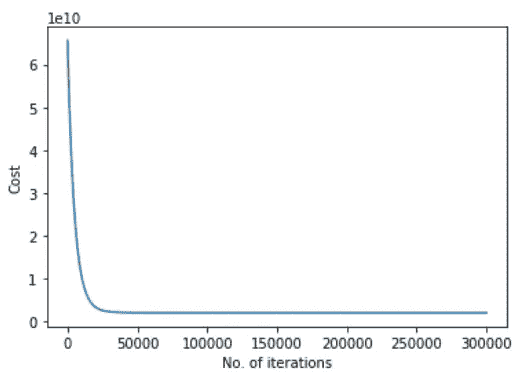
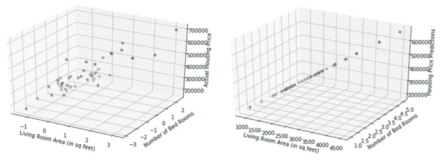

# 从零开始使用梯度下降优化在 Python 中实现多变量线性回归

> 原文：<https://towardsdatascience.com/implementation-of-multi-variate-linear-regression-in-python-using-gradient-descent-optimization-b02f386425b9?source=collection_archive---------5----------------------->

## 学习、实施和调整…


机器学习的大多数实际应用涉及目标结果所依赖的多个特征。类似地，在回归分析问题中，存在目标结果依赖于许多特征的情况。多元线性回归是解决这类问题的一种可能的方法。在本文中，我将讨论多变量(多特征)线性回归，它的 Python 实现，在一个实际问题上的应用和性能分析。

由于它是一种“线性”回归技术，在构建假设时，将只采用每个特征的**线性**项。设 x_1，x_2，… x_n 是目标结果所依赖的特征。然后，多元线性回归的假设:



where **theta_0, theta_1, theta_2, theta_3,…., theta_n** are the parameters

此外，上述假设也可以根据向量代数重新构建:



还有一个与依赖于参数θ_ 0，θ_ 1，θ_ 2，…，θ_ n 的假设相关的成本函数(或损失函数)

这里的成本函数与多项式回归的情况相同[1]。

因此，这些参数θ_ 0，θ_ 1，θ_ 2，…，θ_ n 必须采用这样的值，对于这些值，成本函数(或简单地成本)达到其可能的最小值。换句话说，必须找出成本函数的最小值。

在这种情况下，分批梯度下降可用作优化策略。

**使用批量梯度下降实现多元线性回归:**

实现是通过创建 3 个模块来完成的，每个模块用于在培训过程中执行不同的操作。

=> hypothesis():是计算并输出目标变量的假设值的函数，给定 theta (theta_0，theta_1，theta_2，theta_3，…，theta_n)，矩阵中的特征，维数为[m X (n+1)]的 X 其中 m 是样本数，n 是特征数。假设()的实现如下所示:

```
def **hypothesis**(theta, X, n):
    h = np.ones((X.shape[0],1))
    theta = theta.reshape(1,n+1)
    for i in range(0,X.shape[0]):
        h[i] = float(np.matmul(theta, X[i]))
    h = h.reshape(X.shape[0])
    return h
```

=>BGD():它是执行批量梯度下降算法的函数，将当前的θ值(theta_0，theta_1，…，theta_n)、学习速率(alpha)、迭代次数(num_iters)、所有样本的假设值列表(h)、特征集(X)、目标变量集(y)和特征数(n)作为输入，并输出优化的 theta (theta_0，theta_1，theta_2，theta_3，…，theta_n)和包含所有迭代的成本函数值的成本历史或成本 BGD()的实现如下所示:

```
def **BGD**(theta, alpha, num_iters, h, X, y, n):
    cost = np.ones(num_iters)
    for i in range(0,num_iters):
        theta[0] = theta[0] - (alpha/X.shape[0]) * sum(h - y)
        for j in range(1,n+1):
            theta[j] = theta[j] - (alpha/X.shape[0]) * 
                                   sum((h-y) * X.transpose()[j])
        h = hypothesis(theta, X, n)
        cost[i] = (1/X.shape[0]) * 0.5 * sum(np.square(h - y))
    theta = theta.reshape(1,n+1)
    return theta, cost
```

=>linear_regression():它是主函数，以特征矩阵(X)、目标变量向量(y)、学习速率(alpha)和迭代次数(num_iters)作为输入，输出最终优化的 theta，即[ **theta_0，theta_1，theta_2，theta_3，…]的值。成本函数在批量梯度下降后几乎达到最小值的θ_ n****和存储每次迭代的成本值的**成本**。**

```
def **linear_regression**(X, y, alpha, num_iters):
    n = X.shape[1]
    one_column = np.ones((X.shape[0],1))
    X = np.concatenate((one_column, X), axis = 1)
    # initializing the parameter vector...
    theta = np.zeros(n+1)
    # hypothesis calculation....
    h = hypothesis(theta, X, n)
    # returning the optimized parameters by Gradient Descent...
    theta, cost = BGD(theta,alpha,num_iters,h,X,y,n)
    return theta, cost
```

**现在，让我们继续讨论多元线性回归在实际数据集上的应用。**

**让我们考虑俄勒冈州波特兰市的房价数据。它包含房子的大小(平方英尺)和卧室的数量作为特征，房子的价格作为目标变量。该数据集可从以下网址获得:**

**[](https://github.com/navoneel1092283/multivariate_regression.git) [## navoneel 1092283/多元回归

### 通过在 GitHub 上创建帐户，为 navoneel 1092283/multivariate _ regression 开发做出贡献。

github.com](https://github.com/navoneel1092283/multivariate_regression.git) 

**问题陈述**:*给定房子的大小和卧室数量，分析预测房子可能的价格"*

**数据读入 Numpy 数组**:

```
data = np.loadtxt('data2.txt', delimiter=',')
X_train = data[:,[0,1]] #feature set
y_train = data[:,2] #label set
```

**特征标准化或特征缩放**:

这包括缩放特征以实现快速高效的计算。



Standard Feature Scaling Strategy

其中 u 是平均值，sigma 是标准偏差:



特征缩放的实现:

```
mean = np.ones(X_train.shape[1])
std = np.ones(X_train.shape[1])for i in range(0, X_train.shape[1]):
    mean[i] = np.mean(X_train.transpose()[i])
    std[i] = np.std(X_train.transpose()[i])
    for j in range(0, X_train.shape[0]):
        X_train[j][i] = (X_train[j][i] - mean[i])/std[i]
```



这里，

1.  特征“房子的大小(平方。英尺)或 F1: 2000.6808
2.  特征“床位数”的平均值或 F2: 3.1702
3.  F1 的标准偏差:7.86202619e+02
4.  F2 的标准偏差:7.52842809e-01

```
# calling the principal function with **learning_rate = 0.0001** and 
# **num_iters = 300000**
theta, cost = linear_regression(X_train, y_train,
                                               0.0001, 300000)
```



theta after Multi-Variate Linear Regression

在分批梯度下降迭代过程中，成本得到了降低。成本的降低借助于曲线显示出来。

```
import matplotlib.pyplot as plt
cost = list(cost)
n_iterations = [x for x in range(1,300001)]
plt.plot(n_iterations, cost)
plt.xlabel('No. of iterations')
plt.ylabel('Cost')
```



Line Curve Representation of Cost Minimization using BGD in Multi-Variate Linear Regression

**使用三维散点图并排显示特征和目标变量实际值和预测值:**

= >实际目标变量可视化:

```
from matplotlib import pyplot
from mpl_toolkits.mplot3d import Axes3Dsequence_containing_x_vals = list(X_train.transpose()[0])
sequence_containing_y_vals = list(X_train.transpose()[1])
sequence_containing_z_vals = list(y_train)fig = pyplot.figure()
ax = Axes3D(fig)ax.scatter(sequence_containing_x_vals, sequence_containing_y_vals,
           sequence_containing_z_vals)
ax.set_xlabel('Living Room Area', fontsize=10)
ax.set_ylabel('Number of Bed Rooms', fontsize=10)
ax.set_zlabel('Actual Housing Price', fontsize=10)
```

= >预测目标变量可视化:

```
# Getting the predictions...
X_train = np.concatenate((np.ones((X_train.shape[0],1)), X_train)
                         ,axis = 1)
predictions = hypothesis(theta, X_train, X_train.shape[1] - 1)from matplotlib import pyplot
from mpl_toolkits.mplot3d import Axes3Dsequence_containing_x_vals = list(X_train.transpose()[1])
sequence_containing_y_vals = list(X_train.transpose()[2])
sequence_containing_z_vals = list(predictions)fig = pyplot.figure()
ax = Axes3D(fig)ax.scatter(sequence_containing_x_vals, sequence_containing_y_vals,
           sequence_containing_z_vals)
ax.set_xlabel('Living Room Area', fontsize=10)
ax.set_ylabel('Number of Bed Rooms', fontsize=10)
ax.set_zlabel('Housing Price Predictions', fontsize=10)
```



**Actual Housing Price Vs Predicted Housing Price**

**性能分析:**

1.  平均绝对误差:51502.7803(美元)
2.  均方差:4086560101.2158(美元平方)
3.  均方根误差:63926.2082(美元)
4.  r 平方得分:0.7329

需要注意的一点是，平均绝对误差、均方误差和均方根误差不是无单位的。为了使它们无单位，在训练模型之前，可以用缩放特征的相同方式缩放目标标注。除此之外，还获得了 0.7329 的下降 R 平方分数。

这就是使用梯度下降法在 Python 中实现多元线性回归的全部内容。

**参考文献**

[1][https://towards data science . com/implementation-of-uni-variable-linear-regression-in-python-using-gradient-descent-optimization-from-3491 a13c a2 b 0](/implementation-of-uni-variate-linear-regression-in-python-using-gradient-descent-optimization-from-3491a13ca2b0)**