# 2017 年深度学习优化实现亮点(feat。塞巴斯蒂安·鲁德)

> 原文：<https://towardsdatascience.com/implementation-of-optimization-for-deep-learning-highlights-in-2017-feat-sebastian-ruder-616766fe37f0?source=collection_archive---------12----------------------->

GIF from this [website](https://giphy.com/gifs/animation-news-3o6ZtbRh0xqwWzO8PC)

Sebastian Rude r 是自然语言处理专业的博士生，也是 T2 AYLIEN 的研究科学家。他有一个关于自然语言处理和机器学习的最有趣、信息量最大的博客。(我一直都在读，我强烈推荐任何人也去读！)

我在这篇文章中讲述了我从他的博客文章[中了解到的所有优化算法](http://ruder.io/optimizing-gradient-descent/index.html)[。现在这篇文章是第二个版本，涵盖了更先进的优化技术。](/only-numpy-implementing-and-comparing-gradient-descent-optimization-algorithms-google-brains-8870b133102b)

**网络架构/基准比较**

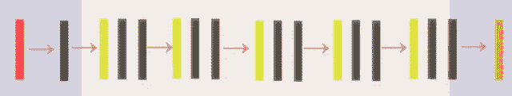

Network Architecture of ELU Network, from this [blog post](/iclr-2016-fast-and-accurate-deep-networks-learning-by-exponential-linear-units-elus-with-c0cdbb71bb02)

我最近报道了' [*通过指数线性单元(ELUs)进行快速准确的深度网络学习'*](https://arxiv.org/abs/1511.07289) ，[单击此处](/iclr-2016-fast-and-accurate-deep-networks-learning-by-exponential-linear-units-elus-with-c0cdbb71bb02)阅读博文，不幸的是，我们在那里实现的模型遭受了对训练图像的过度拟合。所以让我们来看看这些方法是如何提高模型的性能的。(换句话说，它能概括得多好)我之所以这么说，是因为所有这些方法都在解决概括的问题。

> 请注意，为了公平比较(我想知道这些方法如何改进网络),所以我没有添加任何额外的层，如批量标准化或任何数据预处理。此外，所有的网络都是使用 Adam Optimizer 的某种变体来训练的。

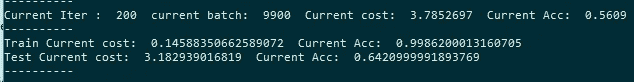

上图是同一个网络在使用 L2 正则化的自动微分(adam optimizer)进行训练时的表现。因此，总的来说，我们的目标是用新的优化方法在测试图像上达到 64%的准确率。

**修正 Adam 中的权重衰减正则化**

上述论文是塞巴斯蒂安在他的博客文章中使用的主要参考资料之一。所以我认为把它链接到这里也是一个好主意。

**案例 1)解耦重量衰减/结果**

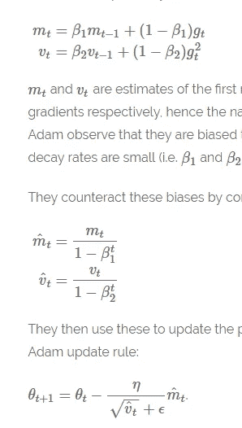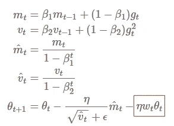

**左图** →常规 Adam 优化器
**右图** →带解耦权重衰减的 Adam
**红框** →添加权重衰减项

第一种方法非常简单，当更新新的权重时，我们将添加某种权重衰减项(小于 1 ),将其乘以权重以及学习速率。当用 python 实现时，它看起来像下面这样。

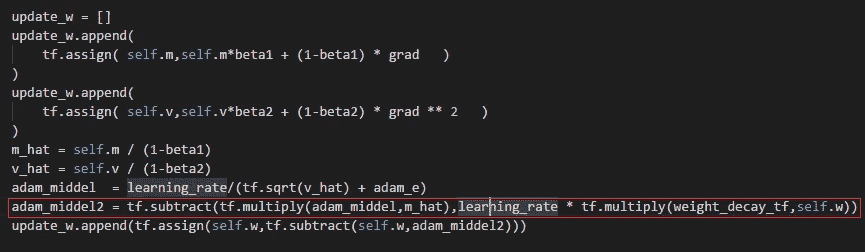

**红线** →添加重量衰减调整线

我已经将重量衰减率设置为 0.512，并且在每 10、50、100 和 150 次迭代中，我将重量衰减值减半。

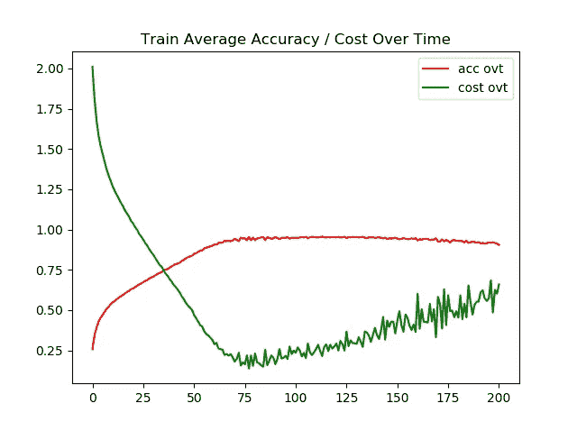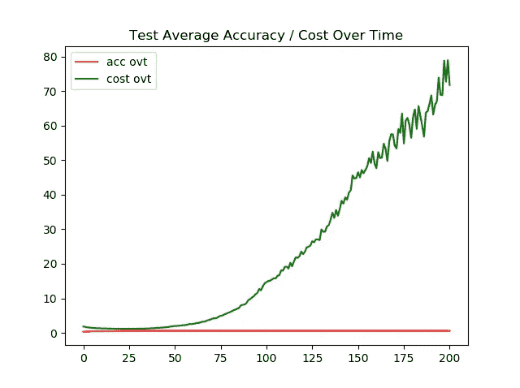

**左图** →一段时间内的训练精度/成本
右图 →一段时间内的测试精度/成本

由于成本上升到 80 英镑，右边的图表是倾斜的，但是不要担心，我已经附上了下面的图像，以显示模型的最终准确性。

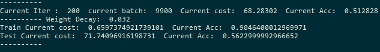

如上所述，使用这种方法，我们能够在测试图像上实现 56%的准确率。考虑到仅亚当和 L2 正则化就能达到 64%的准确率，这还不算太好。

**案例 2)固定指数移动平均值/结果**

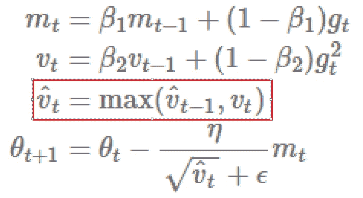

**红框** →新旧 v 值之间的最大值

上图显示了 Adam 的新更新规则(该算法的另一个名称是 AMSGrad)。另外，请注意，对于这条规则，我已经将 Beta 2 的值更改为 0.9，而不是使用默认值 0.999。(如下图所示)

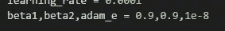

最后，当在 Tensorflow 中实现时，它可能如下所示。

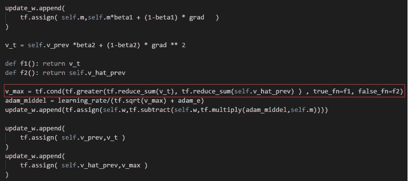

Followed [Filip KRZN](https://fdlm.github.io/post/amsgrad/)’s implementation

**红框** →新旧 v 值之间的最大值

我个人最喜欢这种方法，因为它实现起来非常简单。但是我明白当比较张量时，减少和可能不是最好的方法，另一种方法可以是比较欧几里得范数。但是现在让我们看看这个方法是如何提高模型的性能的。

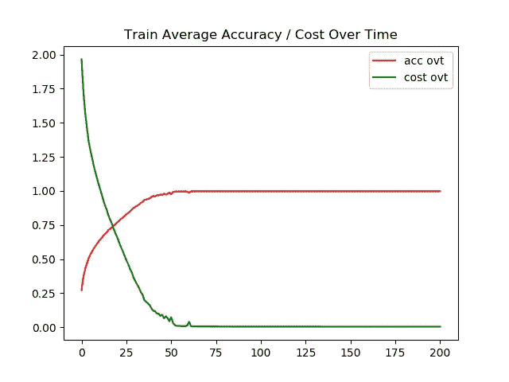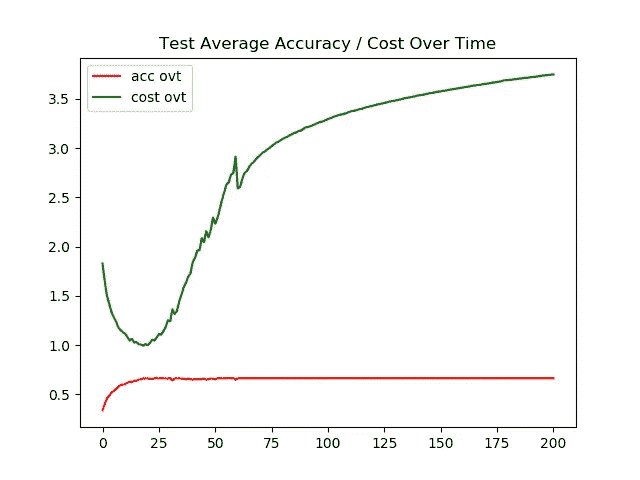

**左图** →一段时间内的训练精度/成本
**右图** →一段时间内的测试精度/成本

如上所述，这种方法并没有完全防止模型过度拟合，但是它确实比我们的基准测试获得了更好的性能。

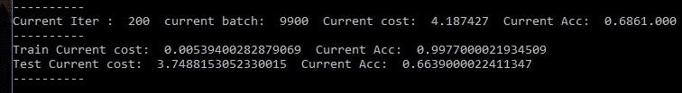

在测试图像上有 66%的准确性，而在训练图像上有 99%的准确性，除了我们在反向传播中所做的改变之外，没有其他形式的正则化方法。

**情况 3)调整学习率/结果**

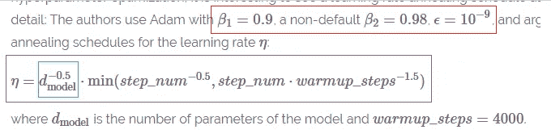

**红框** →更改 Adam 的 Hyper 参数
**蓝框** →模型参数的计算数量
**紫框** →等式选择当前步骤的学习率

为此，我们将计算我们网络中的参数数量。如果有人想知道怎么做，请点击这个链接。下面是 VGG 16 计算参数值的一个简单例子。

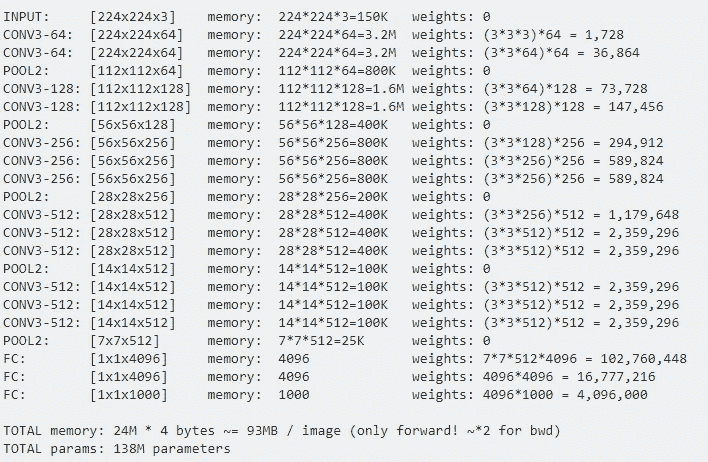

Image from this [website](http://networks?, H. (2018). How to calculate the number of parameters of convolutional neural networks?. Stack Overflow. Retrieved 8 May 2018, from https://stackoverflow.com/questions/28232235/how-to-calculate-the-number-of-parameters-of-convolutional-neural-networks)

下面是一个为我们的网络计算参数的例子。

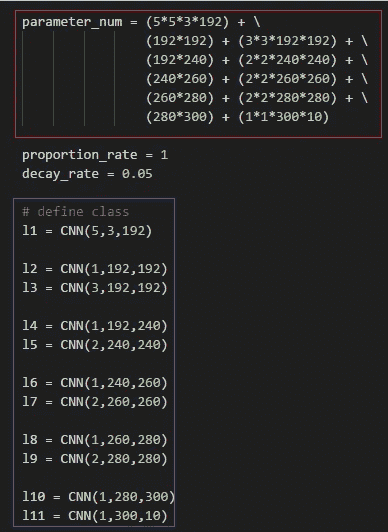

**红框** →参数计算
蓝框 →网络架构参考

现在，既然我们已经准备好了参数的数量，让我们来看看计算学习率的等式。

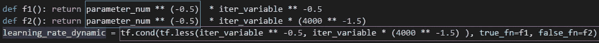

通过简单的 tf.cond()，我们能够在 step_num^(-0.5 和 step_num*warmup_steps^(-1.5).之间选择最小值最后让我们看看结果。

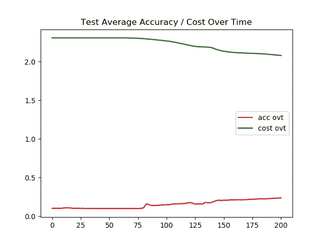

**左图** →一段时间内的训练精度/成本
**右图** →一段时间内的测试精度/成本

如上所述，使用这种方法，模型甚至不能在训练图像上表现良好。我怀疑这种方法的学习率会更高。

> **请注意，我将步骤数解释为迭代(或当前迭代)数，如果这是错误的，请在下面评论。**

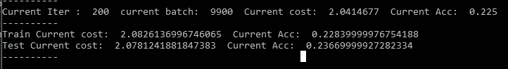

对于训练图像和测试图像，该模型最终精度大约为 23%。

**情况 4)带重启/结果的 Adam**

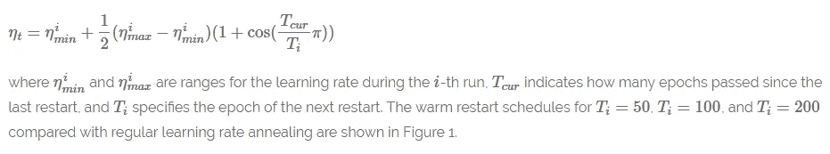

上面是重启的随机梯度下降(SGD)方程。总之，对于每次迭代 Ti，学习率被重置。所以当我们绘制学习率随时间变化的曲线时，它看起来会像下面这样。

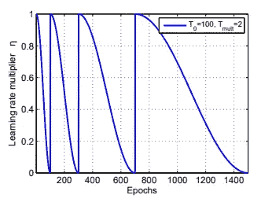

如上所述，学习率在迭代 1 时被设置为 1，再次设置为 300，700 等等。现在让我们来看看如何将这个方法应用到亚当身上。

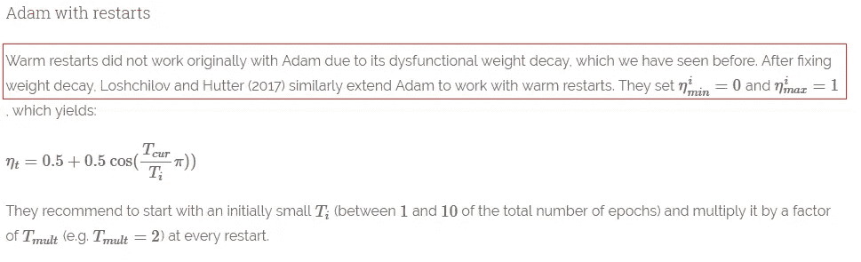

**红框** →如何将此方法应用于 Adam 优化器

如上所述，我们首先需要修复重量衰减，我们已经看到了这一点。(这是我们在案例 1 中使用的方法)。现在让我们看一下实现。

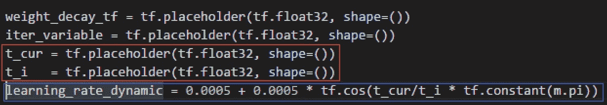

**红框**→Ti 和 Tcur 的可变占位符
**蓝框** →学习率计算公式

实现重启的方法有很多种，但我选择最简单的方法 LOL。另外请注意，原始论文的作者建议将学习率的最大值设置为 1，我设置为 0.001。当我们绘制学习率如何随时间变化(200 次迭代)时，它看起来像下面这样。

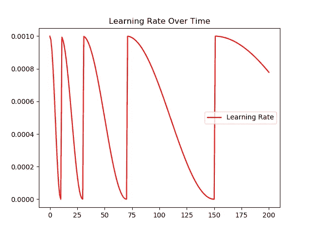

重启迭代次数设置为 10、30、70 和 150。(当我们将第一次重启迭代设置为 10 时)。现在让我们来看看模型的性能。

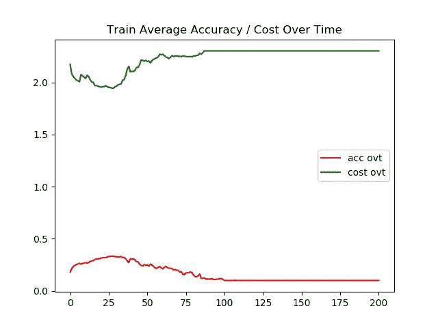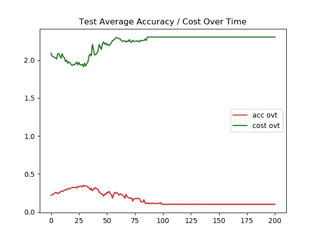

**左图** →一段时间内的训练精度/成本
**右图** →一段时间内的测试精度/成本

嗯……毫无疑问，这个模型做得很糟糕。我实际上花了很多时间试图让这个模型工作，但是这个模型似乎总是只在迭代的开始学习一些东西，并且在训练期间的某个地方，它似乎过了头，停止了所有的学习过程。

> 由于我很想知道我做错了什么，如果你对这款车型有什么推荐，请在下面评论。

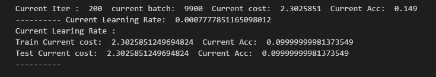

训练图像和测试图像的最终准确度都是 9%。

**互动代码/透明度**

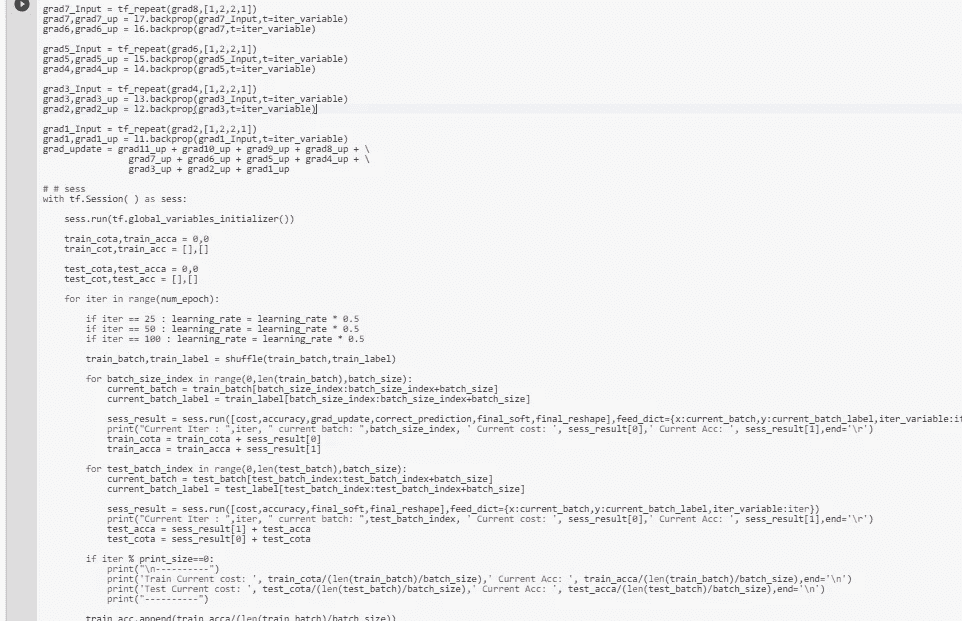

*对于谷歌实验室，你需要一个谷歌帐户来查看代码，你也不能在谷歌实验室运行只读脚本，所以在你的操场上做一个副本。最后，我永远不会请求允许访问你在 Google Drive 上的文件，仅供参考。编码快乐！同样为了透明，我在训练期间上传了所有的日志。*

要访问案例 [1 的代码请点击此处](https://colab.research.google.com/drive/1xfKt1BmEx_-OAFlXz6o3xQjR3SO-dcxy)，要访问[日志请点击此处](https://github.com/JaeDukSeo/Daily-Neural-Network-Practice-2/blob/master/NeuralNetwork/optimizer2017/opt1/case1.txt)。
访问案例 [2 的代码请点击此处](https://colab.research.google.com/drive/143sXisWX2tl0LDO4zB0Qw8RNqir0X8OM)，访问[日志请点击此处](https://github.com/JaeDukSeo/Daily-Neural-Network-Practice-2/blob/master/NeuralNetwork/optimizer2017/opt2/case2.txt)。
访问案例 [3 的代码请点击此处](https://colab.research.google.com/drive/1LuJC-G85nXF1J1qbUfrTZEYPnUv9X-bv)，访问[日志请点击此处](https://github.com/JaeDukSeo/Daily-Neural-Network-Practice-2/blob/master/NeuralNetwork/optimizer2017/opt3/case3.txt)。
要访问案例 [4 的代码请点击此处](https://colab.research.google.com/drive/1Jt5uUmssdY4S_Pc0_6G3wqSXpflCueT-)，要访问[的日志请点击此处。](https://github.com/JaeDukSeo/Daily-Neural-Network-Practice-2/blob/master/NeuralNetwork/optimizer2017/opt4/case4.txt)

**最后的话**

这些都是由许多聪明的研究人员完成的惊人的工作，然而，对于这个实验来说，没有一个看起来像是灵丹妙药。

如果发现任何错误，请发电子邮件到 jae.duk.seo@gmail.com 给我，如果你想看我所有写作的列表，请在这里查看我的网站。

同时，在我的 twitter 上关注我[这里](https://twitter.com/JaeDukSeo)，访问[我的网站](https://jaedukseo.me/)，或者我的 [Youtube 频道](https://www.youtube.com/c/JaeDukSeo)了解更多内容。我还实现了[广残网，请点击这里查看博文](https://medium.com/@SeoJaeDuk/wide-residual-networks-with-interactive-code-5e190f8f25ec) t。

**参考**

1.  2017 年深度学习优化亮点。(2017).塞巴斯蒂安·鲁德。检索于 2018 年 5 月 7 日，来自[http://ruder.io/deep-learning-optimization-2017/](http://ruder.io/deep-learning-optimization-2017/)
2.  只有 Numpy:实现和比较梯度下降优化算法+谷歌大脑的…(2018).走向数据科学。2018 年 5 月 7 日检索，来自[https://towards data science . com/only-numpy-implementing-and-comparison-gradient-descent-optimization-algorithms-Google-brains-8870 b 133102 b](/only-numpy-implementing-and-comparing-gradient-descent-optimization-algorithms-google-brains-8870b133102b)
3.  克利夫特博士、安特辛纳、t .和霍克雷特博士(2015 年)。通过指数线性单元(ELUs)进行快速准确的深度网络学习。Arxiv.org。检索于 2018 年 5 月 7 日，来自[https://arxiv.org/abs/1511.07289](https://arxiv.org/abs/1511.07289)
4.  [ICLR 2016]通过指数线性单元(ELUs)进行快速准确的深度网络学习，具有…(2018).走向数据科学。2018 年 5 月 7 日检索，来自[https://towards data science . com/iclr-2016-fast-and-accurate-deep-networks-learning-by-index-linear-units-elus-with-c 0 cdbb 71 bb 02](/iclr-2016-fast-and-accurate-deep-networks-learning-by-exponential-linear-units-elus-with-c0cdbb71bb02)
5.  张量流正则化。(2018).ritchieng . github . io . 2018 年 5 月 7 日检索，来自[http://www . ritchieng . com/machine-learning/deep-learning/tensor flow/regulation/](http://www.ritchieng.com/machine-learning/deep-learning/tensorflow/regularization/)
6.  tf.cond |张量流。(2018).张量流。检索于 2018 年 5 月 7 日，来自[https://www.tensorflow.org/api_docs/python/tf/cond](https://www.tensorflow.org/api_docs/python/tf/cond)
7.  '开关')，V. (2018)。值错误:形状的等级必须为 0，但对于“cond _ 11/Switch”(op:“Switch”)的等级为 1。堆栈溢出。2018 年 5 月 8 日检索，来自[https://stack overflow . com/questions/47739707/value error-shape-must-be-rank-0-but-is-rank-1-for-cond-11-switch-op-switch](https://stackoverflow.com/questions/47739707/valueerror-shape-must-be-rank-0-but-is-rank-1-for-cond-11-switch-op-switch)
8.  tensorflow？，H. (2018)。如何在 tensorflow 中求圆周率？。堆栈溢出。检索于 2018 年 5 月 8 日，来自[https://stack overflow . com/questions/45995471/how-to-get-pi-in-tensor flow](https://stackoverflow.com/questions/45995471/how-to-get-pi-in-tensorflow)
9.  网络？，H. (2018)。如何计算卷积神经网络的参数个数？。堆栈溢出。检索于 2018 年 5 月 8 日，来自[https://stack overflow . com/questions/28232235/how-to-calculation-the-number of-parameters-of-convolutionary-neural-networks](https://stackoverflow.com/questions/28232235/how-to-calculate-the-number-of-parameters-of-convolutional-neural-networks)
10.  Loshchilov，I .，& Hutter，F. (2017)。修正 Adam 中的权重衰减正则化。 *arXiv 预印本 arXiv:1711.05101* 。
11.  示例:基础— imgaug 0.2.5 文档。(2018).img aug . readthe docs . io . 2018 年 5 月 8 日检索，来自[http://img aug . readthe docs . io/en/latest/source/examples _ basics . html](http://imgaug.readthedocs.io/en/latest/source/examples_basics.html)
12.  [ICLR 2016]通过指数线性单元(ELUs)进行快速准确的深度网络学习，具有…(2018).走向数据科学。2018 年 5 月 8 日检索，来自[https://towards data science . com/iclr-2016-fast-and-accurate-deep-networks-learning-by-index-linear-units-elus-with-c 0 cdbb 71 bb 02](/iclr-2016-fast-and-accurate-deep-networks-learning-by-exponential-linear-units-elus-with-c0cdbb71bb02)
13.  (2018).Arxiv.org。于 2018 年 5 月 8 日检索，来自[https://arxiv.org/pdf/1711.05101.pdf](https://arxiv.org/pdf/1711.05101.pdf)