# 从零开始使用梯度下降优化在 Python 中实现单变量多项式回归

> 原文：<https://towardsdatascience.com/implementation-of-uni-variate-linear-regression-in-python-using-gradient-descent-optimization-from-3491a13ca2b0?source=collection_archive---------10----------------------->

## *学习、实施和调整…*

回归是一种对特征空间中的数据或数据点进行连续分类的方法。弗朗西斯·高尔顿在 1886 年发明了回归线的用法[1]。

**线性回归**

这是多项式回归的一个特例，假设中多项式的次数是 1。一般多项式回归将在文章的后半部分讨论。顾名思义，“线性”，这意味着关于机器学习算法的假设本质上是线性的，或者仅仅是线性方程。耶！！这确实是一个线性方程。在单变量线性回归中，目标变量依赖于单一特征或变量。

单变量线性回归的假设如下:

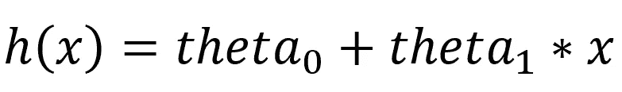

where **theta_0** and **theta_1** are the parameters and **x** is the single feature or variable

上述假设也可以用矩阵乘法格式或向量代数的形式写成:

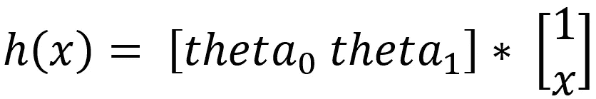

存在与取决于参数θ_ 0 和θ_ 1 的假设相关联的成本函数。

线性回归的成本函数通常如下所示:

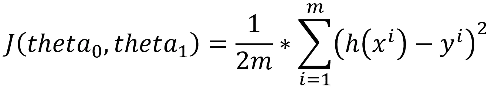

现在，这两个参数 theta_0 和 theta_1 必须采用这样的值，使得该成本函数值(即成本)采用可能的最小值。因此，现在的基本目标是找到成本最小的θ_ 0 和θ_ 1 的值，或者简单地找到成本函数的最小值。

梯度下降是最重要的凸优化技术之一，使用它可以找到函数的最小值。梯度下降算法如下所示:

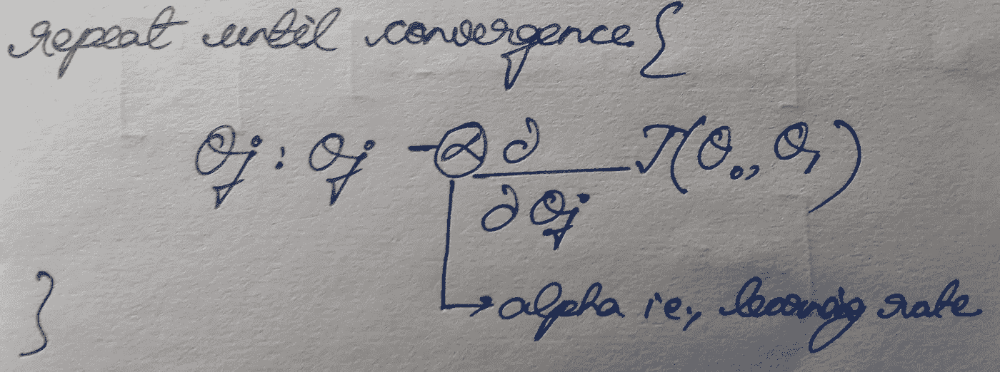

梯度下降有两种方法:

1.  随机梯度下降
2.  批量梯度下降

**使用随机梯度下降实现线性回归:**

在随机梯度下降中，运行梯度下降算法，一次从数据集中取一个实例。

实现是通过创建具有不同操作的 3 个模块来完成的:

=>hypothesis():是在给定 theta (theta_0 和 theta_1)和 Feature，X 作为输入的情况下，计算并输出目标变量的假设值的函数。假设()的实现如下所示:

```
def **hypothesis**(theta, X):
    h = np.ones((X.shape[0],1))
    for i in range(0,X.shape[0]):
        x = np.concatenate((np.ones(1), np.array([X[i]])), axis = 0)
        h[i] = float(np.matmul(theta, x))
    h = h.reshape(X.shape[0])
    return h
```

=>SGD():该函数执行随机梯度下降算法，将当前值 theta_0 和 theta_1、alpha、迭代次数(num_iters)、假设值(h)、特征集(X)和目标变量集(y)作为输入，并在由实例表征的每次迭代时输出优化的 theta (theta_0 和 theta_1)。SGD()的实现如下所示:

```
def **SGD**(theta, alpha, num_iters, h, X, y):
    for i in range(0,num_iters):
        theta[0] = theta[0] - (alpha) * (h - y)
        theta[1] = theta[1] - (alpha) * ((h - y) * X)
        h = theta[1]*X + theta[0] 
    return theta
```

=>sgd_linear_regression():它是主函数，将特征集(X)、目标变量集(y)、学习速率和迭代次数(num_iters)作为输入，输出最终的优化θ，即代价函数在随机梯度下降后几乎达到最小值的θ_ 0 和θ_ 1 的值。

```
def **sgd_linear_regression**(X, y, alpha, num_iters):
    # initializing the parameter vector...
    theta = np.zeros(2)
    # hypothesis calculation....
    h = hypothesis(theta, X)    
    # returning the optimized parameters by Gradient Descent...
    for i in range(0, X.shape[0]):
        theta = SGD(theta,alpha,num_iters,h[i],X[i],y[i])
    theta = theta.reshape(1, 2)
    return theta
```

现在，我们来看一个实践数据集，它包含了公司利润如何依赖于城市人口的信息。该数据集可在 GitHub link 上获得，

[](https://github.com/navoneel1092283/univariate_regression) [## navoneel 1092283/单变量 _ 回归

### 通过在 GitHub 上创建帐户，为 navoneel 1092283/univariate _ regression 开发做出贡献。

github.com](https://github.com/navoneel1092283/univariate_regression) 

**问题陈述**:*给定一个城市的人口，用线性回归分析预测一家公司的利润*

数据读入 Numpy 数组:

```
data = np.loadtxt('data1.txt', delimiter=',')
X_train = data[:,0] #the feature_set
y_train = data[:,1] #the labels
```

数据可视化:可以使用散点图来可视化数据集:

```
import matplotlib.pyplot as plt
plt.scatter(X_train, y_train)
plt.xlabel('Population of City in 10,000s')
plt.ylabel('Profit in $10,000s')
```

散点图数据可视化看起来像-

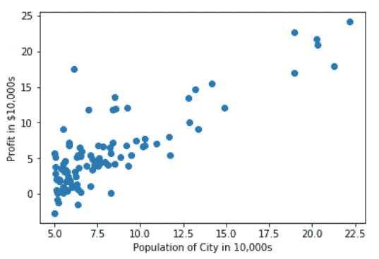

Scatter Plot

使用三模块线性回归-SGD:

```
# calling the principal function with **learning_rate = 0.0001** and 
# **num_iters = 100000**
theta = sgd_linear_regression(X_train, y_train, 0.0001, 100000)
```

θ输出结果为:

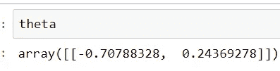

theta after SGD

散点图上θ的可视化:

获得的θ的回归线可视化可以在散点图上完成:

```
import matplotlib.pyplot as plt 
# getting the predictions...
training_predictions = hypothesis(theta, X_train)
scatter = plt.scatter(X_train, y_train, label="training data")
regression_line = plt.plot(X_train, training_predictions
                           , label="linear regression")
plt.legend()
plt.xlabel('Population of City in 10,000s')
plt.ylabel('Profit in $10,000s')
```

回归线可视化结果为:

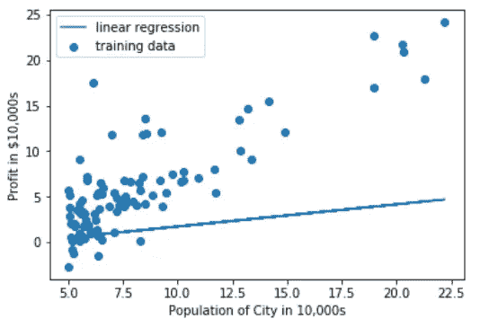

Regression Line Visualization after SGD

**使用批量梯度下降实现线性回归:**

在批量梯度下降中，梯度下降算法运行，一次从数据集中提取所有实例。

实现是通过创建具有不同操作的 3 个模块来完成的:

=>hypothesis():是在给定 theta (theta_0 和 theta_1)和 Feature，X 作为输入的情况下，计算并输出目标变量的假设值的函数。假设()的实现保持不变。

=>BGD():它是执行批量梯度下降算法的函数，将当前的θ_ 0 和θ_ 1、α、迭代次数(num_iters)、所有样本的假设值列表(h)、特征集(X)和目标变量集(y)作为输入，并输出优化的θ(θ_ 0 和θ_ 1)、θ_ 0 历史(θ_ 0)和θ_ 1 历史(θ_ 1)，即每次迭代的θ_ 0 和θ_ 1 的值，以及最终包含成本函数值的成本历史 Gradient_Descent()的实现如下所示:

```
def **BGD**(theta, alpha, num_iters, h, X, y):
    cost = np.ones(num_iters)
    theta_0 = np.ones(num_iters)
    theta_1 = np.ones(num_iters)
    for i in range(0,num_iters):
        theta[0] = theta[0] - (alpha/X.shape[0]) * sum(h - y)
        theta[1] = theta[1] - (alpha/X.shape[0]) * sum((h - y) * X)
        h = hypothesis(theta, X)
        cost[i] = (1/X.shape[0]) * 0.5 * sum(np.square(h - y))
        theta_0[i] = theta[0]
        theta_1[i] = theta[1]
    theta = theta.reshape(1,2)
    return theta, theta_0, theta_1, cost
```

=>linear_regression():它是主函数，将特征集(X)、目标变量集(y)、学习速率和迭代次数(num_iters)作为输入，并输出最终优化的 theta，即成本函数在批量梯度下降后几乎达到最小值的 theta_0 和 theta_1 的值，以及存储每次迭代的成本值的 **cost** 。

```
def **linear_regression**(X, y, alpha, num_iters):
    # initializing the parameter vector...
    theta = np.zeros(2)
    # hypothesis calculation....
    h = hypothesis(theta, X)    
    # returning the optimized parameters by Gradient Descent...
    theta,theta_0,theta_1,cost= BGD(theta,alpha,num_iters,h,X,y)
    return theta, theta_0, theta_1, cost
```

在相同的利润估算数据集上使用 3 模块线性回归 BGD:

```
data = np.loadtxt('data1.txt', delimiter=',')
X_train = data[:,0] #the feature_set
y_train = data[:,1] #the labels
# calling the principal function with **learning_rate = 0.0001** and 
# **num_iters = 300**
theta,theta_0,theta_1,cost=linear_regression(X_train,y_train,
                                             0.0001,300)
```

θ输出结果为:

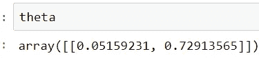

theta after BGD

散点图上θ的可视化:

获得的θ的回归线可视化可以在散点图上完成:

```
import matplotlib.pyplot as plt
training_predictions = hypothesis(theta, X_train)
scatter = plt.scatter(X_train, y_train, label="training data")
regression_line = plt.plot(X_train, training_predictions, label="linear regression")
plt.legend()
plt.xlabel('Population of City in 10,000s')
plt.ylabel('Profit in $10,000s')
```

回归线可视化结果为:

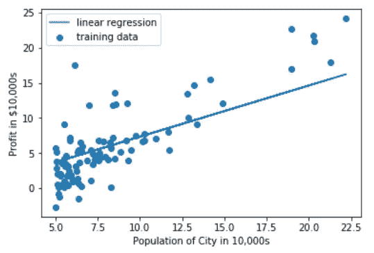

Regression Line Visualization after BGD

此外，在逐迭代的批量梯度下降过程中，成本已经降低。成本的降低借助于线形曲线和曲面图显示出来。

代表 300 次迭代中成本降低的线形曲线:

```
import matplotlib.pyplot as plt
cost = list(cost)
n_iterations = [x for x in range(1,301)]
plt.plot(n_iterations, cost)
plt.xlabel('No. of iterations')
plt.ylabel('Cost')
```

线条曲线显示为:

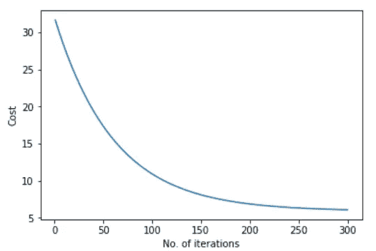

Line Curve Representation of Cost Minimization using BGD

表示成本降低的曲面图:

```
J = np.ones((300,300))
in1 = 0
in2 = 0
theta_0 = theta_0.reshape(300)
theta_1 = theta_1.reshape(300)
for i in theta_0:
    for j in theta_1:
        t = np.array([i,j])
        h = hypothesis(t, X_train)
        J[in1][in2]=(1/X_train.shape[0])*0.5*sum(np.square(h-y_train))
        in2 = in2 + 1
    in1 = in1 + 1
    in2 = 0from mpl_toolkits.mplot3d import Axes3Dfig = plt.figure()
ax = fig.add_subplot(111, projection='3d')X,Y = np.meshgrid(theta_0, theta_1)
ax.plot_surface(X, Y, J)
ax.set_xlabel('theta_0')
ax.set_ylabel('theta_1')
ax.set_zlabel('J')
```

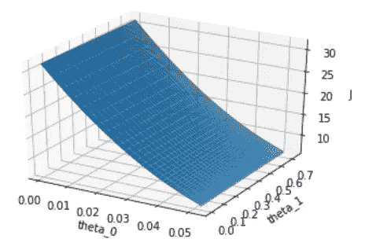

Surface Plot Representation of Cost Minimizaion with values of theta_0 and theta_1

**表现分析(新加坡元对 BGD)**

模型性能分析基于以下指标:

= >平均绝对误差:实例样本中预测值和实际观测值之间的平均模(差)。

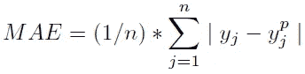

寻找梅:

```
ae = 0 # Absolute Error
for i in range(0,y_train.shape[0]):
    ae = ae + abs(training_predictions[i] - y_train[i])
MAE = ae/y_train.shape[0] # Mean Absolute Error
```

= >均方误差:实例样本中预测值和实际观测值之间的平方差的平均值。

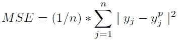

查找 MSE:

```
from math import *
se = 0 # Square Error
for i in range(0,y_train.shape[0]):
    se = se + pow((training_predictions[i] - y_train[i]), 2)
MSE = se/y_train.shape[0] # Mean Square Error
```

= >均方根误差:在一个实例样本中，预测值和实际观测值之间的平方差的平均值的平方根。

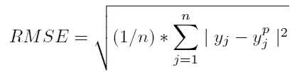

寻找 RMSE:

```
from math import *
RMSE = sqrt(MSE) # Root Mean Square Error
```

=>R 平方得分或决定系数:

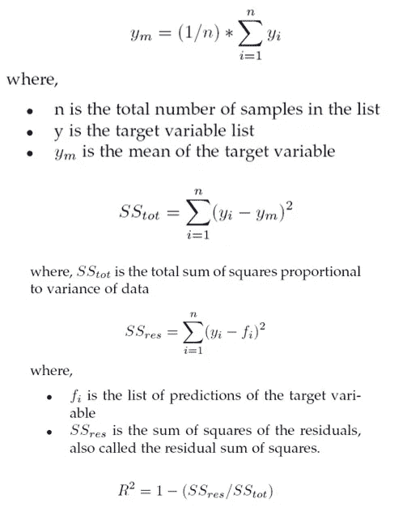

```
import numpy as np
y_m = np.mean(y_train)SStot = 0
for i in range(0,y_train.shape[0]):
    SStot = SStot + pow((y_train[i] - y_m), 2)SSres = 0
for i in range(0,y_train.shape[0]):
    SSres = SSres + pow((y_train[i] - training_predictions[i]), 2)R_Square_Score = 1 - (SSres/SStot)
```

新加坡元和 BGD 的比较:

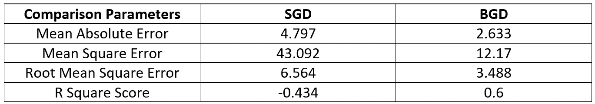

因此，批量梯度下降在各方面都明显优于随机梯度下降！！

这就是使用梯度下降在 Python 中实现单变量线性回归的全部内容。

**多项式回归**

在涉及对单个特征或变量进行回归的预测分析问题中(称为单变量回归)，多项式回归是回归分析的一个重要变体，主要用作线性回归的性能助推器。在本文中，我将介绍多项式回归、它的 Python 实现以及在一个实际问题上的应用和性能分析。

正如前缀“多项式”所暗示的，机器学习算法的相应假设是多项式或多项式方程。因此，这可以是任何次数的，比如如果假设是一次多项式，那么它是一个线性方程，因此称为线性回归，如果假设是二次多项式，那么它是一个二次方程，类似地，如果是三次多项式，那么它是一个三次方程，等等。因此，可以说:

*线性回归是多项式回归的真子集或特例方法，因此多项式回归也称为广义回归*

多项式回归的假设如下:


where **theta_0, theta_1, theta_2, theta_3,…., theta_n** are the parameters and **x** is the single feature or variable

其中**θ_ 0，θ_ 1，θ_ 2，θ_ 3，…，theta_n** 是参数， **x** 是单一特征或变量

上述假设也可以用矩阵乘法格式或向量代数的形式写成:

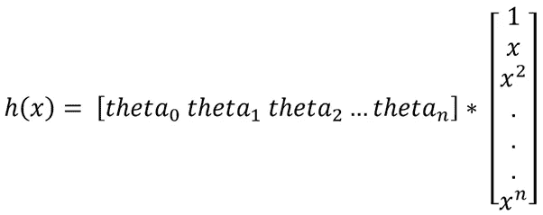

这里，也存在与依赖于参数θ_ 0，θ_ 1，θ_ 2，θ_ 3，…的假设相关联的成本函数。，theta_n。

一般来说，广义回归的成本函数如下所示:

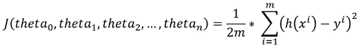

因此，这些参数θ_ 0，θ_ 1，θ_ 2，…，θ_ n 必须采用这样的值，对于这些值，成本函数(或简单地成本)达到其可能的最小值。换句话说，需要找出成本函数的最小值。

批量梯度下降可以用作优化函数。

**使用批量梯度下降实现多项式回归:**

实现是通过创建 3 个执行不同操作的模块来完成的。

=>hypothesis():是计算并输出目标变量的假设值的函数，给定 theta (theta_0，theta_1，theta_2，theta_3，…，theta_n)，特征 X 和多项式回归中多项式的次数(n)作为输入。假设()的实现如下所示:

```
def **hypothesis**(theta, X, n):
    h = np.ones((X.shape[0],1))
    theta = theta.reshape(1,n+1)
    for i in range(0,X.shape[0]):
        x_array = np.ones(n+1)
        for j in range(0,n+1):
            x_array[j] = pow(X[i],j)
        x_array = x_array.reshape(n+1,1)
        h[i] = float(np.matmul(theta, x_array))
    h = h.reshape(X.shape[0])
    return h
```

=>BGD():该函数执行批量梯度下降算法，将当前的θ值(theta_0，theta_1，…，theta_n)、学习速率(alpha)、迭代次数(num_iters)、所有样本的假设值列表(h)、特征集(X)、目标变量集(y)和多项式回归中多项式的次数(n)作为输入，并输出优化的 theta (theta_0，theta_1，theta_2，theta_3，…，theta_n)、theta_history(包含每次迭代的 theta 值的列表)和最终 BGD()的实现如下所示:

```
def **BGD**(theta, alpha, num_iters, h, X, y, n):
    theta_history = np.ones((num_iters,n+1))
    cost = np.ones(num_iters)
    for i in range(0,num_iters):
        theta[0] = theta[0] — (alpha/X.shape[0]) * sum(h — y)
        for j in range(1,n+1):
            theta[j]=theta[j]-(alpha/X.shape[0])*sum((h-y)*pow(X,j))
        theta_history[i] = theta
        h = hypothesis(theta, X, n)
        cost[i] = (1/X.shape[0]) * 0.5 * sum(np.square(h — y))
    theta = theta.reshape(1,n+1)
    return theta, theta_history, cost
```

=>poly_regression():它是主函数，将特征集(X)、目标变量集(y)、学习率(alpha)、多项式回归中多项式的次数(n)和迭代次数(num_iters)作为输入，输出最终优化的 theta，即[ **theta_0，theta_1，theta_2，theta_3，…]的值。成本函数在批量梯度下降后几乎达到最小值的θ_ n****，存储每次迭代的θ值的θ_ history**，以及存储每次迭代的成本值的 **cost** 。

```
def **poly_regression**(X, y, alpha, n, num_iters):
    # initializing the parameter vector…
    theta = np.zeros(n+1)
    # hypothesis calculation….
    h = hypothesis(theta, X, n)
    # returning the optimized parameters by Gradient Descent
    theta,theta_history,cost=BGD(theta,alpha,num_iters,h, X, y, n)
    return theta, theta_history, cost
```

现在，我们来看一个实践数据集，它包含了公司利润如何依赖于城市人口的信息。

在利润估算数据集上使用 3 模多项式回归，

[](https://github.com/navoneel1092283/univariate_regression) [## navoneel 1092283/单变量 _ 回归

### 通过在 GitHub 上创建帐户，为 navoneel 1092283/univariate _ regression 开发做出贡献。

github.com](https://github.com/navoneel1092283/univariate_regression) 

**问题陈述**:*给定一个城市的人口，用多项式回归分析预测一家公司的利润*

```
data = np.loadtxt(‘data1.txt’, delimiter=’,’)
X_train = data[:,0] #the feature_set
y_train = data[:,1] #the labels
**# calling the principal function with learning_rate = 0.0001 and 
# n = 2(quadratic_regression) and num_iters = 300000** theta,theta_history,cost=poly_regression(X_train,y_train,
                                         0.00001,2,300000)
```

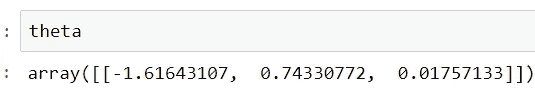

theta after Polynomial Regression

散点图上θ的可视化:

获得的θ的回归线可视化可以在散点图上完成:

```
import matplotlib.pyplot as plt
training_predictions = hypothesis(theta, X_train, 2)
scatter = plt.scatter(X_train, y_train, label=”training data”) regression_line = plt.plot(X_train, training_predictions
                          ,label=”polynomial (degree 2) regression”)
plt.legend()
plt.xlabel(‘Population of City in 10,000s’)
plt.ylabel(‘Profit in $10,000s’)
```

回归线可视化结果为:

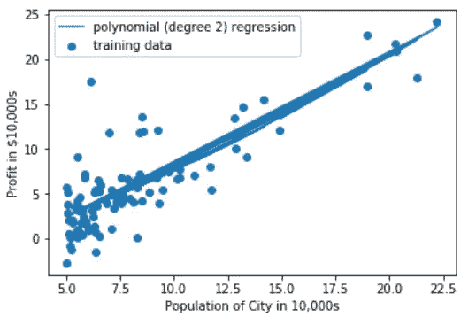

Regression Line Visualization after Quadratic Regression

此外，在逐迭代的批量梯度下降过程中，成本已经降低。成本的降低借助于曲线显示出来。

```
import matplotlib.pyplot as plt
cost = list(cost)
n_iterations = [x for x in range(1,300001)]
plt.plot(n_iterations, cost)
plt.xlabel(‘No. of iterations’)
plt.ylabel(‘Cost’)
```

线条曲线显示为:

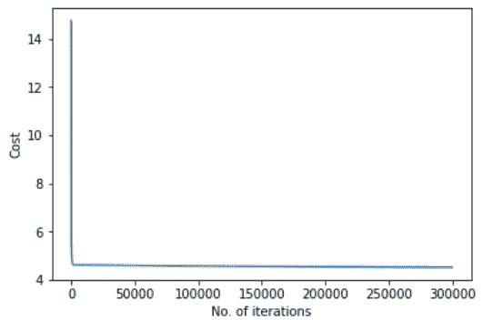

Line Curve Representation of Cost Minimization using BGD in Quadratic Regression

现在，必须进行模型性能分析以及多项式回归与线性回归的比较(迭代次数相同)。

因此，线性回归是使用批量梯度下降完成的，迭代次数为 3，00，000 次，学习速率(alpha)为 0.0001，使用的是我上一篇文章中的实现:

[](/implementation-of-uni-variate-linear-regression-in-python-using-gradient-descent-optimization-from-3491a13ca2b0) [## 使用梯度下降优化在 Python 中实现单变量线性回归…

### 学习、编码和调整…

towardsdatascience.com](/implementation-of-uni-variate-linear-regression-in-python-using-gradient-descent-optimization-from-3491a13ca2b0) 

```
data = np.loadtxt(‘data1.txt’, delimiter=’,’)
X_train = data[:,0] #the feature_set
y_train = data[:,1] #the labels
# calling the principal function with **learning_rate = 0.0001** and
# **num_iters = 300000**
theta,theta_0,theta_1,cost=linear_regression(X_train,y_train,
                                             0.0001,300000)
```

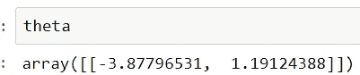

theta after Linear Regression

散点图上θ的可视化:

获得的θ的回归线可视化可以在散点图上完成:

```
import matplotlib.pyplot as plt
training_predictions = hypothesis(theta, X_train)
scatter = plt.scatter(X_train, y_train, label=”training data”)
regression_line = plt.plot(X_train, training_predictions
                           , label=”linear regression”)
plt.legend()
plt.xlabel(‘Population of City in 10,000s’)
plt.ylabel(‘Profit in $10,000s’)
```

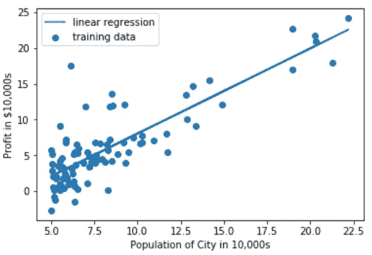

Regression Line Visualization after Linear Regression

此外，在逐迭代的批量梯度下降过程中，成本已经降低。成本的降低借助于曲线显示出来。

```
import matplotlib.pyplot as plt
cost = list(cost)
n_iterations = [x for x in range(1,300001)]
plt.plot(n_iterations, cost)
plt.xlabel(‘No. of iterations’)
plt.ylabel(‘Cost’)
```

线条曲线显示为:

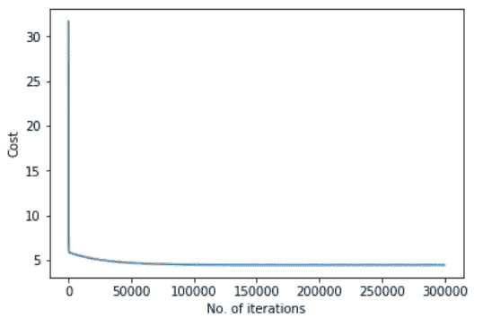

Line Curve Representation of Cost Minimization using BGD in Linear Regression

**性能分析(使用 BGD 优化的线性回归与二次回归):**

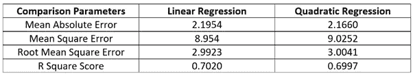

但是在这里，使用批量梯度下降优化，我们最终得到的线性回归**在所有方面都优于**多项式(二次)回归。但是，在实践中，多项式(高次或广义)回归总是比线性回归表现更好。虽然使用 BGD，但由于 BGD 优化本身的一些缺点，我们无法获得与命题相匹配的实验结果。还有另一种优化或寻找多项式(也称线性)回归中成本函数最小值的方法，称为**【OLS(普通最小二乘法)】**或**正规方程法**。

我将在以后的文章中讨论这些内容，并提到本文的参考资料。使用 OLS，可以清楚地证明多项式(在本实验中是二次的)比线性回归表现得更好。除了单变量问题，使用适当的特征工程技术，多项式回归也可用于多变量问题(多特征)。

这就是多项式回归的全部内容。

**参考文献**

[1]迈克尔·布尔默(2003 年)。弗朗西斯·高尔顿:遗传和生物统计学的先驱。[约翰霍普金斯大学出版社](https://en.wikipedia.org/wiki/Johns_Hopkins_University_Press)。[ISBN](https://en.wikipedia.org/wiki/International_Standard_Book_Number)[0–8018–7403–3](https://en.wikipedia.org/wiki/Special:BookSources/0-8018-7403-3)。