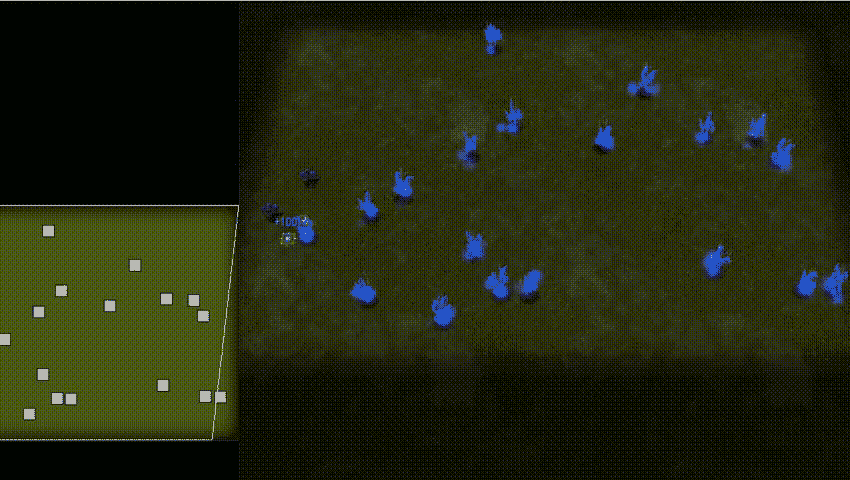
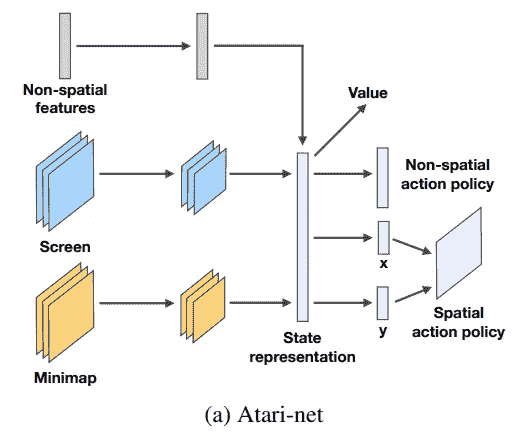
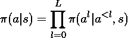
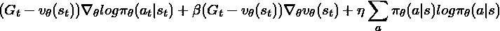

# 实现 DeepMind 基线星际强化学习代理

> 原文：<https://towardsdatascience.com/implementing-a-deepmind-baseline-starcraft-reinforcement-learning-agent-7b1ef6f41b52?source=collection_archive---------9----------------------->

## 将研究用语翻译成代码

实现研究论文中描述的深度学习模型是一种具有挑战性但具有启发性的体验，它显示了有多少信息可以压缩到少数几个句子或段落中。

本周，在[了解了《星际争霸 python API 和强化学习环境的诀窍](http://www.rayheberer.ai/post/sc2-lessons/)之后，我开始构建《T4》中描述的三个基线代理中的第一个:强化学习的新挑战。

具体来说，一个优势行动者-批评家代理使用卷积神经网络架构来估计状态值和最佳策略，该架构基于[深度强化学习的异步方法](https://arxiv.org/abs/1602.01783)中的架构。由于资源限制，我没有实现 A3C 的“异步”部分，这意味着我一次只运行一个代理，而不是并行运行多个代理。

在这篇文章中，我将重点介绍这两篇研究论文中关于代理设计的部分，其中包含了与技术实现相关的最多信息。我希望这将作为一个有用的例子，说明如何将研究人员的语言翻译成代码。我的完整实现可以在这里找到。

概括地说，深度强化学习代理需要满足五个要求:

1.  接收包含状态信息的感知(输入)
2.  通过深层网络处理感知以产生状态表示。
3.  使用状态表示来通知策略(从状态到动作的功能映射)。
4.  使用该策略选择操作并与环境交互。
5.  从环境中获得奖励，并利用这些奖励来改进国家和政策的模式。

这只是一个任意的分解，但是我发现它直观上是有帮助的，并将使用它来指导本文的结构。

# 输入

> *因此，主要的观察来自于以 N × M 像素渲染的特征层集合…除了屏幕和小地图，游戏的人机界面还提供了各种非空间观察。*

对于与 PySC2 交互的代理，它必须有一个在每个时间步长调用的`step(self, obs)`方法。此外，它可能有一个在每集开始时调用的`reset(self)`方法。

我喜欢为我的深度神经网络使用单独的类，如下所示。以要素图层形式出现的输入相对直接地对应于张量流图中的占位符。API 将它们暴露在形状为`[channels, y, x]`的数组中，所以后来在我的网络中，我确保适当地排列这些维度，以便它们可以被馈送到卷积层，并且在将一批 1 馈送到图中时经常使用`np.expand_dims`。

# 国家代表权

> *我们将包含分类值的所有要素图层嵌入到一个连续空间中，这相当于在信道维度中使用一键编码，然后进行 1 × 1 卷积。我们也用对数变换重新缩放数字特征，因为它们中的一些如生命值或矿物可能达到相当高的值。*

虽然我发现“嵌入”的语言有点吓人，但随后的细节证明实现起来更简单。比起在卷积层之后应用一键编码，我发现推断一个特征是分类的还是数字的是更费力的任务。

> *它处理屏幕和小地图要素图层，这两个图层分别有 16，32 个大小为 8，4 和步幅为 4，2 的过滤器。非空间特征向量由具有双曲正切非线性的线性层处理。结果被连接并通过一个带有 ReLU 激活的线性层发送。*

Figure from [https://arxiv.org/abs/1708.04782](https://arxiv.org/abs/1708.04782)

虽然论文的这些段落对应于一些最长的代码块，但它们很容易实现，因为有强大的深度学习框架可用，其中 Tensorflow 是我在这里选择的工具。

# 策略表示

> *…我们建议利用链式法则，以自动回归的方式表示策略:*

我在这里困惑的一点是关于“链式法则”它指的是概率论中的[一般乘积规则](https://en.wikipedia.org/wiki/Chain_rule_(probability))，而不是微积分中也称为“链式规则”的规则。

> *在我们的大多数实验中，我们发现独立地对子动作建模就足够了…对于空间动作(坐标),我们独立地对策略建模，以选择(离散的)x 和 y 坐标。*

基本上，因为在星际争霸 2 中任何给定的动作(称为函数标识符)可能需要可变数量的参数，一种有效的方法来表示函数标识符和参数上的策略是对每种类型有一个独立的策略，其中任何参数给定一个不需要它的函数标识符的概率变为零。

PySC2 中大约有 10 种通用类型的函数标识符，每一种都需要不同的参数序列。在 Tensorflow 图中实现时，我发现使用字典是跟踪所有输出层的好方法。我还为占位符构建了一个字典，稍后将用于训练网络。

# 动作选择

> 为了确保我们的代理永远不会选择不可用的动作，我们屏蔽了 a0 的功能标识符选择，这样只有适当的子集可以被采样，模仿玩家随机点击 UI 上的按钮的方式。我们通过屏蔽动作和重整 a0 上的概率分布来实现这一点。

虽然在我的第一遍中，我在 Tensorflow 图之外实现了这个屏蔽，但在实际选择动作时，它也可以在图中实现，在未来的更新中，我可能会将它移到那里。

# 培养

> *在 A3C 中，我们在网络的 K = 40 个前向步骤之后或者如果接收到终端信号，就切断轨迹并运行反向传播。*

这句话实际上启发了整个帖子。最初我不知道“切断轨迹”意味着什么，于是我踏上了知识之旅。以下两句语录来自原 A3C 论文。

> *像我们的 n 步 Q-learning 的变体一样，我们的 actor-critic 的变体也以前瞻的观点操作，并使用相同的 n 步回报组合来更新策略和价值函数。*

当然，我直接跳到了 A3C 代理的部分，但是我知道线索越来越多了。

> *然后，该算法为自上次更新以来遇到的每个状态-动作对计算 n 步 Q 学习更新的梯度。每个 n 步更新使用最长的可能 n 步返回，导致最后一个状态的一步更新，倒数第二个状态的两步更新，等等，总共最多 t_max 个更新。在单个梯度步骤中应用累积的更新。*

最后，一切都清楚了！不，不是真的。这仍然是一篇高度密集的研究论文，但是在附录中一些伪代码的帮助下，我终于明白了一些关于用来训练网络的目标是如何产生的。

# 额外收获:A3C(或 A2C)渐变

> *A3C 梯度定义如下:*

我打算将来写这方面的东西，但是这个等式中有太多东西需要解开，所以我认为把它包括进来会很有趣。有趣的一点是，策略和值梯度代表了性质上不同的东西，但是通过简单的加法将它们结合在一起仍然能够产生可行的优化目标(提供了一些可以调整的超参数旋钮)。

令我感兴趣的还有“优势”(观察到的回报和估计值之间的差异，梯度成分通过该差异进行缩放)作为一个常数因子，尽管它在计算中包括了网络输出值。这意味着我必须使用`[tf.stop_gradient](https://www.tensorflow.org/api_docs/python/tf/stop_gradient)`,这样权重就不会以游戏化等式的方式更新以改变价值估计。

# 结论

我在两篇指导性研究论文中最重要的部分加了下划线，并展示了它们如何映射到代码上。这个项目让我对研究人员能够将堆积如山的信息浓缩成短到可以在 Twitter 上分享的句子有了新的认识。

虽然我的评论很简短——也是故意如此，因为我希望强调科学报道和代码之间的关系——但我计划继续写一篇文章，更深入地探究所有这些概念的*含义*。