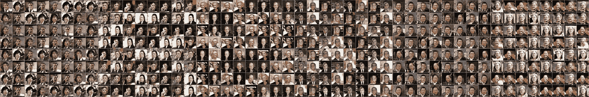
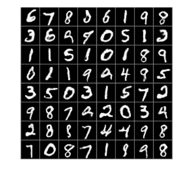
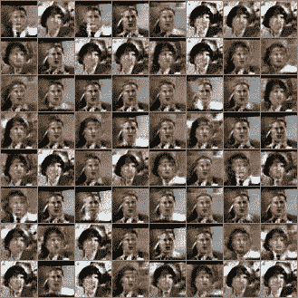

# 实现生成性对抗网络(GAN/DCGAN)来绘制人脸

> 原文：<https://towardsdatascience.com/implementing-a-generative-adversarial-network-gan-dcgan-to-draw-human-faces-8291616904a?source=collection_archive---------0----------------------->

在上一个教程中，我们学习了使用 [Tensorflow](https://www.tensorflow.org/) 来设计一个[变分自动编码器](https://medium.com/towards-data-science/teaching-a-variational-autoencoder-vae-to-draw-mnist-characters-978675c95776) (VAE)，它可以绘制 MNIST 字符。大多数创建的数字看起来很好。只有一个缺点——一些创建的图像看起来有点模糊。用*均方误差*损失函数训练 VAE。然而，很难对精确的字符边缘位置进行编码，这导致网络无法确定这些边缘。如果一个字符的边缘开始向左或向右多几个像素真的有关系吗？我不这么认为。

在本文中，我们将了解如何训练一个不依赖于均方误差或任何相关损失函数的网络，而是让它自己学习真实图像的样子。我们将要了解的架构叫做 [**深度卷积生成对抗网络(DCGAN)**](https://arxiv.org/pdf/1511.06434.pdf) 。罗威尔·阿蒂恩萨在三月下旬写的一篇很棒的文章启发我完成了这个项目，他教我们如何在 keras 应用同样的技术。为了能够与上一个基于 VAE 的模型进行比较，我们将首先看看如何实现一个能够绘制 [MNIST](https://en.wikipedia.org/wiki/MNIST_database) 角色的 DCGAN。之后，我们将在一个更酷的项目中应用我们的知识——只需一些小的调整，我们的网络将学会如何绘制(半)逼真的人脸！

# 深度卷积生成对抗网络

像 VAE 一样，DCGAN 是一种学习生成新内容的架构。就像 VAE 一样，DCGAN 由两部分组成。在这种情况下，它们是:

*   *鉴别器，*，学习如何从我们想要创建的类型的真实对象中辨别出赝品
*   *生成器，**创建新内容并试图欺骗鉴别器*

*基本思想是两个网络部分相互竞争。当鉴别器变得更好时，生成器也需要变得更好，否则它不能再欺骗鉴别器了。类似地，当发生器变得更好时，鉴别器也必须变得更好，否则它将失去区分真假内容的能力。*

*如果你想对 GANs 有更多的直觉，这里有一篇[的文章](https://hackernoon.com/how-do-gans-intuitively-work-2dda07f247a1)，作者[chan chana sornsountorn](https://medium.com/u/5b7a47762eb2?source=post_page-----8291616904a--------------------------------)，描述了一些应用了 DCGANs 的创意项目。其中一个项目是 MNIST 人物的生成，另一个是人脸的生成。在本文中，我们将了解如何在 Python 和 Tensorflow 中实现所描述的技术。我们将从 MNIST 的角色开始。如果你想看这个教程的全部代码，去我的 github 账号看看 [MNIST](https://github.com/FelixMohr/Deep-learning-with-Python/blob/master/DCGAN-MNIST.ipynb) 和[人脸生成](https://github.com/FelixMohr/Deep-learning-with-Python/blob/master/DCGAN-face.ipynb)的代码。*

* [## Felix mohr/使用 Python 进行深度学习

### 在 GitHub 上创建一个帐户，为深度学习 Python 开发做贡献。

github.com](https://github.com/FelixMohr/Deep-learning-with-Python) 

# 设置基础

所以，让我们直接进入代码。

和上一篇教程一样，我们使用 tensorflow 自己的方法来访问批量的 MNIST 字符。我们将批量大小设置为 64。我们的生成器将噪声作为输入。这些输入的数量被设置为 100。批量标准化大大改善了这个网络的训练。对于 tensorflow 应用批处理规范化，我们需要让它知道我们是否处于训练模式。`keep_prob`变量将由我们的辍学层使用，我们引入辍学层是为了获得更稳定的学习结果。`lrelu`定义了流行的 leaky ReLU，希望 tensorflow 的未来版本能够支持它！我首先尝试将标准 ReLUs 应用于这个网络，但这导致了众所周知的 [*死亡 ReLU 问题*](https://en.wikipedia.org/wiki/Rectifier_(neural_networks)#Potential_problems) ，并且我收到了看起来像 Kazimir Malevich 的艺术品的生成图像——我只是得到了[黑色方块](https://en.wikipedia.org/wiki/Black_Square_(painting))。

然后，我们定义一个函数`binary_crossentropy`，我们将在以后计算损失时使用它。

# 鉴别器

现在，我们可以定义鉴别器。它看起来类似于我们的 VAE 的编码器部分。作为输入，它采用真实或虚假的 MNIST 数字(28 x 28 像素灰度图像)并应用一系列卷积。最后，我们使用 sigmoid 来确保我们的输出可以被解释为输入图像是真实的 MNIST 字符的概率。

# 发电机

发生器——就像我们的 VAE 中的解码器部分——接收噪音，并尝试学习如何将噪音转换为数字。为此，它应用了几个转置卷积。一开始我没有对生成器应用批量归一化，它的学习好像真的效率不高。应用批量标准化图层后，学习能力有了很大提高。此外，我首先有一个更大的密集层接受发电机的输入。这导致发生器总是产生相同的输出，不管输入噪声是什么，例如，它总是输出看起来完全相同的 9([模式崩溃](http://aiden.nibali.org/blog/2017-01-18-mode-collapse-gans/))。另一方面，根本不使用密集层会导致生成器在多次迭代后没有学到任何有意义的东西。老实说，调整发电机需要相当大的努力！

# 损失函数和优化器

现在，我们将两部分连接在一起，就像我们在上一个教程中对 VAE 的编码器和解码器所做的那样。但是，我们必须创建两个鉴别器对象:

*   第一个对象接收实像
*   第二对象接收假图像

第二个对象的`reuse`被设置为`True`，所以两个对象共享它们的变量。我们需要两种情况来计算两种类型的损失:

*   当接收真实图像时，鉴别器应该学会计算高值(接近 *1* )，这意味着它确信输入图像是真实的
*   当接收到假图像时，它应该计算低值(接近 *0* ，这意味着它确信输入图像不是真实的

为此，我们使用前面定义的*二元交叉熵*函数。生成器试图实现相反的目标，它试图让鉴别器给假图像分配高值。

现在，我们也应用一些正则化。我们创建了两个不同的优化器，一个用于鉴别器，一个用于生成器。我们必须定义允许这些优化器修改哪些变量，否则生成器的优化器可能会弄乱鉴别器的变量，反之亦然。

在应用批处理规范化时，我们必须向我们的优化器提供`update_ops`——看看 [tensorflow 文档](https://www.tensorflow.org/api_docs/python/tf/contrib/layers/batch_norm),了解关于这个主题的更多信息。

# 训练 GAN

最后，有趣的部分开始了——让我们训练我们的网络！我们向生成器输入随机值，它将学习从这些噪音中生成数字。我们还注意，通过平衡它们的损失，生成器和鉴别器都不会变得太强，否则，这将抑制任一部分的学习，甚至可能阻止网络学习任何东西(我有过这种经验)。

# MNIST 结果

看看我们的生成器绘制的图片——它们看起来比 VAE 绘制的图片更真实，后者的边缘看起来更模糊。然而，训练比训练另一个模型花费的时间要长得多。我还必须提到，在创建的角色看起来有意义之前，我需要比[罗威尔·阿蒂恩萨](https://medium.com/u/8599a4bace36?source=post_page-----8291616904a--------------------------------)更多的迭代，所以特别是如果你没有强大的 GPU，你可能想参考本文顶部提到的他的架构。

MNIST characters created by our DCGAN

这是一个真正的优势，我们不依赖于基于像素位置的损失函数，使结果看起来不那么模糊。这在创建更复杂的数据时尤其重要，例如人脸图片。所以，只要有点耐心，结果最终会回报你的。

# 画人脸

我不会详细介绍生成人脸的完整代码，因为架构基本上是一样的。主要区别在于，我们现在使用三个颜色通道，而不是像以前那样使用一个通道，并且我们允许卷积转置层针对这种更复杂的输入数据学习更多的滤波器。你可以在我的 [github](https://github.com/FelixMohr/Deep-learning-with-Python) 找到完整的代码。

我使用的数据集是麻省大学的 [LFW(野外标记人脸)](http://vis-www.cs.umass.edu/lfw/)数据集。或许使用更大的数据集可以改善结果，但我还没有尝试过。为了让学习在相当长的时间内发生，我将图像缩小到 40 x 40 像素，并以前面提到的相同方式训练 DCGAN。生成器的卷积变换层创建了更多的过滤器，因为这个数据集比 MNIST 数据集更复杂。

Faces drawn by our neural network

看看结果吧！我在特斯拉 K80 GPU 上训练了大约一个小时的网络，以获得这些。也许这些家伙不会骗你相信他们是真人。但是想想看，神经网络以前从未见过任何人，在完成 MNIST 项目后，我们对它的重新设计付出了多么少的努力！这项技术显然有很大的应用潜力。

如果你喜欢这篇文章，你可能也会对我的关于使用变分自动编码器 *生成 MNIST 字符的* [*教程感兴趣。*](https://medium.com/towards-data-science/teaching-a-variational-autoencoder-vae-to-draw-mnist-characters-978675c95776)*