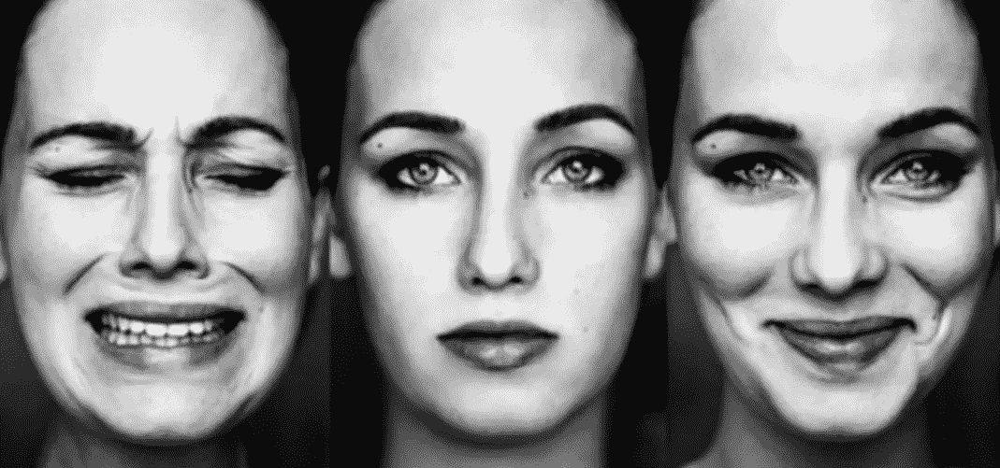
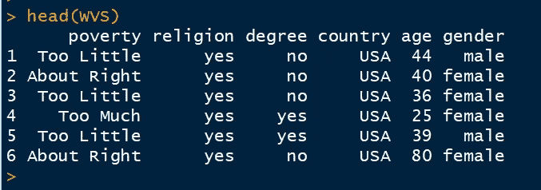
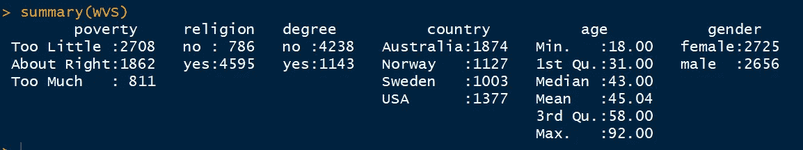
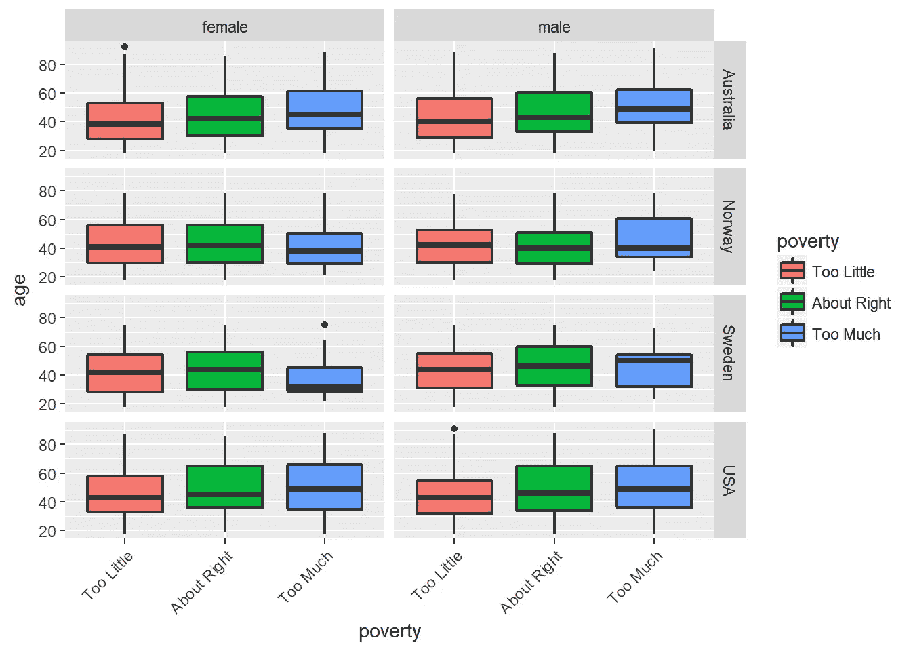
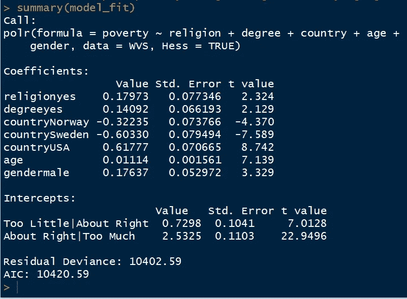
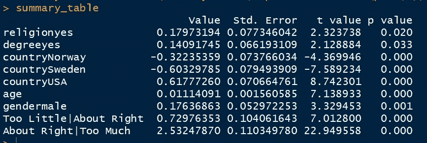
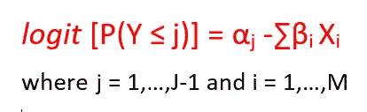
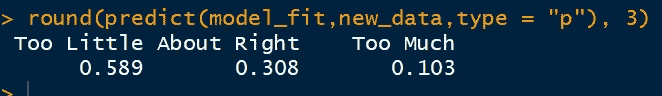

# 有序逻辑回归

> 原文：<https://towardsdatascience.com/implementing-and-interpreting-ordinal-logistic-regression-1ee699274cf5?source=collection_archive---------1----------------------->

## R 中的概述和实现



Fig 1: Performance of an individual — *Poor, Fair, Excellent*

你能猜出下面提到的变量中有什么共同联系吗:

*   工作满意度— *不满意、满意、高度满意*
*   个人表现— *差、一般、优秀*
*   监管对银行绩效的影响— *正面、中性、负面*

变量不仅是分类的，而且它们也遵循一个顺序(从低到高/从高到低)。

如果我们想预测这样的**多类有序变量**那么我们可以使用 ***比例优势逻辑回归*** 技术。

## 目标

为了理解有序逻辑回归的工作原理，我们将考虑世界价值观调查的一项研究，该研究着眼于影响人们对政府减贫努力的看法的因素。

我们的目标是根据个人的国家、性别、年龄等因素，预测个人对政府减贫努力的看法。在给定的案例研究中，个人的感知可以取以下三个值- *太少、大约合适、太多。*

在我们的分析中，我们将使用来自澳大利亚、挪威、瑞典和美国的世界价值观调查数据。

```
**library(carData)
library(MASS)****data(WVS) 
head(WVS)**
```



**Fig 2 — Dataset**

## 数据的描述

**贫困**是多级有序因变量，分类为“太少”、“差不多”和“太多”。我们有以下五个独立变量

*   **宗教**:宗教成员——否或是
*   学位:拥有大学学位——否或是
*   国家:澳大利亚、挪威、瑞典或美国
*   **年龄:**年龄(岁)
*   性别:男性或女性

现在让我们分析这个数据集的**描述性统计数据**:

```
**summary(WVS)**
```



**Fig 3 — Descriptive Statistics**

我们还可以分析不同年龄、性别和国家的贫困分布

```
ggplot(WVS, aes(x = poverty, y = age, fill = poverty)) +   geom_boxplot(size = .75) +   facet_grid(country ~ gender, margins = FALSE) +   theme(axis.text.x = element_text(angle = 45, hjust = 1, vjust = 1))
```



## 拟合模型

我们现在将使用**质量**包中的 **polr** 函数来拟合比例优势逻辑回归模型。

```
**model_fit <- polr(poverty~religion+degree+country+age+gender, data = WVS, Hess = TRUE)
summary(model_fit)**
```



**Fig 4 — Model Summary**

在上面的输出中，我们得到了关于

*   模型方程
*   回归系数及其值、标准误差和 t 值。默认情况下没有显著性检验，但我们可以通过将 t 值与标准正态分布进行比较来计算 p 值。
*   两次截距的估计值
*   剩余偏差和 AIC，用于比较不同模型的性能

## **系数和截距的重要性**

```
**summary_table <- coef(summary(model_fit))
pval <- pnorm(abs(summary_table[, "t value"]),lower.tail = FALSE)* 2
summary_table <- cbind(summary_table, "p value" = round(pval,3))
summary_table**
```



**Fig 5 — Model Significance**

由于所有变量的 p 值<0.05, hence they are statistically significant at 95% CI

## **解释了比例优势模型**

为了解释这个模型，我们首先需要理解比例优势模型的工作原理。

设 J 为因变量的总类别数，M 为自变量的个数(在给定的数据集中，J=3，M = 5)。

比例优势模型的数学公式如下所示



**Fig 6 — Equation for Proportional Odds Model**

这里，J 是具有 J 个级别的有序范畴的级别，I 对应于独立变量

在我们的情况下

*   j = 1 表示“太少”
*   j = 2 表示“大约正确”
*   j = 3 表示“太多”
*   i = 1 指“宗教”
*   i = 2 表示“程度”
*   i = 3 表示“国家”
*   i = 4 表示“年龄”
*   i = 5 表示“性别”

## **解释*图 4*T3 中的模型统计**

**系数:**

*   像**性别**这样的分类变量可以解释为:与女性个体相比，男性个体更有可能对政府的减贫努力产生积极的看法。t 值大于 2，因此在 5%的水平上具有统计学意义。
*   像**年龄**这样的连续变量可以解释为:年龄每增加一个单位，对政府减贫努力持正面看法的概率对数就增加 0.011

**截距:**

*   数学上，截距'**过小|左右'**对应 **logit[P(Y ≤ 1)]** 。它可以被解释为相信政府做得“太少”与相信政府做得“差不多”或“太多”的概率对数
*   同样，截距'**左右|太多'**对应 **logit[P(Y ≤ 2)]** 。它可以被解释为相信政府做得“太少”或“差不多”与相信政府做得“太多”的概率对数

## **对新数据进行预测**

假设我们想要预测与具有以下特征的个人的每个感知相对应的概率

*   宗教:是的
*   学位:否
*   国家:挪威
*   年龄:30 岁
*   性别:男

1.  ***数学计算***

通过使用模型摘要中的截距和斜率值，我们可以按以下方式估计期望的概率

对应于**太少**感知的概率将被计算为:

logit[P(Y≤1)]= 0.7298-[(0.17973 * 1)+(0.14092 * 0)+(-0.32235 * 1)+(0.01114 * 30)+(0.17637 * 1)]

=> logit[P(Y ≤ 1)] =0.36185

= > P(Y≤1)= exp(0.36185)/(1+exp(0.36185))= 0.589

在我们的例子中， **P(Y ≤ 1) = P(Y =1) = 0.589**

类似地，对应于右感知的**的概率将被计算为:**

logit[P(Y≤2)]= 2.5325-[(0.17973 * 1)+(0.14092 * 0)+(-0.32235 * 1)+(0.01114 * 30)+(0.17637 * 1)]

=> logit[P(Y ≤ 2)] =2.16455

= > P(Y≤2)= exp(2.16455)/(1+exp(2.16455))= 0.897

因此，P(Y = 2)= P(Y≤2)—P(Y≤1)= 0.897-0.589

=> **P(Y = 2) = 0.308**

对应于**感知过多**的概率将被计算为:

因此，P(Y = 3) = 1-P(Y ≤2)

**= > P(Y = 3) = 0.103**

***2。在 R* 中计算**

幸运的是，我们可以通过使用 R 中的**预测**函数来绕过上面的数学计算

```
**new_data <- data.frame("religion"= "yes","degree"="no","country"="Norway","age"=30,"gender"="male")****round(predict(model_fit,new_data,type = "p"), 3)**
```



**Fig 7 —Model Prediction**

我们的模型预测，个体*测试者*认为政府减少贫困的努力*太少*

如果您希望了解更多关于这一概念的信息，我建议您访问以下链接:

*   [https://stats . idre . UCLA . edu/r/DAE/ordinal-logistic-regression](https://stats.idre.ucla.edu/r/dae/ordinal-logistic-regression/)
*   http://data . library . Virginia . edu/fitting-and-interpreting-a-proportional-odds-model

谢谢！