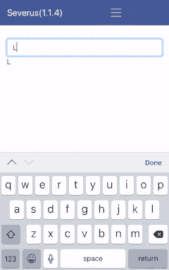

# 用 Postgres 和 Python 实现自动完成

> 原文：<https://towardsdatascience.com/implementing-auto-complete-with-postgres-and-python-e03d34824079?source=collection_archive---------5----------------------->


(linguistics something linguistics) Photo by [Skyler Gerald](https://unsplash.com/@skylargereld?utm_source=unsplash&utm_medium=referral&utm_content=creditCopyText) on [Unsplash](https://unsplash.com/s/photos/linguistics?utm_source=unsplash&utm_medium=referral&utm_content=creditCopyText)

# 介绍


No, she hasn’t learned Python yet. © alphabet inc

如果没有某种自动完成功能，搜索引擎看起来几乎是不完整的。这里有一个从头构建你自己的自动完成的快速指南。我们将使用 Python，Postgres 和 Spacy。弹性搜索是 Postgres 的一个非常好的替代品，但是对于不涉及数百万行的简单任务，Postgres 尽管没有内存能力，但也不算太差。[这里的](https://db-engines.com/en/system/Elasticsearch;PostgreSQL)是一篇强调两者区别的有趣文章。

我们将遵循的流程概述:

*   处理文本数据以提取搜索时弹出的相关短语。
*   将这些数据存储在搜索优化的实体化视图中。
*   创建相关索引。
*   查询该视图并解析自动完成的结果。

# 提取关键短语

[Spacy](https://spacy.io/) 提供了一个工业级的文本解析框架。我们将使用它从文本中提取名词块。代码就像这样简单:

Extraction of noun chunks

此外，您可以使用 Python 的`Counter`来计算这些短语的频率，用于排名和其他目的。下面的代码片段还显示了一个 pg 查询，用于在数据库中插入这些短语，并在发生冲突时采取必要的措施。在我们的例子中，我们通过添加新发现的短语来更新现有短语的频率。

Storing the noun chunks

对于事务性目的，表更适合。我们将把这个表的精选版本放入一个物化视图，用于分析任务，比如搜索。

# 物化视图

了解 Postgres 提供的不同类型的视图之间的区别是很重要的，我们将会看到两种类型:(普通)视图和物化视图。

物化视图将它包含的数据存储在磁盘上，而普通视图在每次查询视图时运行底层查询。这意味着物化视图必须定期刷新。刷新 *es* 既可以手动进行，也可以通过主表上的触发器或监听/通知系统之类的机制进行。我们暂时不讨论这个问题。

主表`*prompts*` 看起来如下:

You can add several conditions on the types of phrases that you want: ngram size, presence of certain POS tags, all phrase as lowercase text, excluding certain stop-words, and so on.

这里的*，id* 是这个表的主键。在 *ngram* 字段上有一个唯一的约束，类型为 varchar(256)。我们不希望关键词太长，因此太具体。

我们现在将创建这个表的物化视图，并在这个视图上建立一个索引。对底层提示表的任何更改都可以通过简单地刷新该视图来解决。

Creation, Indexing and Refreshing of a Materialized View

对于生产级应用程序，请查看[并发刷新视图。](https://www.postgresql.org/docs/9.4/static/sql-refreshmaterializedview.html)

# 获取提示

有几种搜索视图的方法，我们将坚持使用下面的方法:

```
select ngram from <schema_name>.mv_prompts
where tsquery('charges' || ':*') @@ to_tsvector(ngram) 
limit 10
```

另一个巧妙的技巧是在查询的`tsquery(‘charges’ || ‘:*’)`部分包含`|| ‘:*’`。这也可以通过正则表达式搜索得到不完整单词的搜索结果！

## **搜索结果**

这里，' *charges'* '是一个示例搜索词。我们有一个关于`to_tsvector(ngram)`的索引，这将优化搜索。

查询执行时间:109 毫秒。

**注意**:此搜索词仅检索到 9 个结果。

Prompts for search term ‘charg’

下图显示了搜索术语' *charg* '的前 10 个结果。这完全符合我们的目的，因为除了搜索*“费用”*得到的提示外，我们还得到类似于*“应支付利息”*和*“应支付会计期间”*的提示。

查询执行时间:182 毫秒。

没有通配符搜索应该会缩短执行时间，但也会限制结果的数量。这是一个应用程序特有的功能。

# 用一个 API 把它包装起来


(i had a nice dad joke about hitting a space-bar after long day at work, turns out everyone is paranoid about potential copyright infringement and i could not find the source for the original dad joke. So here, enjoy this mildly futuristic bar :/). Photo by [Skyler Gerald](https://unsplash.com/@skylargereld?utm_source=unsplash&utm_medium=referral&utm_content=creditCopyText) on [Unsplash](https://unsplash.com/s/photos/2049?utm_source=unsplash&utm_medium=referral&utm_content=creditCopyText)

*后端现已准备就绪。*现在我们需要反复调用 API 端点来获取用户输入的搜索建议。从*前端*应用程序中获取方法应该能行。这个调用可以在每次按键、按下空格键、输入延迟达到某个阈值或者这些情况的任意组合时触发。

# 包扎

带有 Flask API 处理程序和后续数据库查询的 Python 脚本如下所示:

We done yet?

# 在活动



Straight outta iOS! © ME 😎

进一步的部分包括包括相关的动词短语，解析以保持语义的相似性，以及理解为什么媒体不允许作者定制他们的媒体。