# 二元逻辑回归

> 原文：<https://towardsdatascience.com/implementing-binary-logistic-regression-in-r-7d802a9d98fe?source=collection_archive---------0----------------------->

## R 中的概述和实现


Customer satisfaction for a product — Satisfied vs Dissatisfied (Source: pixabay.com)

你有没有遇到过这样的情况，你想预测一个二元的结果，比如:

*   一个人对一个产品是否满意？
*   一个考生是否会被研究生院录取？
*   两位总统候选人中谁会赢得选举？
*   飞机是否会在预定时间到达目的地？

一个非常简单的机器学习算法将会拯救你，那就是**逻辑回归。**

逻辑回归是一种分类算法，当我们想要基于一组独立变量预测分类变量(是/否，通过/失败)时使用。

在逻辑回归模型中，因变量的比值对数被建模为自变量的线性组合。

让我们使用 **R.** 中的一个实际例子来更清楚地了解**二元逻辑回归**

*考虑这样一种情况，您希望根据血糖浓度、血压、年龄等特征将一个人归类为糖尿病或非糖尿病患者。*

**数据描述**

对于我们的分析，我们将使用来自 **R** 中的 **mlbench** 包的**皮马印第安人糖尿病**数据库

```
**install.packages('mlbench')
install.packages('MASS')
install.packages('pROC')****library(mlbench)
library(MASS)
library(pROC)****data(PimaIndiansDiabetes2)
head(PimaIndiansDiabetes2)**
```

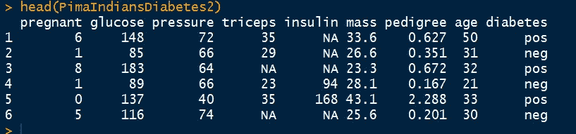

**糖尿病**是该数据集中的二元因变量，分类为 pos/neg。我们有以下八个独立变量

*   **怀孕**:怀孕次数
*   **葡萄糖**:血浆葡萄糖浓度(葡萄糖耐量试验)
*   **压力**:舒张压(毫米汞柱)
*   **三头肌**:皮褶厚度(mm)
*   **胰岛素** : 2 小时血清胰岛素(μU/ml)
*   **体重**:体重指数(体重公斤/(身高米) )
*   **谱系**:糖尿病谱系功能
*   **年龄**:年龄(岁)

现在让我们分析该数据集的**描述性统计数据**:

```
**summary(PimaIndiansDiabetes2)**
```

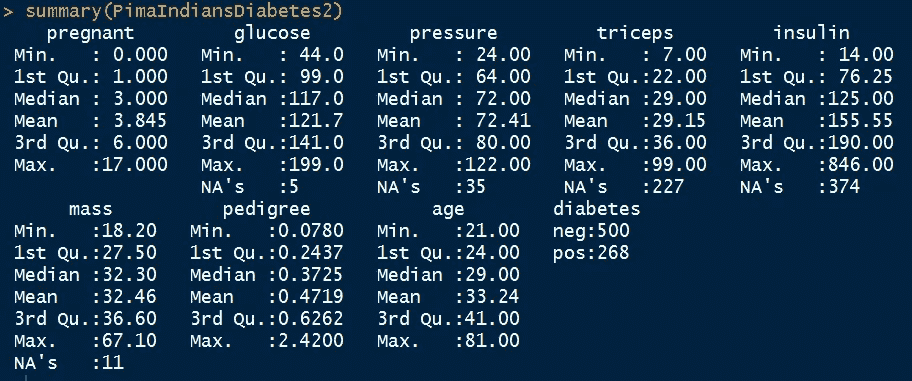

从汇总统计数据中可以明显看出，数据集中存在某些缺失值，它们被突出显示为 NA。

作为一种保守的措施，我们可以删除这样的观察。

```
**newdata <- na.omit(PimaIndiansDiabetes2)
summary(newdata)**
```

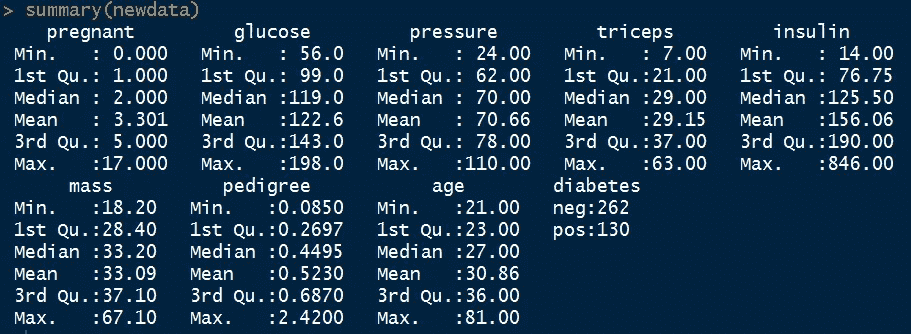

我们来分析一下各个自变量的分布情况:

```
**par(mfrow = c(4,2))****for( i in 1:8){
  hist(newdata[,i], main = colnames(newdata)[i],xlab =     colnames(newdata)[i], col = 'yellow')
}**
```

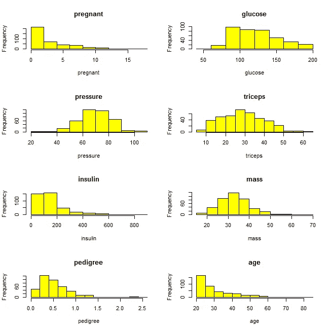

Histogram of independent variables

从上面的直方图来看，很明显变量——怀孕和年龄是高度倾斜的，我们可以分桶分析它们。

对于*年龄*，我们可以创建以下四个时段:20–30 岁、31–40 岁、41–50 岁和 50 岁以上

```
**newdata$age_bucket <- as.factor(ifelse(newdata$age<=30,"20-30",ifelse(newdata$age<=40,"31-40",ifelse(newdata$age<=50,"41-50","50+"))))**
```

对于怀孕的人，我们可以创建以下三个桶:0-5，6-10 和 10+

```
**newdata$preg_bucket <- as.factor(ifelse(newdata$pregnant<=5,"0–5",ifelse(newdata$pregnant<=10,"6–10","10+")))**
```

对于**连续的自变量**，我们可以通过分析它相对于因变量的分布来得到更清晰的分布。

```
**par(mfrow = c(3,2))****boxplot(glucose~diabetes, ylab="Glucose", xlab= "Diabetes", col="light blue",data = newdata)****boxplot(pressure~diabetes, ylab="Pressure", xlab= "Diabetes", col="light blue",data = newdata)****boxplot(triceps~diabetes, ylab="triceps", xlab= "Diabetes", col="light blue",data = newdata)****boxplot(insulin~diabetes, ylab="Insulin", xlab= "Diabetes", col="light blue",data = newdata)****boxplot(mass~diabetes, ylab="Mass", xlab= "Diabetes", col="light blue",data = newdata)****boxplot(pedigree~diabetes, ylab="Pedigree", xlab= "Diabetes", col="light blue",data = newdata)**
```

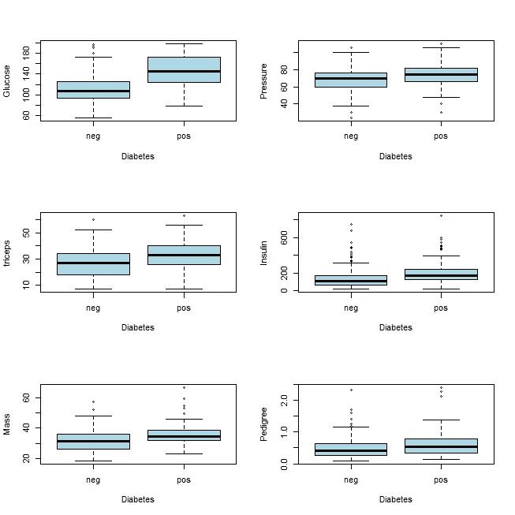

Box Plot for Continuous Independent Variables

从上面的图中，我们可以推断糖尿病患者的葡萄糖含量中位数更高。对于其余的变量，可以得出类似的推论。

对于**分类自变量**，我们可以分析每个分类因变量的频率

```
**xtabs(~diabetes + age_bucket, data = newdata)
xtabs(~diabetes + preg_bucket, data = newdata)**
```

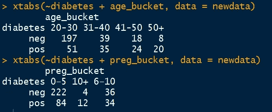

我们现在将创建一个相关建模变量的新数据框。

```
**newdata2 <- newdata[,c("diabetes","glucose","pressure","triceps","insulin","mass","pedigree","age_bucket","preg_bucket")]**
```

实施逻辑回归以预测数据集“*新数据 2* ”中的二元结果——糖尿病。

```
**logit_1 <- glm(diabetes~., family = binomial,data = newdata2)**
```

**模型总结分析**

```
**summary(logit_1)**
```

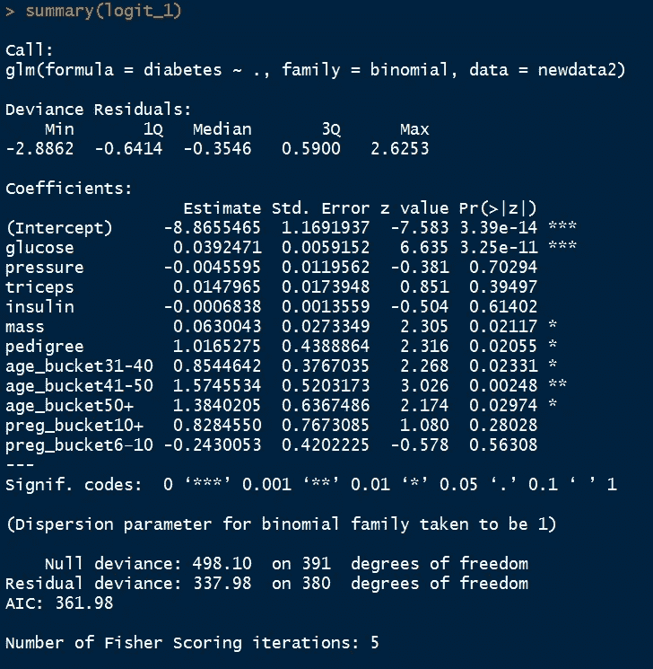

汇总统计数据通过提供以下信息帮助我们更好地理解模型:

1.  偏差残差的分布
2.  截距和斜率估计值以及标准误差、z 值和 p 值
3.  AIC 值
4.  剩余偏差和零偏差

**结果解读**

对于 ***连续变量*** ，解释如下:

葡萄糖**每增加一个单位*，糖尿病【阳性】(相对于糖尿病【阴性】)*的对数几率增加*0.039。
同样，**压力**每增加一个单位*，患糖尿病【阳性】(相对于患糖尿病【阴性】)*的对数几率*减少 0.0045。****

***对于 ***分类变量*** ，每个类别的表现都以基本类别为基础进行评估。变量“age_bucket”的基本类别是 20–30，变量“preg_bucket”的基本类别是 0–5。这些变量的解释如下:***

***处于 31-40 岁的**年龄段**相对于 20-30 岁年龄段，患糖尿病“阳性”(相对于患糖尿病“阴性”)的对数几率变化 0.854。***

***处于 6-10 的**怀孕区间**相对于 0-5 的怀孕区间，患糖尿病“阳性”(相对于患糖尿病“阴性”)的对数概率变化了-0.24。***

*****变量选择*****

***对于给定的一组独立变量，模型“logit_1”可能不是最佳模型。***

***变量选择有多种方法。在本文中，我们将只探索“stepAIC”函数。***

***R 中的“stepAIC”函数执行逐步模型选择，目标是最小化 AIC 值。***

```
***logit_2 <- stepAIC(logit_1)***
```

*****为新创建的具有最小 AIC 的模型分析模型摘要*****

```
***summary(logit_2)***
```

***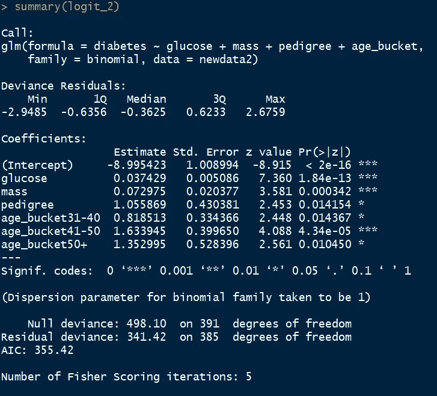***

***实现“stepAIC”函数后，我们现在剩下四个独立变量—葡萄糖、质量、谱系和 age_bucket。在所有可能的模型中，这个模型(logit_2)具有最小的 AIC 值。***

***此外，入围变量非常重要。***

*****结果分析*****

***为了分析将“糖尿病”的值作为“pos”的预测概率，我们可以使用如下的汇总函数***

```
***summary(logit_2$fitted.values)***
```

***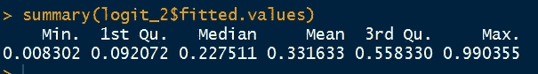***

***我们还可以分析“pos”糖尿病的预测概率的分布。***

```
***hist(logit_2$fitted.values,main = " Histogram ",xlab = "Probability of 'pos' diabetes", col = 'light green')***
```

******

***现在，如果拟合值超过 0.5，我们将预测分类为“正”，否则为“负”。***

```
***newdata2$Predict <- ifelse(logit_2$fitted.values >0.5,"pos","neg")***
```

*****模型性能评估*****

***我们现在可以使用以下参数评估模型的性能:***

1.  *****AIC*****

***AIC 代表 Akaike 信息标准。它是类似于调整后的 R，是惩罚模型自变量数量的拟合度。我们总是喜欢最小 AIC 值的模型。***

***我们可以比较原始模型 logit_1 和由阶梯函数导出的模型 logit_2 的 AIC。***

```
***logit_1$aic
logit_2$aic***
```

***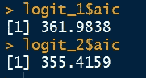***

***正如所料，由阶梯函数导出的模型对应于较低的 AIC 值。***

*****2。混乱矩阵*****

***它是观察值与预测值的表格表示。它有助于量化模型的效率(或准确性)。***

***现在让我们比较“糖尿病”的观察值和预测值:***

```
***mytable <- table(newdata2$diabetes,newdata2$Predict)
rownames(mytable) <- c("Obs. neg","Obs. pos")
colnames(mytable) <- c("Pred. neg","Pred. pos")
mytable***
```

***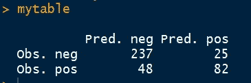***

```
***efficiency <- sum(diag(mytable))/sum(mytable)
efficiency***
```

******

***从混淆矩阵来看，我们的模型的准确率为 81.4%。***

*****3。ROC 曲线*****

***ROC 代表接收机工作特性。它通过评估敏感性和特异性来解释模型的性能。***

```
***roc(diabetes~logit_2$fitted.values, data = newdata2, plot = TRUE, main = "ROC CURVE", col= "blue")***
```

***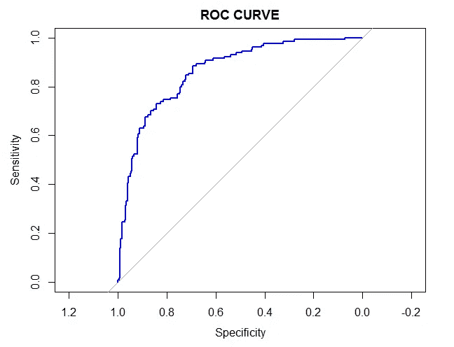***

***ROC 曲线下的面积是准确性的指标。曲线下的面积越大，模型的预测能力越强。***

***完美预测模型的 AUC 等于 1。***

```
***auc(diabetes~logit_2$fitted.values, data = newdata2)***
```

***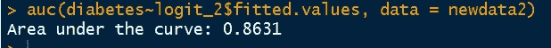***

***模型' **logit_2** 的曲线下面积为 0.863。***

***在下一篇文章中，我们将学习另一种广泛使用的逻辑回归技术— [**有序逻辑回归**](https://medium.com/@akanksha18.009/implementing-and-interpreting-ordinal-logistic-regression-1ee699274cf5)***

***谢谢！***