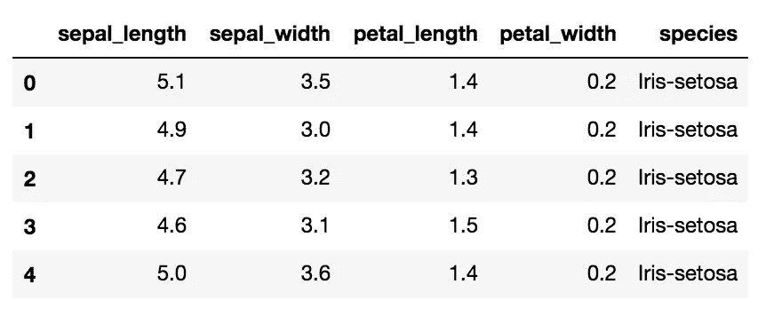
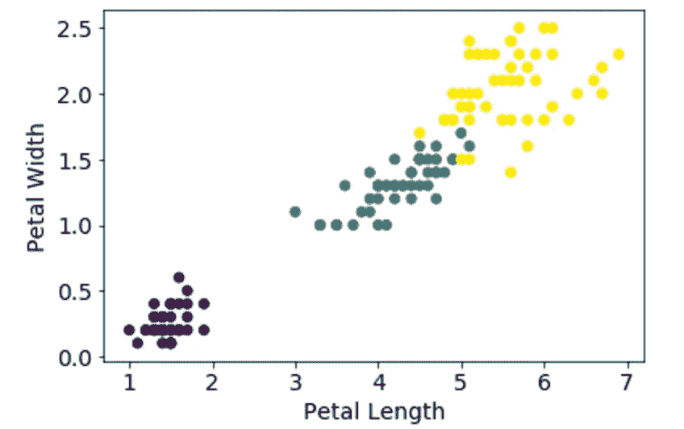

# 在 scikit-learn 中实现 K 近邻

> 原文：<https://towardsdatascience.com/implementing-k-nearest-neighbors-with-scikit-learn-9e4858e231ea?source=collection_archive---------3----------------------->

## scikit-learn 的 KNeighbors 分类器演练

我们将使用 iris 数据集，这里的[来自 UCI 机器学习。这是一个很小的数据集，具有容易区分的聚类，对于像这样的演示非常有用。它包含了对鸢尾属植物三个物种的 150 次观察:刚毛鸢尾、杂色鸢尾和海滨鸢尾。任务是根据最近的邻居来识别每种植物的种类。](http://archive.ics.uci.edu/ml/machine-learning-databases/iris/iris.data)

k-最近邻法是一种简单地查看与它试图预测的观测值最接近的观测值，并根据周围大多数的观测值对感兴趣点进行分类的方法。

我使用以下代码将数据加载到 pandas 数据帧中:

```
## load the iris data into a DataFrame
import pandas as pd
url = '[http://archive.ics.uci.edu/ml/machine-learning-databases/iris/iris.data'](http://archive.ics.uci.edu/ml/machine-learning-databases/iris/iris.data') 
## Specifying column names.
col_names = ['sepal_length', 'sepal_width', 'petal_length', 'petal_width', 'species']
iris = pd.read_csv(url, header=None, names=col_names)
```

下面是一些数据:



下面，我画出了花瓣的长度和宽度被类分开，这样你就可以看到类是如何分开的。



Nice colors!

现在，为了对数据建模，我运行了几个预处理步骤。首先，我将物种名称映射到一个数字上，这样我就可以用我的分类器对它进行分类。其代码如下:

```
## map each iris species to a number with a dictionary and list comprehension.
iris_class = {'Iris-setosa':0, 'Iris-versicolor':1, 'Iris-virginica':2}
iris['species_num'] = [iris_class[i] for i in iris.species]
```

将数据分成我们的建模和目标变量，我们的 X 和 y:

```
## Create an 'X' matrix by dropping the irrelevant columns.
X = iris.drop(['species', 'species_num'], axis=1)
y = iris.species_num
```

列车测试分离:

```
from sklearn.model_selection import train_test_split
## Split data into training and testing sets.
X_train, X_test, y_train, y_test = train_test_split(X, y, random_state=42)
```

我们已经准备好模型了。在下面的代码中，我们将导入分类器，实例化模型，使其适合训练数据，并根据测试数据对其进行评分。请注意，您可以更改用于对每个点进行分类的最近邻的数量。

```
## Import the Classifier.
from sklearn.neighbors import KNeighborsClassifier
## Instantiate the model with 5 neighbors. 
knn = KNeighborsClassifier(n_neighbors=5)
## Fit the model on the training data.
knn.fit(X_train, y_train)
## See how the model performs on the test data.
knn.score(X_test, y_test)
```

该模型实际上具有 100%的准确率，因为这是一个非常简单的数据集，具有明显可分离的类。但是现在你有了。这就是如何用 scikit-learn 实现 K 近邻。加载你最喜欢的数据集，试试吧！