# 使用交互代码实现 NVIDIA 用于自动驾驶汽车的神经网络[手动倒车 TF]

> 原文：<https://towardsdatascience.com/implementing-neural-network-used-for-self-driving-cars-from-nvidia-with-interactive-code-manual-aa6780bc70f4?source=collection_archive---------5----------------------->

Gif from [here](https://giphy.com/gifs/producthunt-self-driving-cars-autonomous-product-hunt-3oEjHZ0YoZeHila4qA/download)

所以最近碰到这个 Quora 的问题，“[用于自动驾驶汽车的神经网络有几层？](https://www.quora.com/How-many-layers-do-neural-networks-used-for-self-driving-cars-have)”，很快我就发现，(通过 [Prasoon Goyal](https://www.quora.com/profile/Prasoon-Goyal) 的回答)NVIDA 从 2016 年开始用的车型并没有那么复杂。

不相信我？请参见下面的网络架构。此外，这里是原始论文的链接，“[自动驾驶汽车的端到端学习](https://arxiv.org/abs/1604.07316)”。

最后，请注意两件事。
1。这种模型在 2016 年使用，当前的模型将更加复杂。
2。让我们在这个模型上使用[扩张反向传播](/outperforming-tensorflows-default-auto-differentiation-optimizers-with-interactive-code-manual-e587a82d340e)，看看我们能达到什么样的结果。

**网络架构(图形形式)**

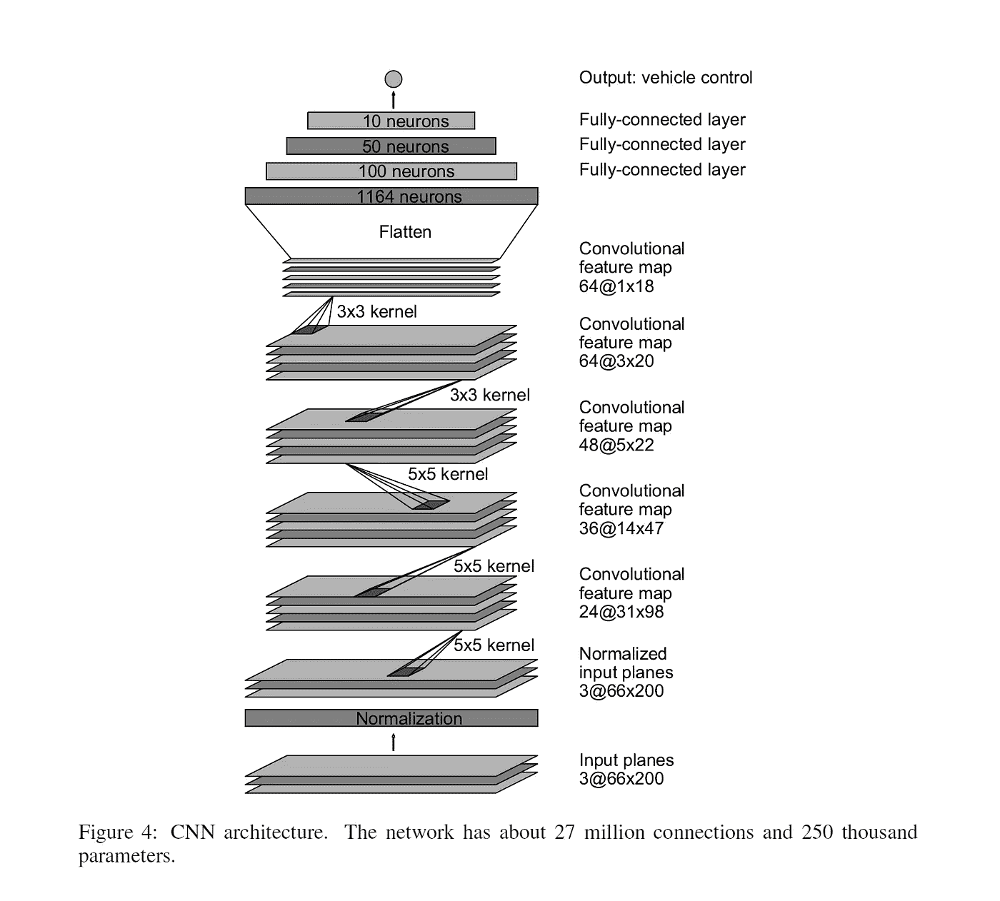

就是这个，LOL 我也不敢相信。这是如此简单，但它似乎在学习如何真正驾驶汽车方面做了一项惊人的工作。让我们看看 NVIDIA 自己的模型视频。

**实验设置/奇怪的观察结果**

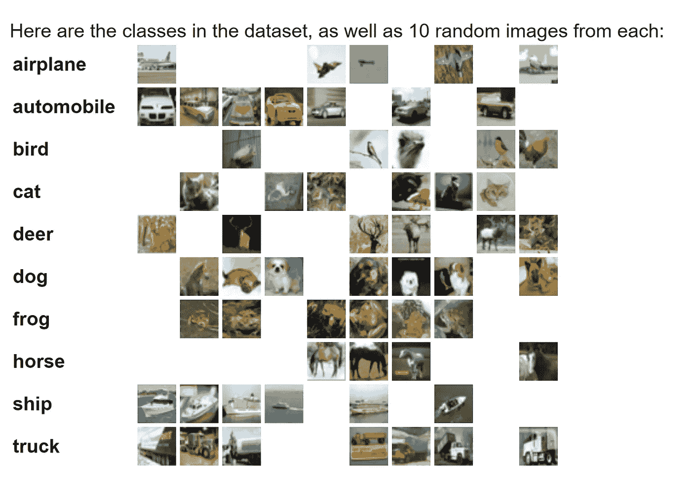

Image from this [webpage](https://www.cs.toronto.edu/~kriz/cifar.html)

由于我没有可以训练 LOL 的汽车，所以我将使用著名的 CIFAR 10 数据集进行分类。

最奇怪的观察是在层中没有激活功能的事实！我甚至找不到任何提到 Relu()或 sigmoid()激活函数的痕迹。甚至在这个[开发者博客](https://devblogs.nvidia.com/deep-learning-self-driving-cars/)里。但是，我决定包含卷积层的 Relu()激活和全连接层的 logistic_sigmoid()激活。这个决定是在进行了多次实验后做出的。

**网络架构(OOP 形式)**

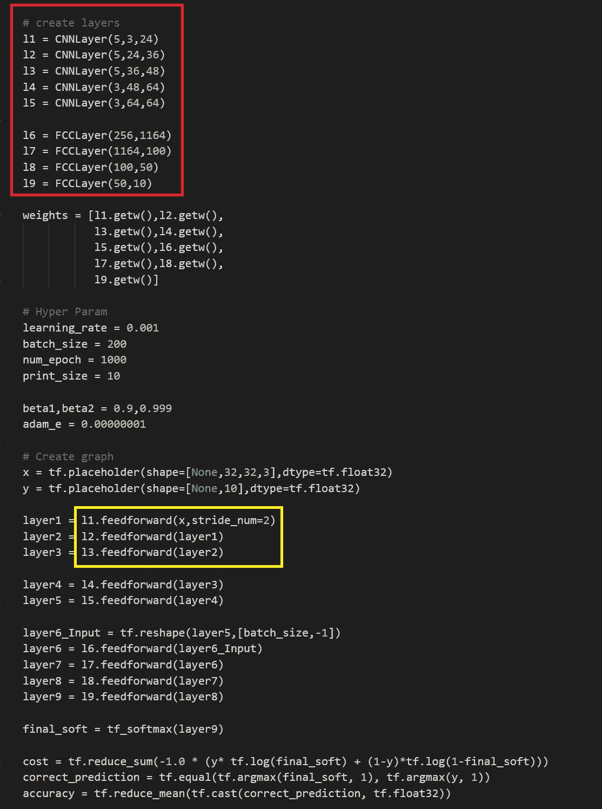

**红框** →网络架构
**黄框** →原纸区别

我唯一需要改变的是第二层和第三层卷积运算的步距。由于输入图像大小，我不能对所有三个卷积层执行步长为 2 的卷积。

**修改后的网络架构(OOP 形式)**

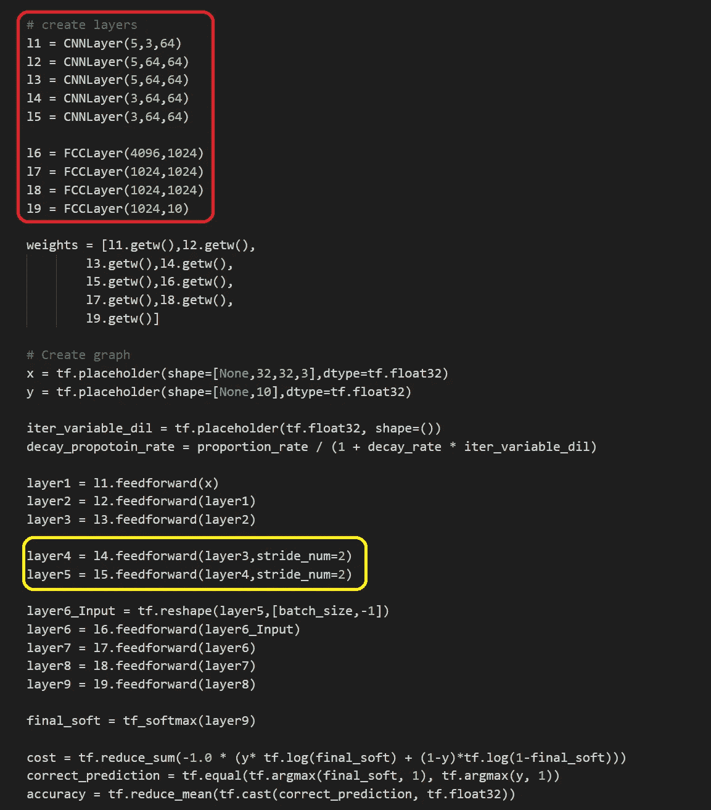

**红框** →神经元和通道数量大小增加
**黄框** →卷积运算差异。

我现在可以告诉你，CIFAR 10 数据集上的性能在原始模型上很差。因此，我增加了卷积层的通道数和全连接层的神经元数，看看我能得到多少改善。也因为我想使用[扩张反向传播](/outperforming-tensorflows-default-auto-differentiation-optimizers-with-interactive-code-manual-e587a82d340e)。

**训练结果(原始模型)**

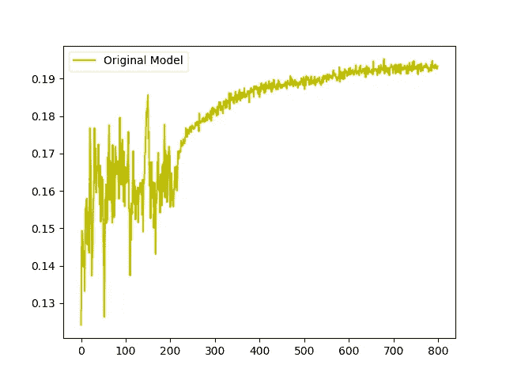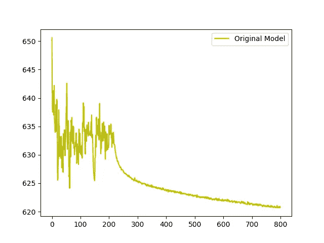

**左图** →随时间变化的列车图像精度
**右图** →随时间变化的列车图像成本

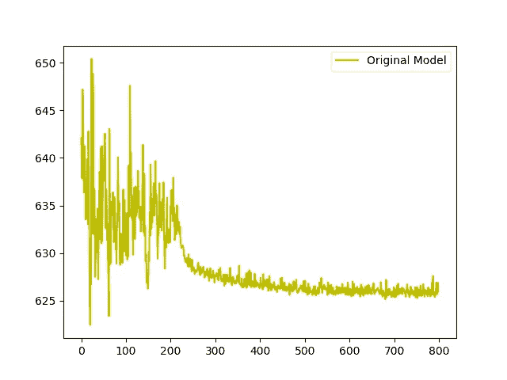

**左图** →随时间测试图像精度
**右图** →随时间测试图像成本

如上所述，训练图像和测试图像的准确率都只有 19%左右。这是可怕的结果。

**透明度**

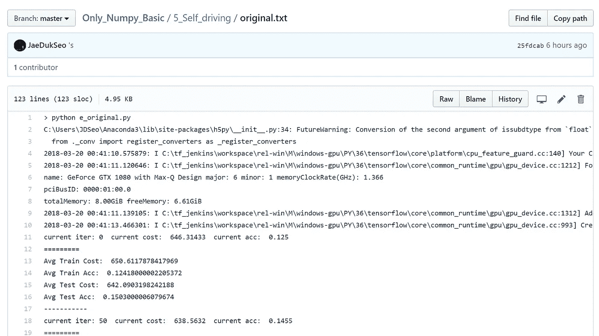

为了增加这个实验的透明度，我已经将培训过程中 cmd 上的所有输出上传到我的 git hub，[请点击这里](https://github.com/JaeDukSeo/Only_Numpy_Basic/blob/master/5_Self_driving/original.txt)访问它们。

**训练结果(修改模型)**

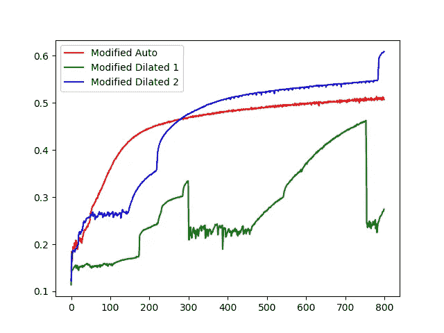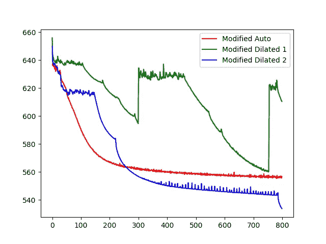

**左图** →随时间变化的列车图像精度
**右图** →随时间变化的列车图像成本

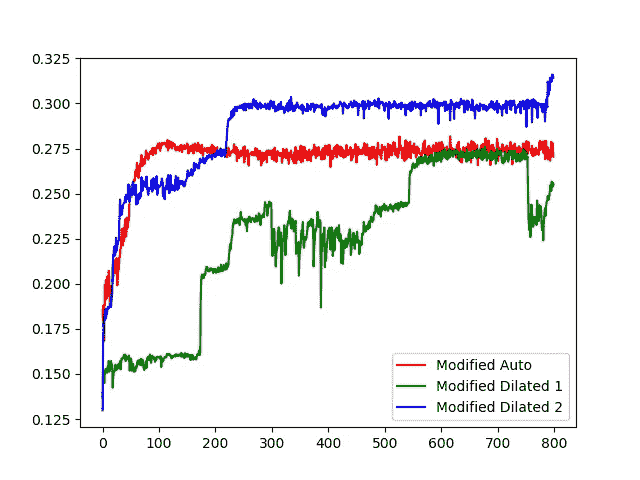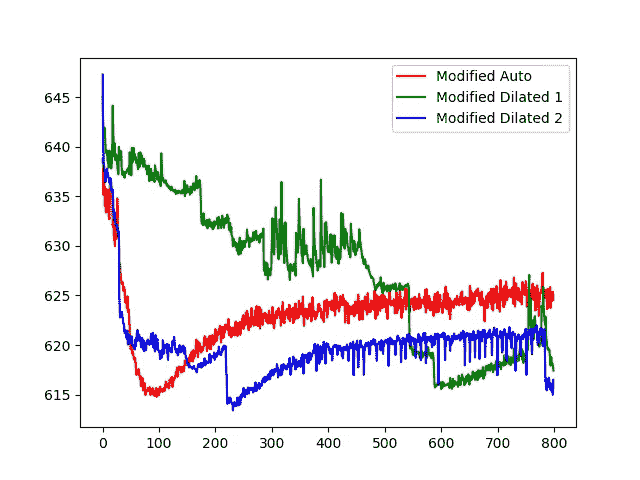

**左图** →随时间测试图像精度
**右图** →随时间测试图像成本

如上所述，即使使用修改的体系结构，训练图像和测试图像的准确度也分别约为 60/30%。这一点都不好……

**透明度**

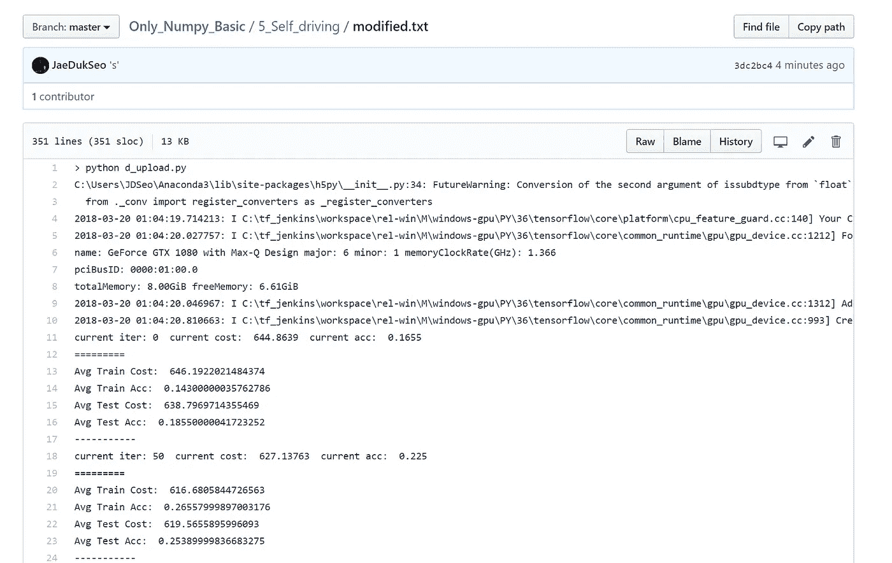

为了增加这个实验的透明度，我已经将培训过程中 cmd 上的所有输出上传到我的 git hub，[请点击这里访问它们。](https://github.com/JaeDukSeo/Only_Numpy_Basic/blob/master/5_Self_driving/modified.txt)

**交互代码(谷歌 Colab、微软 Azure、Repl it)**

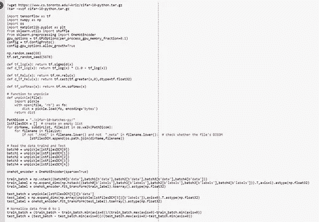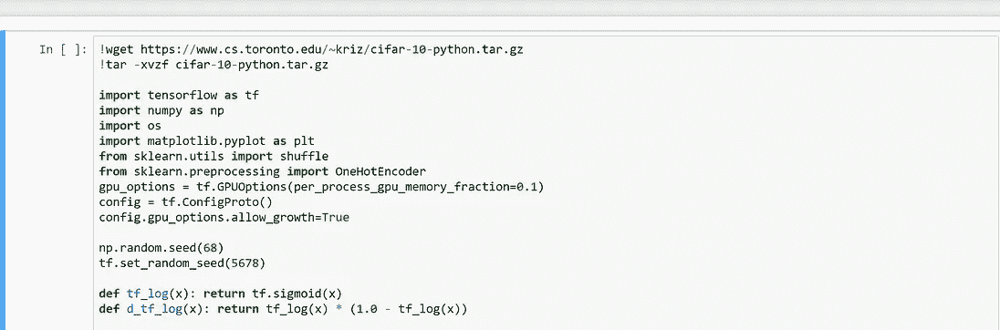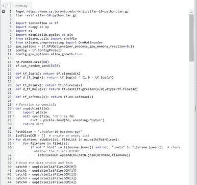

对于谷歌 Colab，你需要一个谷歌帐户来查看代码，而且你不能在谷歌 Colab 中运行只读脚本，所以在你的操场上做一个副本。最后，我永远不会请求允许访问你在 Google Drive 上的文件，仅供参考。编码快乐！

要访问原始模型的代码，请点击您希望查看代码的平台， [Google Colab](https://colab.research.google.com/drive/1eBDD7GN2QhT1ycD8MMj-70rnxH--u1nX) ， [Microsoft Azure](https://selfcar-jaedukseo.notebooks.azure.com/nb/notebooks/31.1%20Self%20Driving%20Car%20og.ipynb) ， [Replt](https://repl.it/@Jae_DukDuk/311-Self-Car-og)

要访问原始模型的代码，请单击您希望查看代码的平台， [Google Colab](https://colab.research.google.com/drive/1m3GerjldirZbBPhqJy7VGmW2JHr8TBu5) ， [Microsoft Azure](https://selfcar-jaedukseo.notebooks.azure.com/nb/notebooks/31.2%20Self%20Driving%20Car%20Modified.ipynb) ， [Replt](https://repl.it/@Jae_DukDuk/312-Self-Car-Modified)

**注意**需要 wget 权限的平台不会在您的浏览器上运行。你可以在 Google Colab 上运行它。

**遗言**

从这个实验中，我了解到一些模型可能在某项任务上做得非常好，而在其他几项任务上表现不佳。此外，我还了解到扩张反向传播也是一个正则化因素。

如果发现任何错误，请发电子邮件到 jae.duk.seo@gmail.com 给我，如果你想看我所有写作的列表，请在这里查看我的网站。

同时，在我的推特[这里](https://twitter.com/JaeDukSeo)关注我，访问[我的网站](https://jaedukseo.me/)，或者我的 [Youtube 频道](https://www.youtube.com/c/JaeDukSeo)了解更多内容。如果你感兴趣的话，我还做了解耦神经网络[的比较。](https://becominghuman.ai/only-numpy-implementing-and-comparing-combination-of-google-brains-decoupled-neural-interfaces-6712e758c1af)

**参考**

1.  [1]2018.【在线】。可用:[https://www . quora . com/How-many-layers-do-neural-networks-used-for-driving-cars-have。](https://www.quora.com/How-many-layers-do-neural-networks-used-for-self-driving-cars-have.)【访问日期:2018 年 3 月 19 日】。
2.  Bojarski，m .、Del Testa，d .、Dworakowski，d .、Firner，b .、Flepp，b .、Goyal，p .、…、张，X. (2016)。自动驾驶汽车的端到端学习。 *arXiv 预印本 arXiv:1604.07316* 。
3.  超越 Tensorflow 的默认自动微分优化器，具有交互式代码[手动…(2018).走向数据科学。检索于 2018 年 3 月 19 日，来自[https://towards data science . com/outpering-tensor flows-default-auto-difference-optimizer-with-interactive-code-manual-e 587 a82d 340 ea](/outperforming-tensorflows-default-auto-differentiation-optimizers-with-interactive-code-manual-e587a82d340ea)
4.  Python？，H. (2018)。如何在 Python 中以列表形式返回字典键？。Stackoverflow.com。检索于 2018 年 3 月 19 日，来自[https://stack overflow . com/questions/16819222/how-to-return-dictionary-keys-as-a-list-in-python](https://stackoverflow.com/questions/16819222/how-to-return-dictionary-keys-as-a-list-in-python)
5.  Python，A. (2018)。在 Python 中访问字典中的任意元素。Stackoverflow.com。检索于 2018 年 3 月 19 日，来自[https://stack overflow . com/questions/3097866/access-an-arbitrary-element-in-a-dictionary-in-python](https://stackoverflow.com/questions/3097866/access-an-arbitrary-element-in-a-dictionary-in-python)
6.  Python 中的 DICOM:用 PyDICOM 和 VTK 将医学图像数据导入 NumPy。(2014).PyScience。检索于 2018 年 3 月 19 日，来自[https://py science . WordPress . com/2014/09/08/DICOM-in-python-importing-medical-image-data-into-numpy-with-pydicom-and-VTK/](https://pyscience.wordpress.com/2014/09/08/dicom-in-python-importing-medical-image-data-into-numpy-with-pydicom-and-vtk/)
7.  博雅尔斯基，m .，菲尔纳，b .，弗莱普，b .，杰克尔，l .，穆勒，美国和齐巴，K. (2016)。自动驾驶汽车的端到端深度学习。NVIDIA 开发者博客。检索于 2018 年 3 月 19 日，来自[https://dev blogs . NVIDIA . com/deep-learning-self-driving-cars/](https://devblogs.nvidia.com/deep-learning-self-driving-cars/)
8.  CIFAR-10 和 CIFAR-100 数据集。(2018).Cs.toronto.edu。检索于 2018 年 3 月 19 日，来自[https://www.cs.toronto.edu/~kriz/cifar.html](https://www.cs.toronto.edu/~kriz/cifar.html)
9.  j . brown lee(2017 年)。如何在 Python 中对序列数据进行热编码-机器学习掌握？机器学习精通。检索于 2018 年 3 月 19 日，来自[https://machine learning mastery . com/how-to-one-hot-encode-sequence-data-in-python/](https://machinelearningmastery.com/how-to-one-hot-encode-sequence-data-in-python/)
10.  SciPy . sparse . CSR _ matrix—SciPy v 1 . 0 . 0 参考指南。(2018).Docs.scipy.org。检索于 2018 年 3 月 19 日，来自[https://docs . scipy . org/doc/scipy/reference/generated/scipy . sparse . CSR _ matrix . html](https://docs.scipy.org/doc/scipy/reference/generated/scipy.sparse.csr_matrix.html)
11.  超越 Tensorflow 的默认自动微分优化器，具有交互式代码[手动…(2018).走向数据科学。检索于 2018 年 3 月 20 日，来自[https://towards data science . com/outpering-tensor flows-default-auto-difference-optimizer-with-interactive-code-manual-e587 a82d 340 e](/outperforming-tensorflows-default-auto-differentiation-optimizers-with-interactive-code-manual-e587a82d340e)
12.  Google Colab 免费 GPU 教程—深度学习火鸡—中等。(2018).中等。检索于 2018 年 3 月 20 日，来自[https://medium . com/deep-learning-turkey/Google-colab-free-GPU-tutorial-e 113627 b9f5d](https://medium.com/deep-learning-turkey/google-colab-free-gpu-tutorial-e113627b9f5d)
13.  文件？，W. (2018)。解压一个. tar.gz 文件需要什么命令？。Askubuntu.com。检索于 2018 年 3 月 20 日，来自[https://askubuntu . com/questions/25347/what-command-do-I-need-to-unzip-extract-a-tar-gz-file](https://askubuntu.com/questions/25347/what-command-do-i-need-to-unzip-extract-a-tar-gz-file)
14.  线？，H. (2018)。如何通过命令行重命名目录？。Askubuntu.com。检索于 2018 年 3 月 20 日，来自[https://askubuntu . com/questions/56326/how-do-I-rename-a-directory-via-the-command-line](https://askubuntu.com/questions/56326/how-do-i-rename-a-directory-via-the-command-line)