# 使用深度学习创建 Snapchat 过滤器系统

> 原文：<https://towardsdatascience.com/implementing-snapchat-like-filters-using-deep-learning-13551940b174?source=collection_archive---------6----------------------->

如果你们都不喜欢阅读

欢迎，所有可能在看到‘Snapchat’和‘深度学习’这两个词后打开这篇文章的千禧一代程序员。我向上帝发誓，这两个字像飞蛾扑火一样吸引着你们。我在骗谁，我也是它的受害者，这就是为什么我花了几个小时做这个项目。

在这篇文章中，如果你愿意这样称呼它，我将回顾标题中的过程和项目背后的一点理论。坦白地说，即使我在标题中使用术语“Snapchat”也可能有点 clickbaity，因为尽管这个项目的工作原理相同(使用面部关键点将对象映射到面部)，但就复杂性和准确性而言，它甚至没有接近 Snapchat 的实现。说完这些，让我从介绍我使用的数据集开始。

# 数据集

我使用的数据集如下:[https://www.kaggle.com/c/facial-keypoints-detection](https://www.kaggle.com/c/facial-keypoints-detection)由[蒙特娄大学的 Yoshua Bengio](http://www.iro.umontreal.ca/~bengioy/yoshua_en/index.html) 博士提供。

每个预测的关键点由像素索引空间中的(x，y)实值对指定。共有 15 个关键点，代表了面部的不同元素。输入图像在数据文件的最后一个字段中给出，由像素列表(按行排序)组成，整数为(0，255)。这些图像是 96x96 像素。

既然我们对正在处理的数据类型有了很好的了解，我们需要对它进行预处理，以便我们可以将它用作模型的输入。

## 步骤 1:数据预处理和其他诡计

上面的数据集有两个我们需要关注的文件——**training . CSV**和 **test.csv.** 训练文件有 31 列:30 列为关键点坐标，最后一列包含字符串格式的图像数据。它包含 7049 个样本，**然而**，这些例子中的许多在一些关键点上有“NaN”值，这让我们很难处理。因此我们将只考虑没有任何 NaN 值的样本。下面的代码就是这样做的:*(下面的代码也对图像和关键点数据进行规范化，这是一个非常常见的数据预处理步骤)*

一切都好吗？不完全是，没有。似乎只有 **2140** 个样本不包含任何 NaN 值。训练一个通用和精确的模型，这些样本要少得多。因此，为了创建更多的数据，我们需要**扩充我们当前的数据**。

数据扩充是一种通过使用缩放、平移、旋转等技术从现有数据中生成更多数据的技术。在这种情况下，**我镜像了每张图像及其对应的关键点**，因为像缩放和旋转这样的技术可能会扭曲面部图像，从而破坏模型。最后，我将原始数据与新的扩充数据结合起来，得到总共 **4280** 个样本。

## 步骤 2:模型架构和培训

现在让我们进入项目的深度学习部分。我们的目标是预测一张看不见的脸的每个关键点的坐标值，**，因此这是一个回归问题**。由于我们正在处理图像，卷积神经网络是特征提取的一个非常明显的选择。这些提取的特征然后被传递到一个完全连接的神经网络，该网络输出坐标。最终的密集层需要 30 个神经元，因为我们需要 30 个值(15 对(x，y)坐标)。

*   “ReLu”激活在每个卷积和密集层之后使用，除了最后一个密集层，因为这些是我们需要作为输出的坐标值
*   剔除调整用于防止过度拟合
*   添加最大池是为了降维

模型能够达到最小损耗 **~0.0113** ，精度 **~80%** ，我觉得已经足够体面了。以下是测试集上模型性能的一些结果:

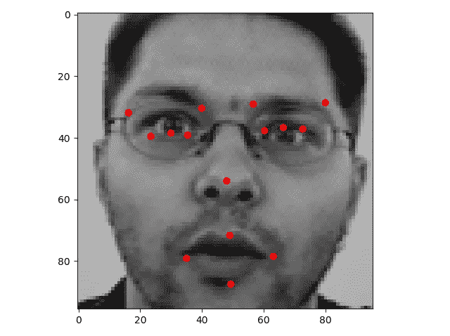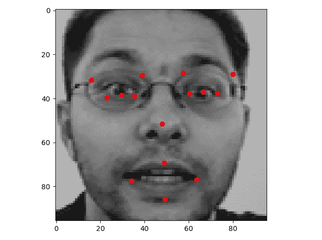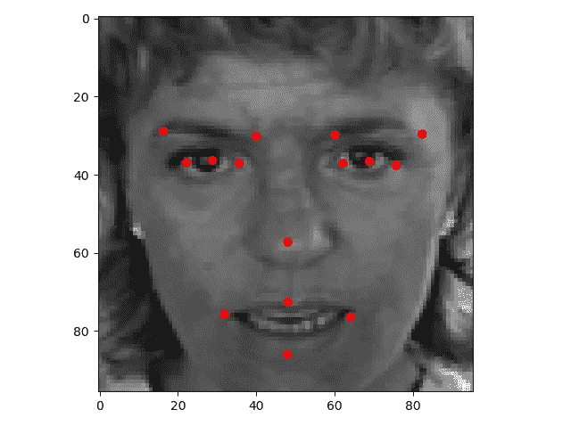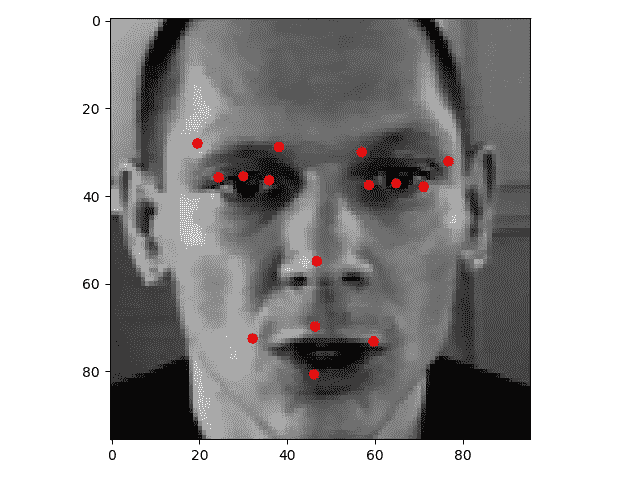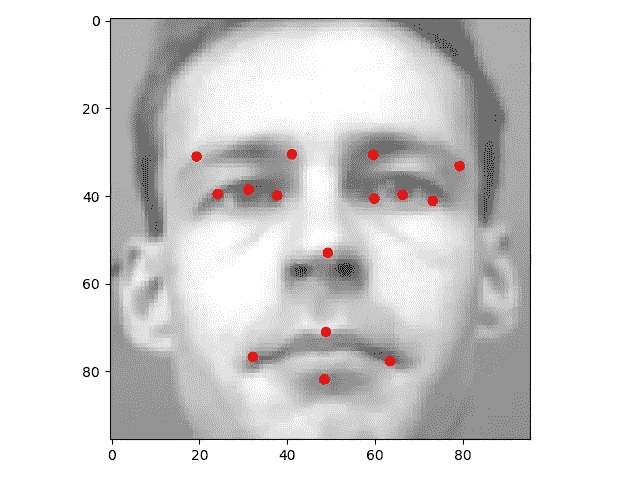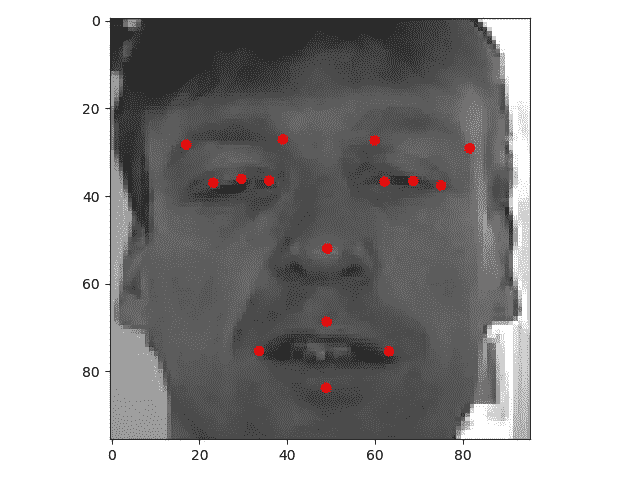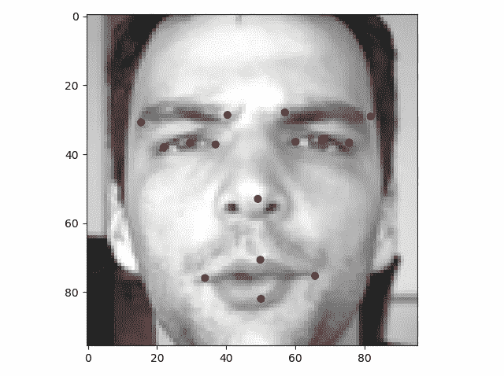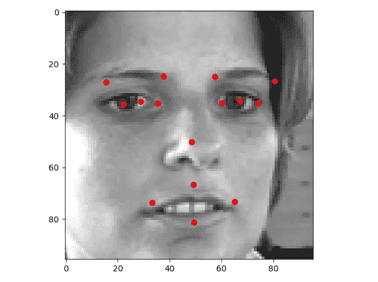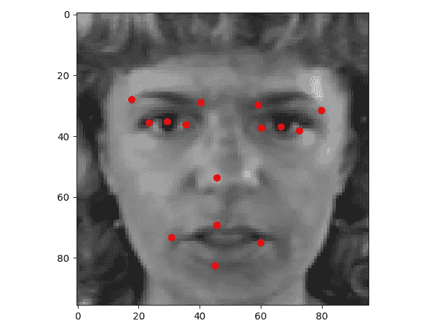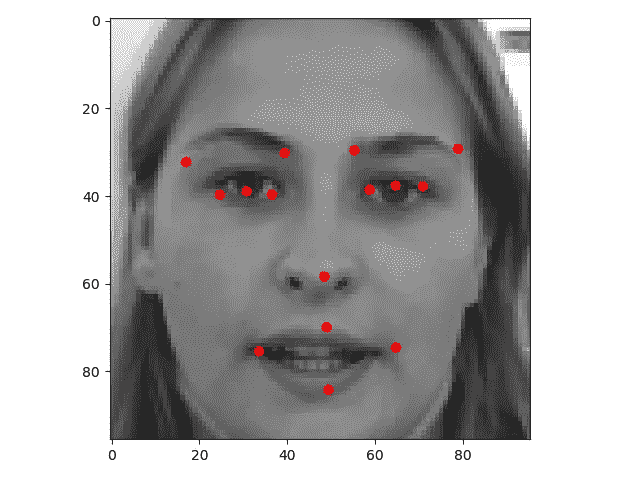

Model performance on the Test set

我还需要检查模型在来自我的网络摄像头的图像上的表现，因为这是模型在过滤器实施期间将接收到的，下面是模型在我美丽的脸的图像上的表现:

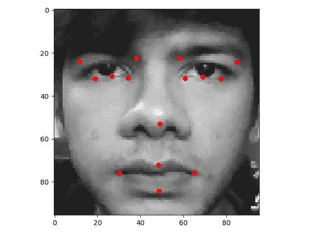

Don’t be intimidated by this scary face. I don’t bite.

## 第三步:将模型付诸实施

我们已经让我们的模型工作了，所以我们现在要做的就是使用 OpenCV 来做以下事情:

1.  从网络摄像头获取图像帧
2.  检测每个图像帧中的面部区域，因为图像的其他部分对模型没有用(我使用了**正面面部哈尔级联**来裁剪面部区域)
3.  通过转换为灰度、规格化和整形来预处理该裁剪区域
4.  将预处理后的图像作为输入传递给模型
5.  获得对关键点的预测，并使用它们在面部定位不同的过滤器

当我开始测试的时候，我脑子里没有任何特定的过滤器。我在 2018 年 12 月 22 日**左右产生了这个项目的想法**，作为一个像其他普通人一样的超级圣诞粉丝，我决定采用以下过滤器:

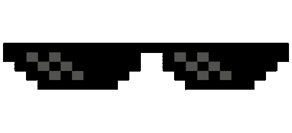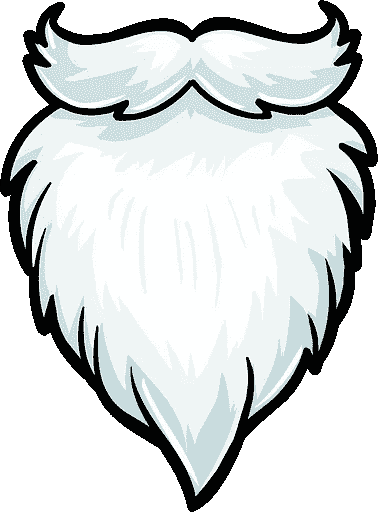

Filters

我使用了特定的关键点来缩放和定位上述每个过滤器:

*   **眼镜滤镜:**左眼左关键点和右眼右关键点之间的距离用于缩放。眉毛关键点和左眼左关键点用于眼镜的定位
*   **胡须过滤器:**左嘴唇关键点和右嘴唇关键点之间的距离用于缩放。上唇关键点和左唇关键点用于胡须的定位
*   **帽子滤镜:**脸部的宽度用于缩放。眉毛关键点和左眼左关键点用于帽子的定位

执行上述所有操作的代码如下:

# 结果

上面，你可以看到项目的最终输出，其中包含一个在我脸上使用滤镜的实时视频和另一个标绘了关键点的实时视频。

## 项目的局限性

虽然这个项目运行得很好，但我确实发现了一些不足之处，使它有点不完美:

*   不是最准确的模型。虽然在我看来 80%已经相当不错了，但还是有很大的提升空间。
*   这个当前的实现只适用于选定的一组过滤器，因为我不得不做一些手动调整，以获得更精确的定位和缩放。
*   将滤镜应用到图像的过程在计算上是相当低效的，因为要覆盖。png 过滤器图像到基于 alpha 通道的网络摄像头图像上，我必须在 alpha 不等于 0 的地方逐个像素地应用过滤器。这有时会导致程序在检测到图像中不止一张人脸时崩溃。

该项目的完整代码在我的 Github 上:[https://Github . com/agr awal-rohit/Santa-filter-face-key point-regression](https://github.com/agrawal-rohit/Santa-filter-facial-keypoint-regression)

如果你想改进这个项目，或者你对我解决上述问题有任何建议，请务必在下面留下回复，并在 Github repo 上生成一个 pull 请求。谢谢你的来访，希望你喜欢这本书。

再见。