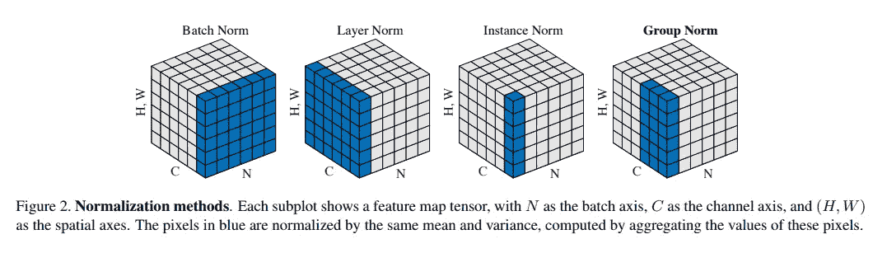
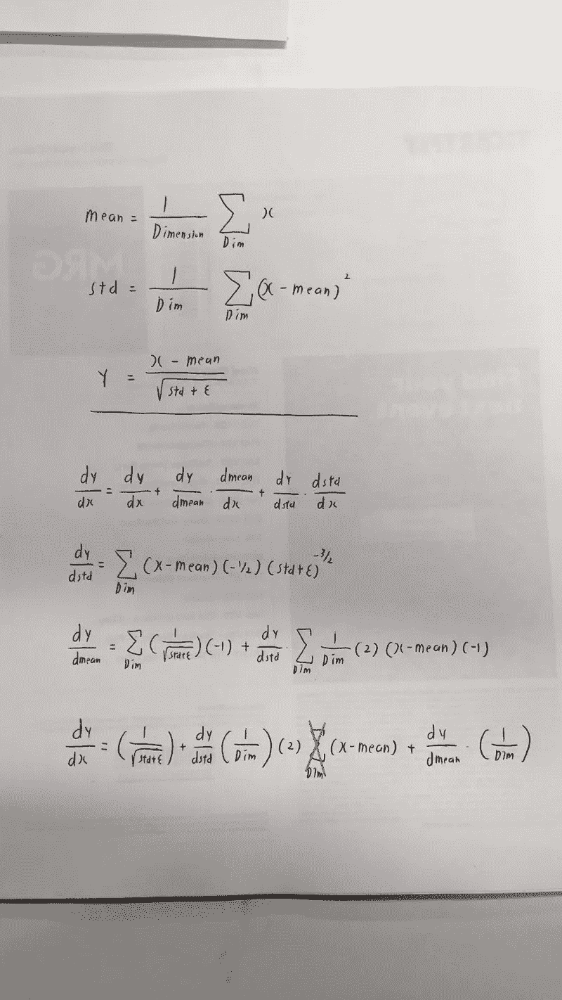
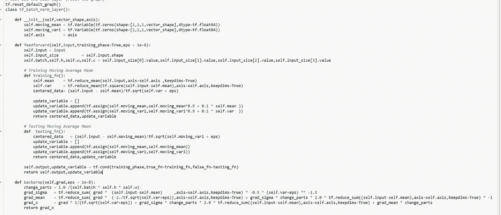
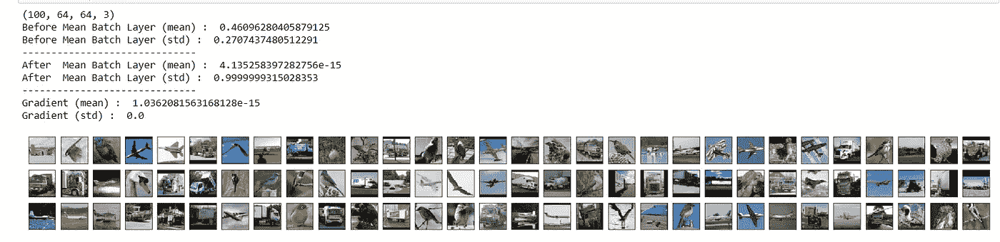
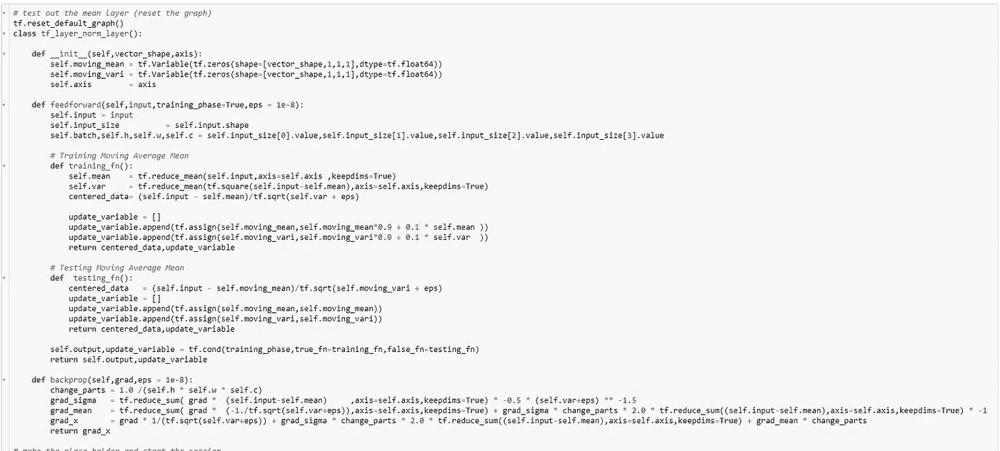
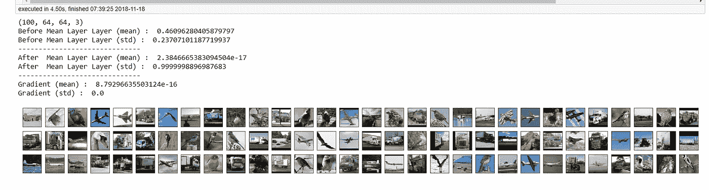
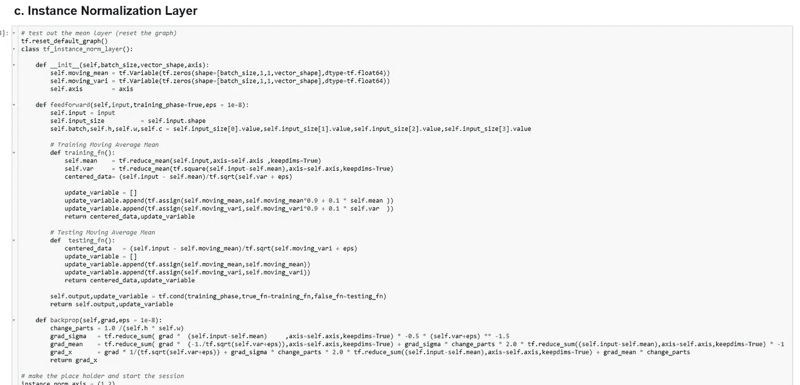
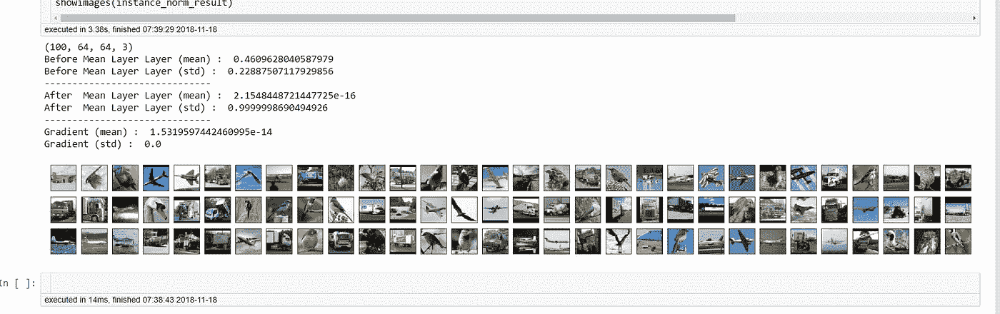
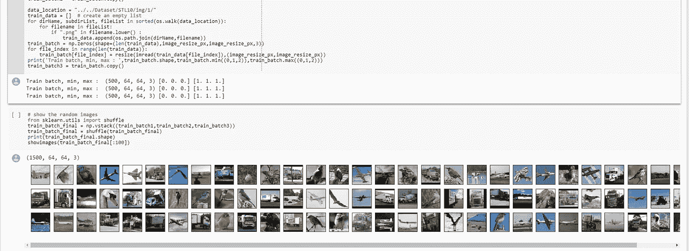

# 在 Tensorflow 中实现空间批量/实例/图层归一化[TF 中的手动反推]

> 原文：<https://towardsdatascience.com/implementing-spatial-batch-instance-layer-normalization-in-tensorflow-manual-back-prop-in-tf-77faa8d2c362?source=collection_archive---------5----------------------->

Photo by [Daniel van den Berg](https://unsplash.com/photos/yaHOyZjxQVA?utm_source=unsplash&utm_medium=referral&utm_content=creditCopyText) on [Unsplash](https://unsplash.com/search/photos/normalization?utm_source=unsplash&utm_medium=referral&utm_content=creditCopyText)

这篇文章是对实现不同规范化层的简单回顾。

> **请注意，这篇帖子是给未来的自己看的，回顾这篇帖子里呈现的材料。**

**简介**

Image from this [website](https://arxiv.org/pdf/1803.08494.pdf)

今天我想写一篇关于实现不同类型的标准化层的短文。如上所述，批次/层/实例甚至组规范化方法都是相互关联的。唯一的区别是他们取均值和方差(一阶和二阶矩)的维度。

**算出导数**

计算每个归一化方案的导数也很容易。唯一的区别是，1)我们求导的维数，2)求导时需要除以的数。

上面的 DIM 变量显示了每个归一化方案之间的差异。假设我们有代表(B，H，W，C)的 4D 张量，它代表图像的批次、高度、宽度和通道。

**批次定额** →对通道(1，1，1，c)取均值和方差
**层定额** →对批次(b，1，1，1)
**实例定额** →对批次/通道(b，1，1，c)取均值和方差

**更新**我重新阅读了最初的批量定额论文，作者没有包括 sigma 项。我也更新了代码。

**批量归一化**

使用我们能够从顶部驱动的派生，实现批量规范化层是非常容易的。

此外，我们可以确认，在该层之后，平均值为零(非常接近零)，并且对于我们已经归一化的维度，标准偏差被设置为 1。

**图层归一化**

类似的故事层标准化，这一次我们将执行标准化方面的批量维度。

**实例规范化**

最后对于实例标准化，我们需要对批量维度和渠道维度进行标准化。

**这篇短文的代码**

要获取这篇博文[的代码，请点击这里。](https://colab.research.google.com/drive/1Ijc1PywRUkvihoX_hXIjfHG4f_f6ERWW)

**最后的话**

实现这种标准化层总是好的做法，对于想要更多数学细节的人，请看这篇[博文。](http://cthorey.github.io./backpropagation/)

**参考**

1.  (2018).Arxiv.org。检索于 2018 年 11 月 18 日，来自[https://arxiv.org/pdf/1803.08494.pdf](https://arxiv.org/pdf/1803.08494.pdf)
2.  空间 Batchnorm Backprop 实施说明 Sam Kirkiles 博客 Medium。(2018).中等。2018 年 11 月 18 日检索，来自[https://medium . com/samkirkiles/spatial-batch norm-back prop-implementation-notes-8 ccde 1 AC 62 a 2](https://medium.com/samkirkiles/spatial-batchnorm-backprop-implementation-notes-8ccde1ac62a2)
3.  推导批次标准化的后向传递的梯度。(2018).kevinzakka . github . io . 2018 年 11 月 18 日检索，来自[https://kevinzakka . github . io/2016/09/14/batch _ normalization/](https://kevinzakka.github.io/2016/09/14/batch_normalization/)
4.  thorey，C. (2016 年)。流过批量归一化的渐变是什么样子的？。Cthorey.github.io..检索于 2018 年 11 月 18 日，来自[http://cthorey . github . io ./back propagation/](http://cthorey.github.io./backpropagation/)