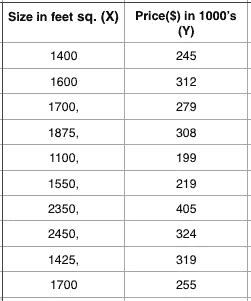
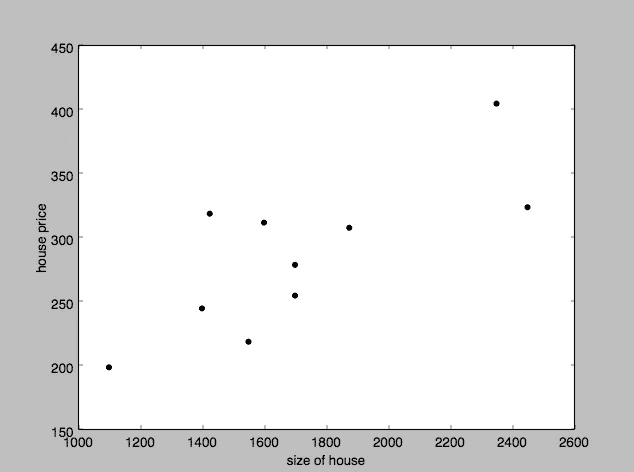
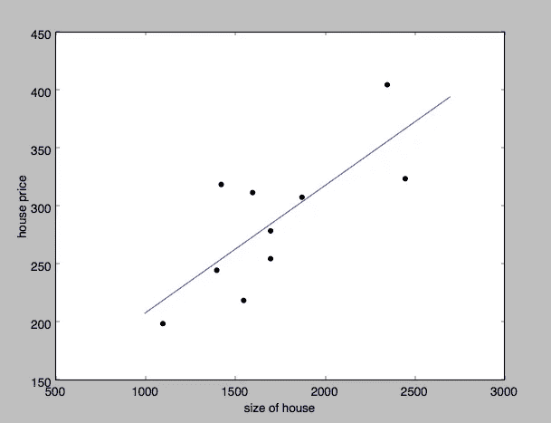

# 用 sk learn——线性回归实现监督学习算法

> 原文：<https://towardsdatascience.com/implementing-supervised-learning-algorithm-by-sklearn-linear-regression-96ffbdb29961?source=collection_archive---------4----------------------->


在这篇博客中，我们将看到如何使用 Python 中的 SkLearn 库实现监督学习算法—线性回归。SkLearn 或 scikit-learn 是最广泛使用的机器学习和数据分析工具之一。它完成所有的计算，让您专注于提高效率，而不是算法的计算部分。

关于 scikit-learn 的更多细节，你可以从给定的链接中参考官方文档

[](http://scikit-learn.org/stable/) [## sci kit-learn:Python 中的机器学习

### 编辑描述

scikit-learn.org](http://scikit-learn.org/stable/) 

## 什么是监督学习算法？

机器学习大致包括两种方法，一种是有监督的，另一种是无监督的。在监督学习中，我们事先知道测试数据集的输出，而在无监督学习中，没有这样的数据集提供给我们。

要深入了解这个主题，请参考给定的链接。

[](http://machinelearningmastery.com/supervised-and-unsupervised-machine-learning-algorithms/) [## 监督和非监督机器学习算法-机器学习掌握

### 什么是监督机器学习，它与无监督机器学习有什么关系？在这篇文章中，你将…

machinelearningmastery.com](http://machinelearningmastery.com/supervised-and-unsupervised-machine-learning-algorithms/) 

## 现在到了有趣的部分——编码

我们将用 Python 编码，确保你已经在你的系统上安装了它。我将指导您安装所需的外部库。

```
import matplotlib.pyplot as pltimport numpy as npfrom sklearn import linear_model
```

让我快速地引导你到我们正在使用的库，如果你还没有它们，你可以使用 pip 安装它们。

*   [**Matplotlib**](https://matplotlib.org)**:**是一个用于绘制 2D 图形和图表的 python 库。我们将使用它来表示我们的模型。
*   [**Numpy**](http://www.numpy.org) :是 python 中用来进行科学计算的包。我们将使用它为我们的数据集制作数组和矩阵，并对它们进行基本计算。
*   **S**[**kle arn—Linear _ model**](http://scikit-learn.org/stable/modules/linear_model.html):我们将使用 sklearn 的线性模型对给定的数据集进行线性回归。

出于教学目的，我们将使用小型硬编码数据集，否则您可以使用任何数据集。有像 [**熊猫**](http://pandas.pydata.org) 这样的库允许从外部源加载数据集。

比方说，现在我们想根据房子的大小来预测房子的价格。我们的测试数据集将是这样的。



DataSet Table

我们现在将使用 python 中的字典放置数据集(用于教程目的)，并将使用 matplot 库绘制它们。

```
import matplotlib.pyplot as pltimport numpy as npfrom sklearn import datasets, linear_modelhouse_price = [245, 312, 279, 308, 199, 219, 405, 324, 319, 255]size = [1400, 1600, 1700, 1875, 1100, 1550, 2350, 2450, 1425, 1700]plt.scatter (size,house_price, color=’black’)plt.ylabel(‘house price’)plt.xlabel(‘size of house’)plt.show()
```

上面将给出以下输出。



现在，我们使用 scikit 的线性模型以如下方式训练我们的数据集。

```
import matplotlib.pyplot as pltimport numpy as npfrom sklearn import datasets, linear_modelhouse_price = [245, 312, 279, 308, 199, 219, 405, 324, 319, 255]size = [1400, 1600, 1700, 1875, 1100, 1550, 2350, 2450, 1425, 1700]size2 = np.array(size).reshape((-1, 1))#fitting into the modelregr = linear_model.LinearRegression()regr.fit(size2, house_price)print('Coefficients: \n', regr.coef_)print('intercept: \n', regr.intercept_)##############################formula obtained for the trained modeldef graph(formula, x_range): x = np.array(x_range) y = eval(formula) plt.plot(x, y)#plotting the prediction line graph('regr.coef_*x + regr.intercept_', range(1000, 2700))print regr.score(size2, house_price)#############################plt.scatter (size,house_price, color=’black’)plt.ylabel(‘house price’)plt.xlabel(‘size of house’)plt.show()
```

编译完上面的代码后，你会看到带有预测行的数据模型。

```
(‘Coefficients: \n’, array([ 0.10976774]))(‘intercept: \n’, 98.248329621380833)
```

这里，预测线的方程是“y = mx + c”的形式，上面计算了“m”和“c”的值。



给定房子的大小，要预测任何新的价格，我们可以通过以下方式使用线性模型提供的预测函数。

```
print regr.predict([2000])
```

> 预测产量为 317.78380528 千美元。

这就结束了线性压缩的教程。对于任何开始学习机器的人来说，我建议不要使用 scikit 库，先进行一次线性回归，只是为了更好地理解概念。尽量使用 [**梯度下降**](https://www.analyticsvidhya.com/blog/2017/03/introduction-to-gradient-descent-algorithm-along-its-variants/) 等算法，使平方误差函数最小化。如果你不想用 python 编码，你可以使用 GNU-Octave 或 Matlab 等工具，它们非常适合原型和分析。此外，对矩阵和计算有很好的了解会对你有很大帮助。

快乐编码:)

感谢阅读这篇文章。如果你觉得这篇文章有帮助，一定要点击下面的❤来推荐它。这对我意义重大。

*如果你想了解更多关于编程的知识，你可以关注我，这样我写新帖的时候你会收到通知。*

还有，让我们在 [**Twitter**](https://twitter.com/mayank_trp408) ， [**Linkedin**](https://www.linkedin.com/in/mayank-tripathi-a49563126/) ， [**Github**](https://github.com/mayank408) 和 [**脸书**](https://www.facebook.com/profile.php?id=100001106266064) 上成为朋友吧。