# 在 Tensorflow 中实现 T-SNE[TF 中的手动回柱]

> 原文：<https://towardsdatascience.com/implementing-t-sne-in-tensorflow-manual-back-prop-in-tf-b08c21ee8e06?source=collection_archive---------2----------------------->

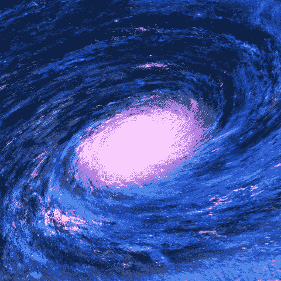

GIF from this [website](https://giphy.com/gifs/star-universe-galaxy-l0Exm2Wa4TermgtJC)

今天，我只是想研究一下 t 分布随机邻居嵌入(t-SNE)，并想在 tensorflow 中实现它，同时创建一些可视化。下面是我们要比较的案例。

***案例 A)纯 T-SNE 降维到 2D
案例 B)全连接网络作为 T-SNE 降维到 2D
案例 C)卷积神经网络作为 T-SNE 降维到 2D
案例 D)全连接网络作为 T-SNE 降维到 3D
案例 E)卷积神经网络作为 T-SNE 降维到 3D***

> ***请注意这篇帖子是为了我未来的自己，回顾如何在 tensorflow 中实现 T-SNE。***

Original SNE paper from this [website](https://cs.nyu.edu/~roweis/papers/sne_final.pdf)

TSNE paper from this [website](http://www.cs.toronto.edu/~hinton/absps/tsne.pdf)

如果有人感兴趣，T-SNE 最初是基于辛顿教授发明的随机邻居嵌入(SNE)。我链接了原始的 SNE 论文和 T-SNE 论文。

**T-SNE 比 PCA 做得更好的案例**

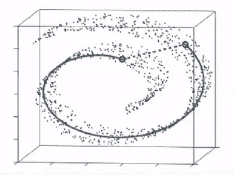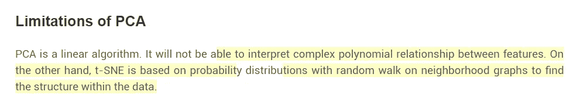

Image from this [website](https://www.analyticsvidhya.com/blog/2017/01/t-sne-implementation-r-python/) and this [website](https://www.youtube.com/watch?v=RJVL80Gg3lA)

已经有不同的方法来执行降维，但是传统方法存在局限性。例如，主成分分析(PCA)以线性方式降低维度，并且在一些情况下，更高维度的几何形状是以非线性方式。它没有捕捉到关键信息。更多更好更深入的解释请阅读这篇[博文](https://www.quora.com/What-advantages-does-the-t-SNE-algorithm-have-over-PCA)或观看下面的视频。

Video from [GoogleTechTalks](https://www.youtube.com/channel/UCtXKDgv1AVoG88PLl8nGXmw)

**一些有用的知识(我不得不学)**

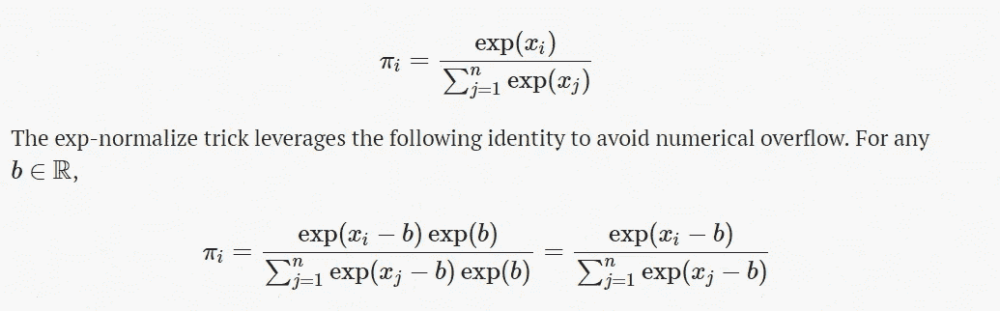

Image from this [website](https://timvieira.github.io/blog/post/2014/02/11/exp-normalize-trick/)

对我来说，在深入研究 T-SNE 之前，了解一些额外的东西是个好主意，比如指数归一化技巧，(或者[稳定的 softmax 函数](http://cs231n.github.io/linear-classify/#softmax))或者对二分搜索法的回顾。

video from
[Udacity](https://www.youtube.com/channel/UCBVCi5JbYmfG3q5MEuoWdOw)

此外，它有助于审查二分搜索法，一般来说，它的运行时间为 O(登录)，这是很好的。对于 T-SNE，它用于搜索最佳西格玛值，以匹配我们想要的困惑。

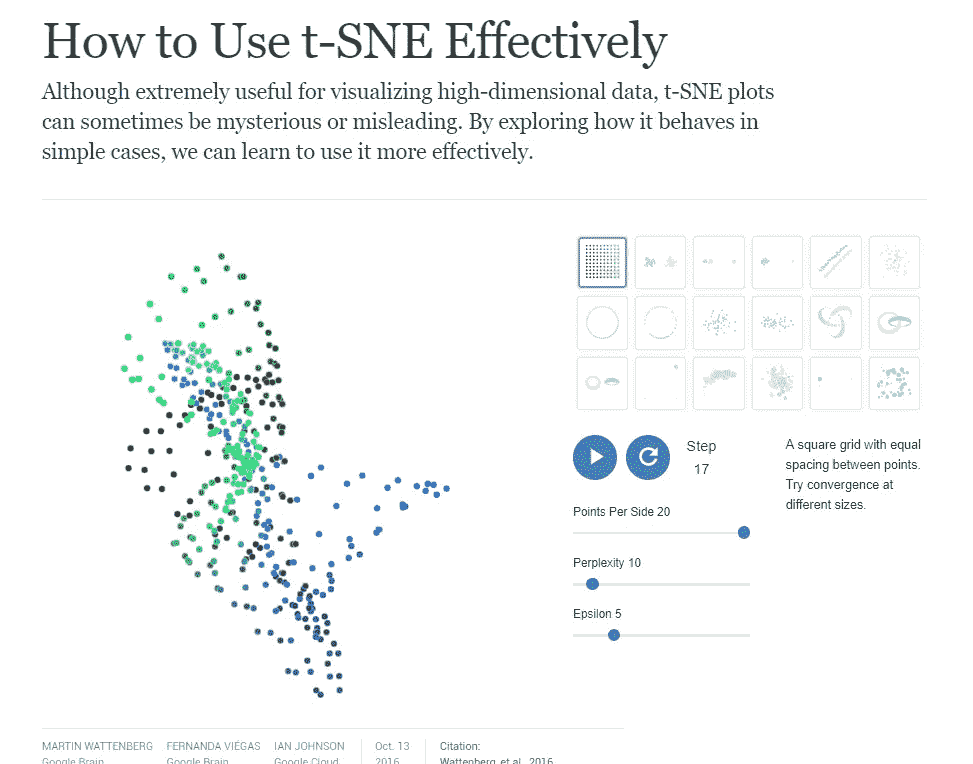

Image from this [website](https://distill.pub/2016/misread-tsne/)

最后，来自 Distill 的一份出版物是一个令人惊奇的在线资源，可以让你更深入地了解 T-SNE 及其成功的原因。

**张量流中的纯 T-SNE**

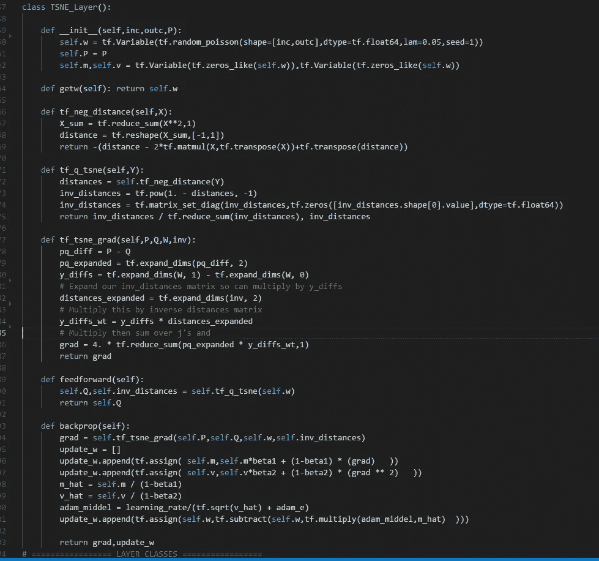

遵循这里完成的 Numpy 实现[，](https://nlml.github.io/in-raw-numpy/in-raw-numpy-t-sne/)并将其转换成 tensorflow 并不难。(liam schoneveld 也出色地解释了每个函数背后的数学原理。).此外，我们可以使纯 SNE 霸王龙成为 SNE 霸王龙层，如上图所示。并分配前馈操作以及反向传播。剩下要做的唯一的事情是连接到完全连接的层以及卷积层到这个 T-SNE 层。

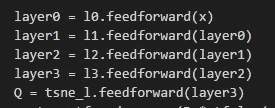

这一点也不难，我们已经实现了全连接层/卷积层，我们可以做类似上面的事情来建立连接。

***结果:案例 A)纯 T-SNE 退化为 2D***

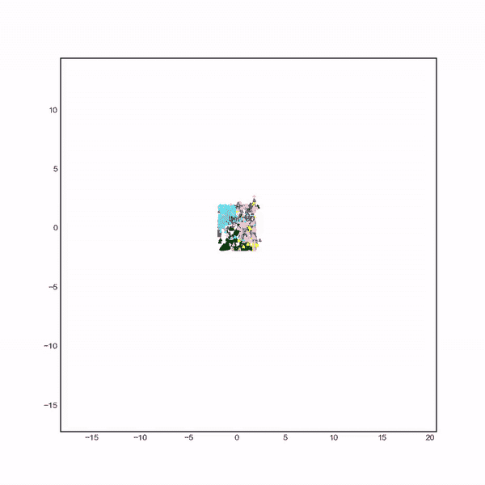

上面的 gif 显示了每个星团是如何通过历元数形成的。最终的聚类如下图所示。

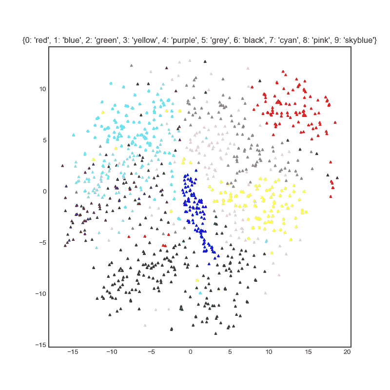

如上所述，我们注意到算法很好地将数字分成不同的簇，但是，我们仍然可以注意到一些随机点属于不正确的点。

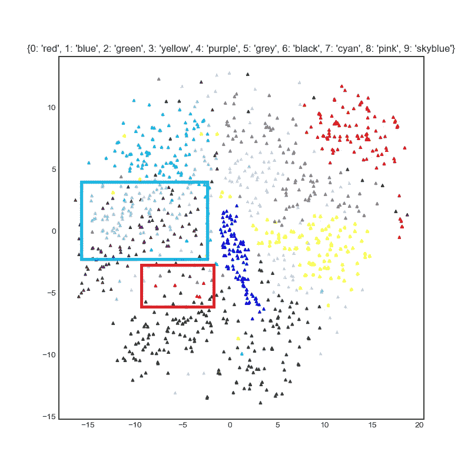

在红色区域，我们可以观察到一些 0/5 位于错误的位置。正如在天蓝色区域看到的一样，四和九之间没有明显的区别。

***结果:情况 B)全连通网络为 T-SNE 简化为 2D***

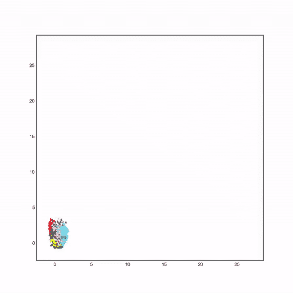

由于我们在最后一层使用 ELU()激活函数，我们可以注意到轴点是正数。此外，似乎大部分聚类都是在培训的开始阶段完成的。(具体来说，5000)。剩下的用于重新定位每个数据点。

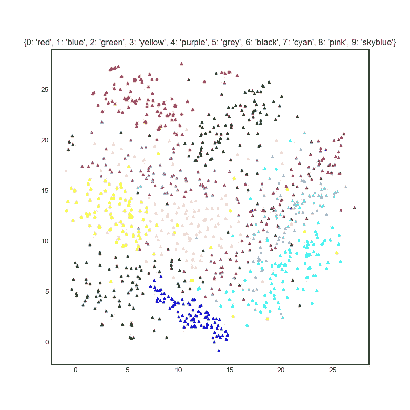

首先，我们可以注意到，大多数的零都很好地聚集在一起。(与纯 SNE 霸王龙的情况相比，要好得多。).然而，四和九之间的区别仍然不是很清楚…

***结果:情况 C)卷积神经网络为 T-SNE 简化为 2D***

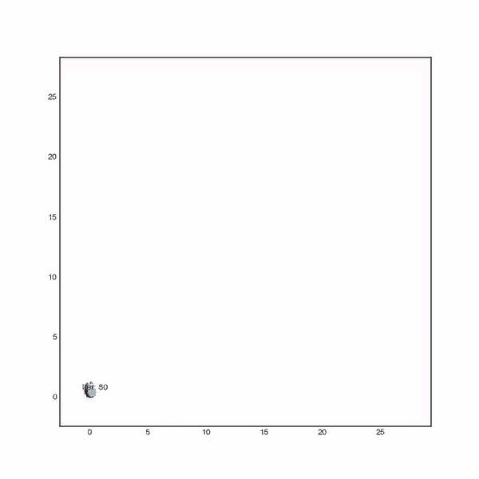

对于全连接网络的卷积神经网络，我们可以看到部分数据点粘在 Y 轴上。但我个人认为四九分开比其他任何情况都好。

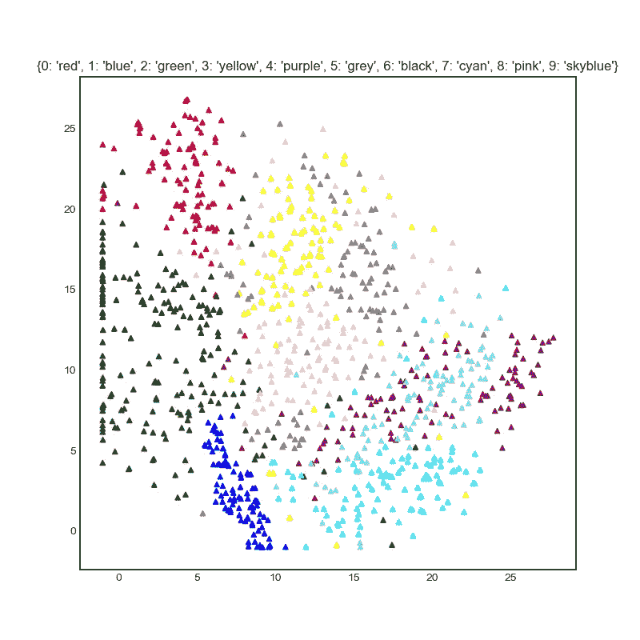

以上是最终结果，在最右边的点，我们可以看到 4 和 9 之间的分离比其他的更好，因为 4 聚集在最右边。(但是需要分开得多。)

**使用 Sklearn T-SNE 进行比较**

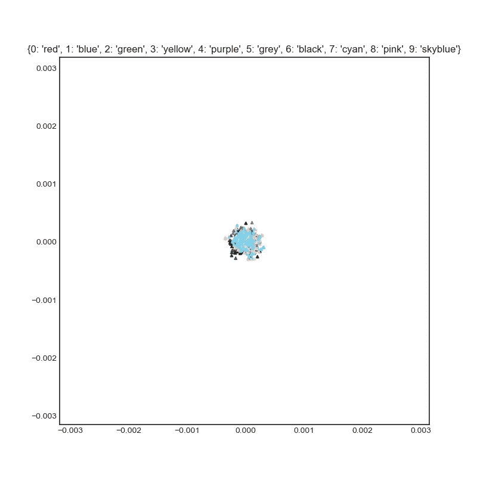

我想将我的结果与 sklearn 的 TSNE 进行比较，如果我使用相同的学习速率和相同的超参数，我会得到上面的结果。

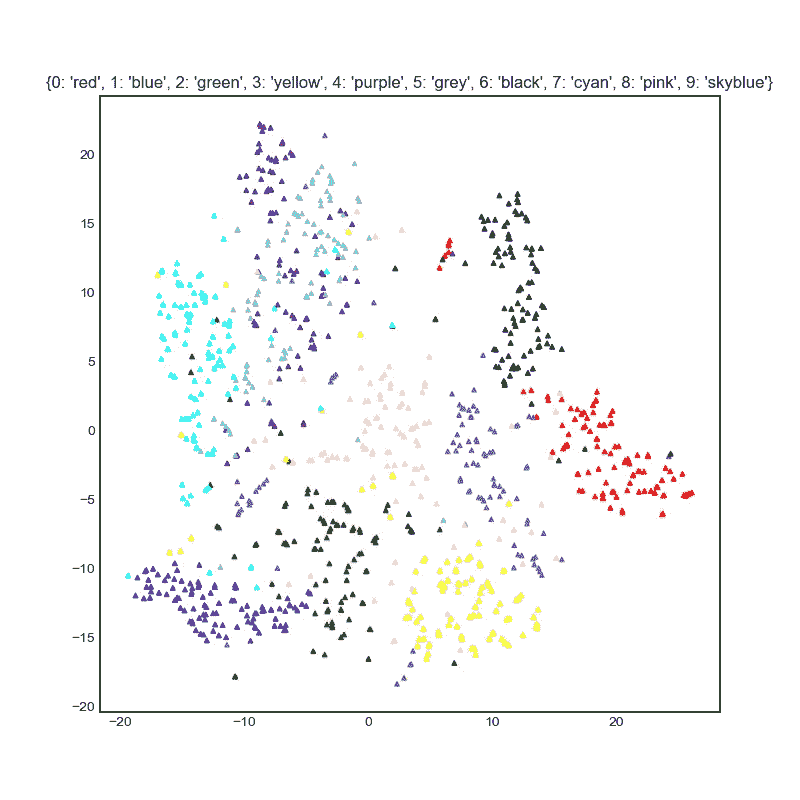

然而，通过一些超参数调整，我能够得到上述结果。四个和九个之间仍然存在着不清楚的分离，但是每个星团之间的距离却更远了。

***结果:案例 D)全连通网络为 T-SNE 简化为 3D***

上面的 gif 展示了 MNIST 数据集降维为 2 的聚类过程，总体来说做得不错。

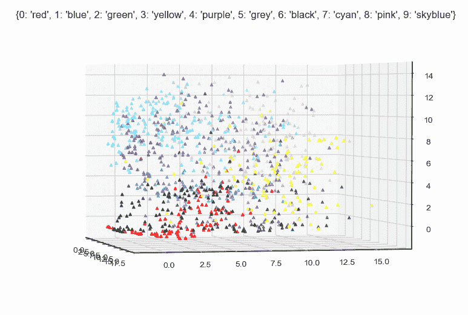

上面的 gif 显示了最终的聚类。然而，与其他数字相比，4 和 9 之间的区别并不明显。

***结果:情况 E)卷积神经网络为 T-SNE 简化为 3D***

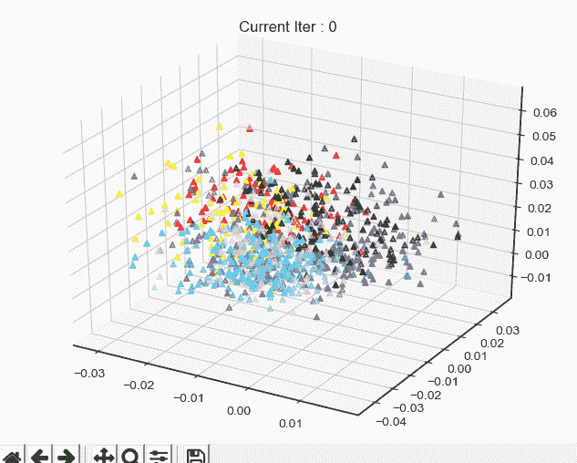

上面的 gif 显示了我在连接到 T-SNE 层之前使用 CNN 时的聚类进度。下面是最终得到的 gif。

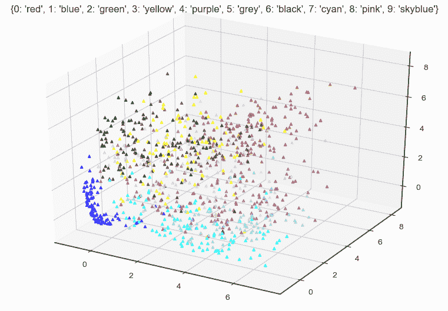

我个人认为 CNN 在数据聚类方面做得更好，因为在处理图像时，空间信息更有用。

**互动码**

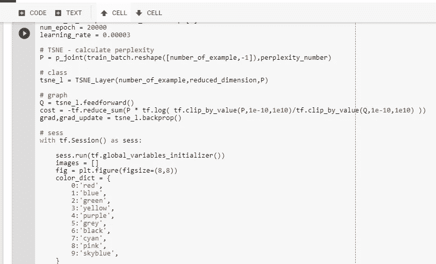

对于 Google Colab，您需要一个 Google 帐户来查看代码，而且您不能在 Google Colab 中运行只读脚本，所以请在您的操场上创建一个副本。最后，我永远不会请求允许访问你在 Google Drive 上的文件，仅供参考。编码快乐！

要访问案例 A)的代码，请[点击此处。](https://colab.research.google.com/drive/12F-PETpXiFx6bSm-kTx3XRM78CXFPHFT)
要访问案例 B)的代码，请[点击此处。](https://colab.research.google.com/drive/1ESSNZMyxHSUnKgQcyG8zb7oypXpkALNP)
要访问案例 C)的代码，请[点击此处。](https://colab.research.google.com/drive/19BM2ovJ1fCYnDr7Eq3N-D9lIzNlTXVHm)
要访问案例 D)的代码，请[点击此处。](https://colab.research.google.com/drive/1w-4Ntl-Tu1-E8jIRIvDZSvyPePST1dqK)
要访问案例 E)的代码，请[点击此处。](https://colab.research.google.com/drive/13oL19ULnt-JZaWIrbFO2LAZ6YHudbpgj)
要获取案例 Z 的代码，请[点击此处。](https://colab.research.google.com/drive/13TAEHwTtCyfmhw6vYKvApMX4JwAZxFbi)

**奇怪的结果**

最后，我只是觉得这是一个很酷的结果。显然聚类做得很糟糕，但还是有点酷，哈哈。

**最后的话**

由于 t-SNE 的操作方式，对新数据点进行降维非常困难，为了克服这个问题，原始论文的作者引入了参数 T-SNE。而论文可以在下面看到。

Paper from this [website](http://dimensionality)

接下来的事情是实施上述文件，这将是我的下一个任务。(以及[均匀流形近似](https://github.com/lmcinnes/umap)和投影(UMAP))

如果发现任何错误，请发电子邮件到 jae.duk.seo@gmail.com 给我，如果你想看我所有写作的列表，请点击这里查看我的网站。

同时，在我的推特[这里](https://twitter.com/JaeDukSeo)关注我，访问[我的网站](https://jaedukseo.me/)，或者我的 [Youtube 频道](https://www.youtube.com/c/JaeDukSeo)了解更多内容。我还实现了[广残网，请点击这里查看博文 pos](https://medium.com/@SeoJaeDuk/wide-residual-networks-with-interactive-code-5e190f8f25ec) t。

**参考**

1.  Tensorflow？，C. (2018)。在 Tensorflow 中不复制张量的情况下批量计算成对距离？。堆栈溢出。检索于 2018 年 7 月 21 日，来自[https://stack overflow . com/questions/37009647/compute-pairwise-distance-in-a-batch-without-replication-tensor-in-tensor flow](https://stackoverflow.com/questions/37009647/compute-pairwise-distance-in-a-batch-without-replicating-tensor-in-tensorflow)
2.  NumPy . set _ print options—NumPy v 1.14 手册。(2018).Docs.scipy.org。检索于 2018 年 7 月 21 日，来自[https://docs . scipy . org/doc/numpy-1 . 14 . 0/reference/generated/numpy . set _ print options . html](https://docs.scipy.org/doc/numpy-1.14.0/reference/generated/numpy.set_printoptions.html)
3.  tf.reduce_max | TensorFlow。(2018).张量流。检索于 2018 年 7 月 21 日，来自[https://www.tensorflow.org/api_docs/python/tf/reduce_max](https://www.tensorflow.org/api_docs/python/tf/reduce_max)
4.  tf.matrix_set_diag | TensorFlow(2018).张量流。检索于 2018 年 7 月 21 日，来自[https://www . tensor flow . org/API _ docs/python/TF/matrix _ set _ diag](https://www.tensorflow.org/api_docs/python/tf/matrix_set_diag)
5.  tf.matrix_diag |张量流。(2018).张量流。检索于 2018 年 7 月 21 日，来自[https://www.tensorflow.org/api_docs/python/tf/matrix_diag](https://www.tensorflow.org/api_docs/python/tf/matrix_diag)
6.  tf.matrix_set_diag | TensorFlow(2018).张量流。检索于 2018 年 7 月 21 日，来自[https://www . tensor flow . org/API _ docs/python/TF/matrix _ set _ diag](https://www.tensorflow.org/api_docs/python/tf/matrix_set_diag)
7.  学习？，H. (2018)。logit 最大值的减法如何提高学习？。交叉验证。检索于 2018 年 7 月 21 日，来自[https://stats . stack exchange . com/questions/338285/how-the-subtraction-of-the-logit-maximum-improve-learning](https://stats.stackexchange.com/questions/338285/how-does-the-subtraction-of-the-logit-maximum-improve-learning)
8.  使用 t-SNE 可视化数据。(2018).YouTube。检索于 2018 年 7 月 21 日，来自 https://www.youtube.com/watch?v=RJVL80Gg3lA
9.  Quora.com(2018)。*t-SNE 算法相比 PCA 有什么优势？— Quora* 。[在线]可从以下网址获取:[https://www . quora . com/What-advantages-the-t-SNE 算法优于 PCA](https://www.quora.com/What-advantages-does-the-t-SNE-algorithm-have-over-PCA)【2018 年 7 月 21 日获取】。
10.  Python 中的 lambda、map 和 filter—RUP esh mis HRA—Medium。(2017).中等。检索于 2018 年 7 月 21 日，来自[https://medium . com/@ happymishra 66/lambda-map-and-filter-in-python-4935 f 248593](https://medium.com/@happymishra66/lambda-map-and-filter-in-python-4935f248593)
11.  德斯莫斯图表。(2018).德斯莫斯图形计算器。检索于 2018 年 7 月 21 日，来自[https://www.desmos.com/calculator](https://www.desmos.com/calculator)
12.  类，P. (2018)。Python 调用类中的函数。堆栈溢出。检索于 2018 年 7 月 23 日，来自[https://stack overflow . com/questions/5615648/python-call-function-within-class](https://stackoverflow.com/questions/5615648/python-call-function-within-class)
13.  二分搜索法。(2018).YouTube。检索于 2018 年 7 月 23 日，来自[https://www.youtube.com/watch?v=0VN5iwEyq4c](https://www.youtube.com/watch?v=0VN5iwEyq4c)
14.  (2018).Cs.nyu.edu。检索于 2018 年 7 月 23 日，来自[https://cs.nyu.edu/~roweis/papers/sne_final.pdf](https://cs.nyu.edu/~roweis/papers/sne_final.pdf)
15.  (2018).Cs.toronto.edu。检索于 2018 年 7 月 23 日，来自[http://www.cs.toronto.edu/~hinton/absps/tsne.pdf](http://www.cs.toronto.edu/~hinton/absps/tsne.pdf)
16.  用于视觉识别的 CS231n 卷积神经网络。(2018).cs 231n . github . io . 2018 年 7 月 23 日检索，来自[http://cs231n.github.io/linear-classify/#softmax](http://cs231n.github.io/linear-classify/#softmax)
17.  [副本]，D. (2018)。双竖线。数学栈交换。检索于 2018 年 7 月 23 日，来自[https://math . stack exchange . com/questions/1918 317/double-vertical-bars](https://math.stackexchange.com/questions/1918317/double-vertical-bars)
18.  只有 Numpy:(为什么我做手动反向传播)实现多通道/层卷积神经…(2018).中等。2018 年 7 月 23 日检索，来自[https://medium . com/swlh/only-numpy-why-I-do-manual-back-propagation-implementing-multi-channel-layer-convolution-neural-7d 83242 FCC 24](https://medium.com/swlh/only-numpy-why-i-do-manual-back-propagation-implementing-multi-channel-layer-convolution-neural-7d83242fcc24)
19.  Schoneveld，L. (2017 年)。原始数字:t-SNE。nlml。检索于 2018 年 7 月 23 日，来自 https://nlml.github.io/in-raw-numpy/in-raw-numpy-t-sne/#eq1
20.  奥雷利媒体/t-SNE-教程。(2018).GitHub。检索于 2018 年 7 月 23 日，来自[https://github.com/oreillymedia/t-SNE-tutorial](https://github.com/oreillymedia/t-SNE-tutorial)
21.  tf.clip_by_value |张量流。(2018).张量流。检索于 2018 年 7 月 23 日，来自[https://www.tensorflow.org/api_docs/python/tf/clip_by_value](https://www.tensorflow.org/api_docs/python/tf/clip_by_value)
22.  tf.random_gamma |张量流。(2018).张量流。检索于 2018 年 7 月 23 日，来自[https://www.tensorflow.org/api_docs/python/tf/random_gamma](https://www.tensorflow.org/api_docs/python/tf/random_gamma)
23.  Matplotlib . py plot . text-Matplotlib 2 . 2 . 2 文档。(2018).Matplotlib.org。检索于 2018 年 7 月 23 日，来自[https://matplotlib . org/API/_ as _ gen/matplotlib . py plot . text . html](https://matplotlib.org/api/_as_gen/matplotlib.pyplot.text.html)
24.  变，m. (2018)。matplotlib 艺术家动画:标题或文本不变。堆栈溢出。检索于 2018 年 7 月 23 日，来自[https://stack overflow . com/questions/47421486/matplotlib-artist-animation-title-or-text-not-changing](https://stackoverflow.com/questions/47421486/matplotlib-artist-animation-title-or-text-not-changing)
25.  matplotlib，3。(2018).使用 matplotlib 的 3D 动画。堆栈溢出。检索于 2018 年 7 月 23 日，来自[https://stack overflow . com/questions/38118598/3d-animation-using-matplotlib](https://stackoverflow.com/questions/38118598/3d-animation-using-matplotlib)
26.  Wattenberg，m .，Viégas，f .，& Johnson，I. (2016 年)。如何有效地使用 t-SNE？蒸馏，1(10)。doi:10.23915
27.  sk learn . manifold . tsne—sci kit-learn 0 . 19 . 2 文档。(2018).Scikit-learn.org。检索于 2018 年 7 月 23 日，来自[http://sci kit-learn . org/stable/modules/generated/sk learn . manifold . tsne . html](http://scikit-learn.org/stable/modules/generated/sklearn.manifold.TSNE.html)
28.  动画示例代码:simple _ 3d anim . py—Matplotlib 2 . 0 . 2 文档。(2018).Matplotlib.org。检索于 2018 年 7 月 23 日，来自[https://matplotlib . org/examples/animation/simple _ 3d anim . html](https://matplotlib.org/examples/animation/simple_3danim.html)
29.  何时使用 cla()，c. (2018)。什么时候使用 cla()、clf()或 close()来清除 matplotlib 中的绘图？。堆栈溢出。2018 年 7 月 23 日检索，来自[https://stack overflow . com/questions/8213522/when-to-use-cla-clf-or-close-for-clearing-a-plot-in-matplotlib](https://stackoverflow.com/questions/8213522/when-to-use-cla-clf-or-close-for-clearing-a-plot-in-matplotlib)
30.  何时使用 cla()，c. (2018)。什么时候使用 cla()、clf()或 close()来清除 matplotlib 中的绘图？。堆栈溢出。检索于 2018 年 7 月 23 日，来自[https://stack overflow . com/questions/8213522/when-to-use-cla-clf-or-close-for-clearing-a-plot-in-matplotlib](https://stackoverflow.com/questions/8213522/when-to-use-cla-clf-or-close-for-clearing-a-plot-in-matplotlib)