# 在 PyTorch 中实现 word2vec(跳格模型)

> 原文：<https://towardsdatascience.com/implementing-word2vec-in-pytorch-skip-gram-model-e6bae040d2fb?source=collection_archive---------0----------------------->

你可能听说过 word2vec 嵌入。但是你真的了解它是如何工作的吗？我想我知道。但我没有，直到实现它。

这就是为什么我创建这个指南。

**2021 年更新**:更详细的文章见:[https://neptune.ai/blog/word-embeddings-guide](https://neptune.ai/blog/word-embeddings-guide)

# 先决条件

我假设你知道更多-更少 word2vec 是什么。

**文集**

为了能够跟踪每一步，我使用了以下 nano 语料库:

## 创造词汇

第一步是用 word2vec 创建词汇表。它必须从头开始构建，因为不支持扩展它。

词汇表基本上是一个带有指定索引的独特单词列表。

语料库非常简单和简短。在实际实现中，我们必须执行大小写规范化，删除一些标点符号等，但为了简单起见，让我们使用这些漂亮而干净的数据。无论如何，我们必须把它符号化:

这将为我们提供一个令牌列表:

```
[['he', 'is', 'a', 'king'],
 ['she', 'is', 'a', 'queen'],
 ['he', 'is', 'a', 'man'],
 ['she', 'is', 'a', 'woman'],
 ['warsaw', 'is', 'poland', 'capital'],
 ['berlin', 'is', 'germany', 'capital'],
 ['paris', 'is', 'france', 'capital']]
```

我们迭代语料库中的标记，并生成唯一单词(标记)的列表。接下来，我们创建两个字典，用于单词和索引之间的映射。

这给了我们:

```
 0: 'he',
 1: 'is',
 2: 'a',
 3: 'king',
 4: 'she',
 5: 'queen',
 6: 'man',
 7: 'woman',
 8: 'warsaw',
 9: 'poland',
 10: 'capital',
 11: 'berlin',
 12: 'germany',
 13: 'paris',
 14: 'france'
```

我们现在可以生成对`center word`，`context word`。让我们假设上下文窗口是对称的并且等于 2。

它为我们提供了一组`center`、`context`指数:

```
array([[ 0,  1],
       [ 0,  2],
       ...
```

这很容易翻译成文字:

```
he is
he a
is he
is a
is king
a he
a is
a king
```

这很有道理。

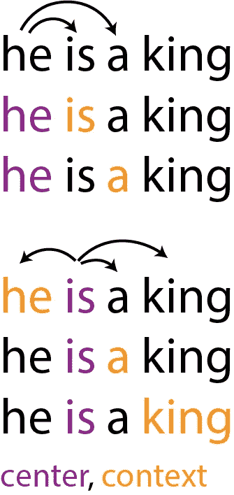

# 定义目标

现在，我们正在讨论从第一个等式到工作实现的细节。

对于跳格，我们感兴趣的是预测上下文，给定中心词和一些参数化。这是我们单对的概率分布。

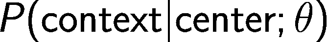

E.g.: P(king | is)

现在，我们想通过所有单词/上下文对来最大化它。

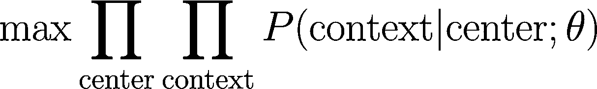

**等等，为什么？**

由于我们对预测给定中心词的上下文感兴趣，所以我们希望最大化每个`context`、`center`对的 *P(上下文|中心)*。由于概率总和为 1——对于所有不存在的`context`、`center`对，我们隐式地使 *P(上下文|中心)*接近于 0。通过将这些概率相乘，如果我们的模型是好的，我们使这个函数接近 1，如果是坏的，这个函数接近 0。当然我们追求的是一个好的——所以一开始就有 max 算子。

这个表达式不太适合计算。这就是为什么我们要执行一些非常常见的转换。

**步骤 1——用*负对数似然*替换概率。**

回想一下，神经网络是关于最小化损失函数的。我们可以简单地将 P 乘以-1，但是应用 log 可以给我们更好的计算特性。这不会改变函数极值的位置(因为 log 是一个严格单调的函数)。所以表达式改为:

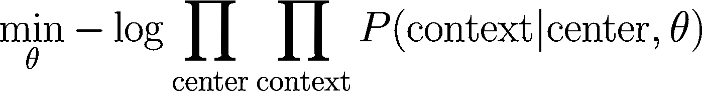

**步骤 2——用总和替换乘积**

下一步是用总和代替乘积。我们能做到是因为:

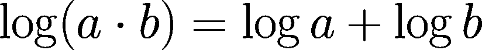

**步骤 3——转换成合适的损失函数**

除以 par 数(T)后，我们得到最终的损失项:

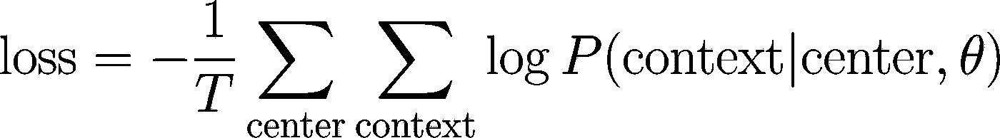

## 定义 P

很好，但是我们如何定义 P(context|center) ？现在，让我们假设到达词实际上有两个向量。一个 if 作为中心词出现( **v** )，第二个 if 上下文( **u** )。假设 P 的定义如下:

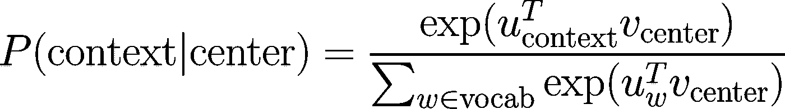

太吓人了！

让我把它分解成更小的部分。请参见以下结构:

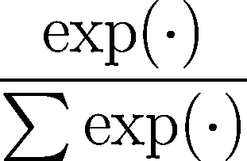

Softmax!

这只是一个 *softmax* 函数。现在仔细看看提名者

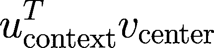

**u** 和 **v** 都是矢量。这个表达式就是给定的`center`，`context`对的标量积。更大，因为它们彼此更相似。

现在，分母:


我们正在遍历词汇表中的所有单词。

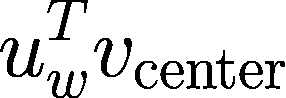

以及计算给定中心词和词汇中被视为上下文词的每个词的“相似度”。

**总结一下:**

对于语料库中每个现有的中心、上下文对，我们正在计算它们的“相似性得分”。然后除以每一个理论上可能的情境的总和——知道分数是相对高还是相对低。因为 softmax 保证取 0 和 1 之间的值，所以它定义了有效的概率分布。

# 太好了，现在我们来编码吧！

实现这一概念的神经网络包括三层:输入、隐藏和输出。

# 输入层

输入层只是以一键编码方式编码的中心字。它的尺寸是`[1, vocabulary_size]`

# 隐蔽层

隐藏层使我们的 v 向量。因此它必须有`embedding_dims`神经元。为了计算它的价值，我们必须定义`W1`权重矩阵。当然它必须是`[embedding_dims, vocabulary_size].`没有激活函数——只有简单的矩阵乘法。

重要的是——`W1`的每一列存储单个单词的 **v** 向量。为什么？因为 x 是一个热点，如果您将一个热点向量乘以矩阵，结果与从其中选择选择单列相同。用一张纸自己试试；)

## 输出层

最后一层必须有`vocabulary_size`神经元——因为它为每个单词生成概率。因此，就形状而言，`W2`就是`[vocabulary_size, embedding_dims]`。

在此之上，我们必须使用 softmax 层。PyTorch 提供了这个的优化版本，结合了`log`——因为常规的 softmax 在数值上并不真正稳定:

```
log_softmax = F.log_softmax(a2, dim=0)
```

这相当于计算 softmax，然后应用 log。

现在我们可以计算损失。像往常一样，PyTorch 提供了我们需要的一切:

```
loss = F.nll_loss(log_softmax.view(1,-1), y_true)
```

`nll_loss`在 logsoftmax 上计算负对数似然。`y_true`是上下文单词——我们想让它尽可能高——因为对`x, y_true`来自训练数据——所以它们确实是上下文的中心。

## **反向投影**

当我们钓到向前传球时，现在是时候表演向后传球了。简单来说:

```
loss.backward()
```

为了优化，使用了 SDG。它如此简单，以至于用手工编写比创建优化器对象更快:

```
W1.data -= 0.01 * W1.grad.data
W2.data -= 0.01 * W2.grad.data
```

最后一步是将梯度归零，以使下一步清晰:

```
W1.grad.data.zero_()
W2.grad.data.zero_()
```

## 训练循环

是时候把它编译成训练循环了。它可能看起来像:

一个潜在的棘手问题是`y_true`定义。我们并不显式地创建一个 hot，而是由`nll_loss`自己创建。

```
Loss at epo 0: 4.241989389487675
Loss at epo 10: 3.8398486052240646
Loss at epo 20: 3.5548086541039603
Loss at epo 30: 3.343840673991612
Loss at epo 40: 3.183084646293095
Loss at epo 50: 3.05673006943294
Loss at epo 60: 2.953996729850769
Loss at epo 70: 2.867735825266157
Loss at epo 80: 2.79331214427948
Loss at epo 90: 2.727727291413716
Loss at epo 100: 2.6690095041479385
```

## 提取向量

好了，我们已经训练好了网络。第一，最后一件事是提取单词的向量。有三种可能:

*   使用 W1 中的矢量 v
*   使用 W2 中的向量 u
*   使用平均 v 和 u

试着自己思考什么时候用哪个；)

# 待续

我正在做这个的在线互动演示。应该很快就有了。敬请期待；)

你可以从[这里](https://gist.github.com/mbednarski/da08eb297304f7a66a3840e857e060a0)下载代码。

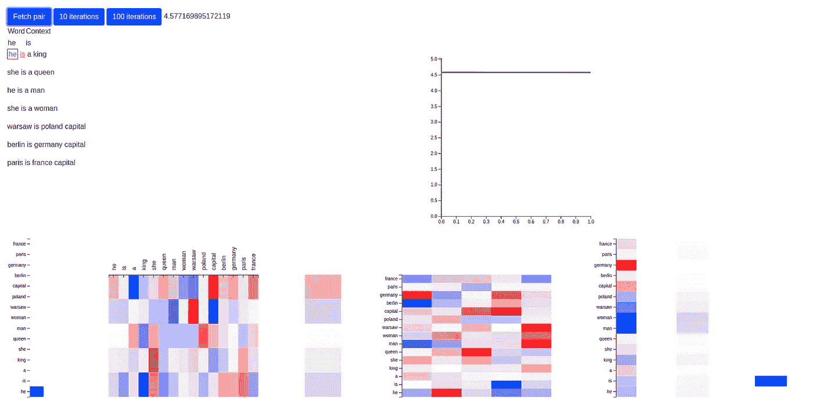

Working on this!