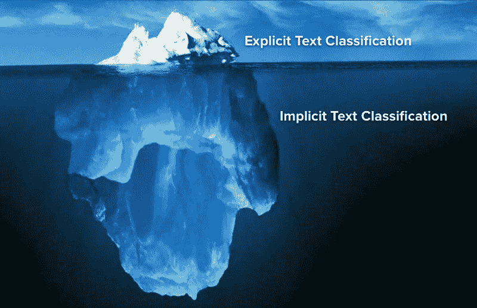
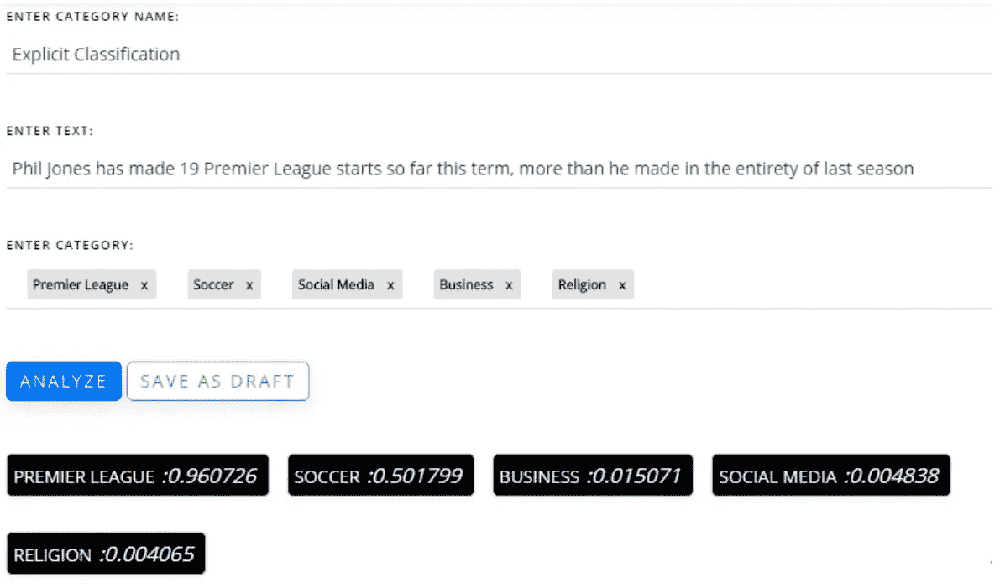
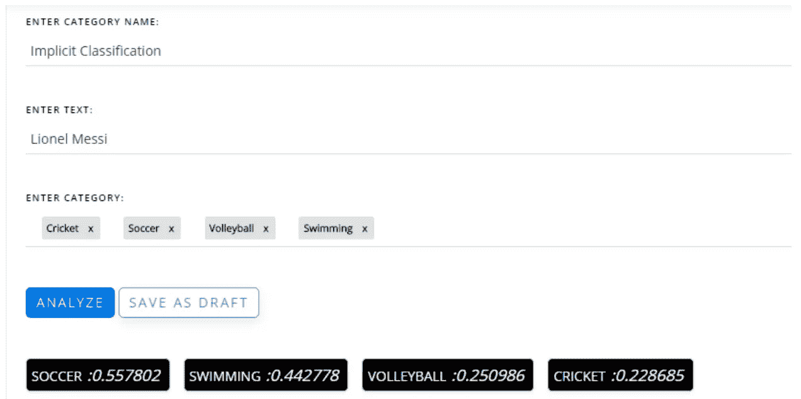
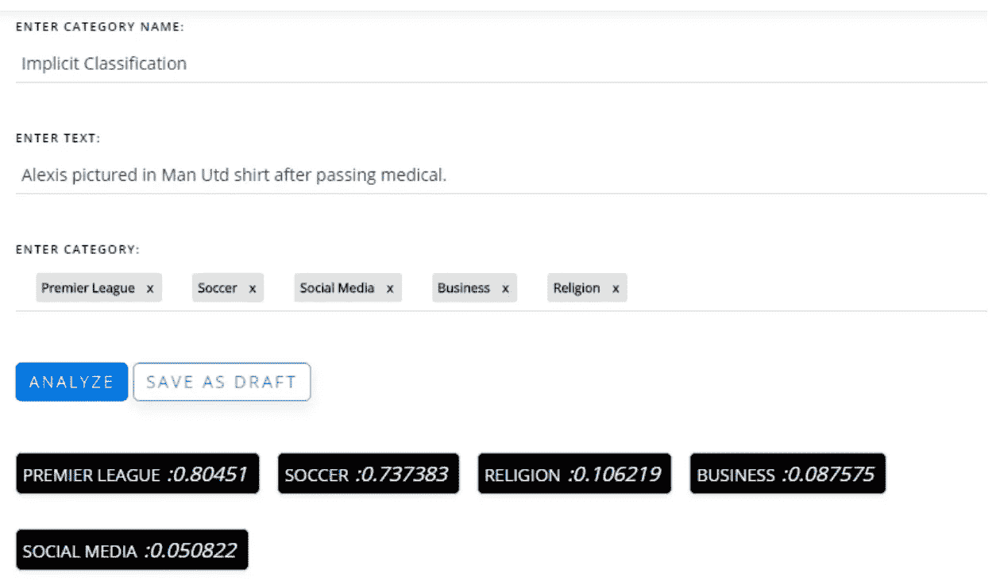

# 使用自定义文本分类的隐式搜索功能

> 原文：<https://towardsdatascience.com/implicit-search-functionality-using-custom-text-classification-58048a6815eb?source=collection_archive---------7----------------------->

文本分类是将任何文本语料库智能地分类到各种预定义的类别中，并且是结构化非结构化数据以对其进行分析的最常见方法之一。在我们之前的[博客](https://blog.paralleldots.com/product/automated-text-classification-using-machine-learning/)中，我们讨论了不同的机器学习技术来分类文本，包括我们最新的产品——[定制分类器](https://www.paralleldots.com/custom-classifier)。在另一篇[文章](https://blog.paralleldots.com/product/custom-text-classification-model-without-any-training-data/)中，我们讨论了如何在没有任何训练数据的情况下，使用自定义分类器在自定义类别上构建自己的文本分类模型。在本文中，我们将看到自定义分类器如何用于显式和隐式文本分类。

# 显式文本分类

为了更好地理解我们所说的明确的文本分类是什么意思，考虑一个文本输入来为其分配一种情绪，“教练对球队的表现感到厌恶”，用以下类别将输入的文本分类为:厌恶、高兴、害怕、悲伤。你的大胆猜测是什么？没错，就是恶心。

这是一个显式文本分类的精确示例，其中输入文本要么携带分类，要么本身直接指向您必须分配给它的分类。让我们通过下面的例子来看看我们的[自定义分类器](https://www.paralleldots.com/custom-classifier)在这种场景下的表现。

# 隐式文本分类

隐式文本分类可以被认为是将文本分类成类别，而不提及文本和所定义的类别之间的任何直接关系。例如，如果你想到莱昂内尔·梅西，我们脑海中会立即浮现什么？足球？。但是，当我们谈论一个没有梅西背景的自动文本分类模型时，它能够以类似的方式识别同一个例子吗？如果你说的是我们的[定制分类器](https://www.paralleldots.com/custom-classifier)，那么答案是非常肯定的！

不相信我们？试试我们的[演示](https://www.paralleldots.com/custom-classifier)！！

自定义分类器能够分类，莱昂内尔梅西不只是另一个名字，但也与足球有关。这是隐式文本分类的一个例子，其中输入文本没有直接指示它需要被分配到的类别。

还不信服？让我们看看最近关于阿莱克西斯·桑切斯转会曼联的新闻报道中的另一个很酷的例子。

这不是很好吗？我们的分类器甚至没有提到这项运动就选择了联盟！！

正如我们所见，这是迈向通用人工智能的第一步。我们没有提到任何与英超联赛或足球相关的东西，但我们的自定义分类器可以识别这种关系。在显式文本分类的基础上进行隐式文本分类的能力使得自定义分类器成为一个令人惊叹的有用工具。

直到最近，这还是一个牵强的概念。正如我们所知，使用机器学习和文本分类项目到目前为止面临的最大障碍是训练算法的注释数据集的可用性。但是随着 ParallelDots 的内部研究团队最近在定制分类器背后的[零触发学习](https://paralleldots.xyz/Zero-Shot-Learning-for-Text-Classification)启发算法，我们真正实现了我们的愿景，即提供触手可及的人工智能。

# 这是什么意思？

这清楚地表明，在行动中，我们的自定义分类器脱颖而出！想象一下，现在你不需要数据科学家或者 ML 专家来为你做文本分类器。此外，正如您可以看到的，我们在执行分析时会给出由我们定义的类别，因此，执行文本分类不需要预先训练，因此您不需要为您的分类定制训练数据集。

这使您能够进行文本分类，而不必担心输入的种类或领域。所以你实际上可以用同一个工具对法律新闻和体育新闻进行分类。

为什么只是这样，这意味着不管任何类型的数据，无论是推文，facebook 评论，新闻或评论，你都可以执行你的文本分类任务，而不必担心任何其他事情。此外，能够进行显式和隐式分类，您可以为您的内容构建一个更智能的搜索引擎，或者使您的对话机器人更加智能。

现在想试试吗？[注册](https://user.apis.paralleldots.com/signing-up)一个免费的 ParallelDots AI APIs 账号开始使用。

# 结论

定制分类器是人工智能将如何塑造我们未来自然语言处理需求的主要例子。它不仅让您在自己的输入数据上定义自己的类别，从而使您比任何其他文本分类工具都有优势，而且还使您的文本分类考虑到与您定义的类别的任何隐含或间接关系。

同时执行显式和隐式文本分类的能力给了你在执行任何文本分类时无与伦比的优势。自定义分类器因此成为帮助您摆脱任何束缚的先锋，这些束缚使您无法使用文本分类的真正力量。

[parallel dots AI API](https://www.paralleldots.com/)，是由 [ParallelDots Inc](https://paralleldots.xyz/) 提供的深度学习支持的 web 服务，可以理解大量的非结构化文本和视觉内容，为您的产品提供支持。你可以查看我们的一些文本分析[API](https://www.paralleldots.com/text-analysis-apis)并通过填写此处的表格[联系我们或者给我们 apis@paralleldots.com 写信。](https://www.paralleldots.com/contact-us)