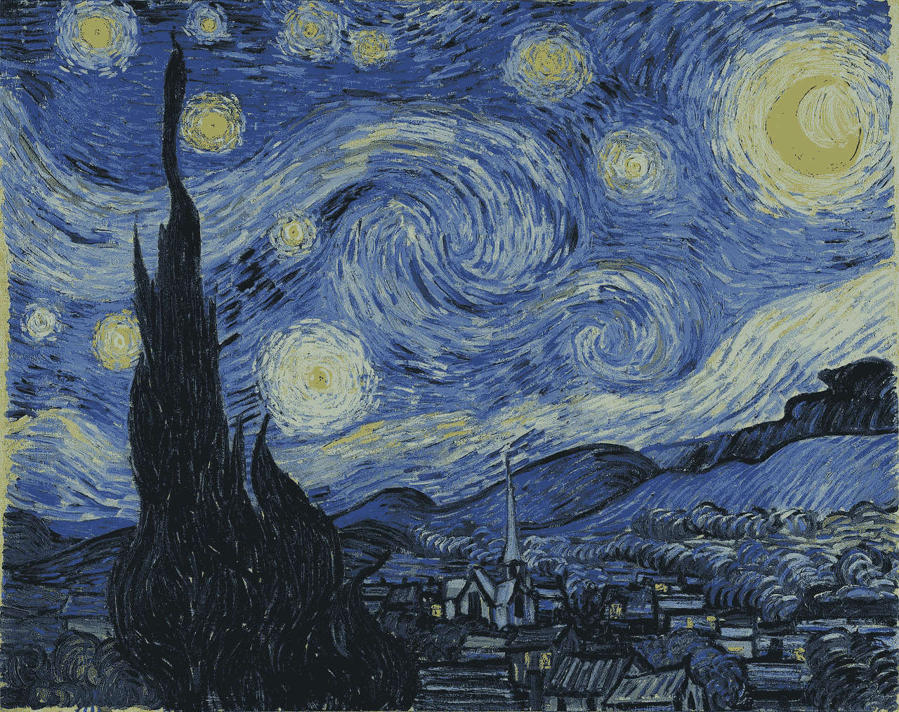

# 重要的资源，如果你正在与神经风格转移或深层照片风格转移

> 原文：<https://towardsdatascience.com/important-resources-if-you-are-working-with-neural-style-transfer-or-deep-photo-style-transfer-719593b3dbf1?source=collection_archive---------0----------------------->

The Starry Night by [Vincent van Gogh](https://en.wikipedia.org/wiki/Vincent_van_Gogh)

神经风格迁移和深度照片风格迁移是深度学习的有趣领域。他们的受欢迎程度已经上升到另一个水平。像 Prisma 和 Deepart.io 这样的应用加速了流行。如果你正在进行神经风格转换或深度照片风格转换，这些是非常重要的资源(论文、实现和教程)来帮助你。

# 研究论文

*   **艺术风格的神经算法**

 [## [1508.06576]艺术风格的神经算法

### 摘要:在美术中，尤其是绘画，人类已经掌握了通过绘画创造独特视觉体验的技巧

arxiv.org](https://arxiv.org/abs/1508.06576) 

*   **神经类型转移——综述**

 [## [1705.04058]神经类型转移:综述

### 摘要:Gatys 等人最近的工作证明了卷积神经网络(CNN)在创建神经网络方面的能力

arxiv.org](https://arxiv.org/abs/1705.04058) 

*   **深度照片风格转移**

 [## [1703.07511]深层照片风格转移

### 摘要:本文介绍了一种深度学习的摄影风格转换方法

arxiv.org](https://arxiv.org/abs/1703.07511) 

*   **控制神经风格转移中的知觉因素**

 [## [1611.07865]控制神经类型转移中的感知因素

### 摘要:神经类型转移显示了非常令人兴奋的结果，使新形式的图像处理成为可能。在这里我们…

arxiv.org](https://arxiv.org/abs/1611.07865) 

*   **实例规范化:快速风格化缺少的要素**

 [## [1607.08022]实例规范化:快速风格化缺少的要素

### 摘要:本文回顾了 Ulyanov 等人提出的快速风格化方法。艾尔。(2016).我们展示了如何…

arxiv.org](https://arxiv.org/abs/1607.08022) 

# **实现**

*   **Torch 实现的神经风格转移**

 [## JC Johnson/神经型

### 神经式算法的神经式 Torch 实现

github.com](https://github.com/jcjohnson/neural-style) 

*   **神经类型转换的 Tensorflow 实现**

 [## 阿尼沙塔利耶/神经类型

### TensorFlow 中的神经式-神经式！:艺术:

github.com](https://github.com/anishathalye/neural-style)  [## 一个人工智能可以模仿任何艺术家猫/变量/日志/生活

### 看看下面两张图。一幅是当代艺术家李奥尼德·阿夫列莫夫画的，另一幅是…

www.anishathalye.com](http://www.anishathalye.com/2015/12/19/an-ai-that-can-mimic-any-artist/)  [## cy Smith/神经风格-tf

### 神经风格的实现

github.com](https://github.com/cysmith/neural-style-tf)  [## log0/神经风格绘画

### “艺术风格的神经算法”的实现

github.com](https://github.com/log0/neural-style-painting)  [## 灯心草/神经艺术-tf

### tensorflow 中的“艺术风格的神经算法”

github.com](https://github.com/woodrush/neural-art-tf) 

*   **深度照片风格转移的火炬实现**

 [## 栾福军/深摄风格转移

### 深照片风格转移.纸张“深照片风格转移”的代码和数据:https://arxiv.org/abs/1703.07511

github.com](https://github.com/luanfujun/deep-photo-styletransfer) 

*   **深度照片风格转移的 Tensorflow 实现**

 [## Louie yang/deep-photo-style transfer-TF

### 深度照片风格转换的 tf - Tensorflow (Python API)实现

github.com](https://github.com/LouieYang/deep-photo-styletransfer-tf) 

*   **Tensorflow 实现快速风格转换**

 [## lengstrom/快速式转移

### 快速风格转移- TensorFlow CNN 快速风格转移！⚡🖥🎨🖼

github.com](https://github.com/lengstrom/fast-style-transfer) 

*   **Torch7(Lua)实现神经风格转移**

 [## 凯胜泰/神经警报

### neuralart -论文《艺术风格的神经算法》的实现。

github.com](https://github.com/kaishengtai/neuralart) 

*   **Keras 实现的神经风格转移**

 [## fchollet/keras

### 用于 Python 的深度学习库。在 TensorFlow、Theano 或 CNTK 上运行。

github.com](https://github.com/fchollet/keras/blob/master/examples/neural_style_transfer.py)  [## titu 1994/神经类型转移

### 神经风格转换——Keras 实现了“艺术设计的神经算法”。

github.com](https://github.com/titu1994/Neural-Style-Transfer)  [## kevinzakka/style_transfer

### “艺术风格的神经算法”的 style_transfer - Keras 实现

github.com](https://github.com/kevinzakka/style_transfer) 

*   **样式转换算法的 ano+Keras 实现**

 [## jayanthkoushik/神经类型

### 风格转换算法的实现。

github.com](https://github.com/jayanthkoushik/neural-style) 

*   **神经艺术风格的深度实现**

 [## Anders bll/neural _ artistic _ style

### Python 中的神经艺术风格

github.com](https://github.com/andersbll/neural_artistic_style) 

*   **pyCaffe 实现的神经艺术风格**

 [## fzliu/style-transfer

### 风格转移 L. Gatys，A. Ecker 和 M. Bethge 的“艺术风格的神经算法”的实现。http…

github.com](https://github.com/fzliu/style-transfer) 

*   **Caffe 实现的神经风格转移**

 [## ftokarev/caffe-神经型

### caffe-neural-style - Caffe 实现了 Leon A. Gatys 的论文“艺术风格的神经算法”。

github.com](https://github.com/ftokarev/caffe-neural-style) 

*   **神经类型转移的 MXNet 实现**

 [## Apache/孵化器-mxnet

### 孵化器-mxnet -轻量级，可移植，灵活的分布式/移动深度学习，具有动态，突变感知…

github.com](https://github.com/apache/incubator-mxnet/tree/master/example/neural-style) 

*   **链器实现神经风格的传递**

 [## DSA no/chainer-神经类型

### 使用链接器实现神经样式

github.com](https://github.com/dsanno/chainer-neural-style) 

*   **用于神经风格转移的 MXNet 预训练模型**

[https://github . com/dmlc/we B- data/raw/master/mxnet/art/model . zip](https://github.com/dmlc/web-data/raw/master/mxnet/art/model.zip)

# **教程**

 [## 用于艺术风格转换的卷积神经网络

### 现在有一个很棒的应用程序叫做 Prisma，它可以把你的照片转换成艺术作品，使用…

harishnarayanan.org](https://harishnarayanan.org/writing/artistic-style-transfer/)  [## 这些“神经网络风格转移”工具是如何工作的？

### 你好！上周我发表了一篇关于神奇的机器学习艺术工具的文章。这让我开始思考——其他人会怎么做……

jvns.ca](https://jvns.ca/blog/2017/02/12/neural-style/)  [## PyTorch 神经传递- PyTorch 教程 0.2.0_2 文档

### 嗯，更进一步需要一些数学知识。设\(C_{nn}\)是一个预先训练好的深度卷积神经网络，并且…

pytorch.org](http://pytorch.org/tutorials/advanced/neural_style_tutorial.html)  [## 用卷积神经网络画梵高

### 为了从图像中提取内容，Gatys 等人使用卷积层 5_2。将图像输入到……

www.subsubroutine.com](http://www.subsubroutine.com/sub-subroutine/2016/11/12/painting-like-van-gogh-with-convolutional-neural-networks)  [## 带有生成模型的端到端神经艺术

### 在这篇博客中，我们将描述我们如何设计一个端到端的神经星夜风格发生器:与传统的…

dmlc.ml](http://dmlc.ml/mxnet/2016/06/20/end-to-end-neural-style.html)  [## “艺术风格的神经算法”的 TensorFlow 实现

### Github 上有这个笔记本和代码。本笔记本演示了论文“A…

www.chioka.in](http://www.chioka.in/tensorflow-implementation-neural-algorithm-of-artistic-style)  [## 在 Mac 上安装 Neural-Style

### 想让你的电脑为你制作艺术品吗？看看神经类型的。它可以做一些非常不可思议的事情，但是天哪…

medium.com](https://medium.com/@eterps/installing-neural-style-on-a-mac-baf695d7256b)  [## Gruff 的技术提示

### 我在绘画方面很垃圾，但是当你可以自己创造人工智能的时候，谁还需要艺术手指呢…

blog.gruffdavies.com](https://blog.gruffdavies.com/tag/neural-style/) 

# **视频教程**

# **文章**

 [## 深度神经网络现在可以将一张照片的风格转移到另一张照片上

### 你可能听说过一种被称为“风格转移”的人工智能技术——或者，如果你没听说过，你见过它…

www.theverge.com](https://www.theverge.com/2017/3/30/15124466/ai-photo-style-transfer-deep-neural-nets-adobe)  [## 深度神经网络现在可以将一张照片的风格转移到另一张照片上

### 你可能听说过一种被称为“风格转移”的人工智能技术——或者，如果你没听说过，你见过它…

www.theverge.com](https://www.theverge.com/2017/3/30/15124466/ai-photo-style-transfer-deep-neural-nets-adobe)  [## 使用 DeepStyle & Ubuntu 创建自己的“神经绘画”

### 神经网络可以做很多事情。它们可以解读图像，理解我们的声音，翻译对话…

www.makeuseof.com](http://www.makeuseof.com/tag/create-neural-paintings-deepstyle-ubuntu/)  [## 风格转移实验

### 风格转换是以其他图像的风格重新组合图像的技术。这些大多是使用…

genekogan.com](http://genekogan.com/works/style-transfer/)  [## 神经类型解释

### 本文提出了一种艺术风格的神经算法，详细介绍了如何从给定的图像中提取两组特征

kvfrans.com](http://kvfrans.com/neural-style-explained/)  [## 神经风格转移-新媒体新技术 2017

### 莱顿媒体技术硕士 2017 春季学期新媒体新技术课程学生的网站…

sites.google.com](https://sites.google.com/site/newmedianewtechnology2017/portfolios/anna/neural-style-transfer)  [## 极端风格机器:使用随机神经网络生成纹理

### 等等，什么！基于完全随机神经网络生成高质量图像？这就是不合理的…

nucl.ai](https://nucl.ai/blog/extreme-style-machines/)  [## 使用神经算法添加或删除画家的风格

### 伦敦的新媒体艺术家凯尔·麦克唐纳告诉创造者项目，他是如何劫持“深度梦”式的网络来…

creators.vice.com](https://creators.vice.com/en_us/article/nz44gm/add-or-delete-a-painters-style-using-neural-algorithms) 

# **使用神经风格转移/深度照片风格转移的公司**

 [## 成为一名数字艺术家

### 人工智能把你的照片变成艺术

deepart.io](https://deepart.io/)  [## 神经风格|艺术风格的神经算法

### 用艺术风格的神经算法生成艺术品

neuralstyle.com](http://neuralstyle.com/)  [## 皮卡佐——创造艺术

### 创造源源不断的生产质量的艺术。把照片变成画，或创造全新类型的图像…

www.pikazoapp.com](http://www.pikazoapp.com/)  [## Instapainting

### 免费使用在线神经网络照片绘画生成器。

www.instapainting.com](https://www.instapainting.com/ai-painter)  [## 神经泰勒

### 将您的视频/照片/GIF 变成艺术

neuralstyler.com](http://neuralstyler.com/) 

# **JC Johnson 神经式代码的 Docker 实现**

https://hub.docker.com/r/ffedoroff/neural-style/

# **音频纹理合成和风格转换**

 [## 音频纹理合成和风格转换

### 通过 Dmitry Ulyanov 和 Vadim Lebedev，我们提出了一种扩展的纹理合成和风格转换方法。

dmitryulyanov.github.io](https://dmitryulyanov.github.io/audio-texture-synthesis-and-style-transfer/)  [## DmitryUlyanov/神经风格音频 tf

### 用于音频神经类型的神经类型音频 tf 张量流实现。

github.com](https://github.com/DmitryUlyanov/neural-style-audio-tf)  [## DmitryUlyanov/神经风格音频火炬

### 神经风格音频火炬火炬实现音频神经风格。

github.com](https://github.com/DmitryUlyanov/neural-style-audio-torch)  [## vadim-v-lebe dev/audio _ style _ transfer

### 在 GitHub 上创建一个帐户，为 audio _ style _ tranfer 开发做出贡献。

github.com](https://github.com/vadim-v-lebedev/audio_style_tranfer) 

# Reddit 线程

# Mathematica(堆栈交换)

 [## 如何实现神经风格转移？

### 在《艺术风格的神经算法》一文中。描述提取内容的过程…

mathematica.stackexchange.com](https://mathematica.stackexchange.com/questions/136704/how-to-implement-neural-style-transfer) 

> 感谢您的阅读。
> 
> 如果你想取得联系，你可以通过**ahikailash1@gmail.com**联系我

**关于我:**

我是 [MateLabs](http://www.matelabs.in) 的联合创始人，我们在那里建立了 [Mateverse](https://www.mateverse.com) ，这是一个 ML 平台，使每个人都可以轻松地建立和训练机器学习模型，而无需编写一行代码。

> **注**:最近，我出版了一本关于 GAN 的书，名为《生成性对抗网络项目》，书中涵盖了大部分广泛流行的 GAN 架构及其实现。DCGAN、StackGAN、CycleGAN、Pix2pix、Age-cGAN 和 3D-GAN 已在实施层面详细介绍。每种架构都有专门的一章。我已经使用 Keras 框架和 Tensorflow 后端用非常简单的描述性语言解释了这些网络。如果你正在开发 GANs 或者打算使用 GANs，请阅读一下，并在**ahikailash1@gmail.com**与我分享你的宝贵反馈

 [## 生成对抗网络项目:使用 TensorFlow 构建下一代生成模型…

### 探索使用 Python 生态系统的各种生成性对抗网络架构关键特性使用不同的…

www.amazon.com](https://www.amazon.com/Generative-Adversarial-Networks-Projects-next-generation/dp/1789136679) 

> 你可以从[http://www . Amazon . com/Generative-Adversarial-Networks-Projects-next-generation/DP/1789136679](http://www.amazon.com/Generative-Adversarial-Networks-Projects-next-generation/dp/1789136679)[https://www . Amazon . in/Generative-Adversarial-Networks-Projects-next-generation/DP/1789136679？FB clid = iwar 0 x2 pdk 4 ctxn 5 gqwmbbkigib 38 wmfx-sqcpbni 8k 9z 8 I-kcq 7 vwrpjxm 7 I](https://www.amazon.in/Generative-Adversarial-Networks-Projects-next-generation/dp/1789136679?fbclid=IwAR0X2pDk4CTxn5GqWmBbKIgiB38WmFX-sqCpBNI8k9Z8I-KCQ7VWRpJXm7I)[https://www . packtpub . com/big-data-and-business-intelligence/generative-adversarial-networks-projects？FB clid = iwar 2 otu 21 fam fpm 4 suh _ HJmy _ drqxovwjzb0k z3 zis bfb _ MW 7 inycqqv7 u 0 c](https://www.packtpub.com/big-data-and-business-intelligence/generative-adversarial-networks-projects?fbclid=IwAR2OtU21faMFPM4suH_HJmy_DRQxOVwJZB0kz3ZiSbFb_MW7INYCqqV7U0c)