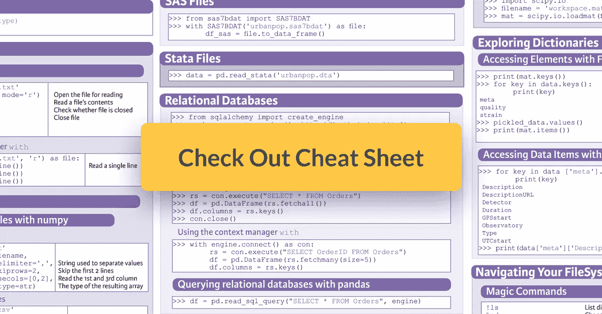

# 在 Python 备忘单中导入数据

> 原文：<https://towardsdatascience.com/importing-data-in-python-cheat-sheet-712ba3638c78?source=collection_archive---------8----------------------->

有了这个 Python 备忘单，您将有一个方便的参考指南来导入您的数据，从平面文件到其他软件和关系数据库的本地文件。

在进行任何数据清理、争论、可视化之前，……您需要知道如何将数据放入 Python。如您所知，有许多方法可以将数据导入 Python，这也取决于您正在处理的文件。

然而，您将最经常使用 pandas 和 NumPy 库:pandas 库是数据科学家进行数据操作和分析的最受欢迎的工具之一，仅次于用于数据可视化的 matplotlib 和 NumPy，后者是构建 Pandas 的 Python 中科学计算的基础库。

在这份用 Python 导入数据的备忘单中，您会发现一些 NumPy 和 pandas 函数，以及用 Python 编程语言构建的函数，它们将帮助您快速获取 Python 中的数据！

本快速指南帮助您学习在 Python 中导入数据的基础知识，您将需要开始清理和整理您的数据！

**找到小抄** [**这里**](https://s3.amazonaws.com/assets.datacamp.com/blog_assets/Cheat+Sheets/Importing_Data_Python_Cheat_Sheet.pdf) **。**

Python 备忘单中的导入数据将指导您完成在工作空间中获取数据的基本步骤:您不仅将学习如何导入文本文件等平面文件，还将了解如何从 Excel 电子表格、Stata、SAS 和 MATLAB 文件以及关系数据库等其他软件的本地文件中获取数据。除此之外，您将获得更多关于如何寻求帮助、如何导航文件系统以及如何开始探索数据的信息。

简而言之，用 Python 启动数据科学学习所需的一切！

你想了解更多吗？现在就开始免费学习 Python 课程中的[导入数据，或者尝试我们的](https://www.datacamp.com/courses/importing-data-in-python-part-1/) [Python Excel 教程](https://www.datacamp.com/community/tutorials/python-excel-tutorial)！

此外，不要错过我们针对数据科学的 [Python 备忘单](https://www.datacamp.com/community/tutorials/python-data-science-cheat-sheet-basics)，或者我们社区中的[许多其他内容！](https://www.datacamp.com/community/data-science-cheatsheets)

*最初发表于*[*【www.datacamp.com】*](https://www.datacamp.com/community/blog/importing-data-python-cheat-sheet)*。*