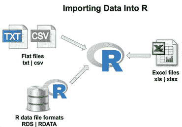
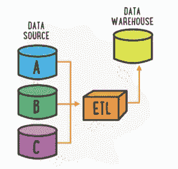
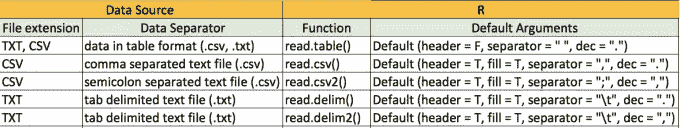
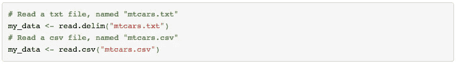
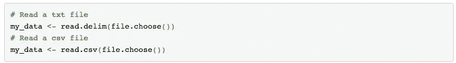
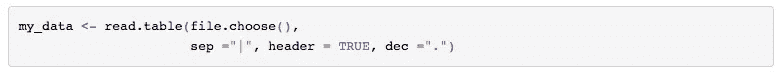
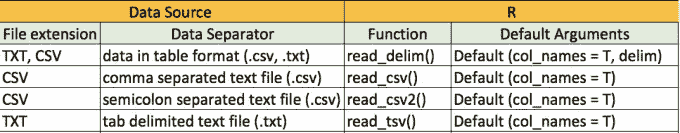
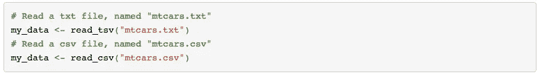
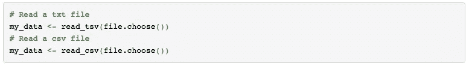

# 将数据导入 R:数据科学项目的第一步

> 原文：<https://towardsdatascience.com/importing-data-to-r-the-first-step-towards-your-data-science-project-a499c1dd0948?source=collection_archive---------12----------------------->

本文的目的是为您迈向数据科学项目的第一步提供**快速查阅指南**。

在导入数据之前，数据科学家需要确定手头问题所需的相关数据源。**数据收集和数据管理**是任何数据相关项目成功的基石。每个企业都有一个专门的数据管理团队，他们不断努力识别不同的数据源，并提取、转换和加载数据(也称为 ETL)到一个名为**数据仓库的中央存储库。**

这个主题非常庞大，因此超出了本文的范围，但在我看来，这是一个非常重要的概念，任何有抱负的数据科学家都应该理解。

一旦确定了数据源，就可以将它导入到 R 中进行进一步的分析。R 中有多个函数专门针对您的数据文件类型(例如 CSV、TXT、HTML、XLSX 等)。)

# 将 TXT/CSV 文件导入到 R

# 使用基本函数

下表根据文件格式总结了将数据导入 R 的基本功能(即不需要额外安装软件包)。

上表中的每个函数都有一组默认参数，这使得它们与其他函数不同。这些论点是:

*   **表头:**逻辑值。如果为 TRUE，该函数假定您的文件有一个标题行。如果不是这样，您可以添加参数 header = FALSE。
*   **填充:**逻辑值。如果为 TRUE，长度不等的行将隐式添加空白字段。
*   **sep:** 字段分隔符。例如，“\t”用于制表符分隔的文件。
*   **dec:** 文件中用于小数点的字符。
*   **stringsAsFactor** 是另一个重要的参数，如果您不希望您的文本数据被转换为因子，应该将其设置为 FALSE。

小心！如果不显式设置上述参数，函数将采用默认的参数值。

在上述每个函数中，**您还需要指定文件名**(如果它在您的本地机器上)**或 URL** (如果文件位于 web 上)。

**读取本地文件**

要在您的计算机上查找文件，您可以遵循以下方法之一:

*   使用命令**setwd(" "**将您的工作目录设置为指向包含您的文件的文件夹，然后在函数中提供文件名。
*   使用导入功能内的 **file.choose()** 。这使您可以从您的机器上交互式地选择文件。

**提示:** *read.table()* 是一个通用函数，可以用来读取任何表格格式的文件，只要你按照自己的要求设置参数。数据将作为数据框导入。例如，如果您有一个包含由“|”分隔的数据字段的文本文件，您可以使用下面的命令:

# 使用 readr 软件包

这个包中的函数的使用方式与基本函数类似。 *readr* 包**比基本函数快得多(超过 10 倍)**，因此，对于大型 TXT 或 CSV 文件非常有用。

*   **delim** :数据文件中分隔数值的字符。
*   **col_names** :可以是 TRUE(默认值)、FALSE 或指定列名的字符向量。如果为 TRUE，输入的第一行将用作列名。

与基本函数类似，在上述每个函数**中，您还需要指定文件名**(如果它在您的本地机器上，或者使用 file.choose()) **或 URL** (如果文件位于 web 上)。

# 摘要

在本文中，我们了解了根据数据量、文件位置和数据分隔符将 TXT/CSV 文件导入 R 的不同方法。对于基本函数，不需要安装额外的包，而对于高级函数，您首先需要安装包(例如，在我们的例子中是 *readr* ),然后调用库来使用这些函数。

*(首发@www.datacritics.com)*