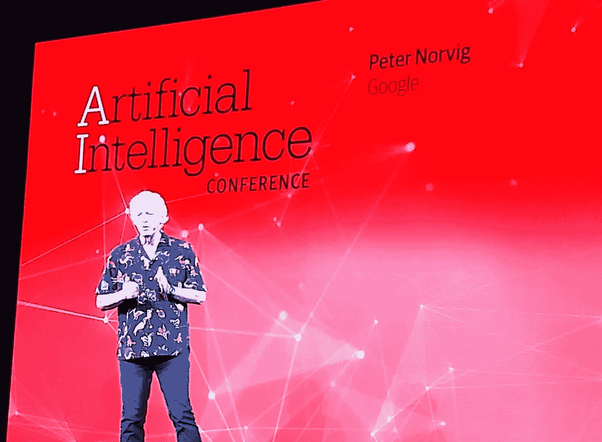
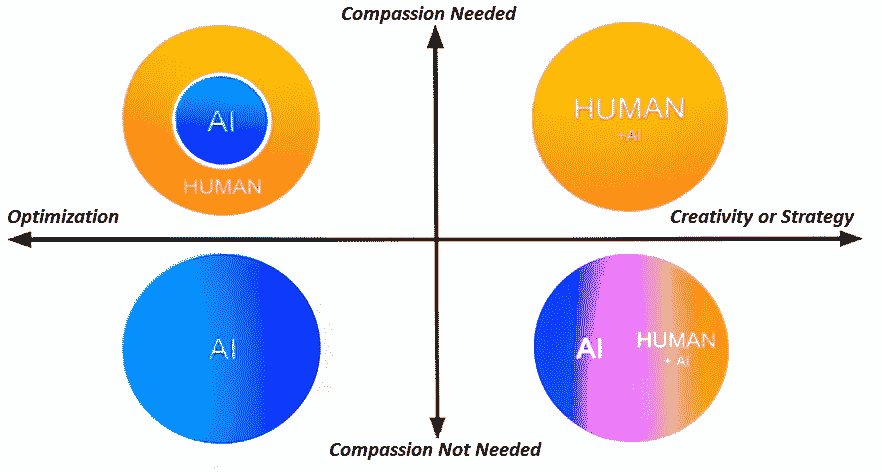
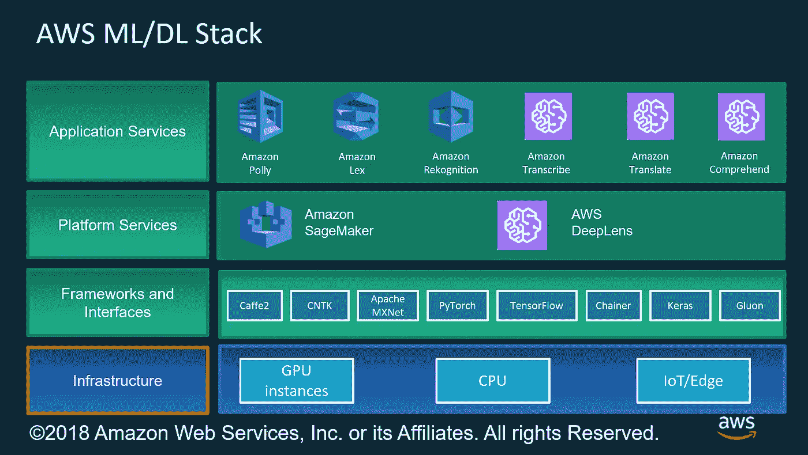
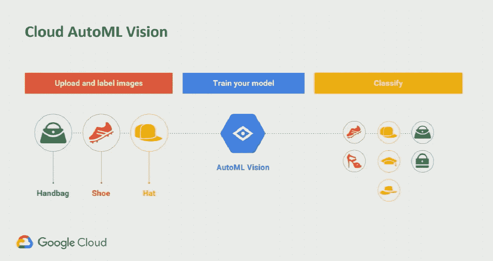
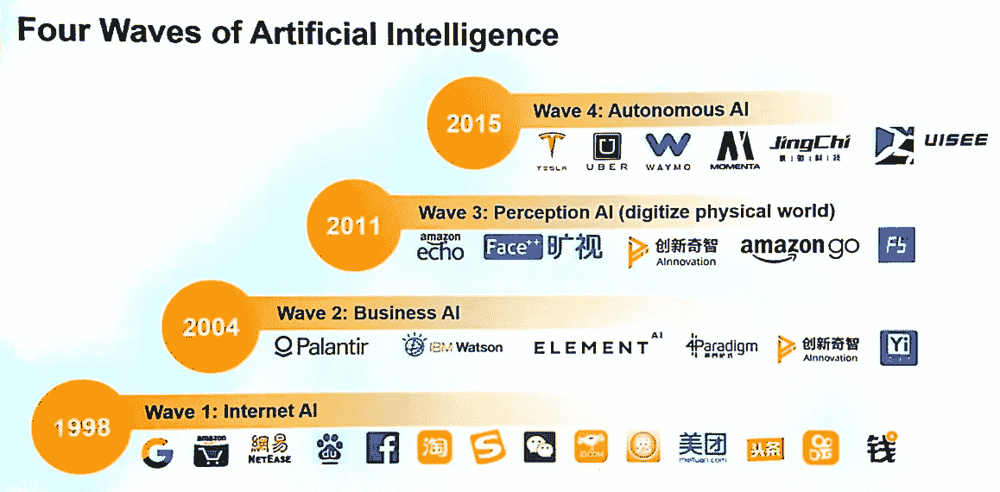

# 2018 年奥莱利 AI Conf 的印象和教训

> 原文：<https://towardsdatascience.com/impressions-and-lessons-from-the-oreilly-ai-conf-2018-51f006be623a?source=collection_archive---------16----------------------->

AI superstar and the author’s personal hero, Peter Norvig, giving his keynote a the AI Conf 2018

我最近参加了[奥莱利人工智能大会 2018](https://conferences.oreilly.com/artificial-intelligence/ai-ca) 。我写这篇文章是为了分享我的经历，以及我从朋友和同事那里学到的一些东西。我评论了我认为是会议的主要主题:人工智能用于客户支持，人类在循环中以及人工智能在劳动力中的影响，深度学习(DL)和强化学习(RL)，部署人工智能和自动机器学习(Auto-ML)的云。最后，我从演讲者那里收集了一些发人深省的话。

还有，[这里是许多演示的幻灯片](https://conferences.oreilly.com/artificial-intelligence/ai-ca-2018/public/schedule/proceedings)。

# 会议的主题

## **人工智能客户支持**

很大一部分实际上使用人工智能或人工智能将数据投入工作的公司都是在客户支持和定制或用户体验领域这样做的。这方面值得注意的例子有:

*   优步，他利用深度学习开发了自然语言处理模型来分类和建议对客户门票的回应，这体现在他们的客户痴迷门票助手( [COTA-v2](https://eng.uber.com/cota-v2/) )中。
*   美国电话电报公司[，他开发了一个 LSTM 网络](https://cdn.oreillystatic.com/en/assets/1/event/282/A%20novel%20adoption%20of%20LSTM%20in%20customer%20touchpoint%20prediction%20problems%20Presentation%201.pptx)(一种递归神经网络)来产生一个模型，该模型描述了客户在与公司互动时将遵循的接触点(渠道)序列，以及这些互动的结果(他们是否购买了产品或服务，以及通过什么渠道购买的)。
*   [加州蓝盾公司](https://conferences.oreilly.com/artificial-intelligence/ai-ca-2018/public/schedule/detail/68050)，他们将他们部署的聊天机器人视为其全渠道客户服务战略不可或缺的一部分。然而，他们强调，最成功的聊天机器人不会自己工作。它们总是建立在良好的数据基础设施之上，包括开发良好的 API 和微服务。

[https://www.theinquirer.net/inquirer/news/3032927/microsofts-xiaoice-bot-can-fool-humans-into-thinking-theyre-talking-to-a-person](https://www.theinquirer.net/inquirer/news/3032927/microsofts-xiaoice-bot-can-fool-humans-into-thinking-theyre-talking-to-a-person)

## **人在回路中以及人工智能对劳动力的影响**

有很多人说人工智能不应该(完全)取代人类，而是让他们的工作更高效、更强大、更令人满意。此外，至少目前，人类仍然有助于开发人工智能解决方案，这是因为一个简单的事实，即大多数**专家知识**包含在人类专家的大脑中，他们是唯一能够准确地对训练 ML 算法所需的数千个数据点进行**昂贵的标记**的人。

The main two axes of human vs. AI replacement / collaboration / augmentation.

还有中间的方法，比如[主动学习](https://drive.google.com/file/d/1al1c7oVDlJqKijFNw-pj51_lamgrfSPb/view)，基于半监督方式的人与机器*协作*的思想。也就是说，让机器处理简单的例行案件，而将困难/边缘案件交给人类专家。当然，这在一些应用中是可行的，在这些应用中，不服从于自动决策的困难情况很容易识别，并且在所有情况中占少数。

## **深度学习和强化学习风靡一时**

对于大多数读者来说，深度学习将自己定位为 ML 模型的事实上的架构可能不是什么新闻。也许是因为会议在加州举行，而且谷歌是会议赞助商之一，所以有大量关于 TensorFlow 的演示。顺便说一下，会后我和我的一些好朋友聊过，他们实际上是 DL 研究者，他们非常肯定 PyTorch 是运行 DL 实验的一个更好的框架。

Peter Norvig 做了一个精彩的主题演讲,讲述了近年来非数字逻辑专家在科学问题上的惊人应用。从天文学应用([引力透镜](https://www.nature.com/articles/nature23463)、[系外行星探测](https://arxiv.org/abs/1712.05044))，到医学应用(用 CV 、[评估心血管风险因素、](https://www.dnainfo.com/chicago/20160720/sauganash/this-chicago-17-year-old-is-using-software-better-diagnose-breast-cancer/)高中生识别癌症、[用基于 DL 的应用](https://www.wired.com/story/plant-ai/)、[追踪奶牛、](https://www.blog.google/technology/ai/using-tensorflow-keep-farmers-happy-and-cows-healthy/))，一直到农业应用([识别生病的木薯植物)。](https://www.wired.com/story/plant-ai/)

两位年轻的微软研究人员(Danielle Dean 和 Wee Hyong Tok)就深度学习中的“最佳秘密”进行了一次非常精彩的演讲。简而言之，迁移学习是一种利用深度网络中编码的知识来解决不同问题的技术，这些知识是由专家在大型数据集上精心训练的。举例来说，被训练来解决对象分类任务的深度网络可以用相对较少的工作来翻新，以解决另一个计算机视觉任务，例如纹理分类。这是通过将网络用作*特征*并仅在可能很小的数据集上重新训练最后一层来实现的。

The texture classification problem trained on a rather small dataset, but solvable via transfer learning!

## 云(几乎)是部署 AI/ML 解决方案的唯一地方

考虑到最先进的 ML 和 AI 解决方案所需的复杂硬件和软件配置，基于云的基础设施占优势就不足为奇了。在这方面最好的贡献之一是来自谷歌的 Levent Besik 的主题演讲，他在演讲中概述了该公司“使人工智能民主化，并使其对所有开发人员&用户变得容易和有用”的努力，无论他们在人工智能的技术或科学方面的专业知识程度如何。谷歌的产品包括三个抽象层次。在最底层，人们可以找到平台( *ml-engine* 、*数据流*和 *dataproc* 云服务)和库(TensorFlow、Keras、Spark)层，供想要“从零开始”创建解决方案的开发人员使用接下来是 AI 构建模块，它们本质上是成熟的 API，用于解决定义明确的问题，如语言翻译、语音转录或图像识别。在最高级别，我们可以找到模板解决方案，如产品推荐引擎或客户联络中心。

Amazon Web Services (AWS) 提供了一套服务和平台，用于开发和部署 ML，遵循相同的一般原则。然而，我感觉 AWS 产品的一些组件，比如亚马逊 Sagemaker 比谷歌的同类产品更成熟、更完整、总体设计更好。

The AWS ML Stack. Image reproduced with permission from AWS.

## **自动毫升**

如果你是一名数据科学家或人工智能解决方案开发人员，在不久的将来，你也有可能被一台机器取代。Auto-ML 技术承诺从数据预处理到超参数调整、模型选择和部署，对 ML 模型构建的最复杂方面进行端到端的抽象和自动化。简而言之，Auto-ML 服务将数据集(可能是脏的，甚至不需要包含标签)作为输入，并输出已经部署的 ML 模型，包括 REST-API 和一切！

Google Cloud’s AutoML solution to generate image classification.

H2O 是另一家展示了这方面有趣发展的公司。

考虑到我认为自己是一个 ML 实践者(我讨厌数据科学家这个术语)，我仍然对 Auto-ML 技术持怀疑态度就不足为奇了。很难想象一个完全自动化的过程能够成功地执行 ML 模型创建中所有困难的基于经验和直觉的决策。例如，巧妙的特征工程是一件特别难自动化的事情。然而，最近在 Auto-ML 方面的进展，如谷歌所展示的，他们已经成功地[开发了设计其他神经网络的神经网络](https://ai.googleblog.com/2017/05/using-machine-learning-to-explore.html)，这让我怀疑自己。

# **行情**

最后，我会给你留下一些我觉得有趣、有启发性或发人深省的引言:

“我们做的许多人工智能的东西除了营销之外没有商业价值。”——[本·泰勒](https://twitter.com/bentaylordata)。

“80%的 ML 工作负载运行在 AWS 上”——Hagay lupes go，AWS。

“[在]2000 万开发人员中，100 万是数据科学家，1000 名是深度学习研究人员”——Levent Besik，谷歌云。

“一些公司有许多‘好想法’(供 AI/ML 使用)，但无法量化价值。如果这个想法是从“这不是很酷吗……”开始的，这可能是个坏主意。”——[本·泰勒](https://twitter.com/bentaylordata)。

“82%的组织正处于考虑采用人工智能的某个阶段。进行试点非常容易，但部署起来却非常困难……高管们正专注于客户保持率和满意度，以及客户获取成本的降低。”— [马尼什·戈亚尔，IBM](https://twitter.com/ManishCGoyal)

“实施人工智能的障碍:缺乏熟练的资源或技术专长，监管限制。关于数据和信息使用的法律、安全、隐私问题。”— [马尼什·戈亚尔，IBM](https://twitter.com/ManishCGoyal)

“在未来，你将会看到负担得起的、智能的、云驱动的、个性化的假肢设备”——[约瑟夫·西罗什，微软](https://twitter.com/josephsirosh)

“我们正在进入一个机器和软件可以分析的世界(看到以前总是隐藏的模式)；优化(告诉飞机每英里飞行的高度，以获得最佳的燃油效率)；预言(告诉你你的电梯什么时候会坏，在它坏之前修好它)；定制(为您量身定制任何产品或服务)并数字化和自动化任何工作。这正在改变每一个行业。”《地球是平的》的作者汤姆·弗里德曼，纽约时报

“ML 所做的只是提供推论。科学的商业方法。业务人员很容易联想到推理…数据科学不太适合敏捷方法”——AWS 的 Carlos Escapa

The fourth waves of AI — Image taken from Sinovation ventures presentation.