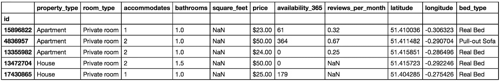
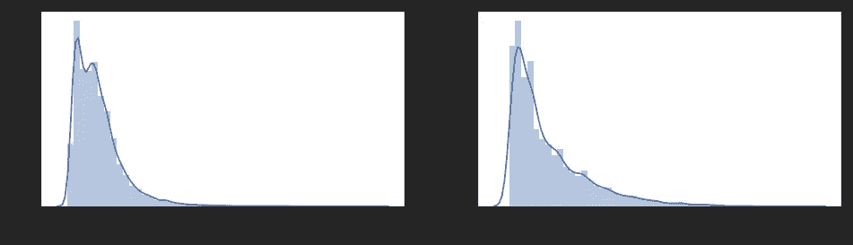
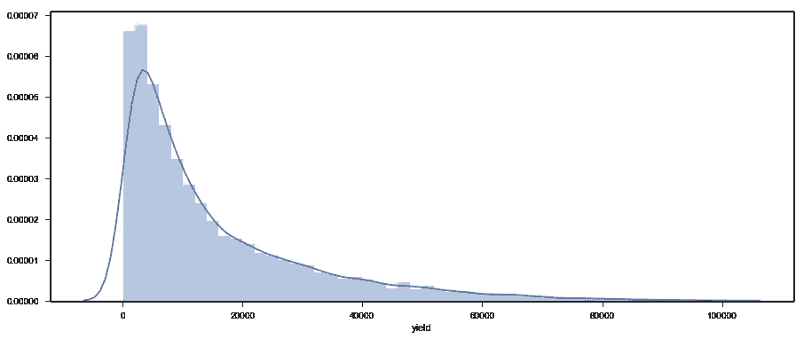
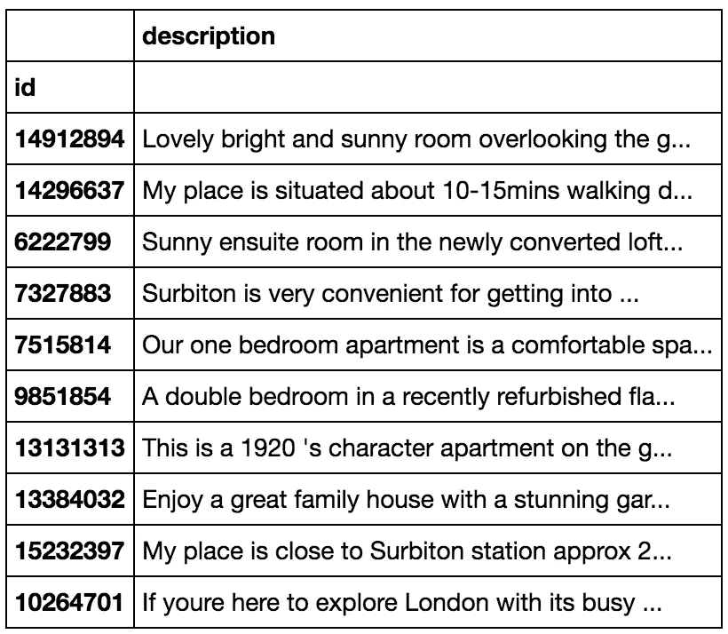
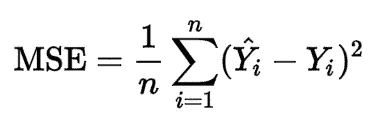
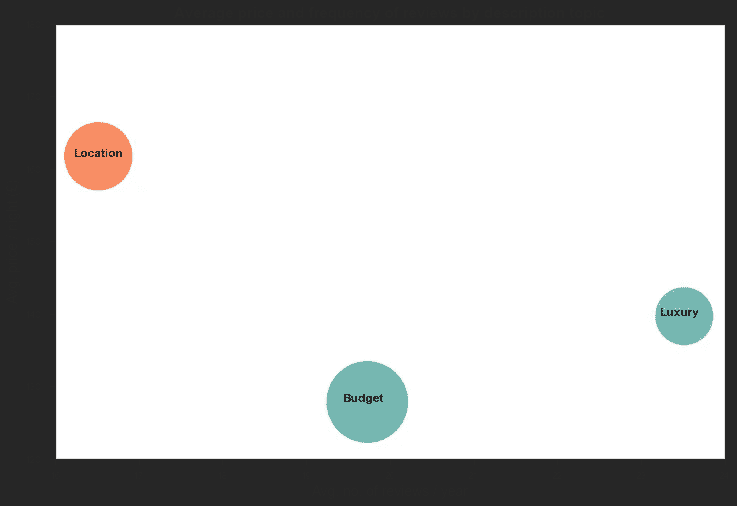

# 利用文本挖掘改进 Airbnb 收益预测

> 原文：<https://towardsdatascience.com/improving-airbnb-yield-prediction-with-text-mining-9472c0181731?source=collection_archive---------3----------------------->


Stunning views from an Airbnb I stayed at in Tasmania. Because no one wants to start reading an article with a graph.

# 介绍

Airbnb 是一个受欢迎的家庭共享平台，让世界各地的人们分享他们独特的住宿。对于潜在的主人来说，这可能是一个有利可图的选择，因为他们有空的度假屋、多余的房间甚至是多余的床。然而，新主人很难知道他们能挣多少钱，特别是，与宜家的普通公寓相比，他们心爱的配有设计师家具的顶层公寓的真正价值是什么？

我在 [Udacity](https://medium.com/u/2929690a28fb?source=post_page-----9472c0181731--------------------------------) 完成机器学习 Nanodegree 的同时，抓住机会解决了这个问题，并为 Airbnb 房源的潜在收益建立了一个预测模型。该模型考虑了文本描述，以捕捉单个列表的丰富的定性模型。我也住在伦敦，自然决定在这里为 Airbnb 房源建模，以利用我的领域知识。

完成这个项目带来了一些有趣的见解，并激励我与其他数据科学爱好者分享这些成果。在这篇文章中，我简要介绍了项目工作流程，并以一种更方便读者的方式讨论了其中的见解。对于技术头脑，整个项目和支持代码可以在我的公共 [GitHub](https://github.com/joaeechew/udacity_capstone) 上找到。

这篇文章的其余部分分为四个主题:

*   **数据探索和操作:**对数据集和描述性见解的讨论。
*   **文本挖掘列表描述:**用于分析语料库和执行主题建模的管道。
*   **训练机器学习模型:**特征工程，模型选择和调优。
*   **结果和可视化:**可视化文本数据和见解。

# 数据探索和操作

## 获取数据

为了建立这个模型，我使用了 Airbnb 内部的[提供的数据集，在那里，关于一个城市的 Airbnb 房源的公开信息已经被搜集并发布，供独立的非商业用途使用。这包括详细的列表信息，如房间数量、位置、文本描述、价格和评论数量。](http://insideairbnb.com/get-the-data.html)



Sample of the dataset.

具体来说，我使用了 2016 年 10 月 3 日至 2017 年 3 月 4 日期间伦敦房源的详细信息。主动列表被定义为在此期间至少被审核过一次的资产。兼职列表、不完整列表和新列表也将被删除。数据清理后，数据集有 9722 行和 16 列。

## 我们如何衡量潜在收益？

为了建立这个模型，**收益率**的概念被用作潜在未来收益的代理。收益的定义是一项资产一年的收入。Airbnb[“三藩市模式”](http://insideairbnb.com/about.html)中基于价格、平均停留时间和审核率的收益计算使用:

***平均停留时间*价格*评论数/月*评论率***

在伦敦，假设平均停留时间为 3 晚。相对保守的 50%的点评率用于将点评数量转换为预计预订量。这种占用模式是预算和立法分析师办公室与 Airbnb 自己的估计之间的中间地带。



**Distribution of Price (£), Reviews/Month, and Annual Yield (£)**

分析价格、评论和最终收益的分布，伦敦的大部分房源价格低于 100 英镑/晚，每月收到 1-4 个预订。这表明入住率为 10-50%(取决于所选的点评率)，AirBnb 主机平均每年为每份房源赚取 15，739 英镑。对于上四分位数的上市公司，这一数字高达 21，480 英镑。从这些数字来看，伦敦市长办公室报告的伦敦市中心住宅租金中位数为 7800 英镑，这表明积极管理的房源有着健康的溢价。

# 文本挖掘列表描述

现在，我们已经有了一个经过处理的数据集，并了解了我们试图预测的内容，我专注于将描述文本转换为对机器学习模型有用的特征。



Sample of listings description field.

在自然语言处理(NLP)行话中，描述文本的集合(左边的摘录)被称为语料库。这被转换成文档术语矩阵，其中每个列表是包含术语矩阵的文档。NLTK 和 gensim 包被用来完成这个任务。

为了减少术语的数量并关注每个文档中最重要的术语，删除了非英语和停用词。单词也是词汇化的，正则表达式标记器用于忽略非字母数字字符串。剩余的单词然后被转换成文档术语矩阵的单词包表示(单词 id、单词频率二元组的列表)。

这样，我们可以使用**潜在狄利克雷分配(LDA)** 来发现语料库中固有的主题，根据学习到的主题对语料库进行分类，并将它们用作回归模型的特征。

> LDA 是一种生成贝叶斯推理模型，它将每个文档与主题的概率分布相关联，其中主题是单词的概率分布。这是一种分析大量文本的有效方法，也是一种更加人性化的主题建模方法。

主题模型在下面的主题间距离图中可视化，使用了出色的 [pyLDAvis](https://github.com/bmabey/pyLDAvis) 包。在这种可视化中，圆圈的面积代表每个主题的流行程度，而右边条的长度代表某个术语在特定主题中的成员资格。例如，下面的主题 1 是最普遍的，在主题 1 中，与整个语料库中术语的总术语频率(蓝色和红色区域)相比，术语“步行”具有最高的估计术语频率(红色区域)。


Visit [https://cdn.rawgit.com/joaeechew/udacity_capstone/481e85b0/lda.html](https://cdn.rawgit.com/joaeechew/udacity_capstone/481e85b0/lda.html) for an interactive version

我选择将文档术语分成 3 个主题，因为它允许非常不同的主题没有重叠，这使得对每个列表进行分类是一个明智的选择。根据每个主题中的热门术语，列表的主题可以描述为:

*   **话题 1 —位置:**这主要是关于“位置”、“步行”、“车站”和“中心”等词语的位置。这可能会吸引那些看重便利和交通便利的游客，比如第一次来伦敦的游客，他们希望最大限度地利用时间，游览伦敦市中心的所有景点。
*   **话题 2——奢华:**这似乎是针对现代公寓，突出了“厨房”、“现代”、“私人”和“空间”等词。这可能会吸引预算较高的旅行者，他们希望住在一个舒适、有空间和隐私的地方(这在伦敦很贵！).
*   **主题 3——预算:**这主要是关于更基本设施的词汇，如“床”、“房间”、“淋浴”和“清洁”。这可能会吸引那些不想花太多钱、正在寻找能保证基本便利设施的房源的预算旅行者。

然后，每个列表被分类到不同主题中的一个，该主题被用作训练模型的下一阶段的附加特征。

# 训练机器学习模型

在本节中，我们通过拟合处理过的数据集来训练机器学习算法。这是建立预测产量的最终模型的地方。

## 误差度量

在训练模型之前，我们首先要定义目标。这是将指导算法的内部权重的误差度量，允许模型通过寻找可能的最低误差来学习最佳预测函数。

在该模型中，均方误差(MSE)被用作精确度的度量。这测量实际产量和预测产量之间的误差平方的平均值。这个的数学公式是:



MSE 是回归模型的常用误差分数，允许直观地测量误差，即 10000 的 MSE 表示产量模型偏离 100(10000 的平方根)。它总是非负的，值越接近零越好。

## 型号选择

有了明确定义的误差度量，我们可以训练几个模型并选择性能最好的一个。在每个模型被训练和测试之后，结果被比较以检查更复杂的模型产生更好的分数。

这些模型遵循复杂的顺序:

1.  **线性回归**:这是一种简单的线性方法，用于对数据集中的特征(如房间数量、入住客人数量)和目标“收益”变量之间的关系进行建模。
2.  **决策树**:这是一个更复杂的基于树的模型，可以捕捉数据集中的非线性关系。这使用树表示，其中树的每个内部节点对应于数据集中的一个特征(例如房间数量)，并且每个叶节点是一个类别标签(例如多于 2 个房间)。
3.  **随机** **森林:**这是从决策树集合中构建的最复杂的模型。这背后的原理是，一组弱学习者，即个体决策树，可以集合起来创建一个强学习者——随机森林。案例和要素的随机样本用于构建每棵单独的树，然后对组合预测进行平均，以返回森林的最终结果。

正如所料，随机森林模型产生了最好的分数。这表明数据集具有许多非线性关系，只能通过更复杂的模型来捕捉。

## 基于 LDA 主题模型的特征工程

虽然使用结构化数据构建预测模型是很好的第一步，但该项目的目标是确定文本挖掘是否可以用于提高产量预测。我处理这个问题的方法是通过比较不同模型在有和没有列出主题作为特征的情况下的得分。

在没有列出主题的情况下，报告的最佳结果是均方根误差为 14，579。在包含描述主题后，根 MSE 进一步降低到 14，560，从而提高了性能。在确认准确性增加后，使用 scikit-learn 的 GridSearchCV 调整最终参数，这进一步将均方根误差降低到 14，520。

虽然精度的提高看起来很小，但值得注意的是，随着精度的提高，挤出额外的几个点变得更加困难。

**更重要的是，这验证了文本挖掘中存在有价值信息的假设，并证明了探索更多 NLP 技术来捕获这些信息的合理性。**

使用基于树的模型的另一个优点是能够看到数据集中每个要素的重要性。这也揭示了使用列表主题的价值:

```
importance %                        feature
7      24.932740                       latitude
0      21.772927                   accommodates
8      19.621701                      longitude
6       7.702141                 minimum_nights
5       6.356207                   extra_people
1       4.105430                      bathrooms
4       3.769556                guests_included
2       2.893417                       bedrooms
13      2.039581      room_type_Entire home/apt
3       1.844825                           beds
**20      0.956488      topics_description_Luxury
19      0.914949    topics_description_Location
18      0.900623      topics_description_Budget**
12      0.477287            property_type_Other
11      0.442333            property_type_House
9       0.430975        property_type_Apartment
14      0.396504         room_type_Private room
10      0.152781  property_type_Bed & Breakfast
17      0.107925              bed_type_Real Bed
15      0.098952          room_type_Shared room
```

根据列表描述建模的主题具有 2.5%的综合重要性，这高于资产类型(1.3%)、床位数量(1.8%)或床位类型(0.11%)的重要性。这意味着非结构化描述文本包含比已经在关于 Airbnb 列表的结构化字段中捕获的更多的信息，并且这些信息可以用 NLP 技术来挖掘。

# 观想洞见

除了提高预测力度之外，还有从文本挖掘 Airbnb 房源描述中产生的进一步见解。通过绘制 3 个主题(位置、奢华、预算)的气泡图，可以将伦敦的 Airbnb 市场划分为不同类型的房源——每种房源都有不同的平均价格和预订率。



Each topic is plotted at the average of that segment while the size represents the number of listings.

就规模而言,“经济型”市场的房源数量最多，其次是“位置型”,而“豪华型”市场的房源数量最少。这是有道理的，人们会自然地期待有更多的“预算”类型的上市。

从平均价格来看，“地理位置”明显领先，排在第 162 位，其次是“豪华”，第 140 位，第 128 位。这表明位置仍然是房地产的王道，验证了古老的谚语“位置，位置，位置！”。

令人惊讶的是，尽管位置价格最高，但评论数量最多的却是“豪华”住宿。这是预订频率的一个代表，表明拥有一个“豪华”类型的列表甚至可能导致高于平均水平的收益。

Airbnb 用户通常是千禧一代，与其他年龄组相比，他们更愿意在旅行上花费，他们被住在别处没有的精品酒店的独特机会所吸引。这可以解释 Airbnb 上“奢华”住宿的流行。其他细分市场，如通常更关心“位置”的商务旅客，可能更喜欢住在酒店，而其他细分市场，如“经济型”旅客，则更喜欢有保证的设施和较低的价格的旅馆。

# 反思和下一步措施

这是一个具有挑战性和有趣的问题，在完成这个项目的过程中，我学到了很多东西。

**NLP 很难，没有正确答案。**处理文本数据带来了独特的挑战，这些挑战源于数据的定性性质。与结构化数据相比，它的形式更加自由，很少有“正确的答案”可供选择。例如，我决定选择相对较少的主题进行建模，这样可以保持主题的可管理性和独特性，足以形成不同的部分。然而，几乎每一个其他选择的背后都有一个合理的理由，这个理由会导致截然不同的结论。

可解释性很重要。在没有正确答案的情况下，能够以人性化的方式解释您的模型有助于建立对结果的信心。我选择使用 LDA 而不是其他主题建模算法(例如，非负矩阵分解)的原因之一是它提供了单词分布的可解释性。这有助于建立信心，我已经选择了合理数量的主题进行建模，并且最终的主题可以被赋予有洞察力的标签，提供有用的信息。

**NLP 可以解锁非结构化文本中的信息。**尽管无论哪种方式都会有有价值的学习，但证明文本挖掘可以用来提取有价值的信息尤其令人满意。由此产生的话题不仅改进了预测模型，还提供了对 Airbnb 市场不同细分市场的宝贵见解。

**更多的非结构化数据？**任何数据从业者可能都会同意，正确的数据很少以您想要的形式出现。能够从非结构化来源中提取信息为执行有用的分析打开了大门——即使数据可用性较低或者不是为您的预期目的收集的。展望未来，探索 Airbnb 中图像的使用以及深度学习算法是否可以从中提取有意义的信息将是一件有趣的事情。

Airbnb 团队已经分享了大量关于 Airbnb 数据的优秀作品，任何有兴趣阅读更多的人都应该阅读他们的一些帖子。希望通过分享我的作品，我能以我自己的一点点方式为之添砖加瓦。如前所述，没有正确的答案，我欢迎并鼓励下面评论中的任何反馈或想法！

*我很幸运，在我感兴趣的领域找到了一个很棒的数据集。这个数据集是由 Airbnb 内部收集的，旨在回答 Airbnb 如何被用于并影响你所在的社区的问题。不管你的观点如何，这是一个重要的讨论，尤其是随着共享经济的兴起，我鼓励你通过访问他们的* [*网站*](http://insideairbnb.com/about.html) *来加入这场对话。*

*报告全文及全部代码可在我的公众号*[*GitHub*](https://github.com/joaeechew/udacity_capstone)*上获得。*