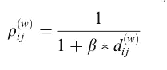
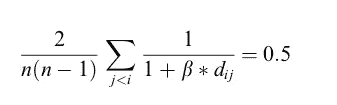
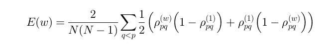
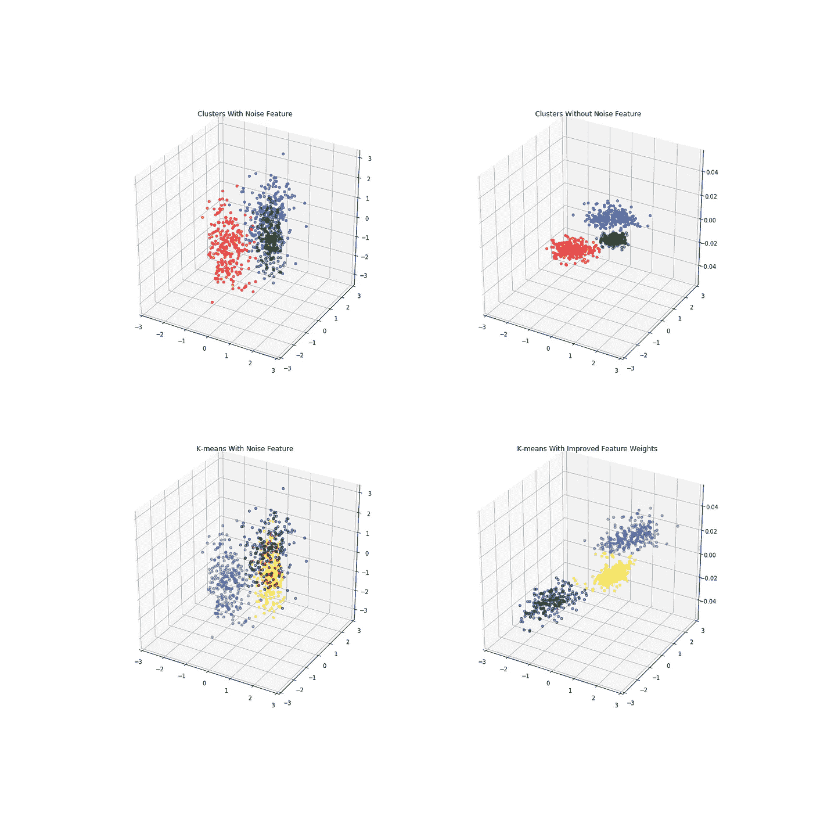
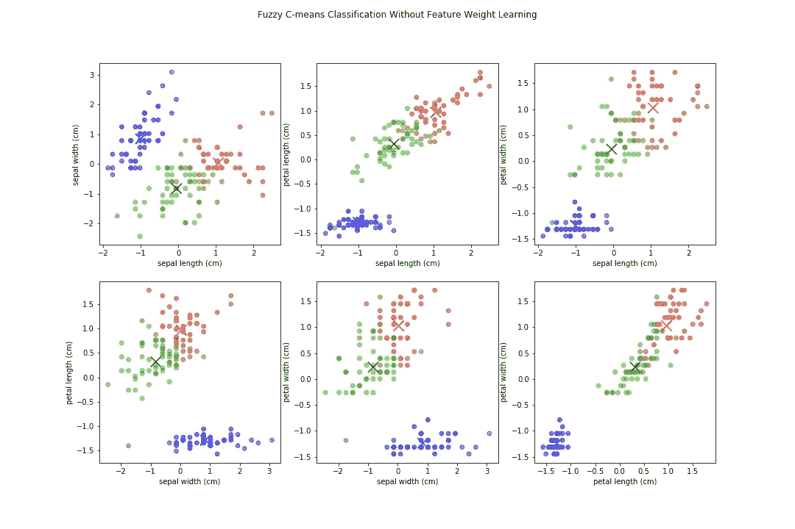
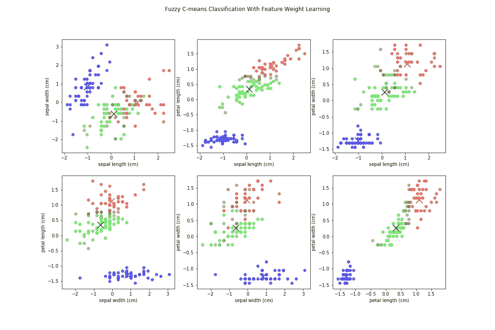

# 利用特征权重学习提高聚类性能

> 原文：<https://towardsdatascience.com/improving-clustering-performance-using-feature-weight-learning-d65d4fec77cb?source=collection_archive---------11----------------------->

## 给无监督学习一个目标


聚类是一种无监督的机器学习方法，旨在将数据划分为不同的组或簇。有几种不同的形式，包括等级、密度和相似性。每一个都有一些不同的算法。任何机器学习算法中最难的部分之一是特征工程，这对于聚类来说尤其困难，因为没有简单的方法来找出最好的方法将数据分成独立但相似的组。

基于相似性的聚类的指导原则是相似的对象在同一聚类内，而不相似的对象在不同的聚类内。这与大多数传统聚类算法的目标没有什么不同。对于基于相似性的聚类，必须给出一个度量来确定两个对象有多相似。这种相似性度量是基于距离的，并且可以采用不同的距离度量，但是相似性度量通常产生[0，1]中的值，其中 0 没有相似性，1 是相同的。为了测量特征权重重要性，我们将不得不使用加权欧几里德距离函数。相似性度量定义如下:



β是我们实际上必须求解的一个值，(w)表示距离权重矩阵，d 表示所有对象之间的成对距离。为了求解β，我们必须假设，如果使用标准权重(全为 1)，我们的相似性矩阵将在[0，1]之间均匀分布，导致平均值为. 5。为了找到β，我们求解方程:



如果使用加权欧几里德距离，则可以使用该相似性矩阵来识别哪些特征引入了更多噪声，以及哪些特征对于聚类是重要的。最终目标是最小化相似性矩阵的“模糊性”，试图将中间(即. 5)的所有内容移动到 1 或 0。为此，我们使用损失指标:



这里(1)表示基本权重(全为 1)，而 *ρ* 表示得到的模糊划分矩阵，它是点 p 和 q 之间的欧几里德距离函数中使用的权重的乘积。

然后，我们可以尝试对这个损失函数使用梯度下降，以尝试相对于相似性矩阵最小化它。梯度下降是机器学习中最常见的优化算法之一，用于通过使用函数梯度(偏导数的组合)来寻找给定函数的最佳参数。通过采取与梯度的负值成比例的步骤，我们可以试图找到函数的局部最小值。我们将不断更新权重，直到达到我们的最大迭代次数，或者函数收敛。所以梯度下降是我们的损失函数，对重量有偏导数。我们将根据梯度和学习率在每次迭代中更新权重。


其中 n 是定义的学习率。n 是一个非常重要的参数，因为太小需要太多的计算，而太大，函数可能永远不会收敛。

如果你能从一个 3D 图形的角度来考虑它，它就像拉伸或收缩每个轴，以某种方式将我们的点放入更紧密的组中，这些组彼此之间距离更远。我们实际上并没有改变数据的位置，我们只是改变了衡量驱动相似性度量的距离的方式。

这是一个创建的示例，我在前两个变量上引入了 3 个具有独立质心的聚类，但引入了第三个噪声变量，这会使聚类更加困难。它们由创建数据时给出的实际分类标签来着色。当消除第三个噪声变量时，我们可以看到，识别聚类要容易得多。



尽管由于 3D 视角的原因，很难看出差异，但您可以看到聚类在学习到的特征权重下更加清晰。通过扩展可以轻松区分它们的主要特征，它能够更好地识别集群。

# **测量改进**

其有效性的一个很好的代表是模糊 c-均值，一个常用的 k-均值算法的相对。它的工作方式与 k-means 非常相似，但是它会产生一种叫做模糊划分矩阵的东西，而不仅仅是一个聚类标签。

模糊划分矩阵是一组权重，用于测量单个点与给定聚类中心的相似程度，类似于我们之前使用的相似性矩阵。它也可以使用加权距离度量来计算，我们可以将它提供给我们新发现的最佳权重。这也将返回到更新集群中心。像 K-means 一样，这导致聚类中心随着每次迭代而移动，直到达到最大迭代次数或某个改进阈值。

在模糊 c 均值中，你会有一个和我们最初的损失函数非常相似的目标。您希望点变得不那么“模糊”,并且希望它们都尽可能靠近它们的聚类中心，而远离其他点。模糊聚类算法的一个很好的度量是 Dunn 的划分系数，它是模糊划分矩阵的所有分量的总和。

让我们尝试在有和没有我们学习的特征权重的情况下对虹膜数据集使用模糊 c 均值。这里模糊 c-的输出意味着比较所有变量，假设 3 个聚类(因为我们从数据集中知道)。



请注意，一些要素之间的界限不太明确，因为我们有多个同等权重的要素，所以界限可能会模糊。现在，当应用特征加权学习方法时，我们得到归一化的距离权重:

```
{'sepal length': 0.0, 'sepal width': 0.0, 'petal length': 1.0, 'petal width': 0.0258}
```



仍然存在模糊的边界，主要是在我们认为它们在距离权重中的值为 0 的特征上，但是该算法将主要焦点放在花瓣长度上。我们得到了相似的聚类，更强的边界(在一些特征上)，并且总体上我们的模糊划分系数增加了大约 23%！

我们现在还知道，如果我们想要生成关于分类它们的规则，我们可以只关注 2 个特征而不是 4 个！

# **注意事项**

仅仅因为使用模糊 c 均值最容易看到结果，并不意味着这种改进措施只能用于该算法。您可以在许多方面使用它，在聚类之前扩展或更好地理解您的数据。我最近在一个使用 OPTICS 算法的应用程序中使用了这种特征约简和重要性技术，并通过根据特征权重学习算法缩放我的特征看到了改进的结果。

如果你想亲自检查或使用它，我已经将这个功能权重学习构建到一个独立的存储库中。

[](https://github.com/Csinclair0/feature_learning.git) [## Csinclair0/feature_learning

### 基于相似性聚类的特征权重学习

github.com](https://github.com/Csinclair0/feature_learning.git) 

# **参考文献**

王，，王，亚东，王。“基于特征权重学习改进模糊 c 均值聚类”。2004 年 Elsevier B .诉 doi 案:10.1016/j.patrec.2004.03.008