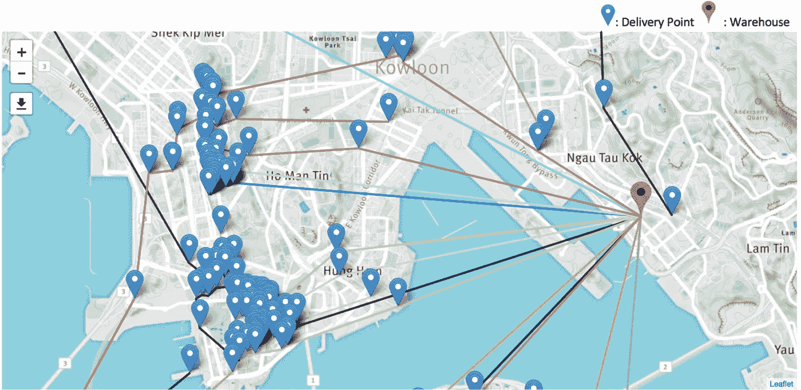
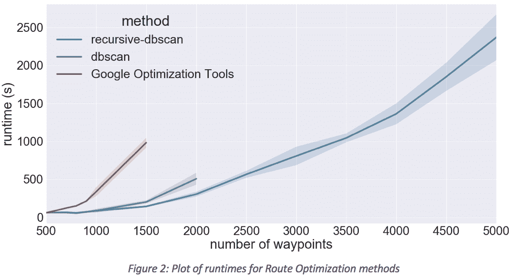
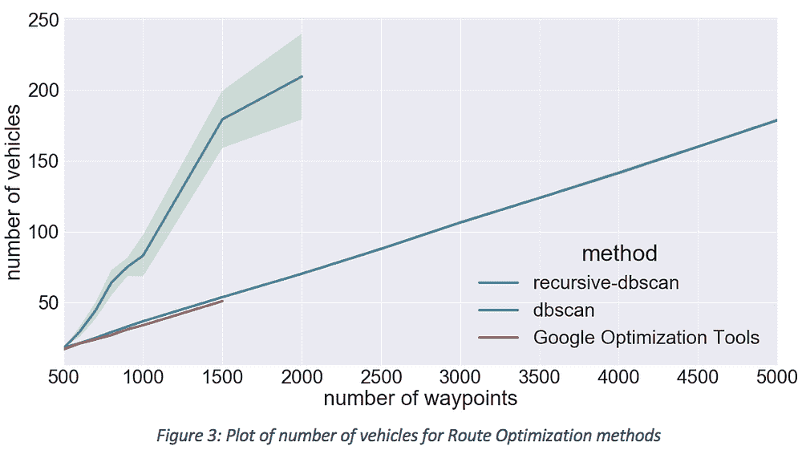
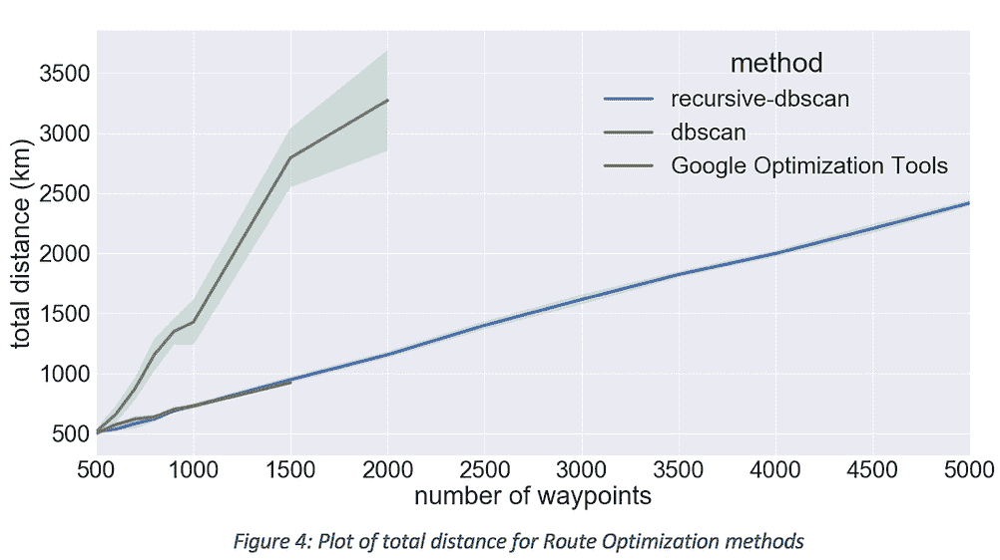

# 通过路线优化改善运营

> 原文：<https://towardsdatascience.com/improving-operations-with-route-optimization-4b8a3701ca39?source=collection_archive---------1----------------------->

## 撰稿人:Feiko Lai，Michal Szczecinski，Winnie So，Miguel Fernandez

> *这个故事最初发表在* [*GOGOVAN 科技博客*](https://medium.com/gogovan-technology/improving-operations-with-route-optimization-e032d8bf5edc)
> 
> *请在这里找到我们关于主题* [*的学术论文。*](https://arxiv.org/abs/1812.02300)

每天，GOGOVAN 的司机都会抵达亚洲各地的仓库，提取我们的业务合作伙伴要求我们交付给他们客户的数千份订单。

这些订单可以是一系列的东西——从期待已久的新手机，到最后一刻订购的周年礼物。它们都有不同的大小、形状和重量。对于他们中的每一个人，都会有一个人在等待，希望这次快递公司能准时到达…

这就是为什么在 GOGOVAN，我们尽我们所能确保顺利和及时的交付，并提供令客户惊叹的服务质量。每一条送货路线都由我们的运营团队手工精心规划和反复检查，以确保我们不会失败。

**手动？！**

你刚才不是说你每天有几千个订单吗？！

*是的，没错。*

过去，运营团队通常需要在取货当天早上手动整理送货路线，并确保我们满足当天的所有送货时间要求。正如您可能想象的那样，这不是一个特别令人兴奋或容易的任务:)

**一个人花了大约 1 个小时来创建 100 个路点的次优路线。对于更大的请求，这个时间会成倍增长。**

我们立刻意识到这个过程只是在乞求一些自动化。

我们不仅为每天清晨不得不做如此平凡工作的运营团队感到难过，而且我们也知道，随着订单量的增长，这项任务将慢慢变成不可能完成的任务。我们认为这是一个开发尖端技术的机会，该技术将成为 GOGOVAN 数据科学堆栈的核心组件。

# 我们是怎么开始的？

我们非常以客户和司机为中心。因此，我们总是首先尝试从他们的角度分析问题，以了解我们的解决方案如何影响和惠及他们。经过大量的头脑风暴，我们得出了以下目标:

*   所有订单都需要按时交付**。**
*   **通过使用**缓冲时间和实时距离**确保驾驶员不会匆忙准时到达。**
*   ****通过减少行驶距离来节省燃油**。**
*   **尽量减少司机的空闲时间——没有人喜欢拿着装满包裹的行李箱等待。**
*   ****提高车辆利用率**。**
*   **完全自动化流程**。****
*   **该算法需要能够**与我们一起成长**——支持不同类型的交付、车辆和国家。**

**确定了我们的主要目标后，我们决定探索学术界和开源的世界——重新发现轮子是没有意义的。我们意识到我们所面临的问题就是众所周知的车辆路径问题。**

## **什么是车辆路径问题？**

**[*车辆路径问题*](https://en.wikipedia.org/wiki/Vehicle_routing_problem)*【VRP】*可以描述为从一个或多个*车场*到多个*客户**约束*创建一组最优*路线*的问题。目标是向所有客户交付货物，同时最大限度地降低路线成本和车辆数量。**

**这个问题是 **NP-hard** ，已经被[伦斯特拉和 Rinnooy Kan](https://onlinelibrary.wiley.com/doi/pdf/10.1002/net.3230110211) 证明。然而，仍然有一些精确的解决方法，使用一个[分支限界](https://link.springer.com/article/10.1007/s10107-005-0644-x)，或者[动态规划](https://link.springer.com/article/10.1007/s10107-008-0218-9)，然而，正如上面的论文中所描述的，它们似乎只适用于最多 150 个航路点。**

**目前，最先进的解决方案是使用元启发式算法获得的:[遗传算法](https://link.springer.com/chapter/10.1007/978-3-540-71615-0_13) ⁴、[禁忌搜索](https://link.springer.com/article/10.1007/BF02579017) ⁵和[蚁群优化](https://link.springer.com/chapter/10.1007/11816102_4) ⁶.这些是目前该领域主要使用的方法。**

**对于该领域的深入回顾，我们推荐[李晓燕的这篇精彩论文](https://pdfs.semanticscholar.org/acc2/785529ecd91c12387d8b8e08567c1ce9ab50.pdf) ⁷。**

## **我们的解决方案**

**随着 VRP 成为一个被广泛认可的问题，确实有很多公司似乎正在解决这个问题。**

***然而，不知何故，我们对他们的解决方案并不满意……***

**我们只知道，如果我们结合我们的**运营知识、数据科学和研究专业知识、大量数据以及开源的最新贡献**，我们就可以获得一个强大的内部解决方案，该解决方案:**

*   **更先进，性能更好，有可定制的算法和迭代逻辑。**
*   **更便宜、更高效、更具可扩展性。**
*   **允许开发有形的知识产权资产并围绕它建立竞争优势。**
*   **允许我们向客户保证，他们的交付数据不会超过 GOGOVAN。**

**考虑了很长时间后，**我们决定，如果我们想成为这个领域的领导者，我们需要用我们自己的方式，而不是用一些黑箱解决方案。****

***所以我们开始了…***

# **第一算法**

***但是我们并没有马上开始研究学术论文！***

**首先，**我们专注于提出自己的方法，并对其进行评估。这个过程让我们从一开始就对这个领域有了更好的了解，并亲身经历了一些常见的问题(我们没有想当然！).更重要的是，这在后来帮助了我们，因为我们可以很容易地看到学术论文中提出的不同方法的利弊，并想出将它们结合起来的策略。****

**这样一个过程是理解这个出色的软件包— [谷歌优化工具](https://developers.google.com/optimization/)如何工作的关键。我们知道谷歌的人节省了我们几个月的时间来编写我们想要测试的所有不同的算法。他们允许我们立即进入最有趣的部分！**

**我们花了很多时间来玩这个库，测试不同的场景，亲眼看看哪些策略在什么时候有效。**

**我们非常喜欢它，所以决定围绕它来开发我们的工具！**

**它拥有我们所需要的一切——透明度、实验能力、灵活性和支持。**

**第一个算法准备好了。我们部署了它。**

****

**Figure 1: Visualisation of one of our first Route Optimization assignments**

# **快速增长—如何处理更多订单？**

**路由优化的第一个版本取得了巨大的成功。**

**提交给 Route Optimizer **的订单量迅速从每个仓库 500 件增加到 1000 多件。理论上，我们应该没事。****

**但是我们没有。**

**我们的算法运行时间和内存使用量惊人地快速增长——从 1 分钟 500 MB 增加到 10 分钟 5 GB。随着我们对越来越大的容量进行测试，我们最终达到了最大值— **对于 2000 个航路点，该模块使用了 25GB 的 RAM 内存。****

**这是不可接受的。**

**基本上，我们有两个选择:**

*   ****建立一个全新的**路由优化器，默认情况下能够支持如此大的容量**
*   **创建一个新的算法，在当前实现的基础上运行**——可能是一种将订单组合成更小批量的方法，然后提交给主优化算法****

**由于我们**务实**(也喜欢在我们已经完成的伟大工作的基础上再接再厉)，我们决定进行第二个选择。**

## **我们如何创建更小的批量？**

**让我们从一个著名的聚类算法开始— [DBSCAN](http://www.aaai.org/Papers/KDD/1996/KDD96-037.pdf) ⁸.**

**我们拥有的是一种最先进的方法，将地理点组合在一起。然而，它也有不利的一面:每个星团都必须有相同的半径。**

**这不是我们想要的，原因很简单:尖沙咀 1 公里半径的一个集群可能包含 1000 个订单，而薄扶林和瀑布湾的其他 1 公里集群可能每个仅包含 3 个订单。**

***这些集群将会非常低效和不均衡……***

**在尖沙咀，集群规模会太大，一个集群中会有太多订单。但与此同时，在其他一些区域，这个半径可能不够，因为聚类太小，相对靠近的停靠点将位于单独的聚类中。**

**这就是为什么我们决定使用一种改进的方法——称为**“递归-DBSCAN”。****

## **递归数据库扫描**

**它建立在 DBSCAN 的辉煌之上，但同时允许我们更深入地挖掘高航点密度区域，同时将远程订单分组在一起。**

**对于订单列表，我们的目标是找到平均路点数最大的半径(但聚类数将高于 *min_no_clusters* )。**我们通过使用简单的二分搜索法算法来做到这一点。****

**一旦我们找到最优解，我们*“进入”*太大的集群，并应用相同的逻辑，直到我们到达每个集群包含小于 *max_len_cluster* 的点。**

**然后，对于每个集群，我们使用谷歌优化工具运行我们开发的路线优化算法。希望这将更快地给我们一个相似的结果，并且使用更少的内存。**

**伪代码如下:**

# **基准**

**我们非常好奇我们的方法将如何执行，但同时我们担心递归可能会运行很长时间，从而使我们的算法不比基线方法好。**

***这就是为什么我们首先决定看看运行时:***

****

**原来， *recursive-dbscan* 算法**大大优于**的*谷歌优化工具*方法。同时，它与 *dbscan* 方法的运行时间没有太大的不同。**

**由于 RAM 内存使用问题，我们只能对最多 2000 个订单运行 *dbscan* 和对 1500 个订单运行 *Google 优化工具*:当所需内存超过 25 GB 时，这两种方法都会崩溃。**

**运行时间很重要，但我们感兴趣的是，与基线方法相比，我们的新算法在总距离和使用的车辆数量方面的表现如何。这两个图表显示:**

********

**正如我们所见，在距离和车辆数量方面，*递归*方法**紧跟**谷歌优化工具*方法。同时，它优于 *dbscan* 方法。***

**这意味着我们的新算法比基线算法更快，而且找到的解的质量也一样好。此外，使用的最大 RAM“只有”1GB！**

*****我们拿到了！*****

## **DBSCAN 与递归 DBSCAN**

**我们还想向您展示递归 dbscan 如何更好地用于远程航路点。**

****

**Figure 5: Comparison od DBSCAN and Recursive-DBSCAN routes. We are aware that they are still not perfect!**

**上图中，左侧是一张使用普通 DBSCAN 算法找到的分配图。我们可以看到许多司机只交付一个订单，因为这些订单是他们批次中唯一的订单。**

**在右侧，我们看到递归方法很好地处理了这个问题，通过对不同区域使用不同的半径，它**设法找到了一个仅使用 3 辆车交付所有订单的解决方案！****

***这是递归 dbscan 方法如何更适合我们的用例以及我们为什么选择使用它的完美可视化。***

# **结论(又名 TL；博士)**

**在这篇文章中，我们提出了我们的方法来解决带有时间窗的有容量限制的车辆路径问题。**通过使用递归 dbscan 方法，我们能够显著减少运行时间和内存使用，同时保持与基准 [Google 优化工具](https://developers.google.com/optimization/routing/tsp/vehicle_routing_time_windows)方法类似的结果质量**。**

**这种算法对我们的运营团队**有很大的帮助**，**将几个小时的琐碎手工工作减少到几分钟的 CPU 时间**(并由人工复核结果)。**

## **今后**

**我们意识到我们的工具并不完美。**

**一个主要的问题是**仍然是一个静态方法**，一旦运行，如果有更好的路线可用，或者如果路况改变，它不会更新自己。在这种情况下，我们有几个选择，一个是实施**地理哈希**如 [Lyft](https://eng.lyft.com/matchmaking-in-lyft-line-691a1a32a008) ，另一个来自我们的合作伙伴——香港理工大学大数据分析研究机构。**

**我们的目标是改善路线优化，以便**持续监控**司机，并且**在司机有可能无法按时运送包裹时发出警报**—**所有这些都是为了让我们的客户对我们的服务更加满意。****

**希望这篇文章为您提供了一些关于我们在 GOGOVAN 解决的问题的深刻见解。如果您对此感兴趣，或者您只是想了解更多，请随时联系我们。**

> **当然，未来还有很大的改进空间，但我们希望分享我们的一些方法，以便在优化按需物流运营这一迷人领域引发讨论和取得进展。**

> **如果您想了解我们数据团队的更多信息，请点击查看我们数据主管的文章[。](https://medium.com/gogovan-technology/what-does-a-data-team-really-do-84b2f669e4b6)**

> **我们一直在寻找顶尖的应用运营和 ML 研究人才。[有意者请联系！](https://gogovan.theresumator.com/apply/j1LCtr/Data-Scientist)(现场和远程)**

> ****参考文献:****
> 
> **[1]j . k .伦斯特拉和 Kan a . h .(1981)，车辆路线和调度问题的复杂性。网络，11:221–227。doi:[10.1002/net . 3230110211](https://doi.org/10.1002/net.3230110211)**
> 
> **[2] Fukasawa，r .，Longo，h .，Lysgaard，j .等人。程序。(2006) 106: 491.**
> 
> **[3]巴尔达奇和明戈齐，数学。程序。(2009) 120: 347.[https://doi.org/10.1007/s10107-008-0218-9](https://doi.org/10.1007/s10107-008-0218-9)**
> 
> **[4] Nagata Y. (2007)带容量限制的车辆路径问题的边缘装配交叉。参见:Cotta C .，van Hemert J .(编辑)组合优化中的进化计算。EvoCOP 2007。计算机科学讲义，第 4446 卷。施普林格，柏林，海德堡**
> 
> **[5]br ysy，o .和 Gendreau，M. Top (2002 年)10: 211。[https://doi.org/10.1007/BF02579017](https://doi.org/10.1007/BF02579017)**
> 
> **[6]谭鑫，卓鑫，张军(2006)带时间窗车辆路径优化问题的蚁群系统。在:黄 DS。、李 k、欧文 G.W .(编)计算智能与生物信息学。ICIC 2006。计算机科学讲义，第 4115 卷。施普林格，柏林，海德堡**
> 
> **[7]李晓燕(2015)带时间窗的有能力限制的车辆路径问题:非营利组织食品提货的案例研究**
> 
> **[8] M. Ester，H. Kriegel，J. Sander 和 X. Xu，“一种基于密度的算法，用于在带有噪声的大型空间数据库中发现聚类”，在 Proc .第二国际。糖膏剂知识发现和数据挖掘(KDD'96)，1996 年，第 226-231 页。**