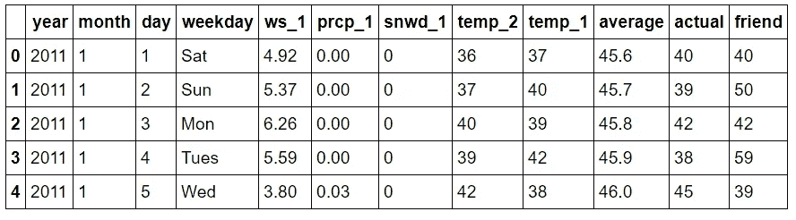
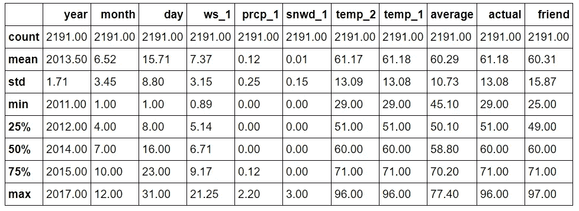
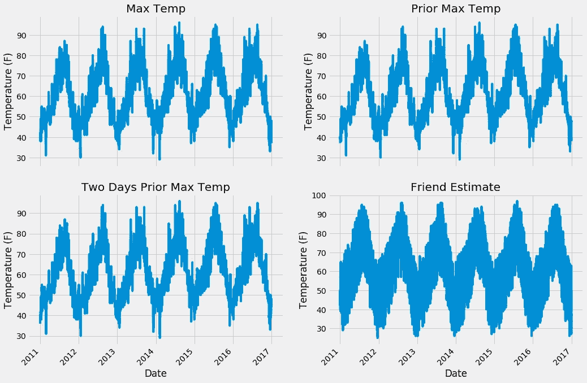
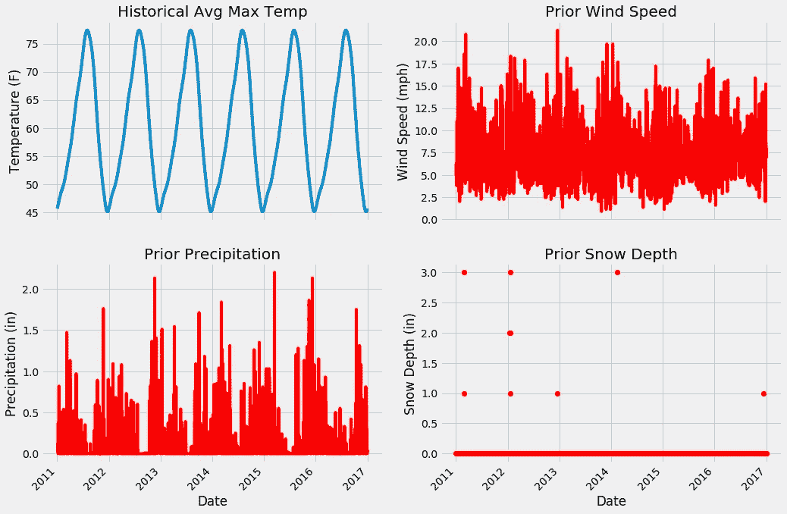
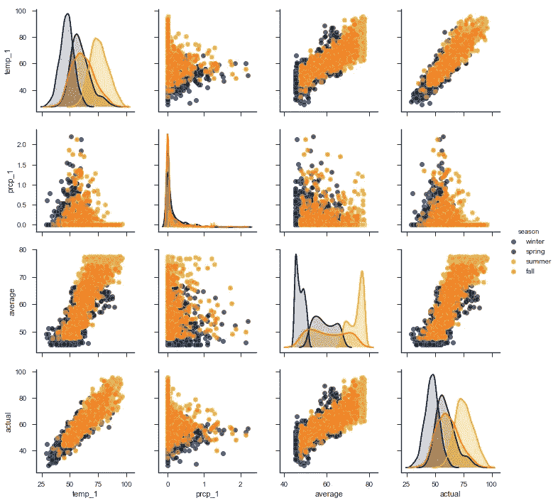
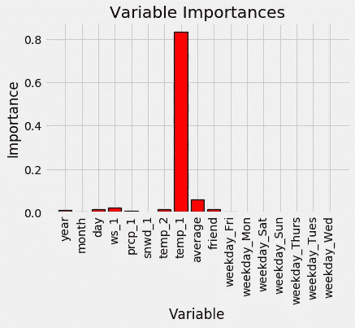
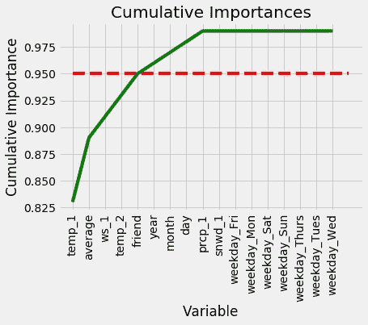
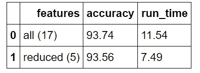
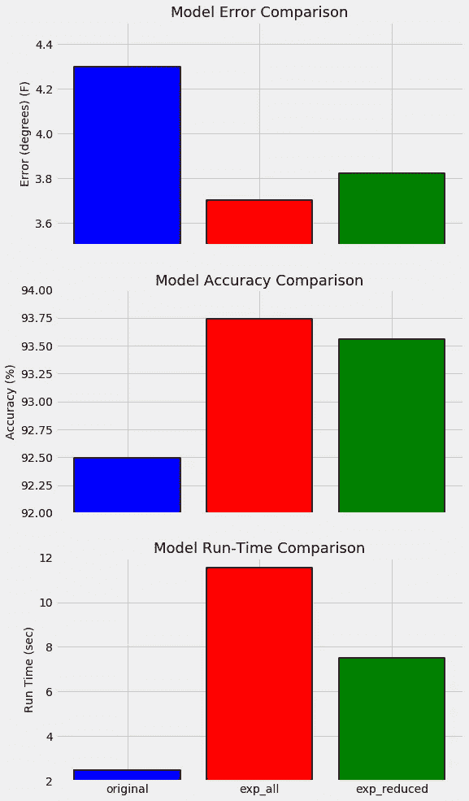

# 改进 Python 中的随机森林第 1 部分

> 原文：<https://towardsdatascience.com/improving-random-forest-in-python-part-1-893916666cd?source=collection_archive---------1----------------------->

## **收集更多数据和特征工程**


在[之前的帖子](https://medium.com/@williamkoehrsen/random-forest-in-python-24d0893d51c0)中，我们用 Python 实现了一个简单随机森林的端到端实现，解决了一个监督回归问题。虽然我们涵盖了机器学习过程的每个步骤，但我们只简要地触及了最关键的部分之一:改进我们最初的机器学习模型。我们完成的模型取得了不错的性能，超过了基线，但我们应该能够通过一些不同的方法来改进模型。本文是探索如何使用 Python 和 [Scikit-Learn 库](http://scikit-learn.org/)改进我们的随机森林机器学习模型的两篇文章中的第一篇。我建议在继续之前先看看这篇介绍性的文章，但是这里涉及的概念也可以独立存在。


# 如何改进机器学习模型

有三种改进现有机器学习模型的通用方法:

1.  使用更多(高质量)数据和特征工程
2.  调整算法的超参数
3.  尝试不同的算法

这些是按照我平时尝试的顺序来呈现的。通常，为改进不良模型而提出的直接解决方案是使用更复杂的模型，通常是深度神经网络。然而，我发现这种方法不可避免地会导致沮丧。一个复杂的模型需要花费很多时间来构建，但是也不能交付，导致了另一个模型的产生，等等。相反，我的第一个问题总是:“我们能获得更多与问题相关的数据吗？”。正如 Geoff Hinton(深度神经网络之父)在一篇名为[‘数据的不合理有效性’](https://static.googleusercontent.com/media/research.google.com/en//pubs/archive/35179.pdf)的文章中所指出的，对问题来说，有用数据的数量比模型的复杂性更重要。其他人[附和了这个观点](http://data-informed.com/why-more-data-and-simple-algorithms-beat-complex-analytics-models/)，即一个简单的模型和大量的数据将会击败一个数据有限的复杂模型。如果有更多的信息可以帮助解决我们没有使用的问题，从投入的时间和获得的性能来看，最好的回报就是获取这些数据。

这篇文章将介绍改进 ML 模型的第一种方法，第二种方法将出现在后续文章中。我还将编写几个算法的端到端实现，这些算法可能会也可能不会击败随机森林(如果对特定算法有任何要求，请在评论中告诉我)！这个例子的所有代码和数据都可以在项目 [GitHub 页面](https://github.com/WillKoehrsen/Data-Analysis/tree/master/random_forest_explained)找到。我在这篇文章中包含了大量代码，不是为了让不熟悉 Python 的人气馁，而是为了展示机器学习变得多么容易，并鼓励任何人开始实现这些有用的模型！

## **问题重述**

简单提醒一下，我们正在处理一个温度预测问题:给定历史数据，我们想预测我们城市明天的最高温度。我正在使用华盛顿州的西雅图，但也可以随意使用 [NOAA 气候数据在线工具](https://www.ncdc.noaa.gov/cdo-web/)来获取你所在城市的信息。这个任务是一个有监督的回归机器学习问题，因为我们有我们想要预测的标签(目标)，并且这些标签是连续的值(与无监督学习相反，在无监督学习中，我们没有标签，或者在分类中，我们预测离散的类)。我们在简单模型中使用的原始数据是 2016 年以来某一年的最高温度测量值以及历史平均最高温度。这得到了我们“有气象倾向”的朋友的预测的补充，这是通过从历史平均值中随机加减 20 度计算出来的。

我们使用原始数据的最终性能的平均误差为 3.83 度，而基线误差为 5.03 度。这表示最终准确率为 93.99%。

# 获取更多数据

在第一篇文章中，我们使用了 2016 年的一年历史数据。多亏了美国国家大气和海洋管理局，我们可以获得 1891 年的数据。现在，让我们把自己限制在六年内(2011-2016)，但可以随意使用额外的数据来看看是否有帮助。除了简单地获取更多年份的数据，我们还可以包含更多的特性。这意味着我们可以使用我们认为对预测最高温度有用的额外天气变量。我们可以使用我们的领域知识(或专家的建议)，以及变量和目标之间的相关性来确定哪些特性是有帮助的。从 NOAA 提供的过多选项中(说真的，我不得不称赞这个组织的工作和他们的开放数据政策)，我将平均风速、降水量和地面积雪深度添加到我们的变量列表中。请记住，因为我们预测的是明天的最高温度，所以我们实际上不能使用当天的测量值。我们必须将它转移到过去的某一天，这意味着我们使用今天的总降水量来预测明天的最高温度。这防止了我们通过今天拥有来自未来的信息来“欺骗”。

额外的数据直接来自源代码，状态相对较好，但是在将它读入 Python 之前，我确实需要做一些轻微的修改。我已经省略了“数据管理”的细节，将重点放在随机森林实现上，但是我将发布一个单独的帖子，展示如何清理数据。我在 munging 中使用了 [R 统计语言](https://www.r-project.org/)，因为我喜欢它使数据操作具有交互性的方式，但这将在另一篇文章中讨论。现在，我们可以加载数据并检查前几行。

```
# Pandas is used for data manipulation
import pandas as pd# Read in data as a dataframe
features = pd.read_csv('data/temps_extended.csv')
features.head(5)
```



Expanded Data Subset

新的变量是:

**ws_1** :前一天的平均风速(mph)

**prcp_1** :前一天的降水量(in)

**snwd_1** :前一天地面积雪深度(in)

在我们有 348 天的数据之前。现在来看看尺寸。

```
print('We have {} days of data with {} variables'.format(*features.shape))**We have 2191 days of data with 12 variables.**
```

现在有超过 2000 天的历史温度数据(约 6 年)。我们应该对数据进行汇总，以确保数字中没有突出的异常。

```
round(features.describe, 2)
```



Expanded Data Summary

从描述性统计数据来看，没有什么立即出现异常。我们可以快速绘制所有变量的图表来证实这一点。我省略了绘图代码，因为虽然 matplotlib 库非常有用，但代码不直观，很容易迷失在绘图的细节中。(所有代码都可以在 [GitHub](https://github.com/WillKoehrsen/Data-Analysis/tree/master/random_forest_explained) 上查看和修改)。

首先是四个温度图。



Expanded Data Temperature Plots

接下来，我们可以看看历史最高平均温度和三个新的变量。



Expanded Data Additional Variables

从数值和图形上看，我们的数据中没有明显的异常值。此外，我们可以检查这些图，看看哪些特性可能有用。我认为积雪深度是最没有帮助的，因为大部分时间积雪深度为零，同样，风速看起来也太嘈杂了，没有多大帮助。根据以往的经验，历史平均最高温度和以往最高温度可能是最重要的，但我们将不得不看到！

我们可以再画一个探索图，配对图，来形象化变量之间的关系。这在散点图中绘出了所有变量之间的相互关系，使我们能够检查特征之间的相关性。与上面的图表相比，这个令人印象深刻的情节的代码相当简单！

```
# Create columns of seasons for pair plotting colors
seasons = []for month in features['month']:
    if month in [1, 2, 12]:
        seasons.append('winter')
    elif month in [3, 4, 5]:
        seasons.append('spring')
    elif month in [6, 7, 8]:
        seasons.append('summer')
    elif month in [9, 10, 11]:
        seasons.append('fall')# Will only use six variables for plotting pairs
reduced_features = features[['temp_1', 'prcp_1', 'ws_1', 'average', 'friend', 'actual']]
reduced_features['season'] = seasons# Use seaborn for pair plots
import seaborn as sns
sns.set(style="ticks", color_codes=True);# Create a custom color palete
palette = sns.xkcd_palette(['dark blue', 'dark green', 'gold', 'orange'])# Make the pair plot with a some aesthetic changes
sns.pairplot(reduced_features, hue = 'season', diag_kind = 'kde', palette= palette, plot_kws=dict(alpha = 0.7),
                   diag_kws=dict(shade=True))
```



Pairplots

对角线图显示了每个变量的分布，因为每个变量相对于自身的图形将只是一条直线！这些颜色代表四季，如右边的图例所示。我们想要关注的是实际最高温度和其他变量之间的趋势。这些图在最下面一行，要查看与实际最大值的特定关系，请移至包含变量的行。例如，左下方的图显示了实际最高温度和前一天的最高温度(temp_1)之间的关系。这是一个[强正相关](http://www.statisticshowto.com/probability-and-statistics/correlation-coefficient-formula/)，表明前一天的最高气温升高，第二天的最高气温也升高

# 数据准备

这些数据已经在数字和图形上得到验证，现在我们需要将它转换成机器学习算法可以理解的格式。我们将执行与简单实现中完全相同的数据格式化过程:

1.  一键编码分类变量(星期几)
2.  将数据分为要素(独立变量)和标签(目标)
3.  将数据帧转换为 [Numpy 数组](https://docs.scipy.org/doc/numpy-dev/user/quickstart.html)
4.  创建要素和标注的随机训练和测试集

我们可以用几行 Python 代码完成所有这些步骤。

```
# One Hot Encoding
features = pd.get_dummies(features)# Extract features and labels
labels = features['actual']
features = features.drop('actual', axis = 1)# List of features for later use
feature_list = list(features.columns)# Convert to numpy arrays
import numpy as npfeatures = np.array(features)
labels = np.array(labels)# Training and Testing Sets
from sklearn.model_selection import train_test_splittrain_features, test_features, train_labels, test_labels = train_test_split(features, labels,                                          test_size = 0.25, random_state = 42)
```

我们设置了一个随机的种子(当然它必须是 [42](https://en.wikipedia.org/wiki/42_(number)#The_Hitchhiker's_Guide_to_the_Galaxy) )来确保不同运行的结果一致。让我们快速检查一下每个数组的大小，以确认一切正常。

```
print('Training Features Shape:', train_features.shape)
print('Training Labels Shape:', train_labels.shape)
print('Testing Features Shape:', test_features.shape)
print('Testing Labels Shape:', test_labels.shape)**Training Features Shape: (1643, 17)
Training Labels Shape: (1643,)
Testing Features Shape: (548, 17)
Testing Labels Shape: (548,)**
```

可以走了！我们有大约 4.5 年的训练数据和 1.5 年的测试数据。然而，在我们开始建模的有趣部分之前，还有一个额外的步骤。

## 建立新的基线

在之前的帖子中，我们使用历史平均最高温度作为我们要击败的目标。也就是我们把明天的最高气温作为当天的历史平均最高气温来评估预测的准确性。我们已经知道，即使是根据一年的数据训练的模型也可以超过基线，所以我们需要提高我们的预期。对于新的基线，我们将使用根据原始数据训练的模型。为了进行公平的比较，我们需要用新的、扩展的测试集来测试它。然而，新的测试集有 17 个特征，而原始模型只训练了 14 个特征。我们首先必须从测试集中删除 3 个新特性，然后评估原始模型。原始随机森林已经根据原始数据进行了训练，下面的代码显示了准备测试功能和评估性能(参考[笔记本](https://github.com/WillKoehrsen/Data-Analysis/blob/master/random_forest_explained/Improving%20Random%20Forest%20Part%201.ipynb)进行模型训练)。

```
# Find the original feature indices 
original_feature_indices = [feature_list.index(feature) for feature in feature_list if feature not in ['ws_1', 'prcp_1', 'snwd_1']]# Create a test set of the original features
original_test_features = test_features[:, original_feature_indices]# Make predictions on test data using the model trained on original data
predictions = rf.predict(original_test_features)# Performance metrics
errors = abs(predictions - test_labels)print('Metrics for Random Forest Trained on Original Data')
print('Average absolute error:', round(np.mean(errors), 2), 'degrees.')# Calculate mean absolute percentage error (MAPE)
mape = 100 * (errors / test_labels)# Calculate and display accuracy
accuracy = 100 - np.mean(mape)
print('Accuracy:', round(accuracy, 2), '%.')**Metrics for Random Forest Trained on Original Data
Average absolute error: 4.3 degrees.
Accuracy: 92.49 %.**
```

在一年的数据上训练的随机森林能够实现 4.3 度的平均绝对误差，表示在扩展的测试集上 92.49%的准确度。如果我们用扩展的训练集训练的模型不能击败这些指标，那么我们需要重新思考我们的方法。

# 扩展数据的训练和评估

Scikit-Learn 的伟大之处在于，可以用几行代码创建和训练许多最先进的模型。随机森林就是一个例子:

```
# Instantiate random forest and train on new features
from sklearn.ensemble import RandomForestRegressorrf_exp = RandomForestRegressor(n_estimators= 1000, random_state=100)
rf_exp.fit(train_features, train_labels)
```

现在，我们可以进行预测，并与已知的测试集目标进行比较，以确认或否认我们扩展的训练数据集是一项不错的投资:

```
# Make predictions on test data
predictions = rf_exp.predict(test_features)# Performance metrics
errors = abs(predictions - test_labels)print('Metrics for Random Forest Trained on Expanded Data')
print('Average absolute error:', round(np.mean(errors), 2), 'degrees.')# Calculate mean absolute percentage error (MAPE)
mape = np.mean(100 * (errors / test_labels))# Compare to baseline
improvement_baseline = 100 * abs(mape - baseline_mape) / baseline_mape
print('Improvement over baseline:', round(improvement_baseline, 2), '%.')# Calculate and display accuracy
accuracy = 100 - mape
print('Accuracy:', round(accuracy, 2), '%.')**Metrics for Random Forest Trained on Expanded Data
Average absolute error: 3.7039 degrees.
Improvement over baseline: 16.67 %.
Accuracy: 93.74 %.**
```

嗯，我们没有浪费时间去获取更多的数据！基于六年的历史测量值和使用三个附加特征的训练已经使我们在基线模型上获得了 16.41%的改进。确切的指标将根据随机种子而变化，但我们可以确信新模型优于旧模型。

为什么一个模型会随着更多的数据而改进？回答这个问题的最好方法是从人类如何学习的角度来思考。我们通过经验来增加我们对世界的了解，我们练习一项技能的次数越多，我们就会学得越好。机器学习模型也“从经验中学习”,因为每次它查看另一个训练数据点时，它都会学习更多关于特征和标签之间关系的信息。假设数据中存在关系，为模型提供更多数据将使其更好地理解如何将一组要素映射到标注。对于我们的例子，随着模型看到更多天的天气测量，它更好地理解如何进行这些测量并预测第二天的最高温度。实践提高了[人的能力](http://projects.ict.usc.edu/itw/gel/EricssonDeliberatePracticePR93.PDF)和机器学习模型的性能。

# 特征约简

在某些情况下，我们可能走得太远，实际上使用了太多的数据或添加了太多的功能。一个适用的例子是我目前正在研究的涉及建筑能源的机器学习预测问题。问题是根据天气数据预测 15 分钟内的建筑能耗。对于每栋建筑，我都有 1-3 年的历史天气和电力使用数据。令人惊讶的是，我发现随着我包含更多的一些建筑的数据，预测的准确性下降了。经过询问，我确定一些建筑在数据收集过程中进行了改造以提高能源效率，因此，最近的用电量与改造前有很大不同。在预测电流消耗时，使用修改前的数据实际上降低了我的模型的性能。变更后的最新数据比旧数据更相关，对于几栋建筑，我最终减少了历史数据的数量以提高性能！

对于我们的问题，数据的长度不是一个问题，因为在六年的数据中没有影响最高温度的重大变化(气候变化正在增加温度，但时间跨度更长)。然而，有可能我们有太多的功能。我们之前看到一些特征，特别是我们朋友的预测，看起来更像是噪音，而不是最高温度的准确预测。额外的功能可能会降低性能，因为它们可能会通过向模型提供不相关的数据来“混淆”模型，从而阻止模型学习实际的关系。[随机森林执行隐式特征选择](http://blog.datadive.net/selecting-good-features-part-iii-random-forests/)，因为它在最重要的变量上分割节点，但其他机器学习模型不这样做。因此，改进其他模型的一种方法是使用随机森林特征重要性来减少问题中的变量数量。在我们的例子中，我们将使用特征重要性来减少随机森林模型的特征数量，因为除了潜在的提高性能之外，[减少特征数量](https://en.wikipedia.org/wiki/Dimensionality_reduction)将会缩短模型的运行时间。本文不涉及更复杂的降维，如 PCA ( [主成分分析](http://www.cs.cmu.edu/~tom/10601_fall2012/slides/pca.pdf))或 ICA ( [独立成分分析](http://wwwf.imperial.ac.uk/~nsjones/TalkSlides/HyvarinenSlides.pdf))。这些在减少特征数量的同时不减少信息方面做得很好，但是它们转换了特征，使得它们不再代表我们测量的变量。我喜欢机器学习模型具有可解释性和准确性的混合，因此我通常坚持使用允许我理解模型如何进行预测的方法。

## 特征重要性

在 Scikit-Learn 中，查找随机森林的特征重要性很简单。重要性的实际计算超出了这篇博文的范围，但是这发生在后台，我们可以使用模型返回的相对百分比来对特性进行排序。

以下 Python 代码创建了一个由[元组](https://docs.python.org/3/tutorial/datastructures.html)组成的列表，其中每个元组都是一对(要素名称，重要性)。这里的代码利用了 Python 语言中一些巧妙的技巧，即[列表综合](https://www.python-course.eu/list_comprehension.php)、[压缩](https://www.bradmontgomery.net/blog/pythons-zip-map-and-lambda/)、[排序](https://docs.python.org/3/howto/sorting.html)，以及[参数解包](https://www.geeksforgeeks.org/packing-and-unpacking-arguments-in-python/)。如果你不完全理解这些，不要担心，但是如果你想熟练掌握 Python，这些是你应该有的工具！

```
# Get numerical feature importances
importances = list(rf_exp.feature_importances_)# List of tuples with variable and importance
feature_importances = [(feature, round(importance, 2)) for feature, importance in zip(feature_list, importances)]# Sort the feature importances by most important first
feature_importances = sorted(feature_importances, key = lambda x: x[1], reverse = True)# Print out the feature and importances 
[print('Variable: {:20} Importance: {}'.format(*pair)) for pair in feature_importances]Variable: temp_1               Importance: 0.83
Variable: average              Importance: 0.06
Variable: ws_1                 Importance: 0.02
Variable: temp_2               Importance: 0.02
Variable: friend               Importance: 0.02
Variable: year                 Importance: 0.01
Variable: month                Importance: 0.01
Variable: day                  Importance: 0.01
Variable: prcp_1               Importance: 0.01
Variable: snwd_1               Importance: 0.0
Variable: weekday_Fri          Importance: 0.0
Variable: weekday_Mon          Importance: 0.0
Variable: weekday_Sat          Importance: 0.0
Variable: weekday_Sun          Importance: 0.0
Variable: weekday_Thurs        Importance: 0.0
Variable: weekday_Tues         Importance: 0.0
Variable: weekday_Wed          Importance: 0.0
```

这些数据明确证明了一些变量比其他变量对我们的问题更重要！鉴于有如此多的变量的重要性为零(或由于舍入而接近零)，似乎我们应该能够在不影响性能的情况下去掉其中一些变量。首先，让我们制作一个图表来表示特征重要性的相对差异。我留下了这个绘图代码，因为它更容易理解。

```
# list of x locations for plotting
x_values = list(range(len(importances)))# Make a bar chart
plt.bar(x_values, importances, orientation = 'vertical', color = 'r', edgecolor = 'k', linewidth = 1.2)# Tick labels for x axis
plt.xticks(x_values, feature_list, rotation='vertical')# Axis labels and title
plt.ylabel('Importance'); plt.xlabel('Variable'); plt.title('Variable Importances');
```



Expanded Model Variable Importances

我们还可以制作一个累积重要性图，显示每个额外变量对整体重要性的贡献。虚线表示 95%的总重要性。

```
# List of features sorted from most to least important
sorted_importances = [importance[1] for importance in feature_importances]
sorted_features = [importance[0] for importance in feature_importances]# Cumulative importances
cumulative_importances = np.cumsum(sorted_importances)# Make a line graph
plt.plot(x_values, cumulative_importances, 'g-')# Draw line at 95% of importance retained
plt.hlines(y = 0.95, xmin=0, xmax=len(sorted_importances), color = 'r', linestyles = 'dashed')# Format x ticks and labels
plt.xticks(x_values, sorted_features, rotation = 'vertical')# Axis labels and title
plt.xlabel('Variable'); plt.ylabel('Cumulative Importance'); plt.title('Cumulative Importances');
```



Cumulative Feature Importances

我们现在可以用它来删除不重要的特征。95%是一个任意的阈值，但是如果它导致明显的低性能，我们可以调整这个值。首先，我们需要找到超过 95%重要性的特征的确切数量:

```
# Find number of features for cumulative importance of 95%
# Add 1 because Python is zero-indexed
print('Number of features for 95% importance:', np.where(cumulative_importances > 0.95)[0][0] + 1)**Number of features for 95% importance: 6**
```

然后，我们可以创建一个新的训练和测试集，只保留 6 个最重要的特性。

```
# Extract the names of the most important features
important_feature_names = [feature[0] for feature in feature_importances[0:5]]
# Find the columns of the most important features
important_indices = [feature_list.index(feature) for feature in important_feature_names]# Create training and testing sets with only the important features
important_train_features = train_features[:, important_indices]
important_test_features = test_features[:, important_indices]# Sanity check on operations
print('Important train features shape:', important_train_features.shape)
print('Important test features shape:', important_test_features.shape)**Important train features shape: (1643, 6)
Important test features shape: (548, 6)**
```

我们将特性的数量从 17 个减少到 6 个(尽管公平地说，其中 7 个特性是从一周中的某一天的一次性编码中创建的，所以我们实际上只有 11 条唯一的信息)。希望这不会显著降低模型的准确性，并将大大减少训练时间。

## 重要特性的培训和评估

现在，我们进行与所有功能相同的训练和测试程序，并评估准确性。

```
# Train the expanded model on only the important features
rf_exp.fit(important_train_features, train_labels);# Make predictions on test data
predictions = rf_exp.predict(important_test_features)# Performance metrics
errors = abs(predictions - test_labels)print('Average absolute error:', round(np.mean(errors), 2), 'degrees.')# Calculate mean absolute percentage error (MAPE)
mape = 100 * (errors / test_labels)# Calculate and display accuracy
accuracy = 100 - np.mean(mape)
print('Accuracy:', round(accuracy, 2), '%.')**Average absolute error: 3.821 degrees.
Accuracy: 93.56 %.**
```

仅使用 6 个特征，性能遭受 0.12 度平均误差的微小增加。通常，随着功能的减少，性能会略有下降，这必须与运行时间的减少相权衡。机器学习是一个进行权衡的游戏，运行时间与性能通常是关键决策之一。我将很快做一些基准测试来比较这两个模型的相对运行时间(代码见 Jupyter Notebook)。



Model Tradeoffs

总体而言，缩减特征模型的相对精度降低了 **0.131%** ，相对运行时间降低了 **35.1%** 。在我们的例子中，运行时是无关紧要的，因为数据集很小，但是在生产环境中，这种权衡可能是值得的。

# 结论

我们没有开发更复杂的模型来改进我们的随机森林，而是采取了收集更多数据点和附加特征的明智步骤。这种方法得到了验证，因为与基于有限数据训练的模型相比，我们能够将的误差降低 16.7%。此外，通过将特征的数量从 17 个减少到 6 个，我们将运行时间减少了 35%,而准确性仅略有下降。总结这些改进的最好方法是用另一个图表。根据一年的训练数据训练的模型在左侧，使用六年的数据和所有特征的模型在中间，而右侧的模型使用六年的数据，但只是最重要特征的子集。



Model Comparisons

这个例子展示了增加数据量的有效性。虽然大多数人犯了立即转向更强大的模型的错误，但我们已经认识到，大多数问题可以通过收集更多相关数据点来改善。在本系列的后续部分中，我们将研究改进模型的其他方法，即超参数调整和使用不同的算法。然而，在这种情况下，获得更多的数据可能会在投入的时间和提高的性能方面获得最大的回报。下次你看到有人在第一个模型失败后急于实现复杂的深度学习模型，礼貌地问他们是否已经用尽了所有的数据来源。机会是，如果仍然有与他们的问题相关的数据，他们可以获得更好的性能并在这个过程中节省时间！

一如既往，我感谢任何意见和建设性的反馈。可以在 wjk68@case.edu 找到我