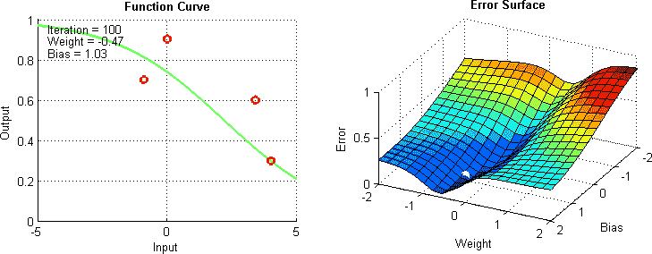
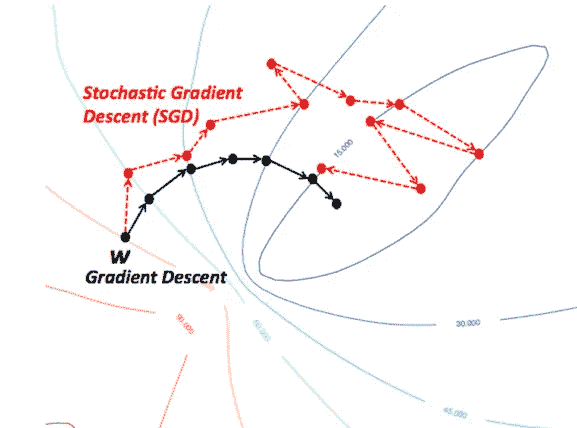
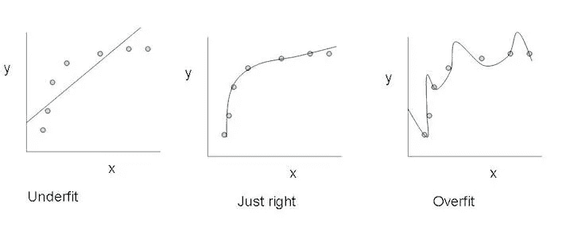
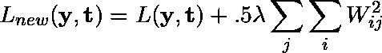
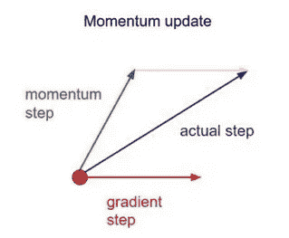
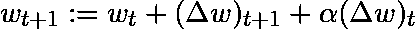
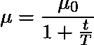
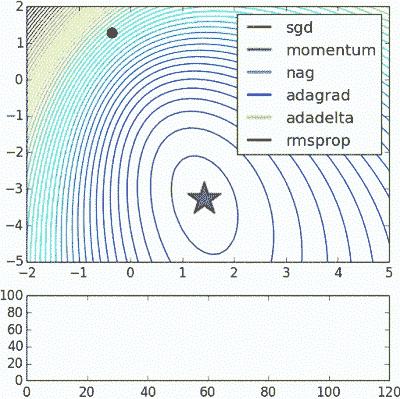

# 改进香草梯度下降

> 原文：<https://towardsdatascience.com/improving-vanilla-gradient-descent-f9d91031ab1d?source=collection_archive---------2----------------------->

## 应用于训练神经网络的性能改进

## **简介**

当我们使用梯度下降来训练神经网络时，我们会冒着网络陷入局部最小值的风险，在这种情况下，网络会停止在误差曲面上的某个位置，而该位置不是整个曲面上的最低点。这是因为误差曲面不是固有凸的，所以曲面可能包含许多独立于全局最小值的独立局部最小值。此外，虽然网络可能达到全局最小值并收敛到训练数据的期望点，但是不能保证它将如何很好地概括它所学习的内容。这意味着它们容易在训练数据上过度拟合。

为了帮助减轻这些问题，我们可以使用一些东西，尽管没有办法明确地防止它们发生，因为这些网络的误差表面往往很难遍历，并且神经网络作为一个整体很难解释。

## 随机和小批量随机梯度下降

标准梯度下降算法的这些修改为算法的每次迭代使用训练数据的子集。SGD 将在每次权重更新时使用一个样本，小批量 SGD 将使用预定义的数量(通常比训练样本的总数小得多)。这使得训练进行得更快，因为它需要更少的计算，因为我们在每次迭代中不使用整个数据集。这也有望带来更好的性能，因为网络在训练期间的剧烈运动应该允许它更好地避免局部最小值，并且只使用数据集的一小部分应该有助于防止过度拟合。

## 正规化

一般而言，正则化是一种通过向表示模型复杂性的损失函数添加一项来惩罚模型复杂性的机制。在神经网络的情况下，它惩罚大的权重，这可能指示网络已经过度适应训练数据。

使用 L2 正则化，我们可以将损失函数重写如下，将网络的原始损失函数表示为 **L(y，t)** ，正则化常数表示为 **λ** :

正则化将网络中每个权重的平方和添加到损失函数中，惩罚模型对任何一个连接赋予过多的权重，并有望减少过度拟合。

## 动力

简单地说，动量将过去权重更新的一部分添加到当前权重更新中。这有助于防止模型陷入局部最小值，因为即使当前梯度为 0，过去的梯度很可能不是，所以它很容易陷入。通过使用动量，沿着误差表面的运动通常也更平滑，并且网络可以更快地穿过误差表面。

对于简单动量，我们可以将权重更新方程重写如下，将 **α** 表示为动量因子:

也有其他更高级的动量形式，比如 T2 内斯特罗夫方法 T3。

## 学习速率退火

我们可以调整学习速度，让它随着时间的推移而下降，而不是在整个训练过程中使用一个恒定的学习速度。

最常见的调度具有如下的 **1/t** 关系，其中 **T** 和 **μ_0** 被提供超参数，并且 **μ** 是当前学习率:

这通常被称为“搜索然后收敛”退火时间表，因为直到 **t** 到达 **T** ，网络处于“搜索”阶段，并且学习速率没有降低太多，之后，学习速率变慢，网络到达“收敛”阶段。这大致与*开发*和*探索*之间的平衡有关。开始时，我们优先探索搜索空间并扩展我们对该空间的整体知识，随着时间的推移，我们过渡到利用我们已经发现的搜索空间中的好区域，并缩小到特定的最小值。

## 结论

这些是改进标准梯度下降算法的一些方法。当然，这些方法中的每一种都会向您的模型添加超参数，因此会增加调整网络所花费的时间。最近，更新的算法如**亚当**、**阿达格拉德**、**、和**阿达德尔塔**如雨后春笋般涌现，它们使用了其中一些技术以及许多其他技术。他们倾向于在每个参数的基础上优化，而不是全局优化，因此他们可以根据个人情况微调学习速度。他们在实践中往往工作得更快更好；然而，要正确实施它们要困难得多。下图说明了同时工作的上述每个梯度下降变化。观察到更复杂的版本比简单的动量或 SGD 版本收敛得更快。**

