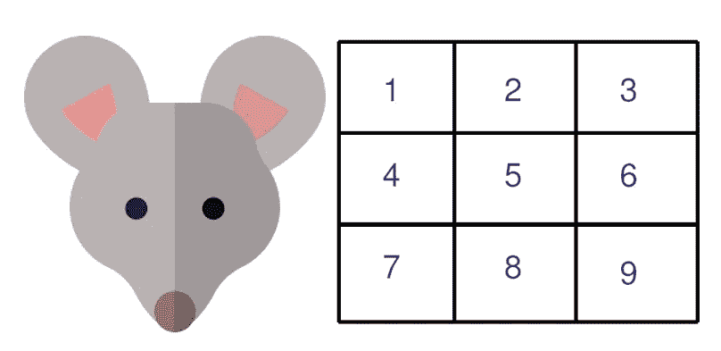
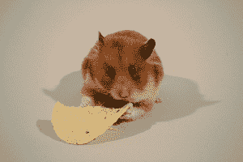
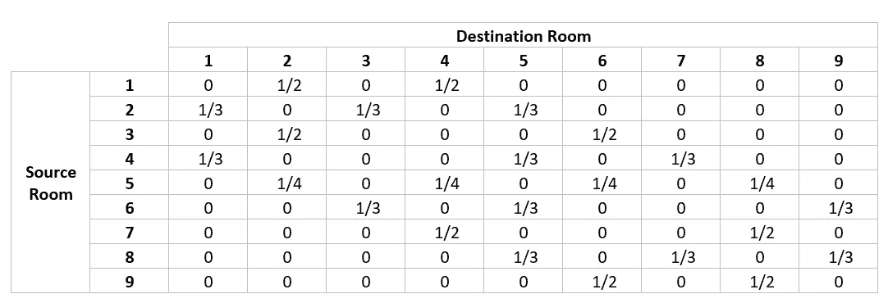

# 马尔可夫鼠

> 原文：<https://towardsdatascience.com/in-5-mins-the-markov-mouse-a4f7a38289fb?source=collection_archive---------1----------------------->

**什么是马尔可夫链？**

马尔可夫链是一种描述一系列可能事件的模型，其中每个事件的概率仅取决于前一个事件达到的状态，即如果我们可以仅根据流程的当前状态对其未来进行预测，就像了解流程的完整历史一样，那么该流程被称为“马尔可夫流程”。让我们带着一个问题直接进入它。

**问题**:

让我们模拟一只老鼠在迷宫里走来走去。迷宫是一个包含九个房间的封闭空间，房间之间有门道相连。

**THE MOUSE AND THE MAZE**

Mouse snacking before entering the maze !

有通向相邻房间的门，即有门:

从 1 到 2 *，* 4

从 2 到 1 *、* 3 *、* 5

从 3 到 2 *，* 6

从 4 到 1 *、* 5 *、* 7

从 5 到 2 *、* 4 *、* 6 *、* 8

从 6 到 3 *、* 5 *、* 9

从 7 到 4 *，* 8

从 8 到 5 *、* 7 *、* 9

从 9 到 6.8

我们假设鼠标是“马尔可夫鼠标”，即鼠标随机地从一个房间移动到另一个房间，其中鼠标到达下一个房间的概率仅取决于它当前所在的房间，而不取决于它如何到达当前房间。

下面是我们可以用提供的信息创建的转移概率数据，称为转移矩阵:

Transition Matrix

它为我们提供了鼠标从源房间到目的房间的概率。例如，如果鼠标出现在房间 1，它可以以 1/2 的概率去房间 2，或者它可以以 1/2 的概率去房间 4。同样，如果老鼠在 2 号房间，它可以去 1 号、3 号或 5 号房间——每个房间都有 1/3 的概率。

**符号:**

转移矩阵用 P 表示。左上角的矩阵元素用 P(1，1)表示，而右下角的矩阵元素是 P(9，9)。示例:

P(1，1) =鼠标从房间 1 移动到房间 1 的概率= 0

P(1，2) =老鼠从房间 1 移动到房间 2 的概率= 1/2

P(3，6) =老鼠从房间 3 移动到房间 6 的概率= 1/2

> **重申马尔可夫性质，P(2，3)是假设鼠标从状态 2 开始，鼠标下一步到状态 3 的概率。马尔可夫性意味着概率不依赖于早期的历史。**

现在我们已经对流程进行了建模，让我们来看看两个有趣的问题:

**问题 1**

鼠标从 1 号房间出发，经过两次跃迁到达 6 号房间的概率是多少？

**解决方案 1**

让我们从直觉开始这个问题——在第一次转换中，鼠标可以从状态 1 进入状态 2 或 4。

如果鼠标进入状态 2，那么在第二次转换中，它只能进入状态 3、4 或 5。

如果鼠标进入状态 4，那么在第二次转换中，它只能进入房间 4、5 或 7。

因此，鼠标不可能在两次转换中从房间 1 到达房间 6。老鼠从 1 号房间出发到达 6 号房间的概率为 0。

**问题二**

鼠标从 2 号房间出发，在两次转场中再次到达 2 号房间的概率是多少？

**方案二**

从房间 2 开始，鼠标可以通过以下方式再次到达房间 2:

一、 **2 →1 → 2**

→概率= P(2，1)*P(1，2) = 1/3 * 1/2 = 1/6

二。 **2 → 3 → 2**

→概率= P(2，3)*P(3，2) = 1/3 * 1/2 = 1/6

三。 **2 →5 →2**

→概率= P(2，5)*P(5，2) = 1/3 * 1/4 = 1/12

将所有的个体概率相加，我们得到 1/6 + 1/6 + 1/12 = 5/12。因此，如果鼠标从房间 2 开始，它可以以 5/12 = **0.4167 的概率在两次转换中再次到达状态 2。**

解决上述两个问题的另一种方法是矩阵乘法。如果我们将转移矩阵提升到 2 的幂(P ),我们将得到转移矩阵或鼠标在两次转移中从任何其他房间到达任何房间的概率。**下面是 P 矩阵。**

P² Matrix

从上面的矩阵我们可以看到，在两个跃迁中 **P(2，2) = 0.4167** 和 **P(1，6) = 0** ，和我们上面计算的一样。

这是理解马尔可夫链的一个很好的起点，当我们更进一步时，我们可以回答更有趣的问题，例如:

如果从 1 号房间开始，老鼠会在每个房间呆多长时间(持续时间的百分比)？

如果有无限个跃迁，我们会达到稳态吗，它会是什么样子？

从一个特定的房间开始，在 100 次转换中，鼠标最有可能出现在哪里？

**————****—————**

在 [LinkedIn](https://www.linkedin.com/in/rohan-joseph-b39a86aa/) 上连接

资料来源:http://www.columbia.edu/~ww2040/4701Sum07/MarkovMouse.pdf