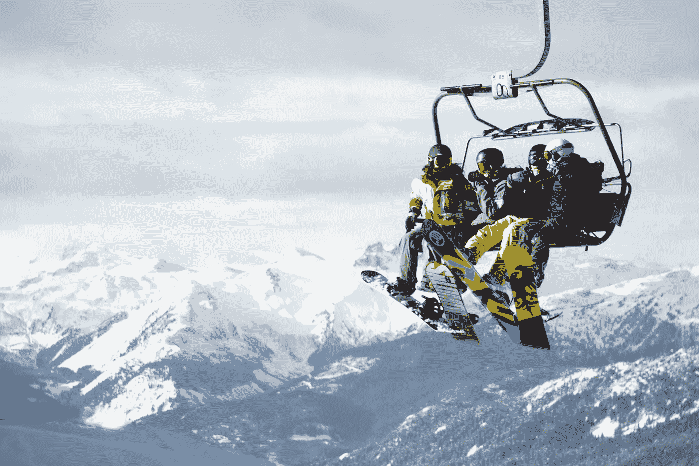
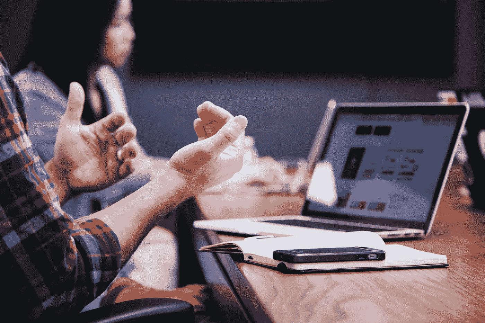

# 在一场人工智能与内容营销者的对决中，谁将赢得未来？

> 原文：<https://towardsdatascience.com/in-a-ai-vs-content-marketer-showdown-who-will-win-the-future-22b737213868?source=collection_archive---------11----------------------->

Photo by [Pamela Saunders](https://unsplash.com/photos/yV8hguKKMq0?utm_source=unsplash&utm_medium=referral&utm_content=creditCopyText) on [Unsplash](https://unsplash.com/search/photos/ski-lift?utm_source=unsplash&utm_medium=referral&utm_content=creditCopyText)

2017 年 6 月底，1300 名[行动号召会议](https://calltoactionconference.unbounce.com/)与会者聚集在加拿大温哥华，与 Unbounce 的人工智能机器正面交锋，看谁能最好地预测登陆页面的性能。参与者将查看 Unbounce 的 204 个登录页面中的一个，分析该副本，并确定哪个将获得高于平均水平的转化率。与此同时，Unbounce 的算法也被设置为做同样的事情。

在 17，000 名参与者输入后，结果被记录下来。Unbounce 的人工智能(AI)算法在 80%的情况下正确预测了高于平均水平的转化率，而参与者的平均正确预测率为 50%。

问题是，在这些与会者中，有一些世界上最聪明的营销专家，他们来自顶级公司，如 Adobe、Mirum，甚至 Unbounce 自己的 Oli Gardner。CTA 会议发言人 Joel Klettke 的专长是转换文案，他获得了 57%的正确预测率(以人类标准衡量，这是一个令人印象深刻的成绩)，远远低于算法的成功率。他们每个人都被耍了。Unbounce 的[下一个前沿](https://www.straight.com/life/933766/machine-learning-could-soon-determine-everything-about-creating-webpages-says-unbounce):使用机器视觉创建一个类似的算法来预测网站设计转化率。

尽管如此，其他品牌也在创造类似的算法来预测图像转换率。Visit Utah 的营销团队与 Cortex 合作，Cortex 是一种人工智能算法，可以对图像元素进行评级，以发现哪些元素可以在目标受众之前产生更大的参与度。当该品牌需要吸引寻求滑雪体验的游客时，该算法通过咨询犹他州的营销人员，告诉他们滑雪者更喜欢只有一个人的场景、干净的雪道、蓝天和松树，帮助[将转化率提高了 23%](https://www.meetcortex.com/visit-utah-case-study) 。

**AI 算法比人更会营销吗？那么，这给创意内容营销者留下了什么？AI 能在多大程度上比创意营销人员更好地完成内容营销工作？虽然不总是在摊牌活动中，但 Unbounce 和 Cortex 并不是唯一一个让创意营销人员与人工智能算法对抗，看谁能更好地完成设计或文案工作的公司。让我们来看看其中的一些，以确定创意营销人员在人与机器的世界中所处的位置。**

**让我们看看文案如何对抗人工智能……** 在[最近的一项研究](http://www.tandfonline.com/doi/pdf/10.1080/17512786.2014.883116)中，焦点小组被要求给几份文案打分。参与者不知道的是，有些是由人工智能生成的，有些是由人类撰稿人生成的。最终，机器生成的内容在客观性和可信度方面表现良好，但在参与度方面表现不佳——易读、有趣、写得好、连贯和清晰。

尽管如此，Gartner 预计 2018 年总业务内容的 20%将由机器生成。然而，“商业内容”和“营销文案”之间的差异，为人工智能何时应该用于内容创作和机器生成内容的总体目的提供了关键的见解。

“人工智能驱动的内容生成可以为金融机构生成详细的报告，处理海量数据，并将其转化为逻辑清晰的文本。但是，如果你要求它写一个新鲜的、引人注目的故事，抓住读者的想象力，它将会悲惨地失败，“ [Bill Zeintek](https://www.linkedin.com/in/bill-zientek/) SEO 专家，搜索引擎优化专家，以及拥有[深厚足迹](https://www.deepfootprint.com/)的数字营销策略师说。

用于报告目的的文本，例如业绩报告和股票交易摘要，其中“值得信赖”和“客观”等指标是关键，如果是机器制作的，会做得很好。[自动化生产](https://blog.workfusion.com/you-asked-we-answered-top-5-questions-on-combining-rpa-and-ai-fc54ad651d6c)流程意味着文案人员消除或减少耗时的收集、编译、标准化、清理和汇总大数据的手动流程。

但是，旨在吸引受众的营销应该写得很好，清晰，有趣，易读——换句话说，它需要人性。

Photo by [Headway](https://unsplash.com/photos/5QgIuuBxKwM?utm_source=unsplash&utm_medium=referral&utm_content=creditCopyText) on [Unsplash](https://unsplash.com/collections/1804779/teaching-and-learning?utm_source=unsplash&utm_medium=referral&utm_content=creditCopyText)

**也许人工智能驱动的内容设计会更好……** 这是 Grid.io 的首个营销视频[中的脚本](https://twitter.com/thegrid/status/525744028239659008):“你的网站应该反映你是谁。而且做起来应该很好看。当然，你可以自己造一个。但是设计、开发、拖放……如果你能做你关心的事情，让其他事情……发生，不是更好吗？网站直接自己做不是更好吗？这就是所谓的网格。”

该品牌声称，使用一个名为 Molly 的人工智能机器人，她可以创建个性化的高质量网站，而你则可以运营你的业务。只需选择调色板或上传品牌标志，Molly 就能为您的企业打造完美的数字家庭，既能反映您的产品，也能反映其团队。听起来好得难以置信？确实是。

最终，它的局限性让许多用户希望得到更多。测试用户[认为](https://www.cmswire.com/digital-experience/the-grid-ai-powered-website-builder-doesnt-check-enough-boxes/)它需要一个更加个性化的展示来区分它，从而吸引访问者，并且它作为一个作品集而不是一个品牌网站。用户开始设计[论坛](https://www.reddit.com/r/web_design/comments/49djg6/finally_got_to_see_thegridio_sites_i_think_your/)来展示他们的发现:“终于看到 grid.io 网站了。我认为你们的工作是安全的。”

尽管如此，人工智能在支持图形和网页设计师方面取得了长足的进步。Adobe Sensei 在 Adobe Summit 2017 上首次亮相了他们新的人工智能设计功能，并展示了其尖端的图形设计和网页设计功能的原型。

虽然它不能为你做所有的图形设计，但它做了一些令人印象深刻的工作，包括基于图像和图像组件识别的自动照片裁剪，基于设计师图像数据库的元素推荐；图像元素交换；消除难看的图像成分；以及设计建议，如布局、颜色和照片尺寸。

虽然它不会从头开始想象和创建界面或用户体验设计，但它将通过确定哪些照片和副本可能会吸引一小部分用户来支持内容个性化，并实时将它们替换为自定义演示。

结果:“人类增强设计”[说](https://www.fastcodesign.com/3068884/adobe-is-building-an-ai-to-automate-web-design-should-you-worry) Cedric Huesler，Adobe 营销云的主管，他参与了原型的工作。

尽管最初有些不信任，但有创意的营销人员从人工智能那里获得一些帮助是安全的。
Jesus Ramirez，Adobe 制作杰作项目的参与者，[解释了人工智能](https://theblog.adobe.com/machine-learning-comes-to-life/)对创意营销人员的作用:“当相机被发明出来时，人们认为我们不再需要画家了。对于人工智能，我想有些人会有这样的印象，即计算机将完成所有的工作，但归根结底，它只是另一种工具。”

“只是另一个工具，”的确。像 Unbounce 和 Adobe 这样的案例研究表明，尽管有参与限制，创意内容营销人员仍然可以依靠人工智能来增强自己的优势。波长分析和数据分析师的创始人 Natalie Robb 认为，人工智能将最好地帮助内容营销者创造更好的内容，并更有效地使用这些内容。

她表示:“内容营销人员将不再面临一些手工劳动。”。手工劳动，如裁剪图像、交换元素、总结某个主题的主导思想、综合数据、预测副本的转换率；在内容颜色、布局或图像之间进行选择；还有更多。

那么，创意营销人员该何去何从？娜塔莉总结道:“内容营销者必须与技术一起发展，成为数据和通信的大师，但他们不会被取代。”需要人类的创造力来制作有趣的、精心制作的、连贯的、整体吸引人的内容，以供目标受众消费。