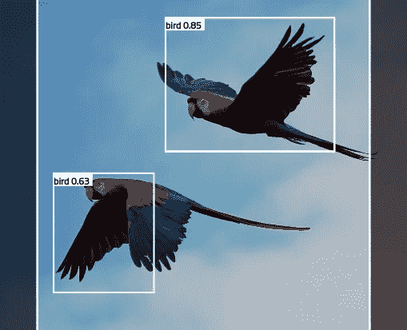
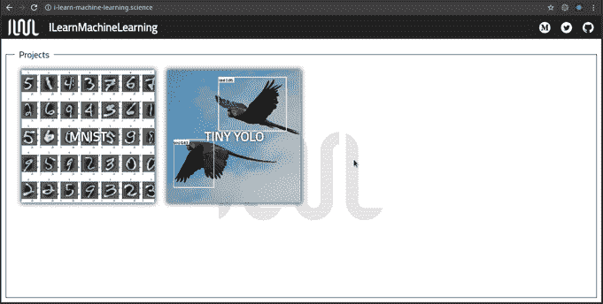
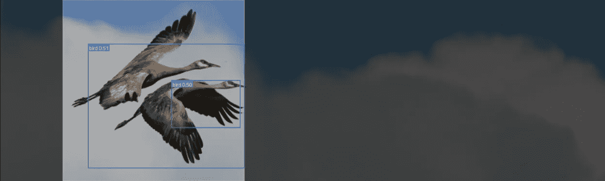
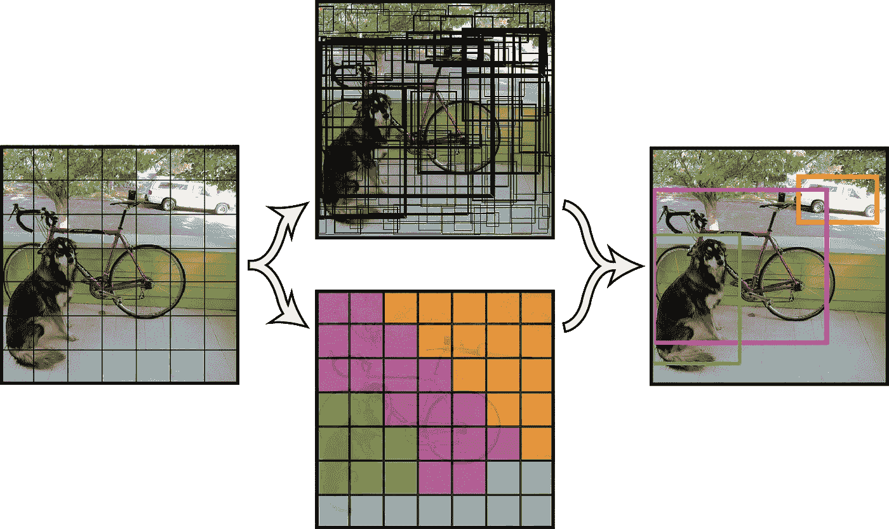
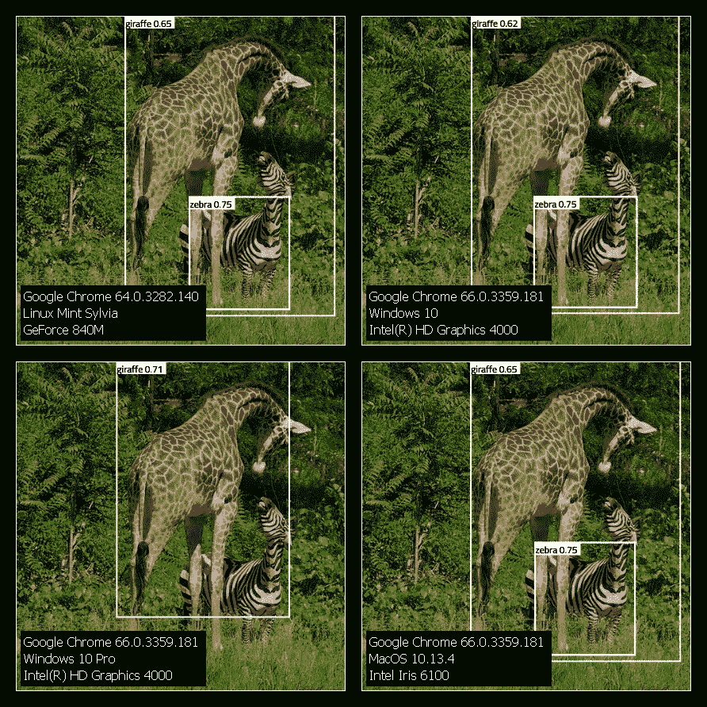

# 使用 YOLO 和 TensorFlow.js 的浏览器内对象检测

> 原文：<https://towardsdatascience.com/in-browser-object-detection-using-yolo-and-tensorflow-js-d2a2b7429f7c?source=collection_archive---------3----------------------->

[Original image](https://pixabay.com/en/parrots-parrot-pair-flying-red-1612070/)

前一段时间，我花了几个晚上玩最先进的物体检测模型 YOLO，这对那些每天对机器学习感兴趣的人来说肯定是已知的。最初写于[Darknet](https://github.com/pjreddie/darknet)——开源神经网络框架——YOLO 在定位和识别图片上的物体的任务中表现非常好。由于我对 TensorFlow.js 感兴趣已经有几个星期了，我决定看看 YOLO 将如何处理浏览器内计算的局限性。完整的源代码以及我以前的 TF.js 项目可以在 [GitHub](https://github.com/SkalskiP/ILearnMachineLearning.js) 上找到。如果你想玩演示版，请访问“我学习机器学习”项目[网站](http://i-learn-machine-learning.science/)。

> **注:**我还推荐阅读最近出现在《走向数据科学》上的一篇[文章](/deep-learning-in-your-browser-a-brisk-guide-ca06c2198846)，这是我这个项目的起点。我将尽量不重复其中包含的信息，而是拓宽其中提出的主题，并希望用我的经验丰富它。

# 老枪暂时…

几个月前,《YOLO》第三版发布了。我有机会用 Python 测试它的功能，我非常希望能在我的小项目中使用它。在花了两天时间浏览了各种存储库、论坛和文档之后，结果发现现在还不可能这样做。如前所述，要在 TensorFlow.js 项目中使用原始 YOLO 模型，您必须首先进行两步转换。第一步将我们从 Darknet 带到 TensorFlow / Keras，第二步将我们的模型转换成 TensorFlow.js 可以理解的形式。不幸的是，由于 YOLOv3 在其架构中引入了新的层，并且像 [Darkflow](https://github.com/thtrieu/darkflow) 或 [YAD2K](https://github.com/allanzelener/YAD2K) 这样最受欢迎的工具都不支持它们向 TensorFlow 的转换，我们现在必须坚持使用旧的工具。将来，我肯定会回来把 v2 换成新的型号。

# 让我们把手弄脏吧

将模型与我们的应用程序连接起来的过程是非常标准的，在本系列的第一篇[文章](https://medium.com/@piotr.skalski92/my-first-tensorflow-js-project-b481bdad17fb)中已经详细描述过了。然而这一次，有更多的脏活等着我们，主要涉及预测前后的数据处理。

F 首先，我们的模型必须要有一个适当维数的张量——确切地说是——【1，416，416，1】。通常情况下，这些值与训练图像的尺寸和批量大小有关。这种方形输入是有问题的，因为通常图片不会以这种方式裁剪。剪切图像以满足上述条件，会带来丢失有价值的数据的风险，这可能导致对图片中的对象的错误识别。为了限制这种不良影响，我们使用流行的 [smartcrop](https://github.com/jwagner/smartcrop.js/) 库，它通过选择最有趣的片段来框住照片。下图是上述机制的一个很好的例子，也是一个成功的预测，如果没有这个技巧可能会失败。最后，我们归一化每个像素的值，使它们在 0 和 1 之间。最后一点对我来说特别重要，因为我花了将近两个小时寻找导致我的模型性能如此糟糕的 bug。迟到总比不到好…

[Original image](https://www.nps.gov/dena/learn/nature/denali-bird-species.htm)

作为每次预测的结果，模型返回具有相当奇怪维度的张量[1，13，13，425]。这些谜一样的数字在这篇文章中被有效地揭露出来，这篇文章完美地解释了在 YOLO 的引擎盖下正在发生的事情。我把它推荐给任何想理解这个美丽算法的人。我们现在的任务是将这个张量转换成图片中物体周围整齐的矩形。这一步非常广泛，很容易成为另一篇文章的主题。在不涉及太多细节的情况下，我要说的是，我们将使用诸如交集超过并集和非最大值抑制之类的技术来去除不太可能的结果，并将剩余的具有高概率的矩形聚集到检测到的对象的边界框中。我建议查看包含这些计算的[源代码](https://github.com/SkalskiP/ILearnMachineLearning.js/blob/master/src/components/modelViews/ImageLoader.tsx)。

[Original image](https://github.com/pjreddie/darknet/wiki/YOLO:-Real-Time-Object-Detection)

# 不同设备之间的不一致性

在完成了 alpha 版本的工作后，我决定在我的朋友面前展示我的新玩具。通过这种方式，我非常意外地发现，该模型在不同的设备上可以表现得非常不同。检测到的对象的类别不会改变，但是它们的概率值可以改变几十个百分点。在下面显示的模型中，阈值被设置为 0.5。这意味着所有概率较低的对象都将被过滤掉。这就是左下方图片中斑马的命运，它的概率下降了 25%以上。TensorFlow.js 仍然是一个年轻的库，正在与某些问题作斗争——目前有[几个问题](https://github.com/tensorflow/tfjs/issues)与他们的 GitHub 上的不一致性有关。显然，在每台设备上进行完全相同的计算并不容易。我为 TensorFlow.js 团队祈祷，希望他们能解决所有这些问题。

[Original image](https://github.com/pjreddie/darknet/blob/master/data/giraffe.jpg)

# 速度杀人

F 最后，我想就 web 编程的一个重要方面(尽管经常被忽视)写几句话，那就是应用程序的速度。将 YOLO 转换成 TF.js 可以理解的形式后，创建了 20 多个文件，总共大约 45 MB。在缓慢的 3G 连接上加载如此大量的数据需要近乎神圣的耐心。如果我们决定在生产中使用这种类型的解决方案，这当然值得注意。

# 寥寥数语

TensorFlow.js 仍然非常年轻，但它给了我们开发人员和日期科学家惊人的可能性。你应该知道我提到的某些限制，但是给 TF.js 一个机会是值得的，因为在我看来，它的真正能力还没有被开发。