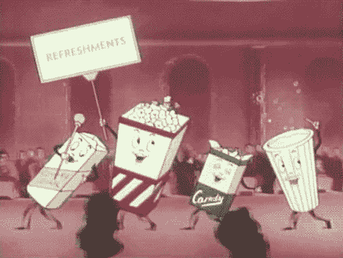
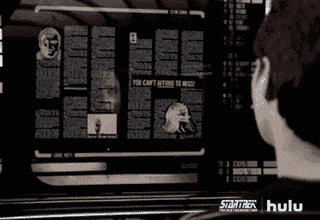
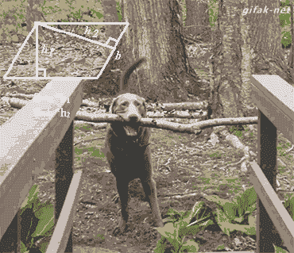

# 捍卫简单，数据可视化之旅

> 原文：<https://towardsdatascience.com/in-defense-of-simplicity-a-data-visualization-journey-86676bd05c57?source=collection_archive---------2----------------------->

我职业生涯的最后 8-9 年一直专注于[数据可视化](http://bocoup.com/datavis)，这给了我足够的时间来发展我在这个领域的一两个理念。我说两个，但我真正指的是大约六个半心烦意乱的职业危机产生时刻(持续几周或几个月)，询问我想从这个领域中得到什么，我正在做的事情是否是“正确的事情”，以及我是否应该做其他事情。

鉴于 Elijah Meeks 关于[为什么](https://t.co/ynoFnFjquL) [数据可视化从业者正在离职](https://t.co/ynoFnFjquL)的深思熟虑的文章，我认为分享我的道路可能是值得的，因为我所坚持的哲学(在这篇文章的标题中巧妙地掩饰为“简单”)是我多年来感觉最好的哲学。

## **觉醒**

Always be learning ([source](http://giphy.com/gifs/bored-sleepy-boring-LTYT5GTIiAMBa/download))

首先认识到数据可视化是一个领域。这看起来很令人惊讶，但是我们并不是生来就有这种知识，也没有人在我没有问的情况下教给我这方面的知识。接下来的几年只是努力跟上。学习数学，学习不同类型的可视化等等。我没有自己的声音，我真的只是试图弄清楚什么是什么，如何建立它，如何做好工作。我做了很多坏事。很多原型都被扔掉了，我真的很伤心，因为我还不知道如何在这个领域评价“好”。这也是一段时间以前的事了，所以例子的基数要小得多。我选择阿曼达·考克斯作为我职业生涯中的英雄，并继续前进。

## **想成为数据艺术家的人**

The struggle is real ([source](http://giphy.com/gifs/5rasSbRlAtxBe/download))

选择一群才华横溢的人作为我的榜样，既鼓舞人心，同时又令人沮丧。我刚刚了解了如何做这些事情，而这些人在提出表达数据的创造性方法方面比我强得多，比如 T2。我刚刚开始能够选择正确的方法并建立它们。我涉足了一些兼职项目，试图做出一些创造性的数据解释，从没有真正展示任何东西的数据中制作东西，只是总体上推动自己尝试将一点点艺术-东西-东西带到我的实践中。不过，我不认为这些努力是成功的，因为我似乎从未找到任何能引起我共鸣的东西。不知何故，这些东西都没有让我展示的人产生任何感觉。他们可能会喜欢，但仅此而已。我不满意，因为我仍然不知道*为什么*我在做这件事。

## **中场休息**

BRB DataVis ([source](http://giphy.com/gifs/animation-vintage-7z60uukpYWFLG/download))

厌倦了我的缺乏进展和仍然缺乏发言权，我决定从数据可视化中休息一下，只是更好地在 web 应用程序上工作。他们当时风靡一时(还记得 [Backbone.js](http://backbonejs.org/) 出来的时候吗！？)我很兴奋能在网络上制作有生命和表演性的东西。

## **helllooooooooo 数据新闻**

I LUV DATA JOURNALISM ([source](http://giphy.com/gifs/disney-perfect-excited-9VkusmHdKHuAE/download))

我很幸运地与伦敦的《卫报》签订了合同，这是我在 Bocoup 的第一个项目之一。突然间，我和一组优秀的数据可视化工具一起研究一些真正有意义的故事。我们与全球发展办公室合作，他们既有有趣的故事要讲，也有一个伟大的使命，那就是揭示否则可能不会得到足够报道的重要故事。在我知道之前，我必须思考如何把我的视觉化编织在一起；胶水是什么。有一个更高的目的，那就是以一种有意义的方式将它们放在一起，并与广泛的人群(新闻消费者)交流。)这是一次令人谦卑的经历，也教会了我很多。它教会了我快速迭代设计，扔掉东西，制造可重用的组件，能够快速编码，这个故事是国王。我为我们[做出的](https://www.google.com/url?sa=t&rct=j&q=&esrc=s&source=web&cd=6&cad=rja&uact=8&ved=0ahUKEwiwsbOmt-rSAhXr7IMKHR_-A5wQFgg-MAU&url=https%3A%2F%2Fwww.theguardian.com%2Fglobal-development%2Finteractive%2F2012%2Fjul%2F20%2Fbusiness-us-food-aid-interactive&usg=AFQjCNGXI_e-4-BgT7ptPlnhaDmv1ZewNA&sig2=v-cX0V7Pq09qhXnyZIZtQQ)作品感到骄傲，但我有一种挥之不去的感觉，也许有些东西我们没有做到。数据中有一些很有说服力的妙语/趣闻，但是我们做的探索性交互需要一段时间才能达到，或者需要用户交互(嘿，还记得 steppers 吗？！)我们不确定用户在做什么。我担心我们采取的方法不是最好的，但我不知道什么是最好的(因为我不是记者)。

## **工具制造时代**

Tools are important ([source](http://giphy.com/gifs/will-nut-12swT4Awwn8ize/download))

当我试图弄清楚我如何适应或不适应这个新闻世界时，我很快发现很多东西都不见了:紧迫的截止日期需要一些可重用性或妥协，我不喜欢这样做，不断增长的数据类型和规模允许进行更复杂的分析，而大多数新闻编辑室不一定具备这种技能。在 Bocoup，我通常是一个问题解决者，比起努力成为一名记者，我更容易投入到这个世界中，努力为我的新闻同行建立工具和资源。我还一边在远处佩服他们，一边想办法偷他们的招数。

在这一点上，我绝对是一个新闻迷。我正享受着由《纽约时报》等媒体催生的交互式图形的黄金时代，我正通过管道把它们传递给我同样投身于政治的父母。然而有趣的事情发生了——它们没有粘在一起。我父母没收到。现在，你可以把这个扔给我的父母，他们已经老了，但是我的妈妈是一个音乐老师，她花了一生的时间来阅读我甚至不能解析的乐谱，我的爸爸是一个机械师，他知道如何从 80 年代的示意图中修复不可思议的机器。然而，他们就是不喜欢这些互动，他们只是不停地问我“这是什么意思？”。在某个时候，我开始截图并发送长篇解释，然后跳过所有截图，只关注对话。那时我意识到，我不想做大多数人都做不到的东西。虽然我很爱他们，但我的同修并不是我的主要观众。

## **数据和设计颠覆了视觉效果**

Data IS beautiful ([source](http://giphy.com/gifs/hulu-cbs-star-trek-the-next-generation-3o7TKSx0g7RqRniGFG/download))

之前的经历让我很快意识到两件事:

1.  如果人们想要一个故事，给他们一个故事。不要浪费他们的时间去得到它。
2.  如果人们有他们想要解决的问题，尽你所能做最简单的事情来帮助他们解决问题。

这两个原则意味着一些事情。

1.  首先，我必须更好地进行数据分析。大多数时候，显示单个数值计数、中位数和平均值实际上并不能解决任何人的问题。我在大学里上的那堂统计学课(完全通过 powerpoint 讲授，讲的是抛硬币)并没有起到什么作用。我钻研了现在被称为数据科学的世界，以了解我可以在数据中找到答案的所有方法。我仍在学习很多东西，我很幸运有[吉姆·瓦兰丁汉姆](http://vallandingham.me)在身边帮我学习。
2.  对于我来说，要学习如何让用户使用和理解，我必须开始思考感知、心理学和人们在与我制作的任何东西交互时的用户体验。我学到的很多东西并不支持制作复杂的视觉效果的愿望。我们都知道制作一个毛团状的网络图通常是没有帮助的——好吧，到目前为止科学也同意这一点。

我开始从优秀的书籍中学到更多关于人类感知的知识，比如科林·威尔的[信息可视化:设计感知](https://www.amazon.com/Information-Visualization-Third-Interactive-Technologies/dp/0123814642)。当时，我还遇到了[莱恩·哈里森](http://web.cs.wpi.edu/~ltharrison/)，他在数据可视化感知方面的工作已经改变了实践(这个星期我能引用[这篇](http://web.cs.wpi.edu/~ltharrison/files/hakone2016proact.pdf)论文多少次？！).我也开始和 Bocoup 非常优秀的设计师一起工作，比如 [Jess Klein](https://bocoup.com/about/bocouper/jess-klein) ，他开始提醒我可用性和有用性是王道。制作大多数人无法理解或不知道如何使用的界面有什么意义？如果是小说又怎么样？如果对大多数人来说没有意义，那么我真的没有解决任何人的问题。

## **问题解决(又名当前哲学)**

Bridge crossing at its best ([source](http://giphy.com/gifs/funny-dog-math-UKkes2qN2T70s/download))

这些天来，我放松了对自己作品视觉效果的要求。当然，得到业内同行的认可确实很棒，但为小诊所从业者构建一个真正简单的工具来首次以数字方式跟踪他们的患者体验数据实际上更棒；向他们展示并解释一个方框图，然后突然看到他们利用它。方框图永远不会获奖，但一个制作精良、使用简单的工具会让某人的生活变得更好，或者至少更轻松一点。

有时这些工具使用简单的图表，有时我们会想出一些更复杂的东西。有时候，我们有太多的数据，我们需要将它们简化为可消费的东西，或者以某种可以通过交互过滤的方式来表示它们。不管是什么情况，我有一个巨大的工具包，我用它来制作对人们来说简单的东西。

不，我还需要做一些我父母能理解的事情。#人生目标。