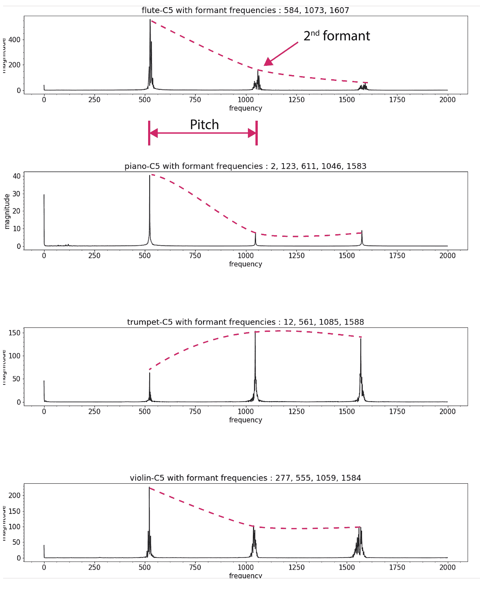
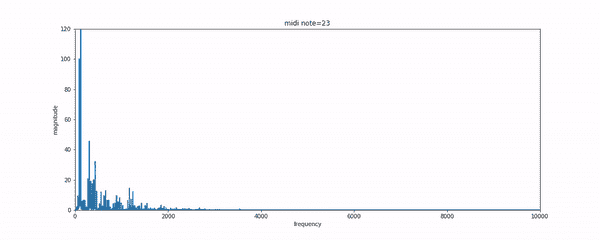
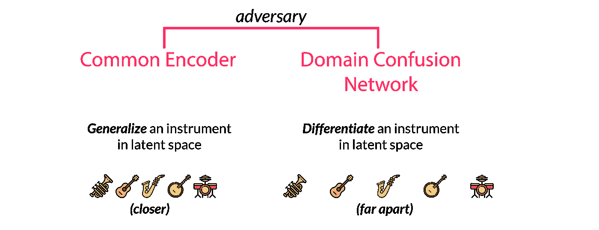
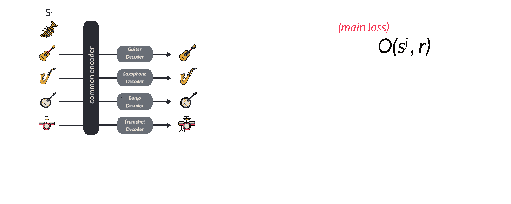
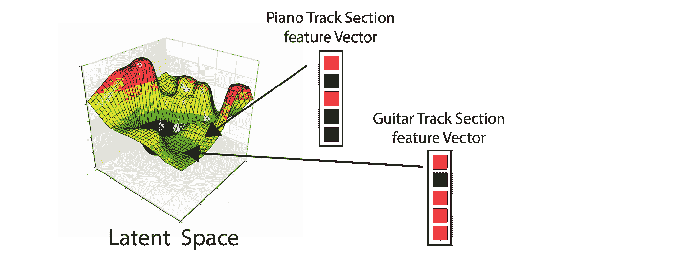

# 深入总结艾的音乐翻译模式

> 原文：<https://towardsdatascience.com/in-depth-summary-of-facebook-ais-music-translation-model-7516a0c3f2ce?source=collection_archive---------10----------------------->

这不是第一次，我们正在解决音乐翻译，其中你试图将钢琴轨道转换为吉他。有很多很多这样的尝试。但是，让脸书·艾最近的论文[1]与众不同的是，他们将它作为一种无监督的学习来对待，并实现了惊人的领域推广。因此，模型在训练时可能没有观察到一个长笛或口哨样本，但它仍然可以将长笛演奏转换为钢琴曲目。

现在，假设我们想要将管弦乐队演奏的莫扎特交响乐的音频转换为钢琴家演奏贝多芬的音频。我将演示 4 种不同的方法。

***Level-0:新手如何接近***

像我这样的新手会迫不及待地认为这是一个转录问题。我会简单地通过短时傅立叶变换找到音符和和弦，然后用新乐器演奏。传统的语音处理提供了许多方法，如基于 Eighen 乐器的乐器概括[6]，多音转录[3]然后解码等。每个乐器在时域中都有独特的音符开始和瞬变。但难点在于，即使是单个乐器(频谱包络)在频域，也不遵循不同音高的峰值模式。我们怎么能忘记复调音乐中的次谐波，等等。所有这些因素使问题变得非常困难。

***Level-1:深度学习科学家如何接近***

如果我在音乐理论方面稍好，那么我可能会使用 CNN 学习音乐转录，它通过 midi 格式生成标签。Midi 是大多数合成器录制数字音乐的标准格式。在 Midi 中，每个按键的按下和释放都是一个事件。我们有像 MAPS[7]这样的数据集，可以用来解决复调钢琴的转录问题。

***Level-2:一个 NLP 的家伙将如何接近***

如果我是一个 NLP 的家伙，我可能会使用序列到序列模型[5]，但我将需要匹配的行为和目标工具的轨道。

***Level-3:学习直接翻译和领域泛化***

如果你真的是优秀的音乐家，那么你会明白每种乐器的细微差别是 MIDI 无法捕捉到的。这也是本文的创新之处。

Noam 等人借用了 wavenet 的自回归架构，并利用它将问题转化为“*下一个音符是什么？有点问题。这使得它无人监管。*

可以在官网([https://deep mind . com/blog/wave net-generative-model-raw-audio/](https://deepmind.com/blog/wavenet-generative-model-raw-audio/))了解 wavenets。但本质上，波网摇滚，因为随着学习门扩大卷积，导致感受野增加，因此更好的预测，更丰富的隐藏特征的潜在空间。这些特征是捕捉人类声音或音乐本质的特征，就像 CNN 中的特征地图(具有不同的架构)。

现在，如果你想学习一个自动回归模型来预测 piano 的下一个样本，那么你只需要学习 wavenet 编码器和解码器。这里，编码器将把先前的序列投影到潜在空间中。然后，解码器试图从潜在空间中的隐藏值中找出意义，以解码序列中的下一个值。

如果这个模型可以为钢琴编码，为其他乐器解码，那不是很好吗？一类条件自回归模型？

这就是脸书人工智能集团所做的。Noem 等人[1]在同一个编码器上训练多个乐器域，并为每个类别配备不同的解码器。你可能会想，这有什么用呢？

但是共享的编码器迫使它学习共同的特征。我们仍然需要告诉模型，这是一个钢琴轨道，而不是一个管弦乐队。为此，我们有一个域混淆网络，它可以理解匹配的类/域。该论文将此视为对手，因为公共潜在空间试图找出公共特征，失去唯一性，而混淆矩阵试图分离公共表示，并使它们更具类条件性。共性和特性之间的斗争。这也需要精心选择正则化系数，这样才能两全其美。

让我们来看看目标函数。我们从域 j 中选取一个样本 sj，然后进行随机音高移位，以避免模型对数据的无脑记忆。在论文中，他们提到，样本在 0.25 到 0.5 秒内完成-0.5 到+0.5 个半音的随机音高。这表示为 O(sj，r)，其中 r 是随机种子。你可能会想，这有什么大不了的。但那些与谷歌品红或任何时间生成模型合作过的人，肯定知道模仿的诅咒。有时，模型开始像鹦鹉一样，做简单的顺序记忆(明显的过度拟合)。这就是为什么这个放大和扭曲的过程在这里非常重要。这就是为什么在多个域上训练编码器是重要的。

然后，我们让这个扩充的输入通过 wavenet 编码器的扩展卷积移动到潜在空间，然后通过特定域解码器 Dj 返回到原始空间，以获得下一个值的预测。我们将预测的下一组值与具有交叉熵损失的实际下一组值进行比较。作为对手或反目标，我们也有一个监督正则化项，它试图根据编码后获得的特征向量来预测域。他们称之为领域混乱网络。

这里的推论非常简单。我们只是根据我们的目标域 j 来调整解码器 dj。因此，如果你给它输入管弦乐曲目，它就会返回目标域 j 中的翻译(钢琴等)。但这是最酷的部分。如果你把一个看不见的乐器输入到模型中，并遵循自动编码过程，使用 j 乐器的解码器，那么它仍然可以近似地工作，这真是太棒了！！！这是因为，它表明编码器真正地概括了可见和不可见领域的潜在表征。这个概念是许多生成算法的核心，比如 GANs，变分自动编码器，我强烈推荐你阅读参考资料。

那是我所有的朋友。我已经做了一个超级棒的视频。一定要小心。 ***对博客表示支持*** 在媒体上鼓掌:)

**订阅我的 youtube 频道** 。我每周都发布关于 AI 近期话题的数学直觉的视频*。链接如下:[http://youtube.com/c/crazymuse](http://youtube.com/c/crazymuse)*

# ****Youtube 视频(基于本博客):****

# ****有用链接****

*[1]主题深度讲解:[https://www.youtube.com/watch?v=QL_joojCzvs](https://www.youtube.com/watch?v=QL_joojCzvs)*

*[2]**https://www.youtube.com/watch?v=vdxCqNWTpUs 脸书团队演示:***

*[3] **谷歌洋红:**[https://magenta.tensorflow.org/](https://magenta.tensorflow.org/)*

*[4] **地图数据集:**[http://www . TSI . telecom-Paris tech . fr/AAO/en/2010/07/08/MAPS-database-a-piano-database-for-multi pitch-estimation-and-automatic-transcription-of-of-music/](http://www.tsi.telecom-paristech.fr/aao/en/2010/07/08/maps-database-a-piano-database-for-multipitch-estimation-and-automatic-transcription-of-music/)*

*[5] **NSynth 数据集:**【https://magenta.tensorflow.org/nsynth *

*【6】【https://github.com/vishnubob/python-midi】有用的博客 Midi-python:*

# ****参考文献****

*[1] Mor，n .，Wolf，l .，Polyak，a .，& Taigman，Y. (2018)。一个通用音乐翻译网络。arXiv 预印本 arXiv:1805.07848。*

*[2]范·登·奥尔德，a .、迪耶曼，s .、曾，h .、西蒙扬，k .、维尼亚尔斯，o .、格雷夫斯，a .、… &卡武克库奥卢，K. (2016)。Wavenet:原始音频的生成模型。arXiv 预印本 arXiv:1609.03499。*

*[3]西格蒂亚，s .，贝内托斯，e .，&迪克森，S. (2016)。用于复调钢琴曲改编的端到端神经网络。IEEE/ACM 音频、语音和语言处理汇刊(TASLP)，24(5)，927–939。*

*[4] Sutskever，I .，Vinyals，o .，& Le，Q. V. (2014 年)。用神经网络进行序列间学习。神经信息处理系统进展(第 3104-3112 页)。*

*[5]罗伯茨，a .，恩格尔，j .，拉弗尔，c .，霍桑，c .，&埃克，D. (2018)。学习音乐长期结构的层次潜向量模型。arXiv 预印本 arXiv:1803.05428。*

*[6]贝内托斯和迪克森(2013 年)。使用时间约束移位不变模型的多乐器复音音乐转录。*美国声学学会杂志*， *133* (3)，1727–1741。*

*[7] V. Emiya，钢琴音乐的自动改编，博士论文，巴黎电信，法国，2008*