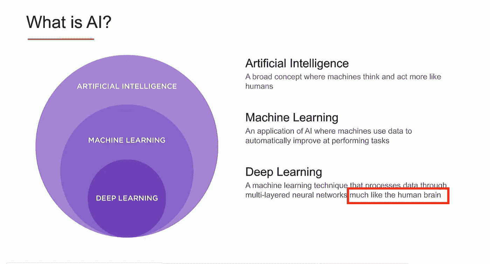
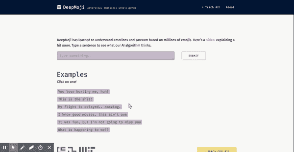

# 赞美人为的愚蠢

> 原文：<https://towardsdatascience.com/in-praise-of-artificial-stupidity-60c2cdb686cd?source=collection_archive---------18----------------------->

## 为什么今天的人工授精不是“真正”的人工授精，但对您来说可能没那么重要。

## 让人工智能再次变得伟大

> “人工智能就是电。“a . Ng
> 
> "那些不学习历史的人注定要重复历史。"**桑塔亚那**

N 在阳光明媚的硅谷，一家新的人工智能公司以闪亮的新承诺和/或令人瞠目结舌的融资回合成为头条新闻。这种狂热并不局限于硅谷:一片概念有些重叠的云——大数据、数据科学、机器学习、人工智能、深度学习——近年来已经成为主流；严肃的商界人士甚至声称*数据科学家*是“[21 世纪最性感的工作](https://hbr.org/2012/10/data-scientist-the-sexiest-job-of-the-21st-century)”，部分证明了我成为 NBA 超级巨星的失败尝试(为了一些清晰的照片证据，将[这种](https://www.instagram.com/p/BVEYJhNFY1O/?hl=en&taken-by=tooso_ai)生活与下面的生活进行比较)。

Still, not as sexy as the life of a data scientist.

对许多老(ish)从业者来说，世界似乎终于赶上了我们一直知道的事情:制造智能机器非常酷！另一方面，在人工授精的含义、人工授精的承诺和人工授精实际能实现的目标上，似乎存在一些可怕的混乱。

作为一名资深从业者和另一家拥有人工智能领域的旧金山初创公司“T14”的创始人，我发现自己完全沉浸在一个生态系统中，在这个生态系统中，乐观主义往往只与对人工智能历史中基本事实的真正无知相匹配:我不禁想知道，我们是处于一个时代的开始，还是处于一个时代的结束？

在接下来的文章中，我提交了我对人工智能非常主观的概述——昨天、今天、明天——并将犯下终极(呆子)罪:将科学炒作与商业价值脱钩。

*免责声明:在接下来的内容中，我们不会从学术角度提出特别原创的主张；即使只是考虑非学术的东西，我们的一些考虑也是共用的* [*这里*](http://nautil.us/issue/67/reboot/why-robot-brains-need-symbols\)*[*这里*](https://www.technologyreview.com/s/608911/is-ai-riding-a-one-trick-pony/)*[*这里*](https://www.quantamagazine.org/to-build-truly-intelligent-machines-teach-them-cause-and-effect-20180515/) *和* [*这里*](https://www.technologyreview.com/s/611229/boosting-ais-iq/) *。这篇文章的目的不是在学术上讨论一些支持或反对人工智能的有力论据，而是从“内部人士”的角度看待当前的炒作，并将其放在更广泛的背景下，特别是对受过教育的新领域读者来说。没有任何完整性和中立性的假设，你会在最后找到一个参考文献列表，相当令人印象深刻的人和进一步的评论。***

## **在人工智能之前做人工智能很酷**

> **"你会看到，我们的艺术由一些数学和大量的想象力组成."达伦马特**

**为了提醒自己我多大了，并对今天的炒作有所了解，让我们跳回到我们都知道并热爱的 90 年代。我在下面学究式地转载了人工智能创始人[约翰·麦卡锡](https://en.wikipedia.org/wiki/John_McCarthy_(computer_scientist))在对彭罗斯的书的[评论中的一些言论(你没想到彭罗斯会出现在 2018 年的人工智能博客上，是吧？):](https://projecteuclid.org/euclid.bams/1183555924)**

***人工智能的进步是由:***

1.  **用逻辑公式或其他合适的方式表示更多种类的关于世界的一般事实。**
2.  ***识别智力机制，例如常识推理中涉及的逻辑推理之外的机制。***
3.  ***代表人们在常识推理中使用的近似概念。***
4.  **设计更好的搜索可能性空间的算法，例如让计算机进行逻辑推理的更好方法。**

***像其他科学一样，人工智能产生数学问题，并提出新数学。到目前为止，最重要和典型的是非单调推理的形式化*。**

**Wow **:** 我们刚刚在 A.I .上浏览了一整段，没有遇到“深度学习”。抛开彭罗斯不谈(抱歉，我对[的逻辑学家和](https://math.stanford.edu/~feferman/papers/penrose.pdf)的家伙捣乱情有独钟)，文章中的参考文献与当前的辩论相去甚远，令人尴尬而着迷。**

**如果你对人工智能的热情始于九十年代的经典读物(如*明斯基，1988，珀尔，2000，霍夫施塔特，1995，*等。)，麦卡锡关于人工智能进步的观点会在你心中产生共鸣，就像一首来自遥远而快乐的过去的歌曲。然而，如果你刚刚来到数据科学派对，这些话很可能听起来很空洞:虽然今天在“人工智能公司”的面试可能会涉及到，比如说，[普通最小二乘法](https://en.wikipedia.org/wiki/Ordinary_least_squares)，但大多数候选人可能对 [*非单调推理*](https://plato.stanford.edu/entries/logic-nonmonotonic/) 甚至的意思一无所知。“到底发生了什么？”这时你可能会问(“我们应该雇佣他们吗？”你也可能会问，但这是一个棘手的问题)。**

**在一个口号中，*数据的不合理有效性*发生了(作为一个概念，而不仅仅是开创性的*哈勒维、诺维格和佩雷拉，2009* ，不出所料，佩雷拉是这一概念的一个非常标志性的代表)。**

**为了明白我的意思，是时候更深入地探究第一个人工智能的光辉岁月了:屏住呼吸。**

## **冬天来了**

> **“你可以给思想定价。有些花费很多，有些花费很少。一个人如何支付思想的费用？我认为答案是:有勇气。”维特根斯坦**

**众所周知，这门学科“诞生”于[达特茅斯研讨会](https://en.wikipedia.org/wiki/Dartmouth_workshop):约翰·麦卡锡*是的*，*麦卡锡*创造了“人工智能”一词，以标志着对概念和任务的计算学习，这些概念和任务在以前只属于人类智能。如果我必须用一句话来总结那些辉煌的过去——有时被称为[象征性的人工智能](https://en.wikipedia.org/wiki/Symbolic_artificial_intelligence)——大致如下:**

> **一般(“常识”)智能行为的关键是以一种允许明确操作和组合概念的方式来表示概念:我们对这种“表示”的最佳猜测是形式逻辑，而我们对“操作”的最佳猜测是逻辑推理。**

**尽管开国元勋们很乐观，但事实证明，从*原理*中复制伯特兰·罗素的定理是“相当容易的”,但让自主代理像一个 2 岁的孩子一样走过一个房间“基本上是不可能的”。商业应用在规模上被证明是不成功的，“人工智能”变成了一件坏事:[冬天](https://en.wikipedia.org/wiki/AI_winter)确实来了，而且对我们所有人来说，几乎“埋葬”了这个领域——至少在主流文化和大规模商业活动的眼中是这样。**

**虽然不确定人工智能复兴的根本原因，但在我看来，谷歌的大规模增长发挥了很大作用，证明了一家建立在核心技术和算法(今天我们称之为“人工智能”)基础上的公司确实可能是“下一个大事件”。谷歌对待能够完成“以前只留给人类智能的任务”的产品的方式有什么不同？**

**让我们从一个非常熟悉的例子开始:Gmail awesome 垃圾邮件过滤器，这个例子直接取自我自己的收件箱。**

****

**A message flagged as “spam” by my Gmail account.**

**对于人类来说，有许多常识性的推理来决定一条消息是合法的还是垃圾邮件，例如:**

*   **严肃的企业不会写信给人工智能创业者谈论石油合作伙伴关系；**
*   **“石油销售部门”的主管(不管是什么)不会有一个*展望*领域(谁会有一个*展望*领域呢？).**

**换句话说，你的推理会是:**

**a) **明确的** —即，如果被问到，你可以使用类似上述的概念来陈述*为什么*你认为该邮件是垃圾邮件(例如，你有“表述”，并且这些表述很容易通过语言共享)；**

**b)在很大程度上基于大量**重要的知识**，从完全理解英语开始——也就是说，同样的信息在俄语中不会以同样的方式进行分析。**

**如果你认为向计算机教授所有这些听起来像一场噩梦，那么，你就明白了为什么古老的人工智能方法很快就被认为是非常不切实际的，甚至对于简单的“认知任务”也是如此。那么，谷歌的出路是什么？**

**事实证明，要将一封邮件可靠地归类为垃圾邮件，并不需要深厚的英语知识或常识信念。我们可以通过将挑战转化为一个简单的统计问题来回避语言意义的问题:在垃圾邮件和合法邮件中,“合作伙伴”和“石油”这两个词会同时出现多少次？如果你对电子邮件中的所有单词都问这个问题，你会有一个“全局概率”，即电子邮件本身是垃圾邮件还是合法邮件:你处理的包含这些单词的电子邮件越多，你的过滤就越准确。**

**如果你想一想，这是一个不可思议的工程技巧:我们从一个需要非平凡智能来解决的问题开始，我们承认我们不能完全理解/复制这种智能，我们意识到用平凡的算法和*大量数据*代替非平凡智能可以实现完全相同的目标:事实证明，解决本质上的意义问题更容易(这个人是在用文字欺骗我做什么吗？)通过*完全忽略*的意思并利用共现模式。**

**随着谷歌和大数据时代的兴起，一场完美风暴开始让“智能机器”再次变得酷起来:增强的计算能力、前所未有的可用数字信息和许多聪明的算法(如上文的垃圾邮件分类器)开始为各种商业上成功的产品提供动力。虽然细节有所不同，但大多数成功都有一个共同点:将表示复杂知识的漫长而艰苦的工作转化为某种优化问题；由于我们无法横向扩展智能，我们转而扩展了数据收集。**

**从某种意义上说，人工智能冬天过后，我们学到的大部分东西并不是如何建造更智能的机器:对我来说，最重要的信息确实是，我们认为需要智能的许多实际问题实际上可以通过愚蠢的算法和大量的数据点来解决。**

**“[智能作为曲线拟合](https://www.quantamagazine.org/to-build-truly-intelligent-machines-teach-them-cause-and-effect-20180515/)的产物是当今深度学习的炒作。**

## **深度学习和浅薄的想法**

> **“一个聪明人不值得花时间去争取多数。从定义上来说，已经有足够多的人可以做到这一点。”哈代**

**毫无疑问，*深度学习*在各种“人工智能任务”中取得了突破性的、可衡量的进步，并释放了人工智能技术实际应用的惊人潜力。如果有可能与我们的智能手机交谈，并从中获得除沮丧之外的东西，这在很大程度上要归功于语音识别方面与深度学习相关的改进；如果使用谷歌翻译作为理解外语歌曲的第一近似值是合理的，那么这在很大程度上是由于机器翻译中与深度学习相关的改进——这个列表还可以继续下去。**

> **淡化神经网络的科学和工程成就是完全没有意义和完全愚蠢的。**

**虽然有*但是*。学习“模仿人脑”的神经元样结构的想法(是的，人们实际上大声说出来)确实是非常古老的:最近发生的变化是硬件和算法的改进使得(嗯，相当简化事情)在更多数据上训练更大的网络成为可能，并大幅提高各种任务的性能。“作为曲线拟合的智能”的一般思想仍然是一样的:给定足够的数据和聪明的计算技术，我们一次又一次地从“昂贵”和“难以捉摸”的知识到“便宜”和“可测量”的优化进行交易。**

****

**Real 2018 slide from a real A.I. unicorn: gotta love the human brain metaphor.**

**有趣的是，人类和机器之间的差异已经变得很明显，与其说是在*他们得到了多少*对/错的答案，不如说是在*他们错得有多离谱*。换句话说，即使人类和机器同意这幅图片的标题:**

**他们会基于非常不同的“思维过程”达成一致。作为证明，以下机器生成的标题(“冲浪板上的恐龙”)不仅是错误的:它实际上远远不是一个对整个游戏产生怀疑的“智能猜测”——一个物理系统怎么可能让*理解*图像如此错误？**

**嗯，事实上这是*不可能*的:当系统“碰巧”正确/错误时，没有*理解*，因为一般的教训仍然是一样的——为了在许多看似智能的任务上达到 90%的准确性，确实根本没有必要智能。**

**当手头的任务具有某种程度上抵制“曲线拟合”的深度(不是有意的双关语)结构时，事情通常会变得更糟:我一生都对语言感兴趣，所以很自然地会问深度学习到底揭示了人类语言多少。以一个非常酷的项目为例， [deepmoji](https://deepmoji.mit.edu/#) ，它使用深度学习来制作一个模型，这个模型“*已经学会理解情绪和讽刺*”*。*即使最初的[论文](https://arxiv.org/abs/1708.00524)非常有趣，我们也很容易意识到“理解讽刺”可能比宣传的更难以捉摸。考虑下面的一对句子:**

****

**Testing Deepmoji with negation (original video [here](https://drive.google.com/file/d/1rI0uV_5TsqpxXf2mYQmTxkx_4a3NlxdY/view)).**

*   **我的航班被延迟了..太神奇了。**
*   **我的航班没有延误..太神奇了。**

**而在第一种情况下，DeepMoji 检测到讽刺，并建议适当的“愤怒”表情符号(真棒！)，第二句话，只有三个字母(N-O-T)不同，完全被误解了:根本没有讽刺的意思。与之前的图像一样，这表明我们最初并没有真正“理解”讽刺，但我们“只是”能够训练神经网络来拾取统计特征，在特定条件下，这些特征被证明足够精确。**

**在结束之前，让我们强调最后两点:**

*   ***可解释性*:人们经常[注意到](https://www.technologyreview.com/s/604087/the-dark-secret-at-the-heart-of-ai/)深度学习模型是“黑箱”，因为人类很难理解*他们为什么*做他们所做的事情。虽然大多数观察家强调这种特征的明显的伦理和实践后果，但我们对人工智能历史的小小探索(不一定证明但是)表明，某种程度的可解释性可能是“智能”的关键部分:拥有表征意味着某种“模块化”结构，这种结构比简单的权重矩阵更自然地导致回答“为什么问题”；**
*   ***数据*:大量的统计学习(不仅仅是深度学习)需要大量的数据才能工作。虽然*吨级数据*不是一个精确的数量，但重要的是要注意，无论您如何定义，它可能比其他更高效的物理系统需要的数据多得多:哪些系统？很有可能，你现在身边就有一个这样的人:他们被称为“孩子”，他们有时甚至会从一个简单的例子中学到复杂的概念。虽然我们当然可以想象是一个超级智能的外星种族，需要很长时间才能掌握新的任务，但通过考虑机器学习的缓慢和昂贵，我们很容易衡量我们离真正的智能还有多远。**

**最终，尽管“曲线拟合”已经变得令人印象深刻，但越来越多的从业者认为，人工智能需要的是*新想法，而不是更多的数据/GPU*(深度学习的真正先驱 Geoffrey Hinton 最近表示，我们应该“[抛弃这一切，重新开始](https://www.axios.com/artificial-intelligence-pioneer-says-we-need-to-start-over-1513305524-f619efbd-9db0-4947-a9b2-7a4c310a28fe.html))。我们将在最后提到一些我们喜欢的开创性发展，因为我们现在不得不问:我们应该如何处理所有这些新发现的人工愚蠢？**

## **预测机器**

> **“有时候，似乎人工智能的每一个新步骤，都没有产生大家都同意是真正智能的东西，而只是揭示了真正智能不是什么。”霍夫施塔特**

***Agrawal、Gans 和 Goldfarb，2018* 是三位经济学家最近的[书](https://www.amazon.com/Prediction-Machines-Economics-Artificial-Intelligence/dp/1633695670)，通过经济理论的透镜分析了人工智能的复兴。他们的核心论点相当简单:人工智能意味着更低的预测成本，由于预测具有巨大而广泛的商业价值，随着人工智能渗透到我们个人和企业生活的方方面面，许多经济过程将在不久的将来被改变。**

**在这一点上，应该清楚的是，他们心目中的“人工智能”显然不是麦卡锡和他的朋友们在达特茅斯的那个夏天开始建立的；他们所想的是过多的小型、特定任务、精细优化的软件，这些软件将比现有系统更好地解决狭窄的业务问题——垃圾邮件过滤器、电子商务中的推荐书籍传送带、何时购买芝加哥机票的通知、针对天气、航空公司价格波动的优化等。**

**这,“仅仅”是这,*当前的*人工智能革命，通过更好地完成“愚蠢”的任务，正在席卷消费者和企业市场:虽然这些预测机器不会达到任何程度的智能或理解，但结合在一起，它们降低了成本，提高了许多过程的效率。**

**从这个角度来看，虽然技术不再是主要的参与者，但它显然是这种新商业生态系统的推动者:没有开源工程工具和库、教育资源、计算能力、纯粹的数据的繁荣，这些“T0”人工智能群对于 X 公司来说都是不可能的，而且许多情况仍然会相当不优化。随着预测被更好的库和服务抽象和封装，我们可以看到在不远的将来，人工智能组件在代码库中会像今天与数据库交互一样常见。虽然用经过适当优化的曲线拟合工具来交换理解智力的梦想对一些人来说肯定令人沮丧，但将人工智能从大学实验室带入疯狂的商业世界是恢复兴趣、增加资金和吸引人才的必要步骤。从商业角度来看，有数十亿美元的机会摆在那些只需要一点点科学和适量数据的人面前([麦肯锡估计人工智能可能每年创造超过 3.5 万亿美元的价值](https://www.forbes.com/sites/louiscolumbus/2018/04/30/sizing-the-market-value-of-artificial-intelligence/#1a953d67ffe9)):对于“基于预测的人工智能”来说，春天，当然是*而不是*冬天，正在来临。**

**很明显，与“真正的”人工智能所能实现的相比，所有这些“愚蠢的”人工智能都是毫无价值的；不幸的是，人工智能作为一个领域多年来一直在做的一件事，就是与它自己的期望严重不符。在这方面，“预测机器”的出现虽然不如“思维机器”的未来出现那样令人兴奋和改变游戏规则，但却标志着该学科历史上一个前所未有的里程碑——即商业价值超过了象征性的“不归路”。**

**尽管炒作和乐观情绪会时好时坏，“曲线拟合”最终给了人工智能一个席位:的确，有时候*明智胜过*。**

## **一个遥远的未来**

> **“霍夫斯塔德定律:它总是比你预期的要长，即使你考虑到了霍夫斯塔德定律。”D. R. Hofstadter**

**在过去的 60 年里，我们从“演绎机器”到“预测机器”——离“思考机器”还有多远？嗯，*这个*是一个非常难的预测:没有人知道目标有多远，更糟糕的是，没有人知道我们会走哪条路。如上所述，仅凭“自下而上的方法”*或“符号推理”*似乎是极不可能满足的:然而，如何有效地将两者完全结合起来仍然是一个谜。在更具“象征性”的部分，最近一波不可思议的想法、论文和工具在概率编程中承诺以一种前所未有的方式将逻辑和概率结合起来:如果你对我们自己的观点感到好奇，我们最近发表了一篇[长的、固执己见的和认知友好的帖子](/fluid-concepts-and-creative-probabilities-785d3c81610a)，里面有可运行的代码样本。****

***如果人工智能历史——我们对其进行了部分*和主观*回顾——能给我们一些启示，我有信心提出三点建议:*****

*   ***对于人工智能中的业务人员:*不要恐慌*。当然，人工智能市场可能很快会放缓，深度学习可能会开始停滞，媒体的所有乐观情绪可能会冻结一点。虽然确实有很多”。人工智能初创公司“只是”随波逐流”，*近年来制造的许多*预测机器将会留在这里，还有更多的机器有待发明。当然，我们可能想在某个时候重温整个“人工*智能*”标签，但这并不意味着我们要赶走婴儿。***
*   **对于人工智能的研究人员:*回到基础*。人工智能建立在理解认知的跨学科努力之上；有趣的是，大部分关于*深度学习*的原创想法来自心理学杂志(如*辛顿 1985，罗森布拉特 1958* )。虽然现在很难确定路线图，也几乎不可能看到各个部分——计算机科学、心理学、语言学、神经科学、逻辑——是如何整合在一起的，但从不同角度解决一个非常困难的问题不会损害我们的机会。**
*   **对于 A.I .的投资者来说:*引领创新，不要只是跟随*。资金一直在[行业](https://news.crunchbase.com/news/venture-funding-ai-machine-learning-levels-off-tech-matures/)持续[流动](https://2utfff4d3dkt3biit53nsvep-wpengine.netdna-ssl.com/wp-content/uploads/2018/03/AI_Deal-Dollar.png)，尤其是深度学习初创公司。然而，所有这些对人工智能的狭隘看法的资金可能会让我们陷入“局部最小值”，而其他有前途的方法，离宣传更远，受到的关注更少。这不仅仅是对科学不利:如果你在那些[幂回报定律](http://reactionwheel.net/2015/06/power-laws-in-venture.html)中寻找好的异常值，随着“预测机器”市场变得拥挤，你对下一件大事的最佳押注可能完全来自一种新的方法。**

**那么人工智能初创公司的创始人呢(如果有人关心他们的话)？好吧，在为真正的机器智能提前规划的同时，我们可能应该继续在我们的日常追求中追求更卑微和平凡的里程碑。我们的灵感和指导不亚于艾伦·图灵本人:**

> **“我们只能看到前面不远的地方，但我们可以看到那里有许多需要做的事情。”**

**让我们永远不要忘记，完成这件事取决于我们自己。**

## **再见，太空牛仔**

****

**如果您有问题、反馈或评论，请与[jacopo . taglia bue @ tooso . ai](mailto:jacopo.tagliabue@tooso.ai)分享您的人工智能观点。**

**别忘了在 [Linkedin](https://www.linkedin.com/company/tooso) 、 [Twitter](https://twitter.com/tooso_ai) 和 [Instagram](https://www.instagram.com/tooso_ai/) 上获取 [Tooso](http://tooso.ai/) 的最新消息。**

## **感谢**

**感谢整个 Tooso 团队，Stefano Pacifico 和 Davide Romano 对这篇文章之前的草稿的评论。**

**在我们之前关于[学习概念](/fluid-concepts-and-creative-probabilities-785d3c81610a)的媒体报道中，以及在我们 11 月[的人工智能讲座](https://www.meetup.com/it-IT/The-Future-of-AI-in-IT/events/255678923/)中，已经详细讨论了其中一些观点:我们要感谢[人工智能未来会议](https://youtu.be/N9LSY74SeWo)的组织者和参与者，感谢他们对我们的观点做出的热情贡献和有益反馈。**

## **杂项笔记和更多阅读材料**

*   **显然，任何工业规模的垃圾邮件过滤器都会采用比上面解释的朴素贝叶斯分类更复杂的思想，但直到今天，它仍然是一种非常简单有效的基线算法，具有很大的教学价值。对于数据科学新手和不懒惰的读者来说，这里有一章[非常不错。](https://www.amazon.com/Programming-Collective-Intelligence-Building-Applications/dp/0596529325)**
*   **微软深度学习 Twitter 机器人可以在这里找到:我们在听 Josh Tenenbaum 的[精彩演讲](https://youtu.be/7ROelYvo8f0)时了解到了它，其中涉及许多有趣的问题:学习、概率编程和基于模型的推理。**
*   **在我们最近关于[概念](/fluid-concepts-and-creative-probabilities-785d3c81610a)的帖子中，我们详细讨论了[乔希·特南鲍姆](https://web.mit.edu/cocosci/josh.html)在“贝叶斯学习”方面的最新作品。如果你想从某个地方开始， [*认知的概率模型*](https://probmods.org/) 是一本真正令人惊叹的书。**
*   **在我们最近关于[概念](/fluid-concepts-and-creative-probabilities-785d3c81610a)的帖子中，我们详细讨论了[流体概念](https://www.amazon.com/Fluid-Concepts-Creative-Analogies-Fundamental/dp/0465024750)和[道格拉斯·霍夫斯塔德](https://en.wikipedia.org/wiki/Douglas_Hofstadter)。一些简短的[文章暂且不提](https://www.theatlantic.com/technology/archive/2018/01/the-shallowness-of-google-translate/551570/)，感觉霍夫施塔特大部分都从幕后消失了:[慈曼赤](https://translate.google.com/?rlz=1C5CHFA_enUS783US783&um=1&ie=UTF-8&hl=en&client=tw-ob#auto/en/ci%20manchi)道格拉斯！**
*   **我们在最后掩盖了与主题相关的大量学术材料:在没有任何完整性假设的情况下，你可以得到一堆经典材料(例如*福多尔，皮里申，1988* ，*平克，普林斯，1988* )和下面参考文献中更近期的材料(例如*达维奇，2017，马库斯，2018* ，*珀尔，2018* )。 *Lake，Baroni，2017* 是 NLP 最近的一个作品，我们很喜欢；对于如何将归纳偏见与深度学习结合起来的一些想法，Google Brain，Deep Mind 等公司的人有一篇很好的论文。(参见下面的参考文献)。虽然一些人最近一直在使用推特(Twitter)来讨论这些和类似的话题，但很多这样的争论确实可以追溯到几十年前(正如我们指出的，一些基本的事情还没有改变。】。**
*   **图灵奖获得者[朱迪亚·珀尔](https://en.wikipedia.org/wiki/Judea_Pearl)多年来一直是“偶然模型”的倡导者，即如果没有推理因果过程和做出反事实判断的能力，就无法实现真正的智能。认知科学家也提出了类似的想法(见 *Lake，Ullman，Tenenbaum 和 Gershman，2016* 的概述)，特别强调了人类学习的“组合性方面”，即利用简单概念构建复杂概念的能力( *Lake，Salakhutdinov 和 Tenenbaum，2015* )。基于模型的学习是我们关于概率编程的[帖子](/fluid-concepts-and-creative-probabilities-785d3c81610a)的主要主题，其中包含注释代码示例和额外的参考资料，以进行更深入的探索。**
*   **专家读者可能已经注意到，我们使用“表示”有点随意(草率？)在我们的讨论中；特别是，我们强调“外显表征”是类人智能的一个关键组成部分，但我们没有详细评论在深度学习经验成功中至关重要的表征。当涉及语言时，这两种类型之间的差异更明显(因为 1)人类使用语言在他们之间进行交流，2)非平凡的组成性是语言的本质)，但这肯定是所有人工智能任务之间的真正差异。对于概念倾向的读者来说，*福多尔，Pylyshyn，1988* 是符号与神经架构中表征精神状态的一个里程碑式的讨论。**

## **引用(惰性格式)**

*   **[预测机器:人工智能的简单经济学](https://www.amazon.com/Prediction-Machines-Economics-Artificial-Intelligence/dp/1633695670)**
*   **[人类水平的智力还是类似动物的能力？](https://arxiv.org/pdf/1707.04327.pdf)**
*   **Google Brain People 等，2018，[关系归纳偏差、深度学习与图形网络](https://arxiv.org/pdf/1806.01261.pdf)**
*   **福多尔，皮利希恩，1988，[连接主义与认知架构:批判性分析](http://ruccs.rutgers.edu/images/personal-zenon-pylyshyn/proseminars/Proseminar13/ConnectionistArchitecture.pdf)**
*   **Halevy，Norvig，Pereira，2009，[数据的不合理有效性](https://static.googleusercontent.com/media/research.google.com/it//pubs/archive/35179.pdf)**
*   **辛顿，1985，[玻尔兹曼机的学习算法](https://www.enterrasolutions.com/media/docs/2013/08/cogscibm.pdf)**
*   **Hofstadter，1995，[流体概念和创造性类比:思维基本机制的计算机模型](https://www.amazon.com/Fluid-Concepts-Creative-Analogies-Fundamental/dp/0465024750)**
*   **Marcus，2018，[深度学习:一种批判性评价](https://arxiv.org/abs/1801.00631)**
*   **麦卡锡，1990，[评论:罗杰·彭罗斯，皇帝的新思想](https://projecteuclid.org/euclid.bams/1183555924)**
*   **明斯基，1988，[心灵的社会](https://www.amazon.com/Society-Mind-Marvin-Minsky/dp/0671657135)**
*   **Lake，Baroni，2017，[没有系统性的泛化:论序列对序列递归网络的组合技巧](https://arxiv.org/abs/1711.00350)**
*   **Lake，Salakhutdinov 和 Tenenbaum，2015 年，[通过概率程序归纳进行人类水平的概念学习](https://web.mit.edu/cocosci/Papers/Science-2015-Lake-1332-8.pdf)**
*   **莱克、乌尔曼、特南鲍姆和格什曼，2016 年，[建造像人一样学习和思考的机器](https://arxiv.org/pdf/1604.00289.pdf)**
*   **珀尔，2000 年，[因果关系:模型、推理和推论](https://www.amazon.com/Causality-Reasoning-Inference-Judea-Pearl/dp/052189560X)**
*   **Pearl，2018，[因果革命的七个火花对机器学习的理论障碍](http://ftp.cs.ucla.edu/pub/stat_ser/r475.pdf)**
*   **Pinker，Prince，1988，[论语言与联结主义:语言习得的并行分布式处理模式分析](https://www.sciencedirect.com/science/article/pii/0010027788900327)**
*   **罗森布拉特，1958 年，[感知器:大脑中信息存储和组织的概率模型](http://psycnet.apa.org/record/1959-09865-001)**