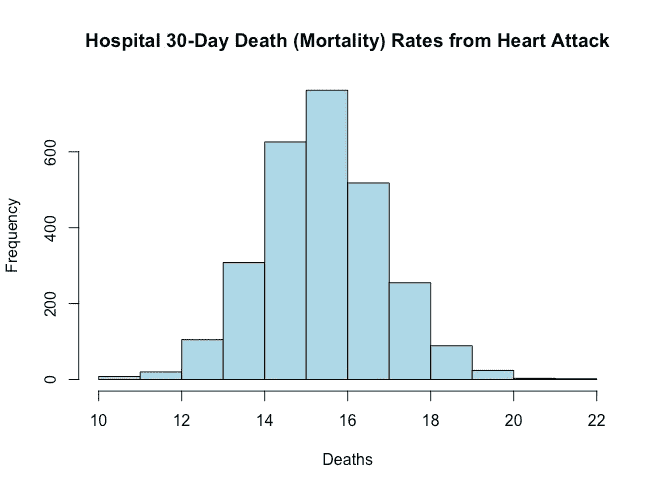

# 编程(JHU 课程，课程 2)

> 原文：<https://towardsdatascience.com/in-progress-review-course-2-r-programming-jhu-coursera-ad27086d8438?source=collection_archive---------0----------------------->

Histogram Showing Mortality Rates (Part of Week 4 Assignment)

数据科学专业的第二门课程“R 编程”是一门向用户教授 R 基础知识的入门课程。虽然我确实认为它很好地讲解了基础知识，但对于真正的 R 初学者来说，任务难度有点太大。因此，我决定将我的所有代码发布在我的 [github](https://github.com/mGalarnyk/datasciencecoursera/tree/master/2_R_Programming) 上。

我带着一点曲折完成了这门课程。我决定使用非常流行的 [data.table](https://www.datacamp.com/courses/data-table-data-manipulation-r-tutorial) 包，而不是纯粹使用 data.frame，data . frame 没有 data.table 广泛用于大型数据集。

第 1 周重点:删除和子集化数据是一项非常有用的技能。向量、列表、矩阵和因子的教学是极好的。并不太难。

R Programming JHU Quiz 1

第二周重点:词法范围是所有对象必须存储在内存中的原因。编程作业很有用。如下所示，我已经决定尽可能地对 data.table 语法进行专门化，因为它在行业中被广泛使用。

R Programming JHU Week 2 Quiz

第二周的恐惧:许多用户抱怨这周的项目难度增加了很多。这也是我决定将所有作品放在 github 上的部分原因。

R Programming JHU Assignment 1

第 3 周重点:在下面的测验中练习我的数据表技能(或缺乏技能)的机会。很高兴看到通用数据集的使用，因为它们易于操作。《T4》的任务还不错。

第 4 周亮点:测验[还不错。R 剖面仪讲座。有一个很好的说明，当代码被设计、运行和理解时，优化是一个优先事项。通过排序、分组等方式找出各州最好的医院很有趣。在我看来，考虑到这是一个初学者的专业，这个作业有点多。这个缩略图是我在这个作业的早期生成的。](https://github.com/mGalarnyk/datasciencecoursera/blob/master/2_R_Programming/quizzes/quiz4.md)

R Programming JHU Assignment 3

总的来说，这是一门对工业界非常有用的课程，因为它教会人们获取数据文件并对其进行操作。然而，对于初学者来说，它的期望太高太快了。如果你有任何问题，请留言告诉我！

另外，请看我的[课程 3 获取和清理资料复习](https://medium.com/@GalarnykMichael/getting-and-cleaning-data-jhu-coursera-course-3-c3635747858b#.plgmix8rj)！