# 追求幸福(上)

> 原文：<https://towardsdatascience.com/in-pursuit-of-happiness-4283c8c335c4?source=collection_archive---------2----------------------->

> 幸福的国家都是相似的；每个不幸的国家都有自己的不幸之处。

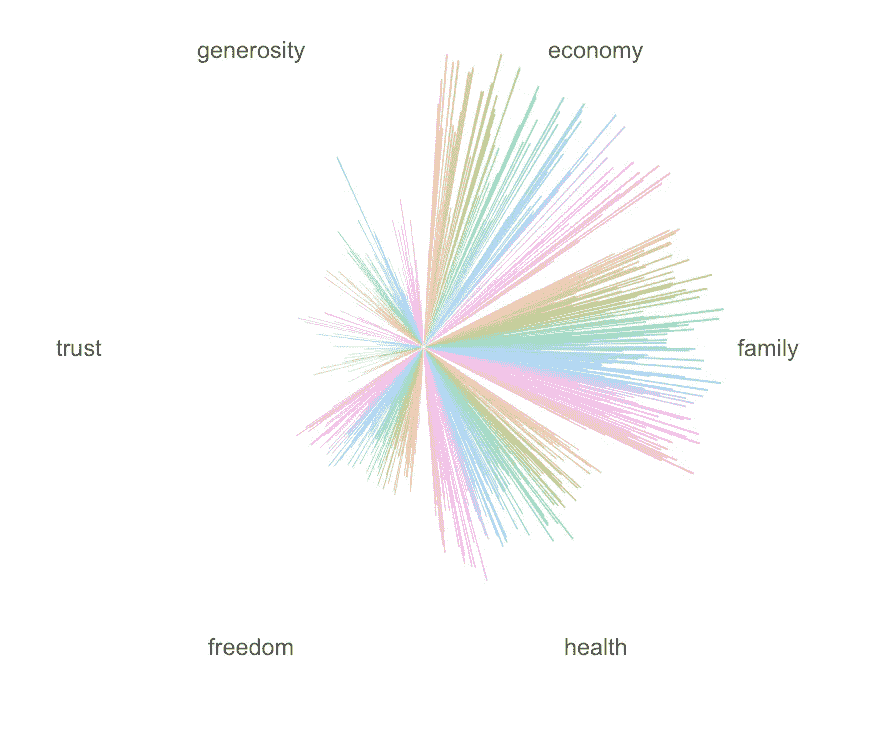

Global well-being

在一个增长往往等同于经济的世界，OCED 提出了福祉的重要性，这使国家层面的幸福成为人们关注的焦点。

今天我在看联合国委托的 2016 年[世界幸福报告](https://www.kaggle.com/unsdsn/world-happiness)，该报告包含全球幸福指数和一系列社会经济因素，如经济、家庭、健康、自由、信任和慷慨。越来越多的国家将幸福作为衡量社会进步的标准。众所周知，不丹使用国民幸福总值(GNH)作为发展指标。鲜为人知的是，3 月 20 日被定为国际幸福日。

我注意到的第一件事是一个广泛的模式，在每个因素上排名越高的国家越幸福。因此，经过一些数据清理后，我研究了每个地区的国家在社会经济福祉方面的表现。

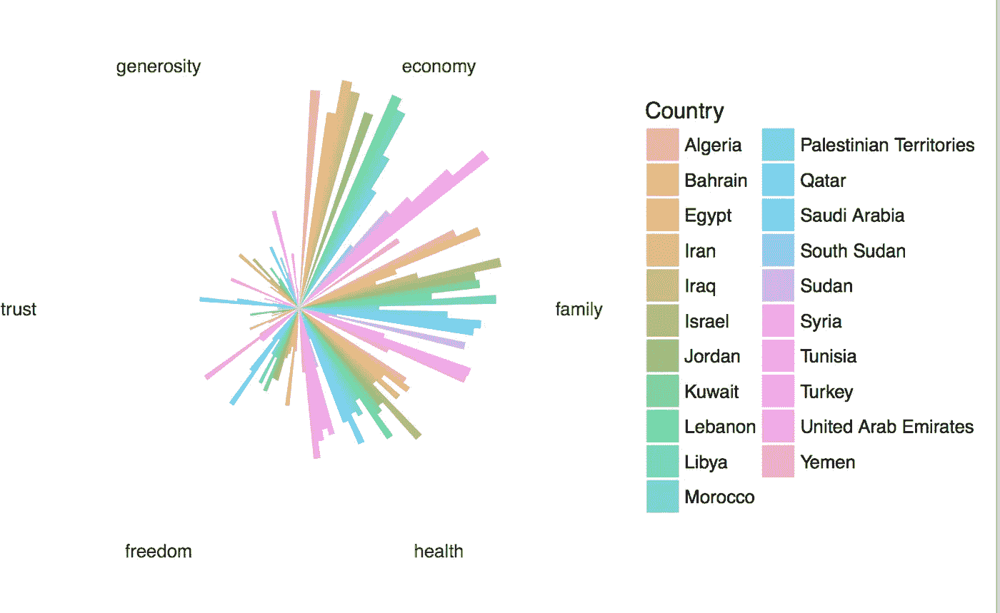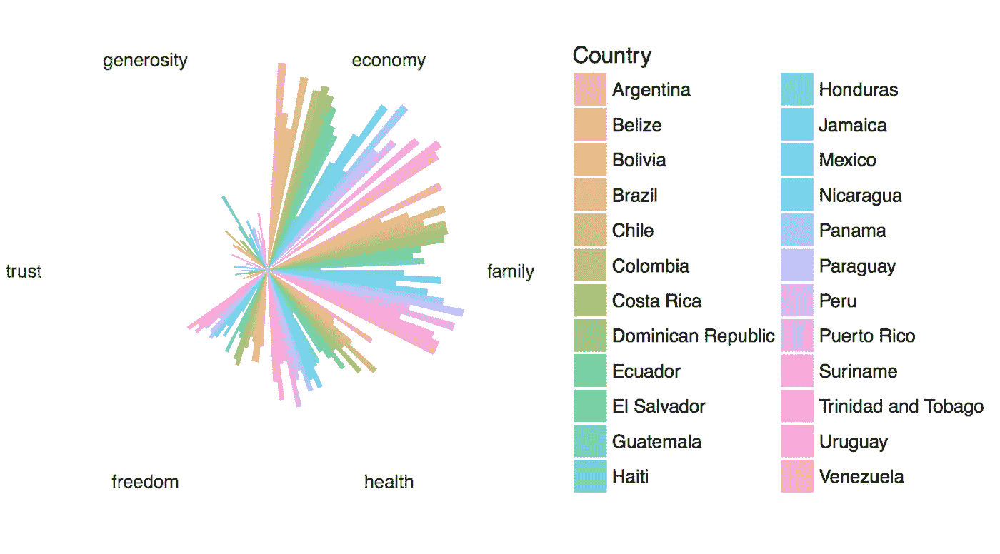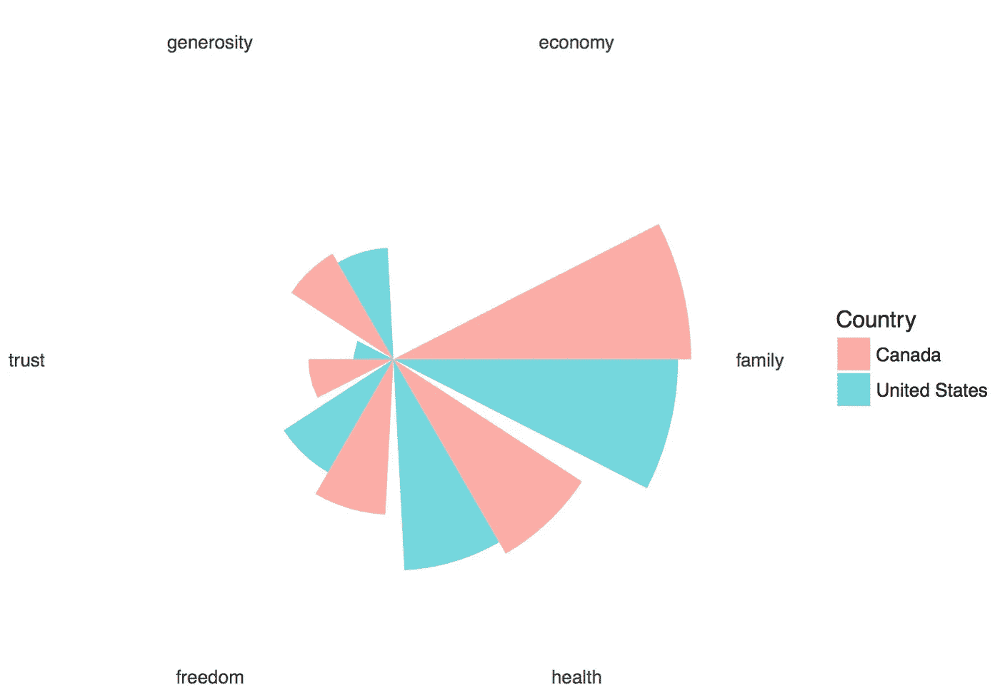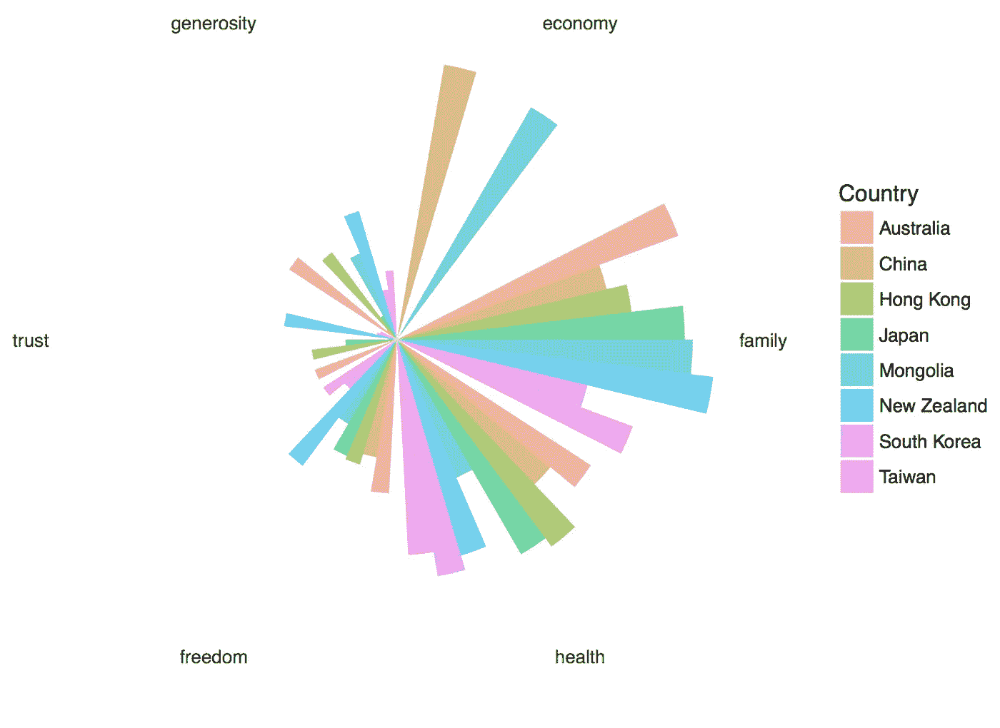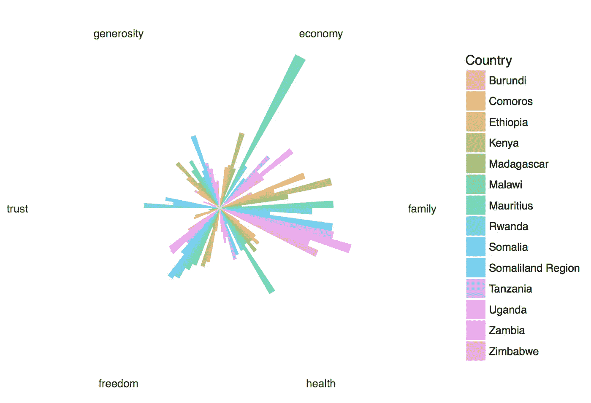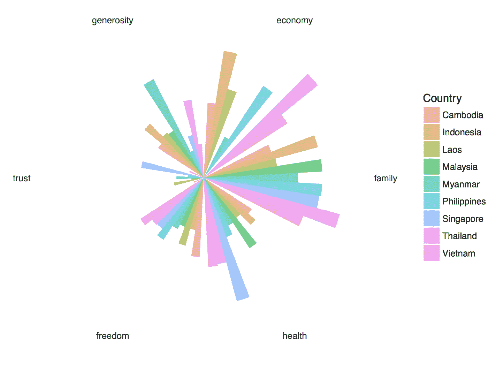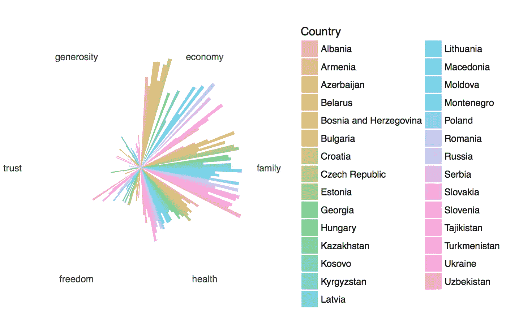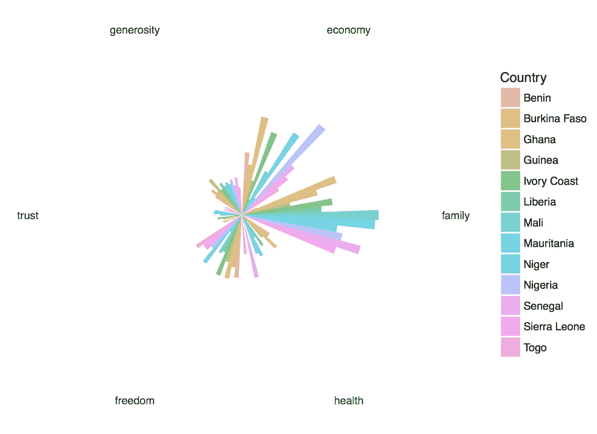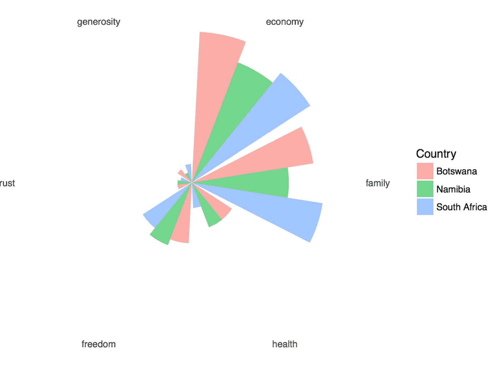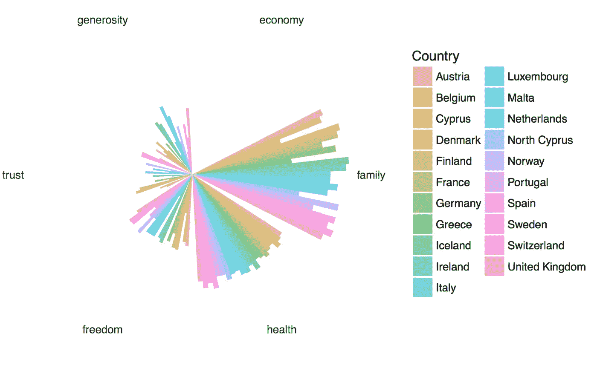

一些观察结果:

*   *慷慨、信任和自由都很低*
*   有些地区(如北美)比其他地区(如南美)更加 T4 化。
*   地区有*离群值*:信任指数在东南亚相当低，新加坡除外；东非的毛里求斯经济指数特别高，也高于世界平均水平；与南亚国家相比，斯里兰卡和不丹的家庭指数要好得多。

这是可视化数据集的第一步。接下来，我打算研究社会经济福祉如何对国家层面的幸福做出贡献，以及这一趋势如何逐年变化。

我今天学到的是，为了循环图表，需要在 print()语句中包含 ggplot。这些图表只是极坐标上的柱状图投影。

你可以在这里阅读更多关于世界幸福报告的内容。

感谢阅读。这是我关于数据科学和视觉故事的# 100 天项目的# 12 天。