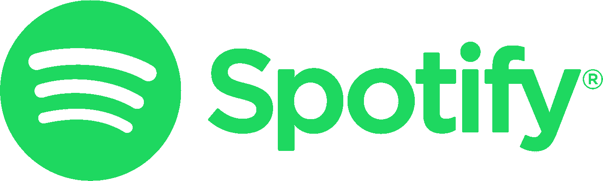
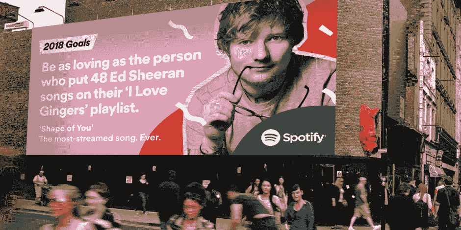
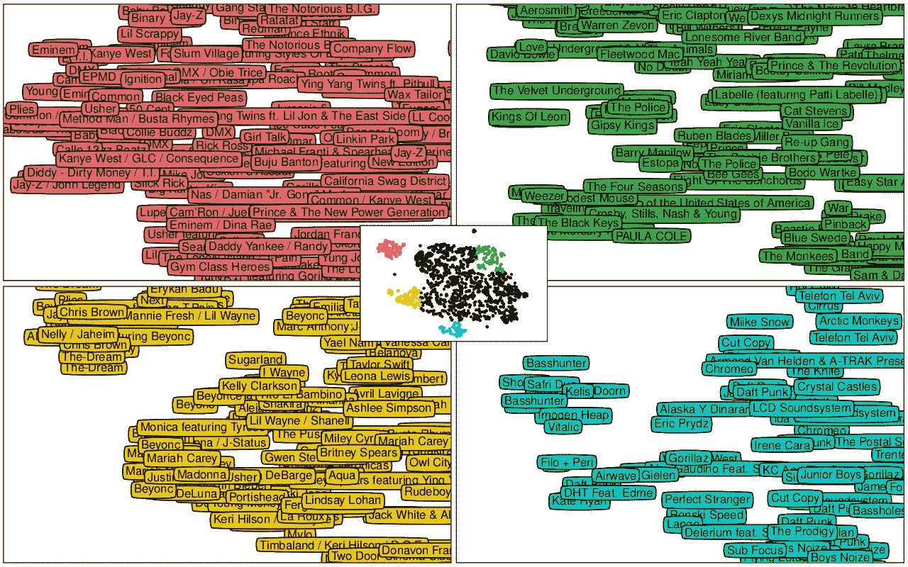
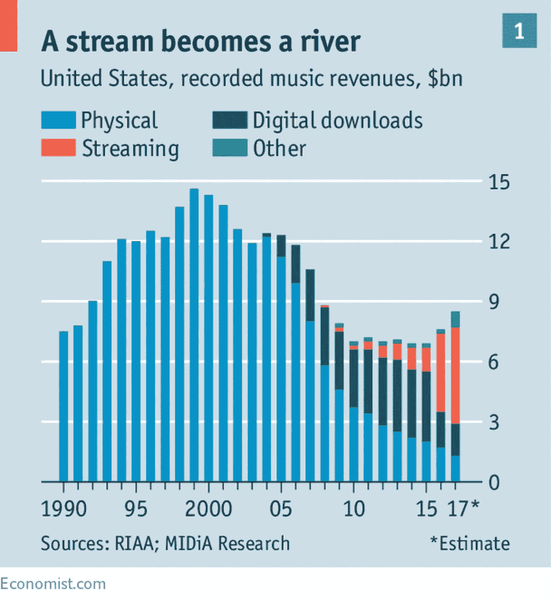
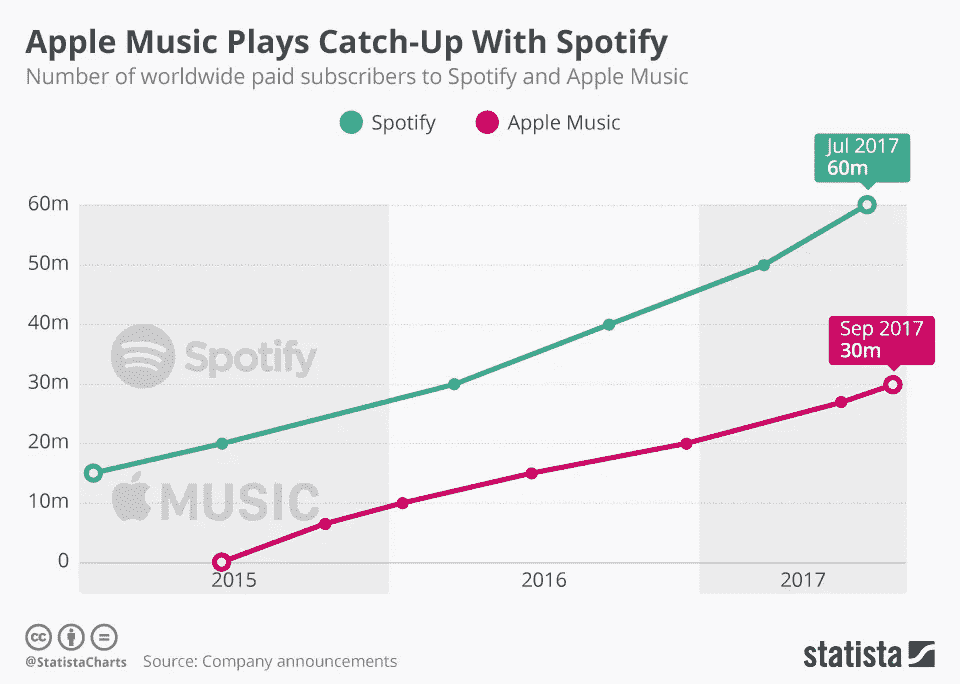

# 产品分类:Spotify

> 原文：<https://towardsdatascience.com/in-this-article-i-provide-a-detailed-analysis-of-spotify-as-a-company-music-industry-direction-eeb945d7257c?source=collection_archive---------3----------------------->

*在这篇文章中，我详细分析了 Spotify 作为一家* ***公司*** *(音乐产业方向、市场竞争、增长战略)和作为一款* ***产品*** *(特点分析、Spotify 的 ML 概述、UI 建议)。*

尽管 Spotify 在计划公开募股之前正忙于清理其诉讼和债务，投资者对这家音乐流媒体巨头的估值为 160 亿美元。在全球 1.466 亿付费音乐用户中，Spotify 拥有 7000 万 T21 用户，在音乐流媒体市场中的份额不到 50%。

# 了解你的历史……并重复它。

那么是什么让 Spotify 走到了今天？有几个关键策略曾经奏效并将继续奏效:

**社会特征**:

*   订阅你的朋友，看看他们在听什么。由于 Spotify 与脸书整合在一起，找到你的朋友变得很简单。看到你的朋友听什么会让你感觉联系更紧密，并为音乐发现增加额外的分数。
*   通过直接连接到平台的简单链接，与任何人分享歌曲/播放列表。每一份股票都像一张请柬，促进增长。
*   公共播放列表是 Spotify 上音乐发现的主要部分。Spotify 有 3000 万首歌曲，有 20 亿个播放列表。考虑到该平台的设计提倡制作播放列表并将其公之于众，如此巨大的数字并不令人惊讶。默认情况下，播放列表是公开的，制造摩擦来隐藏你的音乐品味。从头开始制作播放列表或添加到现有的播放列表，只需点击一下鼠标。

**智能定价**(定期订阅 10 美元/月):

*   为学生提供 5 美元的折扣订阅，以抓住在线社交网络中最常见的细分市场，因此最有可能引起使用该服务的邀请。
*   最多 6 人的家庭订阅费为 15 美元，激励整个家庭转向一个平台，减少竞争对手的市场份额。

**锁定设计**。随着用户保存的歌曲和定制的播放列表越来越多，他们越来越有可能继续使用 Spotify，因为没有将用户库导出到 Spotify 生态系统之外的功能。虽然这可能会对加入 Spotify 构成威慑，但这是一个明智的策略，因为它是新竞争对手的强大进入壁垒。除非竞争对手能提供完全不同的、更好的东西，否则大多数已经在 Spotify 上收藏了一个系列的用户不会换。为了弥补不能拥有自己音乐的[不适](https://www.digitaltrends.com/music/why-i-have-to-quit-spotify/)，Spotify 含蓄地宣传了这样一种信念，即有一个巨大的音乐海洋应该是我们真正感兴趣的，而不仅仅是保留你已经拥有的音乐。

**真实性**。通过允许歌曲在音乐选择算法上“推广”来赚钱是很诱人的，但迄今为止 Spotify 担心失去听众的信任是正确的。通过将听众的兴趣放在心上，Spotify 很快让每个人都适应了它的音乐查找功能，如*发现周刊*和艺术家/歌曲电台。

数据驱动的文化:Spotify 几乎立即开始追求通过算法来了解音乐的目标，认为这是开发其功能的最佳方式。当 Apple Music 吹嘘其[“手工管理的播放列表”](https://www.cnet.com/news/apple-music-vs-spotify/)时，Spotify 正忙着从该领域雇佣尽可能多的机器学习/数据科学专家。

# Spotify——你进入音乐世界的向导。

最重要的是，Spotify 寻求表现得像一名导游，一名算法大师，在你的音乐启蒙之旅中握着你的手。这反映在 Spotify 的营销和用户界面上。

[source](http://www.thedrum.com/news/2017/11/29/spotify-wraps-up-2017-making-humorous-goals-2018-using-its-data-and-artists)

许多人对 Spotify 机智的活动([2016](http://www.adweek.com/creativity/spotify-crunches-user-data-fun-ways-new-global-outdoor-ad-campaign-174826/)[–2018](http://www.adweek.com/creativity/how-spotify-makes-its-data-driven-outdoor-ads-and-why-they-work-so-well/))窃笑，这些活动经常与重要新闻*(亲爱的 3749 名观看“这是我们所知的世界末日”的人，英国退出欧盟投票的那一天，坚持住*)，或者轻松地嘲笑社会规范*(“比那些在跑步播放列表上写着‘慢手’的 46 个人更传统地锻炼。”*)。除了机敏的喜剧之外，他们之间的共同主题是**基于数据的** **音乐知识**，以及**对用户的关注**。

UI 的设计方式使得每个元素都像一扇等待打开的门，一个等待探索的新领域。如果你喜欢这首歌，右击打开歌曲电台，寻找相似的音乐。寻找新的东西——查看你的每周发现或者点击你朋友的订阅。想要收听您最喜欢的音乐吗——选择一个您的每日混音播放列表。

更正式地说，Spotify 的 UI 仅仅是 Spotify 核心的机器学习冰山的表面。它有 3 个主要的数据来源:

*   **播放列表**(关于什么音乐被视为相似的信息)，
*   **个人收听历史**(音乐播放顺序模式)，
*   **喜欢/不喜欢/跳过**电台(关于歌曲如何混合在一起的信息)。

所有这些都是*与内容无关的*数据，但通过[使用神经网络预测仅来自音频信号的数据](http://benanne.github.io/2014/08/05/spotify-cnns.html)(即歌曲内容本身)，Spotify 的算法也变得*与内容相关*。

Spotify 正在使用一整套*协作过滤*方法(通过在数据中寻找模式来分解艺术家-用户、歌曲-用户矩阵，使其变得紧凑)【Spotify 的[幻灯片](https://www.slideshare.net/MrChrisJohnson/music-recommendations-at-scale-with-spark/12-Alternating_Least_Squares_ALS_121)，为其提供每个用户和每个艺术家/歌曲的*潜在表示*(数字向量)。这给了 Spotify 一个全面的音乐地图，相似的歌曲被放在一起，用户倾向于只在地图的特定区域听音乐。

t-SNE visualization of found latent space (i.e. **map of music**), [[A. van den Oord, S. Dieleman, B. Schrauwen](https://papers.nips.cc/paper/5004-deep-content-based-music-recommendation)]

通过遍历该地图，Spotify 可以找到与您指定的偏好(例如，每周探索、向播放列表推荐歌曲)或给定查询(例如，播放列表的电台、歌曲、艺术家等)相关的相近但新颖的歌曲。).[ [详细解释](https://qz.com/571007/the-magic-that-makes-spotifys-discover-weekly-playlists-so-damn-good/)

总而言之，Spotify 的大部分导航功能只是导航音乐地图的包装器，只去你感兴趣或可能感兴趣的区域。

# 高质量的音乐需要快乐的艺术家。

Spotify 并不是号称每流付费率最高的公司。每条流媒体的价格为 0.0038 美元，落后于 Google play(0.0059 美元)、Apple Music(0.0064 美元)，但领先于 Pandora(0.0011 美元)和 YouTube(0.0006 美元)。[ [信息是美丽的](https://informationisbeautiful.net/visualizations/spotify-apple-music-tidal-music-streaming-services-royalty-rates-compared/) ]然而 Spotify 并不吝啬——它向该行业支付了大约 70%的收入[，其中大部分是版税](http://www.businessinsider.com/what-spotify-pays-artists-for-songs-in-royalties-2013-12)。原因在于市场历史和[激进的艺人标签合同](https://www.theverge.com/2017/6/21/15848890/apple-music-labels-negotiations-smaller-revenue-streaming)。

[Economist article](https://www.economist.com/news/business/21734488-its-clout-streaming-could-allow-it-sign-new-artists-itself-challenging-major-record)

早在 2008 年，Spotify 继承了处于衰落期的音乐行业，当时互联网正以免费下载的文化蚕食音乐利润。然而，即使在 1999 年音乐产业的巅峰时期，消费者在音乐上的平均花费也是 28 美元/年(41.46 美元，如果考虑通货膨胀因素的话)。今天，许多人愿意再次为音乐付费，甚至是每年 120 美元的订阅费。因此，当更多的消费者接受新的音乐模式时，Spotify 将使音乐行业的收入潜力增加两倍。

在此之前，Spotify 与旗下艺人保持良好关系至关重要。Spotify 很明智，它已经向艺术家们提供了免费数据，比如在哪里寻找他们的活跃粉丝来举办一场演唱会，有多少人在观看每首歌曲等等。它可以使用相同的数据来帮助艺术家的营销活动。了解每首歌的听众，艺术家可以根据地点定制他们的表演内容，并决定在哪里租广告位最好，以及以什么情绪为目标。

标签正在成为支付链中一个过时的中间人，从所有版税中拿走很大一部分。因此，从长远来看，Spotify 可以致力于成为自己的品牌。这将减少浪费的利润，并允许 Spotify 以更丰厚的版税份额吸引艺术家。它已经拥有所有必要的数据来维护艺术家的最佳音乐会日程，建议与相关艺术家合作，帮助将艺术家的作品交付给最有可能的观众，等等。这将引起标签行业的强烈反对。然而，考虑到 Spotify 已经面临压力[要从 CRB](http://www.xxlmag.com/news/2018/01/songwriters-paid-more-copyright-royalty-board/) 支付更多版税，而且它没有像苹果或亚马逊那样的替代收入可以依赖，Spotify 基本上被迫尽可能地减少中间商。

目前，Spotify 可以在粉丝和艺术家之间建立更明确的对话。粉丝们明确要求与他们最喜欢的艺术家保持一致，这一点从[天才](https://genius.com/a/genius-and-spotify-together)(已经集成在 Spotify 中)——歌词解释平台的流行以及以艺术家解释他们的创作过程为特色的播客(例如[歌曲浏览器](https://soundcloud.com/hrishihirway/song-exploder-gorillaz-feat-dram))中可以看出。围绕歌曲创作一个故事往往和创作歌曲本身一样重要。Spotify 可以创建有利于分享此类故事的平台功能(通过整合现有平台或从头开始设计功能):

*   一个简单的基于向上/向下投票的 Q/A 标签可以充当艺术家回答粉丝最迫切问题的简单方式，为他们提供“被听到”的安慰感。(想想 reddit 上的 r/AMA。)
*   艺术家在做什么，他们在哪里表演，以及他们的合作进展如何的专门信息。或许，与艺人的 Twitter 账户整合可以做到这一点，但它有与音乐无关的风险。
*   根据有多少需求和最终的资源量，短记录会话更新(即长度为 15-45 秒的“snapchats ”)可以作为艺术家和他们的粉丝之间的短暂亲密时刻。Instagram 整合可能会减少艺术家在各种平台上的维护。

通过提供更明确的数据分析工具，并为艺术家提供与观众亲密接触的机会，Spotify 可以弥补其较低的报酬率，并与艺术家保持健康的关系，这最终应该会让艺术家们看到 Spotify 不仅是一个流媒体平台，而且是一个必要的一体化工具，可以真正帮助他们的职业生涯。

# 结束语。

[statista](https://www.statista.com/chart/8399/spotify-apple-music-paid-subscribers/)

Spotify 距离完全巩固其市场地位还有很长的路要走。由于聪明的初始促销、社交定制设计、ML 焦点和对艺术家的免费数据服务，它领先于游戏。然而，其竞争对手正在积极投资音乐流媒体业务，愿意忍受支付更高的版税，并通过在硬件上预装他们的平台(如亚马逊、谷歌、苹果)甚至与软件集成(如苹果)来偷工减料。但如果 Spotify 能够通过提供不仅仅是一个流媒体平台来保持与艺术家的良好关系，并通过其真实的音乐发现设计来吸引更多的听众，它将有机会在未来进一步重塑音乐行业。