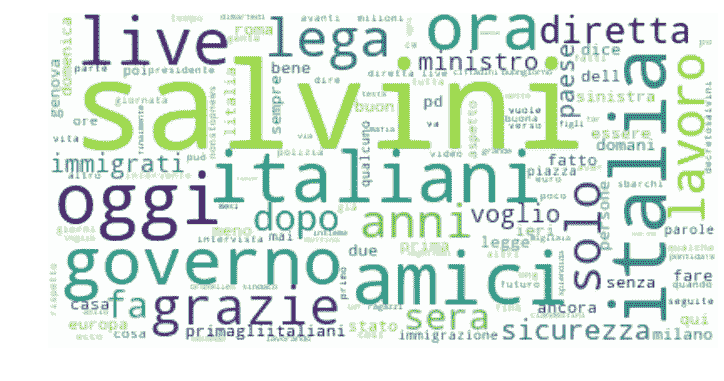
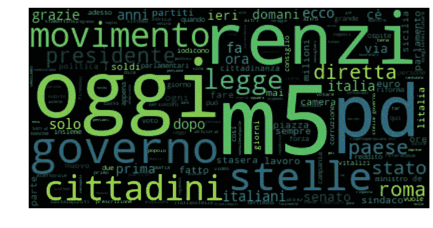
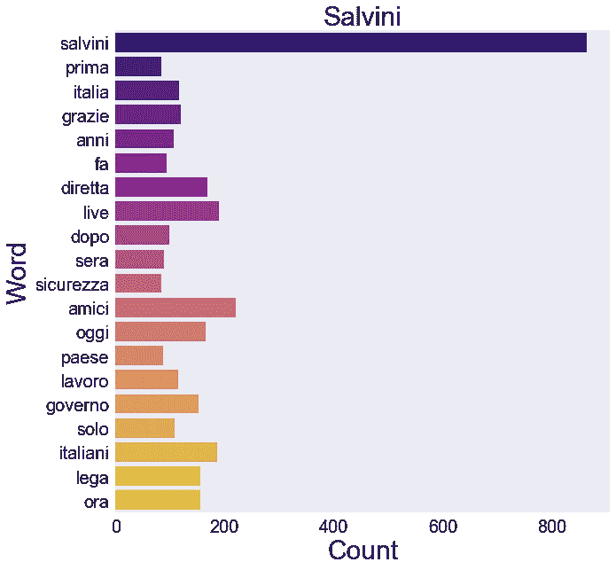
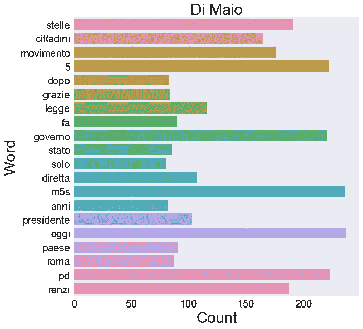
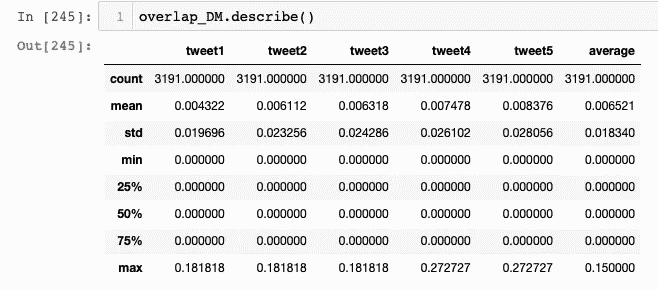

# 不相容性和可预测性——萨尔维尼 vs 迪迈奥:基于推特的分析

> 原文：<https://towardsdatascience.com/incompatibility-and-predictability-salvini-vs-di-maio-a-twitter-based-analysis-131c15fced54?source=collection_archive---------23----------------------->


Luigi Di Maio (left) and Matteo Salvini (right). Image from [liberoquotidiano.it](https://www.liberoquotidiano.it/news/politica/13397185/m5s-minaccia-lega-matteo-salvini-voto-contrario-dl-sicurezza-se-non-leali-su-prescrizione.html)

意大利最近的大选中诞生了所谓的“黄绿”混合联盟，五星运动(5SM)和北方联盟(LN)的议员在两院都占据了多数席位。然而，他们非常不同的政治背景和优先事项正在促成一种令人不安的共存，质疑这两个派别在这样一个独特的机构中的兼容性。然而，联合五星和北方联盟是最低阶层的共同关切，通常通过不可满足的承诺和无视其他政党和/或旧的国家和超国家机构，如欧盟来解决；一句话:民粹主义。

这足以保证意大利政府长期执政(理论上是 5 年)吗？要回答这个问题，我们需要以某种方式量化这两股力量之间的重叠——以他们的领导人路易吉·迪迈奥(5SM)和马泰奥·萨尔维尼(LN)为代表。我在这里要做的是使用 Python 对两位领导人最近的推文进行简单而有意义的分析。我们将看到**重叠被量化为低至约 15%** 。为了补充我的研究，从 [3mi1y](https://medium.com/u/2706256261fa?source=post_page-----131c15fced54--------------------------------) [here](/markov-models-and-trump-tweets-91b0d3f0f1eb) 的帖子中获得灵感，我将衡量——或者更好地说，让你来衡量——两位领导人的可预测性。更准确地说，我将使用一个一阶马尔可夫模型来构建一个 Salvini-和/或 Di Maio-tweet 生成器。

显然，说意大利语的人在充分理解我的结果的真实性方面有优势。然而，这篇文章可能与愿意对 Twitter 数据进行类似分析的用户有关。

# **导入推文**

要导入特定用户的推文，必须申请一个开发者 Twitter 账号，可以在这里[做](https://developer.twitter.com/content/developer-twitter/en.html)。然后，它足以创建一个个人应用程序(激励其使用等)。根据新法规)获得:

*   消费者密钥
*   消费者秘密
*   访问令牌
*   访问令牌秘密

完成后，我们就可以导入推文了。我使用了 tweepy 包，并遵循了这里[报道的步骤](https://stackoverflow.com/questions/42225364/getting-whole-user-timeline-of-a-twitter-user)

```
#fill below with your credentials
consumer_key = '......'
consumer_secret = '...yours...'
access_token = '...'
access_token_secret = '...' auth = tweepy.OAuthHandler(consumer_key, consumer_secret)
auth.set_access_token(access_token, access_token_secret)
api = tweepy.API(auth)collect_tweets_Salvini=[]
collect_tweets_DiMaio=[] for status in tweepy.Cursor(api.user_timeline, screen_name='[@matteosalvinimi](http://twitter.com/matteosalvinimi)').items():
    #Split and re-join to get rid of \n and similar charachters
    temp = status._json['text']    temp = ' '.join(temp.split())
    collect_tweets_Salvini.append(temp)

for status in tweepy.Cursor(api.user_timeline, screen_name='[@luigidimaio](http://twitter.com/luigidimaio)').items():
    temp = status._json['text']
    temp = ' '.join(temp.split())
    collect_tweets_DiMaio.append(temp)
```

这段代码返回两个列表`collect_tweets_...`,其中包含两位政治家的大量推文(每条约 3200 条)。有许多替代的方法可以得到这些，例如见[这里](https://www.alexkras.com/how-to-get-user-feed-with-twitter-api-and-python/)。

# 第一部分:探索性数据分析和重叠测量

## 数据清理和功能定义

在执行任何类型的分析之前，我们需要清理我们的数据。有些类型的推文与我们无关，比如转发。还有，我们想去掉@、#、表情符号等。我定义了以下函数:

用函数`clean_tweets()` 清理一条推文的过程如下:首先用`prune_tweet()`修剪它，它检查推文中的所有单词，如果它们不满足某些要求(例如，如果它们以@)就丢弃或修改它们，这是用`goodWord()`实现的目标。然后，通过`tweet_process()`，删除意大利语中的标点符号和常用词(如冠词)。最后，我们还消除了重复的单词。这整个过程是通过运行以下命令实现的:

```
clean_Salvini = clean_tweets(tweets_Salvini)
clean_DiMaio = clean_tweets(tweets_DiMaio)
```

创建一个列表列表，其中每个元素都是一个不同的干净的 tweet。

一个非常有用的工具来检查每个政治家的推特语料库的组成，是词云。我们展平列表的列表，以生成两位政治家使用的所有单词的集合，并使用它们作为输入来创建单词云。

这是结果



Figure 1: Salvini Twitter wordcloud.



Figure 2: Di Maio Twitter wordcloud.

单词云显示了某种程度的相似性(“governo”、“oggi”、“diretta”的大小差不多)。最明显的区别涉及人名的出现:大量使用“Salvini”一词来称呼 LN 领导人，而使用“Renzi”(前总理和民主党领导人)来称呼 M5S 领导人。我让你在这里下结论，看看下面的单词出现次数会更容易些



Figure 3: Salvini Top 20 words.



Figure 4: Di Maio Top 20 words.

好吧，我真的希望不要在这里得出任何结论，尽可能少一些政治偏见，但事实上,“salvini”这个词的使用超过了两个列表中的所有其他词——大约一个数量级——值得一些评论。这主要是由于两个原因:第一个原因是，LN 领导人喜欢以#Salvini 标签开始他的推文。第二个是对沟通的受害者般的态度，因为许多帖子都报道了其他人对他的评论，萨尔维尼反过来能够以新的方式提出这些评论，以增加选民的支持。你可以通过浏览推文列表来明确检查这一点。

现在，如何衡量两者的重叠部分？自然语言处理中最常见的技术是对每条 tweet 进行矢量化，使其适合数字分析。这涉及到 tweets 的标记化和相关的东西(例如，见这里的)。后一种分析与分类问题特别相关，一个经典的例子是将电子邮件分类为垃圾邮件或不是垃圾邮件。试图将这种方法强加于我们的案例显然是行不通的:就推文相似性而言，Di Maio 被归类为 Salvini 的可能性非常低。最后，我们谈论的是两个不同的人…因此，我将使用的方法如下:

*   以一位政治家为参照，得到他的前 20 个词(图 3，4)；
*   找到他的包含前 20 个列表中最大出现的单词的 5 条推文，通过产生其相对重要性的函数进行加权(前 5 个列表)；
*   将第二位政治家的一条推文`t2`与上面`t1`前五名中的一条推文进行比较。测量它们的重叠，作为出现在`t1`中的`t2`中的单词的分数
*   将如此获得的 5 个重叠部分平均。

用实例来说明这个过程会更容易理解。让我们以萨尔维尼为参照政治家。他的前 20 个单词如图 3 所示。现在，通过扫描推文语料库并计算前 20 个词中的每一个出现的次数，获得了他的推文的相关前 5 名列表，我们首先根据它们在语料库中的出现进行加权。举个例子，最初的推文(被归类为最重要的，看起来有用……)

`'#Salvini: dopo mesi di lavoro offro agli italiani, che mi pagano lo stipendio, non solo il decreto, ma anche un....'`

这对应于删减的 tweet

`'decreto lavoro offro solo dopo salvini pagano stipendio italiani pro mesi'`

包含单词(及其相对权重，参见图 3): ('lavoro '，115)，(' solo '，109)，(' dopo '，98)，(' Salvini '，864)，(' italiani '，186)。因此，这条推文的部分“分数”是:score _ sum = 115+109+98+864+186 = 1372。我们需要考虑到较短的推文获得较高分数的概率较低。然后，我们将分数除以修剪后的 tweet 的长度，在上面的例子中，长度= 11。除此之外，为了执行有意义的分析，我们希望为修剪后的 tweet 的长度设置一个下限，比如 10。每条推文的得分为

> 分数=分数总和/长度* \Theta(长度-10)

其中\Theta (length)是 Heaviside 阶梯函数，正参数为 1，否则为 0。

代码:

现在我们有了前五名的名单，是时候将其中的每一个元素与 Di Maio 的推文进行比较了。对于 Di Maio `t2`的单个推文，五个重叠被量化为每个`t1.`中包含的`t2`中的字数，这产生了 Di Maio 的#总推文(= 3191) x 5 矩阵。我们取每列重叠的最大值，然后取它们的平均值。发现最大值量化为 15%，如介绍中所述(见下文)。好吧，如果你相信这个分析…



Figure 5: Statistical properties of the overlap matrix described above.

# 第二部分:马尔可夫链

最后，我们采用离散时间[马尔可夫链](https://en.wikipedia.org/wiki/Markov_chain)来模拟推文中的领导者。(一阶)马尔可夫链是一个随机过程，其中事件 X_m 在时间 t_m 的可能性只取决于前一时间 t_(m-1)，而没有关于时间 t_(m-2)，t_(m-3)等的记忆。这意味着从 X_1 到 X_n 发生一系列事件的概率可以分解为


其中 p(X_m |X_{m-1})是 X_m 给定 X_{m-1}的条件概率。

为了在我们的 twitter 数据上训练马尔可夫链，我们做了以下事情:

*   取语料库中所有单词的集合
*   固定其中一个，统计其后每隔一个单词的出现次数。
*   归一化以概率的形式转换出现的次数。
*   迭代集合。

例如，在句子“你好，世界，你好，月亮:今天是星期六”中，我们会有一组独特的单词(你好，世界，月亮，今天，是，星期六)。然后，我们固定单词“hello ”,并统计它后面的每个单词在句子中的出现次数:

你好→[你好:0，世界:1，月亮:1，今天:0，是:0，星期六:0]，

将每个计数除以总出现次数= 2，得出一个单词被另一个单词替代的频率(别名概率):

p(世界|你好)= p(月亮|你好)= 0.5，

p(你好|你好)= p(今天|你好)= p(是|你好)= p(星期六|你好)=0。

创建这种对象的 Python 方法是定义字典。我们通过以下函数在我们的 tweets 语料库上执行这个操作

注意这里我们想保留文章，标点符号等。在推特的语料库中。因此，我们只应用功能`prune_tweet()`而不是`clean_tweets()`。正如上面可以看到的，只要提取出任何 4 个标点符号，我就停止生成推文。我们跑

```
clean_Salvini_WP = list(map(prune_tweet,tweets_Salvini))
clean_DiMaio_WP = list(map(prune_tweet,tweets_DiMaio))dict_S = firstMarkov(clean_Salvini_WP)
Salvini = normalizeFirstMarkov(dict_S)dict_DM = firstMarkov(clean_DiMaio_WP)
DiMaio = normalizeFirstMarkov(dict_DM)
```

这是用这种方法生成的几个句子:

萨尔维尼:“意大利的帕索里尼·斯克里韦瓦反对萨尔维尼。7 mesi del centro di invalidità。意大利，rozzo。

迪马约:我是说，意大利是意大利最大的国家。再见，伦佐波利。

他们听起来像他们吗？哈哈哈。

很明显，这个简单的模型可以通过采用更高阶的马尔可夫链或用其他一些来加权概率函数以考虑语言中的常见模式(例如，添加 exra 权重来区分冠词和形容词等)来改进。).或者，人们可以通过任意混合引用两位领导人的话来改变输出。我将把它作为这个简单项目的后续工作。

欢迎建议！

谢谢