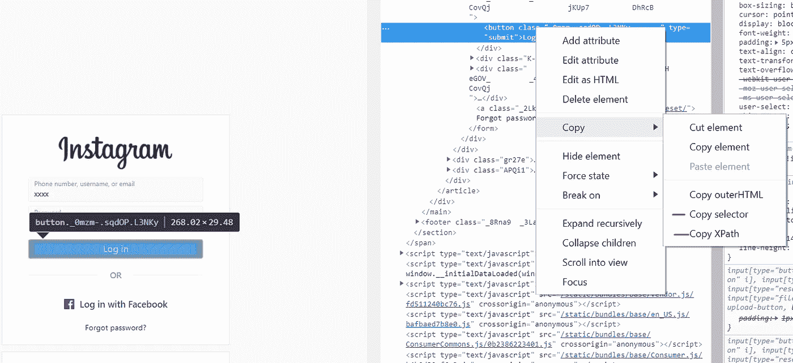
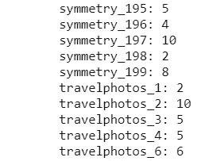
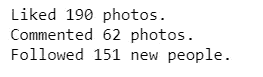
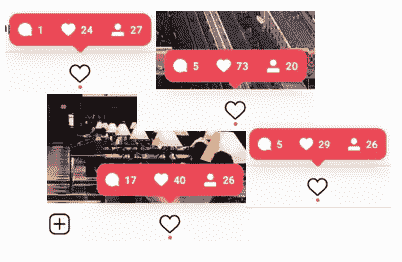
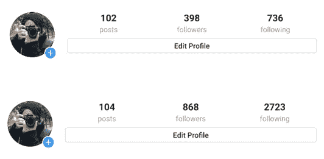

# 用一个简单的 Python 机器人增加你的 Instagram 粉丝

> 原文：<https://towardsdatascience.com/increase-your-instagram-followers-with-a-simple-python-bot-fde048dce20d?source=collection_archive---------0----------------------->

## 我在 4 天内有大约 500 名真正的追随者！

Picture taken by me — Ho Chi Minh City

培养观众是一项昂贵而痛苦的任务。如果你想建立一个与你相关并有共同兴趣的观众群，那就更难了。我总是看到 Instagram 有一个很好的方式来推广我的照片，但我从来没有超过 380 个粉丝...每隔一段时间，我决定再次在 Instagram 上发布我的照片，我设法定期发布一段时间，但从来不会持续超过几个月，我也没有多少粉丝让我保持动力和参与。

> 这个项目的目标是建立一个更大的观众群，并作为一个加号，可能会带动一些交通到我的网站，我卖我的照片！

一年前，在我最后一次运行 Instagram 时，我得到了一个可以让你追踪谁没有关注你的应用程序。我很好奇，因为有几次我的关注者数量莫名其妙地减少了。经过一番研究，我意识到一些用户基本上是如何抓取关注者的。他们评论、喜欢并关注他人——寻找追随者。只是为了在接下来的日子里不再关注他们。

> 我不能说这对我来说是一个惊喜，Instagram 中有机器人…这只是让我想自己建立一个！

这就是我们在这里的原因，让我们开始吧！我用 Python 开发了一个简单的机器人，当时我正在摆弄 Selenium，试图找出一些项目来使用它。简单地说，Selenium 就像一个浏览器，你可以在 Python 中非常容易地与之交互。

理想情况下，增加我的 Instagram 受众会让我有动力定期发布帖子。另外，我在我的个人简介中加入了我的[网站](https://fnevesphotography.pixieset.com/)，人们可以在那里购买一些照片。我认为这有点夸张，但是谁知道呢？！我的销售额到目前为止基本为零，所以跟踪那个转化应该很容易！

*如果你想访问我的其他网络抓取文章——以及媒体上的几乎所有内容——你考虑过订阅吗？你会大力支持我的工作！*

 [## 阅读媒体上的每一个故事！

### 作为一个媒体会员，你的会员费的一部分会给你阅读的作家，你可以完全接触到每一个故事…

medium.com](https://medium.com/@fneves/membership) 

## 正是这个世界所需要的！又一个 Instagram 机器人…

在对这个项目进行了一番思考之后，我的目标是增加与我相关的人的数量。我想得到真正想关注我并看到我更多作品的追随者。在最常用的标签中很容易遇到奇怪的内容，所以我设计了这个机器人来查找特定的标签，并与那里的照片进行交互。通过这种方式，我可以非常具体地了解我希望我的观众有什么样的兴趣。例如，我真的很喜欢长时间曝光，所以我可以瞄准使用这个标签的人，并围绕这种内容建立一个观众群。简单高效！

我的画廊融合了不同的主题和风格，从**街头**摄影到**空中**摄影，还有一些**旅行**照片。因为这是我的家乡，我也有很多里斯本的照片。这些将是我在目标标签中使用的主要话题。

> 这不是一个“在 24 小时内获得 1000 名追随者”的机器人！

## 那么我们在谈论什么样的数字呢？

我在几个不同的标签中运行了几次这个机器人，比如“travelblogger”、“travelgram”、“lisbon”、“dronephotography”。三天之内，我的粉丝从 380 人增加到 800 人。大量的喜欢，评论，甚至一些有机增长(人们关注我，但没有被机器人关注)。

需要说明的是，我并不是在密集使用这个 bot，因为如果你运行得太快，Instagram 就会停止响应。它需要在动作之间有一些睡眠命令，因为在短时间内进行一些评论和跟随后，Instagram 会停止响应，机器人会崩溃。

你将登录到你的帐户，所以我几乎可以肯定，如果你加快这个过程，Instagram 可以知道你在做一些奇怪的事情。最重要的是，在做了十几个标签之后，在相同的标签中寻找新用户变得越来越困难。你需要几天时间来更新那里的用户群。

## 但是我不想在过程中跟着那么多人…

在 Instagram 中获得关注者的最有效方式(除了发布很棒的照片！)就是跟着人走。这个机器人对我来说真的很好，因为我不在乎我是否关注 2000 个人来获得 400 个关注者。

这个机器人保存了一个列表，里面有它运行时被跟踪的所有用户，所以有一天我可能真的会对这个列表做些什么。例如，我可以访问每个用户的个人资料，评估他们有多少关注者或帖子，并决定是否继续关注他们。或者，我可以从他们的图库中获取第一张图片，并检查其日期，看看他们是否是活跃用户。

如果我们从机器人中移除关注行为，我可以向你保证增长率将受到影响，因为人们不太倾向于根据单一的喜欢或评论进行关注。

## 你为什么要分享你的代码？！

这就是我和自己的辩论。即使我真的相信回报社会(我也从中学到了很多！)，有几个付费平台做的和这个项目差不多。有些是黑幕，有些是名人用的。我自己启动一个类似平台的可能性还没有被排除，那么为什么要提供代码呢？

考虑到这一点，我决定给这个过程增加额外的难度，所以我将把代码作为图片发布在**下面。我写了“曾经”，因为与此同时，我意识到我得到的图像是低质量的。这反过来让我重新考虑并张贴要点。我就是那么好！图像背后的想法是，如果你真的想使用它，你必须自己键入代码。这就是我限制这个工具的使用的方法，只限于那些真正经历了整个过程去创造它，甚至可能改进它的人。**

> 当我自己键入代码，而不是复制/粘贴脚本时，我学到了更多。希望你也有同感！

这个剧本没有想象中那么复杂，我知道还有很大的改进空间。但是，嘿… **它起作用了**！我有其他项目，我想添加到我的投资组合，所以我的时间来进一步发展它是相当有限的。尽管如此，如果我深入研究，我会尝试更新这篇文章。

## 这是最后一个字幕！

你需要 Python(我用的是 Python 3.7)、[、Selenium](https://selenium-python.readthedocs.io/) 、一个浏览器(我用的是 Chrome)以及……显然，一个 Instagram 账户！关于机器人将做什么的快速概述:

*   打开浏览器，使用您的凭据登录
*   对于 hashtag 列表中的每一个 hashtag，它都会打开页面，点击第一张图片打开
*   然后，它会喜欢，跟随，评论，并移动到下一张图片，在 200 次迭代循环(数量可以调整)
*   保存您使用 bot 关注的所有用户的列表

如果你到了这一段，谢谢！你完全应该得到你的奖励！如果您发现这对您的个人资料/品牌有任何帮助，请在下面分享您的体验:)

为了配合 Selenium 使用 chrome，你需要安装 [chromedriver](http://chromedriver.chromium.org/) 。这是一个相当简单的过程，我没有任何问题。只需安装和替换上面的路径。一旦你这样做了，我们的变量 *webdriver* 将成为我们的 Chrome 标签。

在 3 号单元格中，您应该用自己的用户名和相应的密码替换字符串。这是为了让机器人在显示的字段中键入它。你可能已经注意到，当运行 2 号单元格时，Chrome 打开了一个新标签。在密码之后，我将登录按钮定义为一个对象，在下面的行中，我单击它。

如果你想知道那些奇怪的弦是什么，不要害怕！在我的 [**文章**](/looking-for-a-house-build-a-web-scraper-to-help-you-5ab25badc83e) 中，关于房地产网站的网页抓取，我也经历过类似的任务，包括检查网页以告诉机器人去哪里找。您可以非常容易地做到这一点，只需右键单击您想要映射的元素，并选择 Inspect。

一旦进入 inspect 模式，找到与您想要映射的内容相对应的 html 代码。右键单击它并将鼠标悬停在复制上。您将看到，对于如何复制它，您有一些选项。我在整个代码中混合使用了 XPath 和 css 选择器(在 *find_element_* 方法中可以看到)。我花了一段时间让所有的参考顺利运行。有时，css 或 xpath 指示会失败，但是当我调整睡眠时间时，一切开始平稳运行。

在本例中，我选择了“复制选择器”并将其粘贴到一个 *find_element_* 方法中(单元格编号 3)。它会给你找到的第一个结果。如果是 *find_elements_* ，将检索所有元素，您可以指定要获取哪个元素。

一旦你做到了这一点，时间的循环。您可以在 *hashtag_list* 中添加更多的 hashtag。如果您第一次运行它，您仍然没有您所关注的用户的文件，因此您可以简单地创建 *prev_user_list* 作为空列表。

一旦你运行一次，它将保存一个带有时间戳的 csv 文件。该文件将在您第二次运行时用作 *prev_user_list* 。简单且容易跟踪机器人做了什么。

在接下来的运行中使用最新的时间戳进行更新，每次运行 bot 时，您都会得到一系列 csv 积压文件。

代码非常简单。如果你对 Python 有一些基本的概念，你可能会很快学会。我不是 Python 忍者，我能够创建它，所以我想如果你读到这里，你就可以开始了！

循环中的 print 语句是我发现能够有一个跟踪器的方式，它让我知道机器人一直处于哪个迭代。它将打印它所在的标签、迭代的编号以及为注释动作生成的随机数。我决定不在每一页都发表评论，所以我添加了三个不同的评论和一个 1 到 10 之间的随机数来定义是否有任何评论，或者是三个中的一个。循环结束后，我们将 new_followed 用户添加到先前用户的“数据库”中，并保存带有时间戳的新文件。你也应该得到一份小报告。

> 就是这样！

在几个小时没有检查电话之后，这些是我得到的号码。我绝对没有想到它会做得这么好！在我开始测试它的 4 天里，我有了大约 500 个新的追随者，这意味着我的观众在几天内翻了一番。我很好奇接下来几天我会失去多少新粉丝，看看这种增长是否可以持续。在我最新的照片中，我也有很多“赞”,但我猜这比后面的照片更令人期待。

I didn’t get the screenshot at the exact start of the bot, but you get the idea!

如果能让这个机器人在服务器上运行就好了，但是我还有其他项目要探索，配置服务器不在其中！欢迎在下面留言，我会尽力回答你的问题。

如果你想更认真地对待这个问题，我强烈推荐这些书:

*   用 Python 进行网页抓取—[https://amzn.to/3QRGzYt](https://amzn.to/3QRGzYt)
*   实用网页抓取—【https://amzn.to/3cyRVli 

Picture taken by me — Azores

*感谢阅读！如果你喜欢这篇文章，我邀请你看看我的其他故事。我主要感兴趣的是数据科学、Python、区块链和数字货币、技术，以及其他一些东西，如* [***摄影***](https://fnevesphotography.pixieset.com/?utm_source=tdsinst) *！*

*如果你想取得联系，可以在这里联系我****或者直接回复下面的文章。***

***声明:本文中的一些链接是附属链接。这意味着，对你来说零成本，如果你通过链接完成购买，我将赚取代销商佣金！***