# 使用交互式代码在 Numpy 和 Tensorflow 中通过梯度上升进行独立分量分析

> 原文：<https://towardsdatascience.com/independent-component-analysis-via-gradient-ascent-in-numpy-and-tensorflow-with-interactive-code-98b9a73e5d19?source=collection_archive---------4----------------------->

GIF from this [website](https://giphy.com/gifs/animation-car-pretty-8rE46GISKreDDKUbMF)

我想了解更多关于独立分量分析的知识，我发现实际上有多种方法来计算这种运算。

> **请注意，这篇帖子是为了我对 ICA 更深入的了解。**

**计算独立分量分析的演进**

首先，Bell 和 Sejnowski 使用 infomax 原理开发了原始 ICA。(于 1991 / 1994 年提出)。

Paper from this [website](http://www.inf.fu-berlin.de/lehre/WS05/Mustererkennung/infomax/infomax.pdf)

还有使用[定点算法](http://www.cis.hut.fi/projects/ica/fastica/fp.shtml)的 FastICA。(1997 年提交)

Paper from this [website](https://www.cs.helsinki.fi/u/ahyvarin/papers/NC97.pdf)

还有从 [Inria](https://www.inria.fr/en/) 出发的 FasterICA。(2017 年呈现)

Paper from this [website](https://arxiv.org/pdf/1711.10873.pdf)

我对 ICA 如此着迷的原因之一是因为它的悠久传统。如上所述，从 1991 年到 2017 年，各种研究人员一直在研究这种方法。最后，我不太确定这个 pdf 是什么时候创建的，但是有一种方法可以通过 Andrew NG 的随机梯度下降来执行 ICA。

Paper from this [website](http://cs229.stanford.edu/notes/cs229-notes11.pdf)

**带梯度上升的 ICA**

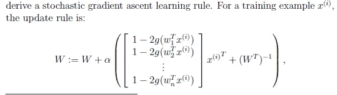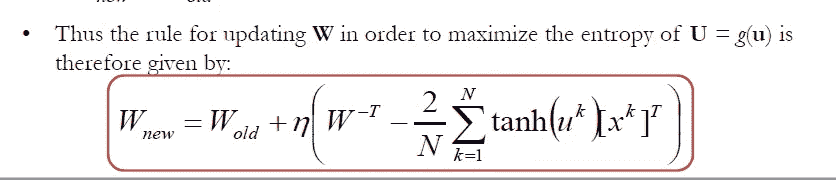

Andrew Ng’s Gradient Ascent (left) [Shireen Elhabian’s](https://www.sci.utah.edu/people/shireen.html) Gradient Ascent (Right) ([source](http://www.sci.utah.edu/~shireen/pdfs/tutorials/Elhabian_ICA09.pdf))

现在，当使用梯度上升执行 ICA 时，没有一个可靠的公式可以遵循。在我们不知道源密度的情况下，Ng 教授建议我们使用 Sigmoid 函数作为累积分布函数，但是 Elhabian 教授使用了 tanh 函数。(所以我想这真的取决于具体情况。).

我不会深入讨论梯度上升法的细节，因为我高度推荐论文本身，而是总结一下。

设 x = As 其中 x 是变换后的数据，A 是变换矩阵，s 是原始信号。我们要做的是估计 A，这样我们就可以恢复原始信号。当我们设置 A^-1 = W 时，我们可以很容易地看到 w 来自哪里。现在让我们来看看这种方法与 FastICA 相比如何。

**使用 ICA 的 2D 数据分离**

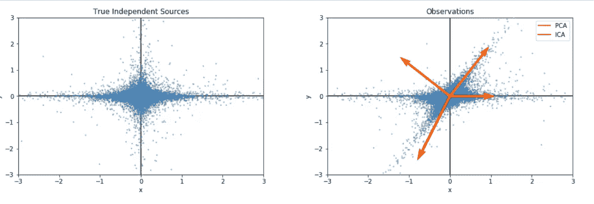

让我们首先从最简单的情况开始，如上所示，我们有两个真正独立的数据源作为散点图 2D。经过一些变换后，我们得到了如右图所示的散点图。我们已经可以看到，对于 PCA，新的基向量是相互正交的，它们指向数据中最大方差的位置。然而，对于 ICA 来说，新的基向量指向数据彼此最独立的方向。

在看结果之前，下面是我实现的代码的屏幕截图。我们将使用 FastICA、PCA、带 Sigmoid 的 ICA 和带 tanh 的 ICA。

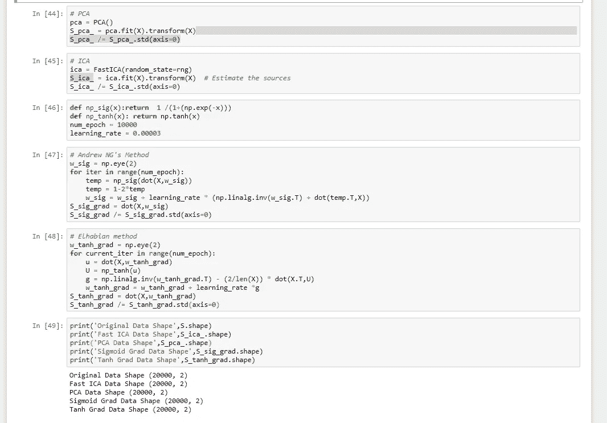

如上所述，在最后阶段，我们可以观察到每种方法都(以自己的方式尝试)来恢复原始信号。注意，对于 epoch，我使用 10000 作为总迭代次数，学习率为 0.00003。

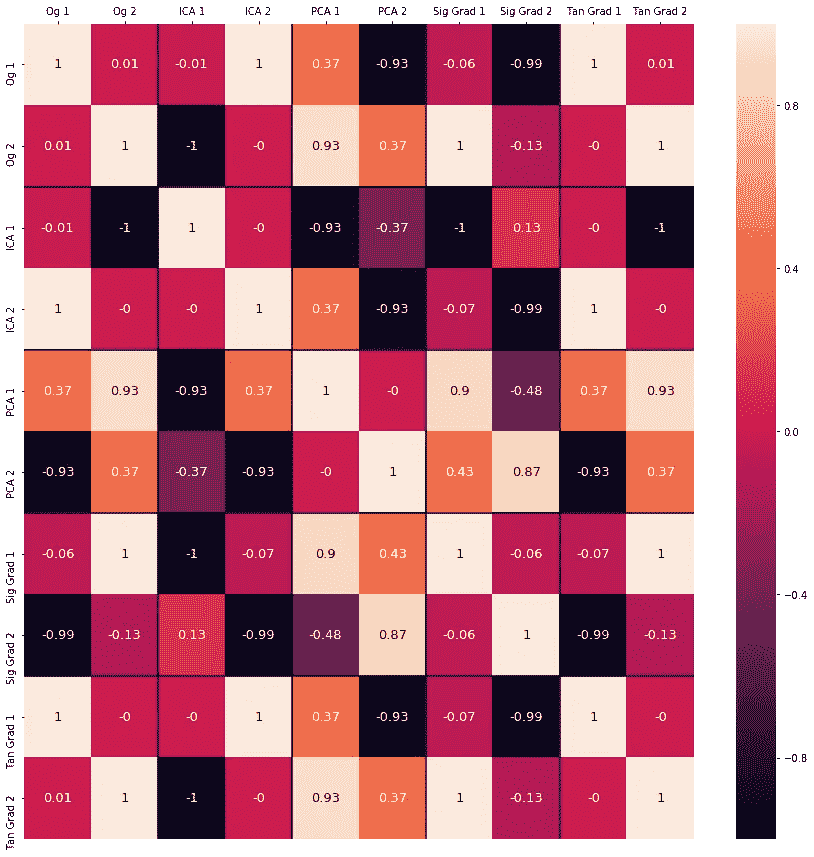

接下来，当我们绘制相关矩阵时，我们可以观察到类似上面的情况，我们可以安全地忽略除了前两行之外的所有内容。(让我们仔细看看它们)。

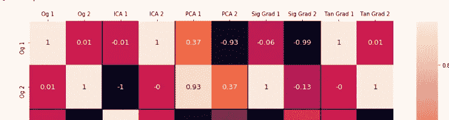

我们可以观察到 FastICA 在将数据分解成独立组件方面做得很好。(尽管变量发生了逆转，但这并不是一个大问题。)对于 PCA，我们可以看到不同变量之间仍然存在一些相关值。最后，使用双曲正切函数可以更好地分解数据。

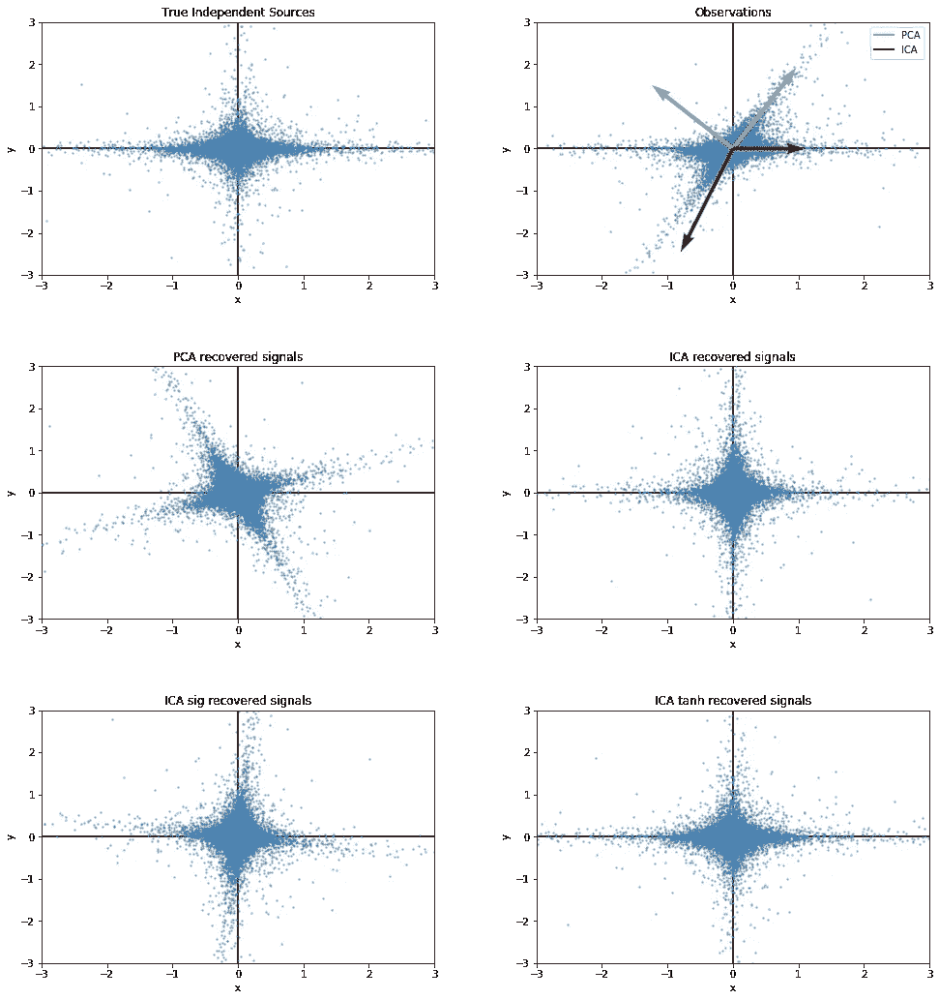

当我们绘制每种方法的散点图时，我们可以清楚地看到 FastICA 和带双曲正切函数的 ICA 在分解方面做得最好。

**使用 ICA 的波形数据分离**

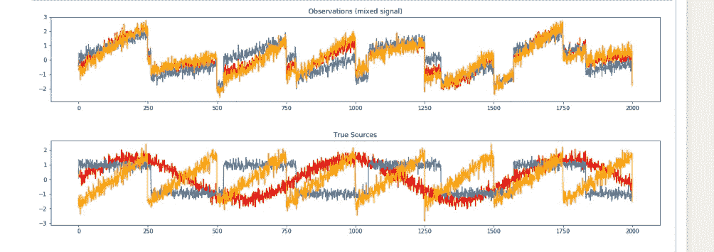

现在使用 sklean ICA 的例子，让我们看看梯度上升 ICA 如何处理波浪数据。同样，我们可以看到，对于这个例子，三个不同的信号通过某个随机变换矩阵 a 组合在一起。

如上所述，让我们首先使用 FastICA 和 PCA 来恢复原始信号。

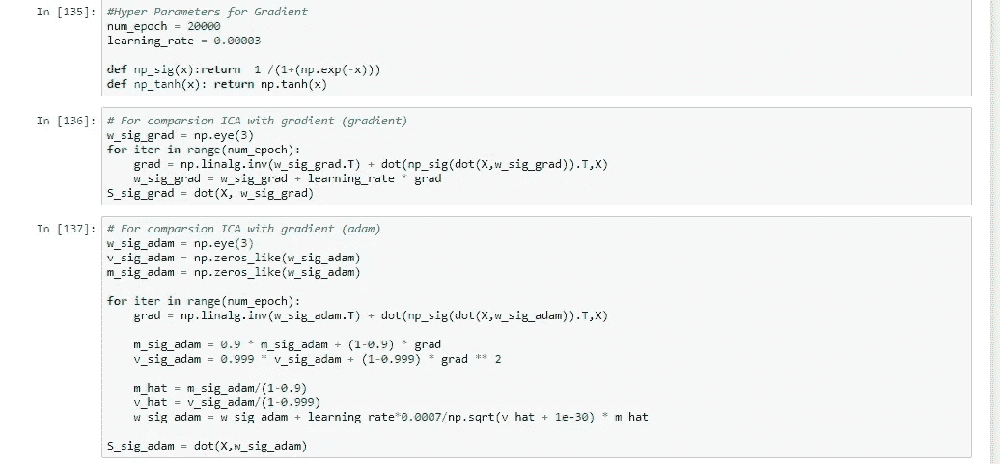

为了让事情更有趣，让我们使用正常梯度更新规则，以及亚当优化器来更新权重 w。(并看看他们如何比较。)上述 ICA 梯度上升方法对 CDF 使用 sigmoid 函数。

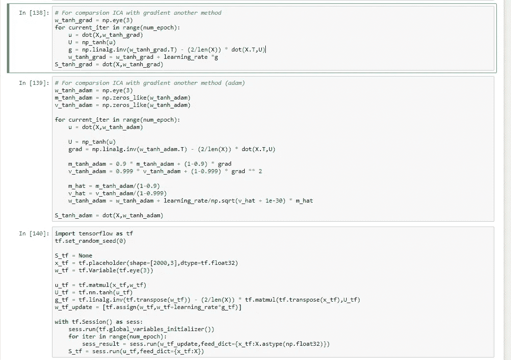

最后，让我们使用双曲正切函数作为 cdf，看看哪个性能更好。此外，我还使用 tensorflow 实现了相同的技术。

如上所述，当所有的分解都完成时，我们可以观察到所有的方法都产生它们的恢复信号版本。

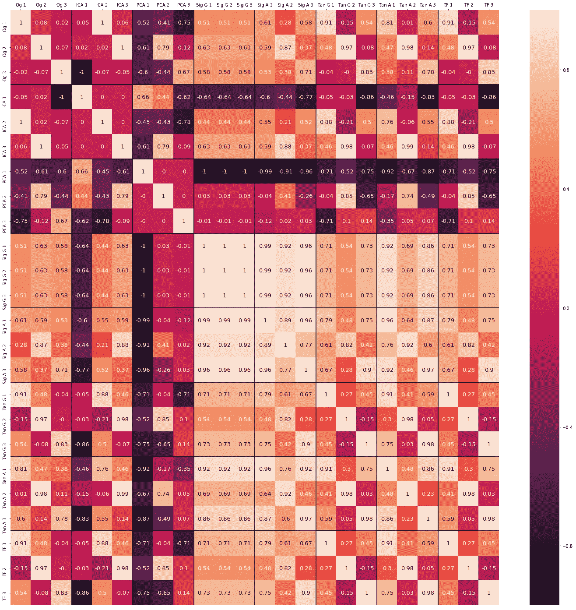

同样，我们可以画出相关矩阵，看看每种方法是如何执行的。

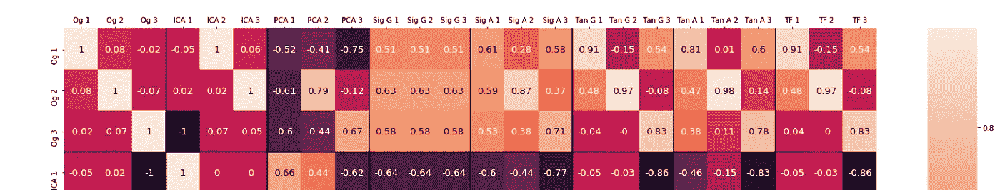

同样，我们只需看到前三行，显然 FastICA 在分解信号方面做得最好。对于 PCA，我们可以看到两个信号被恢复(部分)，但是在不同信号之间仍然具有一些相关值。对于所有的梯度上升方法，我们可以看到 tanh 结合正常梯度更新规则产生了最好的结果。

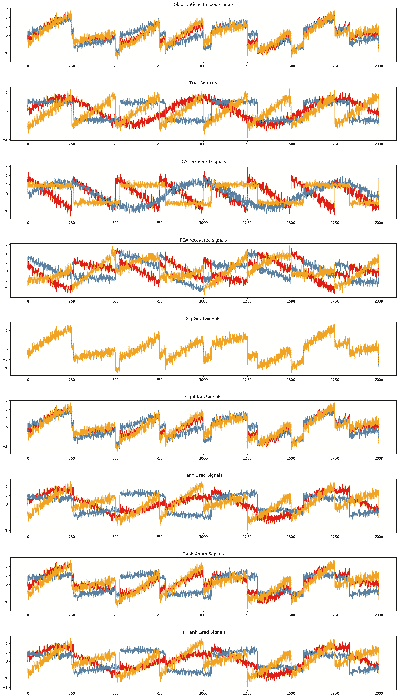

当我们可视化结果信号时，我们可以看到 FastICA 做得最好。

**互动码**

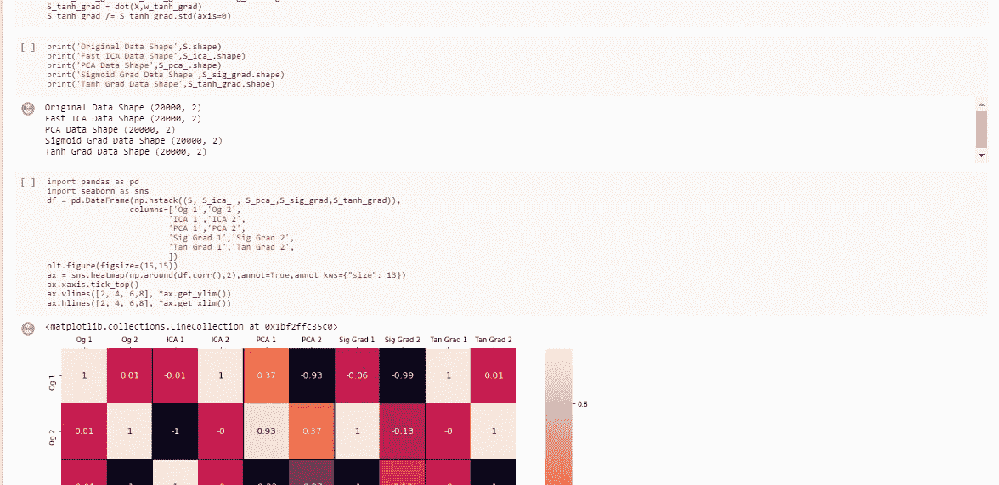

*对于谷歌实验室，你需要一个谷歌帐户来查看代码，你也不能在谷歌实验室运行只读脚本，所以在你的操场上做一个副本。最后，我永远不会请求允许访问你在 Google Drive 上的文件，仅供参考。编码快乐！*

有关 2D 数据分离的代码，请点击此处。
有关波形数据分离的代码[请点击此处。](https://colab.research.google.com/drive/18iEkcQ7IJ8cgJlsb-LyX_vUFHr4IFWM0)

**遗言**

研究 Andrew NG 和 Elhabian 教授的工作是一种荣誉，因为现在我们可以直接通过 back prop，我们可以大胆地做一些非常非常有趣的事情😉

如果发现任何错误，请发电子邮件到 jae.duk.seo@gmail.com 给我，如果你想看我所有写作的列表，请在这里查看我的网站。

同时，在我的 twitter [这里](https://twitter.com/JaeDukSeo)关注我，并访问[我的网站](https://jaedukseo.me/)，或我的 [Youtube 频道](https://www.youtube.com/c/JaeDukSeo)了解更多内容。我也实现了[广残网，请点击这里查看博文 pos](https://medium.com/@SeoJaeDuk/wide-residual-networks-with-interactive-code-5e190f8f25ec) t。

**参考**

1.  熊猫，R. (2018)。重命名 pandas 中的列。堆栈溢出。检索于 2018 年 7 月 14 日，来自[https://stack overflow . com/questions/11346283/rename-columns-in-pandas](https://stackoverflow.com/questions/11346283/renaming-columns-in-pandas)
2.  seaborn . heat map-seaborn 0 . 8 . 1 文档。(2018).Seaborn.pydata.org。检索于 2018 年 7 月 14 日，来自[https://seaborn.pydata.org/generated/seaborn.heatmap.html](https://seaborn.pydata.org/generated/seaborn.heatmap.html)
3.  matplotlib？，H. (2018)。如何改变用 matplotlib 绘制的图形的大小？。堆栈溢出。检索于 2018 年 7 月 14 日，来自[https://stack overflow . com/questions/332289/how-do-you-change-the-size-of-figures-drawn-with-matplotlib](https://stackoverflow.com/questions/332289/how-do-you-change-the-size-of-figures-drawn-with-matplotlib)
4.  标签，M. (2018)。Matplotlib 颜色根据类别标签。堆栈溢出。检索于 2018 年 7 月 14 日，来自[https://stack overflow . com/questions/12487060/matplotlib-color-by-class-labels](https://stackoverflow.com/questions/12487060/matplotlib-color-according-to-class-labels)
5.  /ml/机器学习数据库/鲍鱼索引。(2018).Archive.ics.uci.edu。检索于 2018 年 7 月 14 日，来自[http://archive . ics . UCI . edu/ml/machine-learning-databases/鲍鱼/](http://archive.ics.uci.edu/ml/machine-learning-databases/abalone/)
6.  熊猫。data frame . plot . scatter—pandas 0 . 23 . 1 文档。(2018).Pandas.pydata.org。检索于 2018 年 7 月 14 日，来自[https://pandas . py data . org/pandas-docs/version/0.23/generated/pandas。DataFrame.plot.scatter.html](https://pandas.pydata.org/pandas-docs/version/0.23/generated/pandas.DataFrame.plot.scatter.html)
7.  法，一.(2018)。使用 pandas plot 方法设置图形大小时不一致。堆栈溢出。检索于 2018 年 7 月 14 日，来自[https://stack overflow . com/questions/42215252/consistency-when-setting-figure-size-using-pandas-plot-method](https://stackoverflow.com/questions/42215252/inconsistency-when-setting-figure-size-using-pandas-plot-method)
8.  熊猫。data frame . plot-pandas 0 . 23 . 1 文档。(2018).Pandas.pydata.org。检索于 2018 年 7 月 14 日，来自[http://pandas . pydata . org/pandas-docs/version/0.23/generated/pandas。DataFrame.plot.html](http://pandas.pydata.org/pandas-docs/version/0.23/generated/pandas.DataFrame.plot.html)
9.  xaxis，P. (2018 年)。熊猫数据框线图显示 x 轴上的日期。堆栈溢出。检索于 2018 年 7 月 14 日，来自[https://stack overflow . com/questions/44213781/pandas-data frame-line-plot-display-date-on-xaxis](https://stackoverflow.com/questions/44213781/pandas-dataframe-line-plot-display-date-on-xaxis)
10.  带颜色散点图缺少 xticks 问题#10611 pandas-dev/pandas。(2018).GitHub。检索于 2018 年 7 月 14 日，来自[https://github.com/pandas-dev/pandas/issues/10611](https://github.com/pandas-dev/pandas/issues/10611)
11.  numpy.linalg.inv — NumPy v1.14 手册。(2018).Docs.scipy.org。检索于 2018 年 7 月 14 日，来自[https://docs . scipy . org/doc/numpy-1 . 14 . 0/reference/generated/numpy . Lina LG . inv . html](https://docs.scipy.org/doc/numpy-1.14.0/reference/generated/numpy.linalg.inv.html)
12.  NumPy . eye—NumPy 1.14 版手册。(2018).Docs.scipy.org。检索于 2018 年 7 月 14 日，来自[https://docs . scipy . org/doc/numpy/reference/generated/numpy . eye . html](https://docs.scipy.org/doc/numpy/reference/generated/numpy.eye.html)
13.  使用 FastICA 的盲源分离—sci kit—学习 0.19.1 文档。(2018).Scikit-learn.org。检索于 2018 年 7 月 14 日，来自[http://sci kit-learn . org/stable/auto _ examples/decomposition/plot _ ICA _ blind _ source _ separation . html # sphx-glr-auto-examples-decomposition-plot-ICA-blind-source-separation-py](http://scikit-learn.org/stable/auto_examples/decomposition/plot_ica_blind_source_separation.html#sphx-glr-auto-examples-decomposition-plot-ica-blind-source-separation-py)
14.  2D 点云上的 FastICA-sci kit-了解 0.19.1 文档。(2018).Scikit-learn.org。2018 年 7 月 14 日检索，来自[http://sci kit-learn . org/stable/auto _ examples/decomposition/plot _ ICA _ vs _ PCA . html # sphx-glr-auto-examples-decomposition-plot-ICA-vs-PCA-py](http://scikit-learn.org/stable/auto_examples/decomposition/plot_ica_vs_pca.html#sphx-glr-auto-examples-decomposition-plot-ica-vs-pca-py)
15.  梯度下降优化算法综述。(2016).塞巴斯蒂安·鲁德。检索于 2018 年 7 月 14 日，来自 http://ruder.io/optimizing-gradient-descent/index.html#adam
16.  2D 点云上的 FastICA-sci kit-了解 0.19.1 文档。(2018).Scikit-learn.org。检索于 2018 年 7 月 14 日，来自[http://sci kit-learn . org/stable/auto _ examples/decomposition/plot _ ICA _ vs _ PCA . html](http://scikit-learn.org/stable/auto_examples/decomposition/plot_ica_vs_pca.html)
17.  Python？，H. (2018)。如何用 Python 计算一个 logistic sigmoid 函数？。堆栈溢出。检索于 2018 年 7 月 14 日，来自[https://stack overflow . com/questions/3985619/how-to-calculate-a-logistic-sigmoid-function-in-python](https://stackoverflow.com/questions/3985619/how-to-calculate-a-logistic-sigmoid-function-in-python)
18.  matplotlib？，H. (2018)。如何改变用 matplotlib 绘制的图形的大小？。堆栈溢出。检索于 2018 年 7 月 14 日，来自[https://stack overflow . com/questions/332289/how-do-you-change-the-size-of-figures-drawn-with-matplotlib](https://stackoverflow.com/questions/332289/how-do-you-change-the-size-of-figures-drawn-with-matplotlib)
19.  NumPy . arctan—NumPy 1.14 版手册。(2018).Docs.scipy.org。检索于 2018 年 7 月 14 日，来自[https://docs . scipy . org/doc/numpy/reference/generated/numpy . arctan . html](https://docs.scipy.org/doc/numpy/reference/generated/numpy.arctan.html)
20.  NumPy . arctan—NumPy 1.14 版手册。(2018).Docs.scipy.org。检索于 2018 年 7 月 14 日，来自[https://docs . scipy . org/doc/numpy/reference/generated/numpy . arctan . html](https://docs.scipy.org/doc/numpy/reference/generated/numpy.arctan.html)
21.  价值观？，h. (2018)。如何解释 numpy.correlate 和 numpy.corrcoef 值？。堆栈溢出。检索于 2018 年 7 月 14 日，来自[https://stack overflow . com/questions/13439718/how-to-interpret-numpy-correlate-and-numpy-corrcoef-values](https://stackoverflow.com/questions/13439718/how-to-interpret-numpy-correlate-and-numpy-corrcoef-values)
22.  Python，C. (2018)。在 Python 中计算皮尔逊相关和重要性。堆栈溢出。检索于 2018 年 7 月 14 日，来自[https://stack overflow . com/questions/3949226/calculating-Pearson-correlation-and-significance-in-python](https://stackoverflow.com/questions/3949226/calculating-pearson-correlation-and-significance-in-python)
23.  相关系数:简单的定义，公式，简单的步骤。(2018).统计学如何？检索于 2018 年 7 月 14 日，来自[http://www . statistics show to . com/probability-and-statistics/correlation-coefficient-formula/](http://www.statisticshowto.com/probability-and-statistics/correlation-coefficient-formula/)
24.  SciPy . stats . Pearson r—SciPy v 1 . 1 . 0 参考指南。(2018).Docs.scipy.org。检索于 2018 年 7 月 14 日，来自[https://docs . scipy . org/doc/scipy/reference/generated/scipy . stats . Pearson r . html](https://docs.scipy.org/doc/scipy/reference/generated/scipy.stats.pearsonr.html)
25.  inria——数字世界的发明者。(2018).因里亚。检索于 2018 年 7 月 14 日，来自[https://www.inria.fr/en/](https://www.inria.fr/en/)
26.  (2018).INF . fu-Berlin . de . 2018 年 7 月 14 日检索，来自[http://www . INF . fu-Berlin . de/le hre/WS05/musterekennung/info max/info max . pdf](http://www.inf.fu-berlin.de/lehre/WS05/Mustererkennung/infomax/infomax.pdf)
27.  下载 FastICA。(2018).Research.ics.aalto.fi 于 2018 年 7 月 14 日检索，来自[https://research.ics.aalto.fi/ica/fastica/code/dlcode.shtml](https://research.ics.aalto.fi/ica/fastica/code/dlcode.shtml)
28.  (2018).Cs.helsinki.fi 于 2018 年 7 月 14 日检索，来自[https://www.cs.helsinki.fi/u/ahyvarin/papers/NC97.pdf](https://www.cs.helsinki.fi/u/ahyvarin/papers/NC97.pdf)
29.  CS229:机器学习。(2018).Cs229.stanford.edu。检索于 2018 年 7 月 14 日，来自[http://cs229.stanford.edu/syllabus.html](http://cs229.stanford.edu/syllabus.html)
30.  (2018).Cs229.stanford.edu。检索于 2018 年 7 月 14 日，来自 http://cs229.stanford.edu/notes/cs229-notes11.pdf
31.  数组？，H. (2018)。如何用几个 numpy 1d 数组创建熊猫数据帧？。堆栈溢出。检索于 2018 年 7 月 14 日，来自[https://stack overflow . com/questions/45399950/how-to-create-a-pandas-data frame-with-numpy-1d-arrays](https://stackoverflow.com/questions/45399950/how-to-create-a-pandas-dataframe-with-several-numpy-1d-arrays)
32.  剧情？，H. (2018)。如何更改 seaborn 图的图形大小？。堆栈溢出。检索于 2018 年 7 月 14 日，来自[https://stack overflow . com/questions/31594549/how-do-I-change-the-figure-size-for-a-seaborn-plot](https://stackoverflow.com/questions/31594549/how-do-i-change-the-figure-size-for-a-seaborn-plot)
33.  matplotlib？，H. (2018)。如何改变用 matplotlib 绘制的图形的大小？。堆栈溢出。检索于 2018 年 7 月 14 日，来自[https://stack overflow . com/questions/332289/how-do-you-change-the-size-of-figures-drawn-with-matplotlib](https://stackoverflow.com/questions/332289/how-do-you-change-the-size-of-figures-drawn-with-matplotlib)
34.  热图标注字体大小问题#430 mwaskom/seaborn。(2018).GitHub。检索于 2018 年 7 月 14 日，来自[https://github.com/mwaskom/seaborn/issues/430](https://github.com/mwaskom/seaborn/issues/430)
35.  热图，L. (2018)。在 seaborn heatmap 中分隔组的线条。堆栈溢出。检索于 2018 年 7 月 14 日，来自[https://stack overflow . com/questions/39352932/lines-to-separate-groups-in-seaborn-heat map](https://stackoverflow.com/questions/39352932/lines-to-separate-groups-in-seaborn-heatmap)
36.  tf.eye |张量流。(2018).张量流。检索于 2018 年 7 月 14 日，来自[https://www.tensorflow.org/api_docs/python/tf/eye](https://www.tensorflow.org/api_docs/python/tf/eye)
37.  TF . global _ variables _ initializer | tensor flow。(2018).张量流。检索于 2018 年 7 月 14 日，来自[https://www . tensor flow . org/API _ docs/python/TF/global _ variables _ initializer](https://www.tensorflow.org/api_docs/python/tf/global_variables_initializer)
38.  重新启动，R. (2018)。无需重启即可重置 IPython 内核。堆栈溢出。检索于 2018 年 7 月 14 日，来自[https://stack overflow . com/questions/35492914/reset-an-ipython-kernel-without-restart](https://stackoverflow.com/questions/35492914/reset-an-ipython-kernel-without-restarting)
39.  人们。(2018).Sci.utah.edu。检索于 2018 年 7 月 14 日，来自 https://www.sci.utah.edu/people/shireen.html
40.  (2018).Sci.utah.edu。检索于 2018 年 7 月 14 日，来自[http://www . sci . Utah . edu/~ shire en/pdf/tutorials/El habian _ ICA 09 . pdf](http://www.sci.utah.edu/~shireen/pdfs/tutorials/Elhabian_ICA09.pdf)
41.  matplotlib，M. (2018)。在 matplotlib 中将 x 轴移动到绘图顶部。堆栈溢出。检索于 2018 年 7 月 14 日，来自[https://stack overflow . com/questions/14406214/moving-x-axis-to-the-top-of-a-plot-in-matplotlib](https://stackoverflow.com/questions/14406214/moving-x-axis-to-the-top-of-a-plot-in-matplotlib)