# 奥运会上的印度

> 原文：<https://towardsdatascience.com/india-at-the-olympics-d3b1c4e1468d?source=collection_archive---------12----------------------->

对青年事务和体育部的建议

在亚运会上，印度共获得 671 枚奖牌，排名第六。在英联邦运动会上，印度共获得 504 枚奖牌，排名第四。然而，在奥运会上，印度只获得了 28 枚奖牌，排名第 67 位。数据分析可用于为青年事务和体育部(GOI)提供建议，以提高印度在奥运会上的表现。分析流程图如下所示

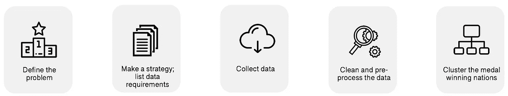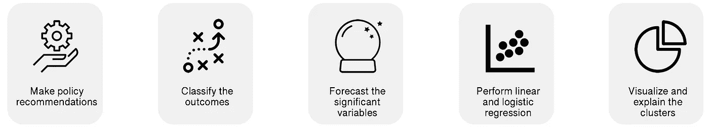

分析的每个阶段的主要结果如下所示。

**层次聚类**

通过对参加过奥运会的国家进行聚类(基于每个国家在过去 120 年中获得的奖牌数量)，我们发现有三个主要的聚类——一个是美国单独的聚类(红色聚类)，第二个是 19 个国家的聚类(黄色聚类)，第三个(蓝色)是世界其他国家(包括印度)的聚类。印度在蓝色集群中，下一步将进入第二集群(黄色集群)，在一届夏季奥运会上赢得至少 53 枚*奖牌。*

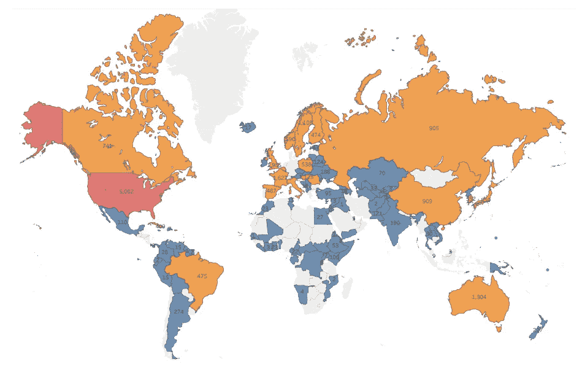

**解释集群**

上述分组可以用各国在人口、人均国内生产总值、平均人类发展指数、公共卫生支出占国内生产总值的百分比、预期寿命以及平均教育指数方面的巨大差异来解释。

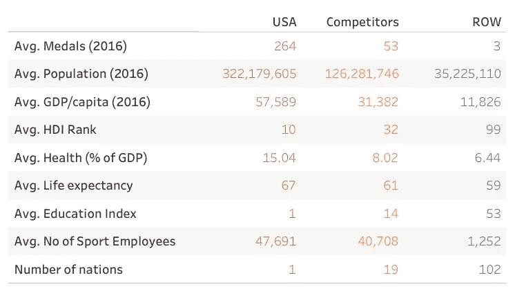

在所有这些变量中，选择其中四个用于下一阶段，即。人口、人均 GDP、预期寿命和公共卫生支出的回归分析。

**多元线性回归**

所选变量的散点图显示，人口和人均国内生产总值具有指数模式，如果进行转换，效果会更好。

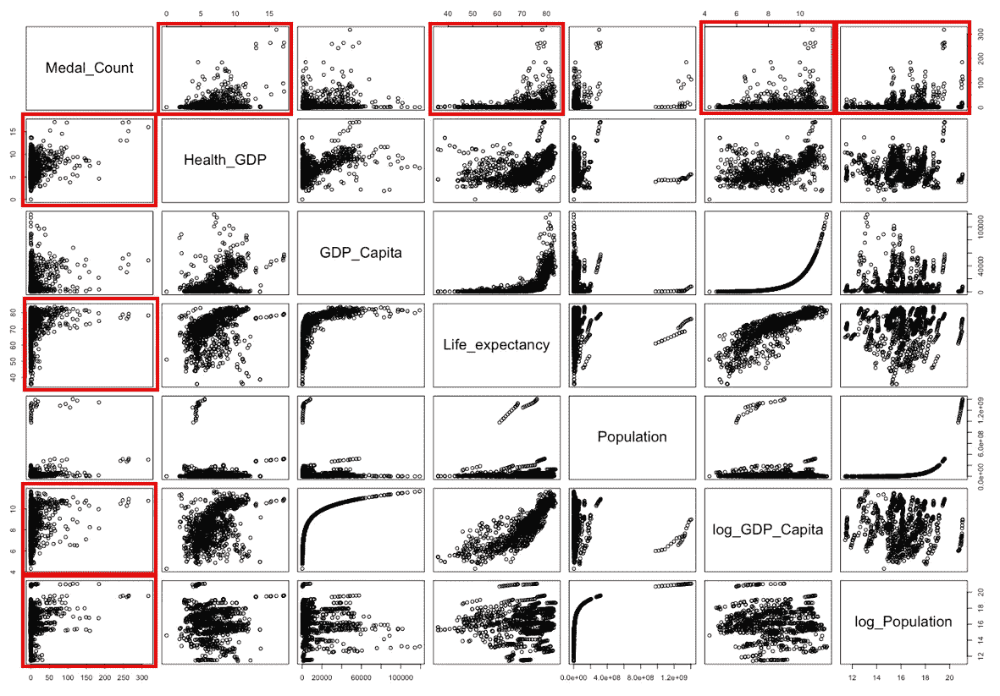

“顺序替换”方法用于选择多元线性回归的最佳子集，即获得的奖牌数回归到公共卫生支出、预期寿命、log(人均 GDP)和 log(人口)上。

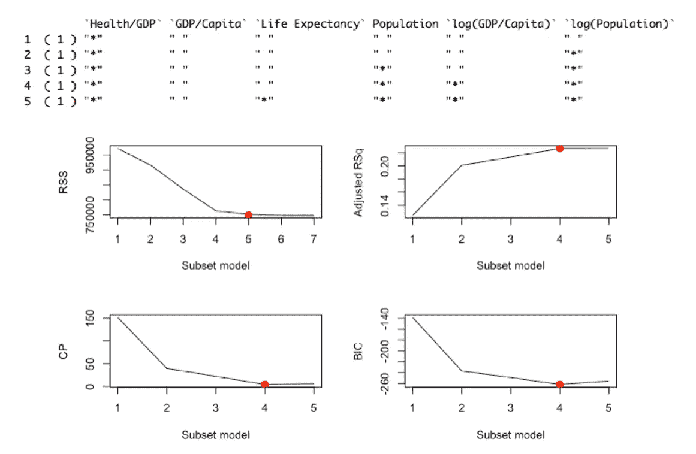

在进行删除诊断之后，回归模型在独立变量中具有显著的 F 统计量以及显著的β系数；也满足多元线性回归的假设。

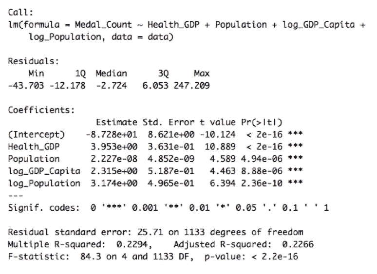

然而，该模型的调整后 R 平方较低，仅为 22%。该模型的可视化显示，它在预测奖牌数量方面做得不太好。

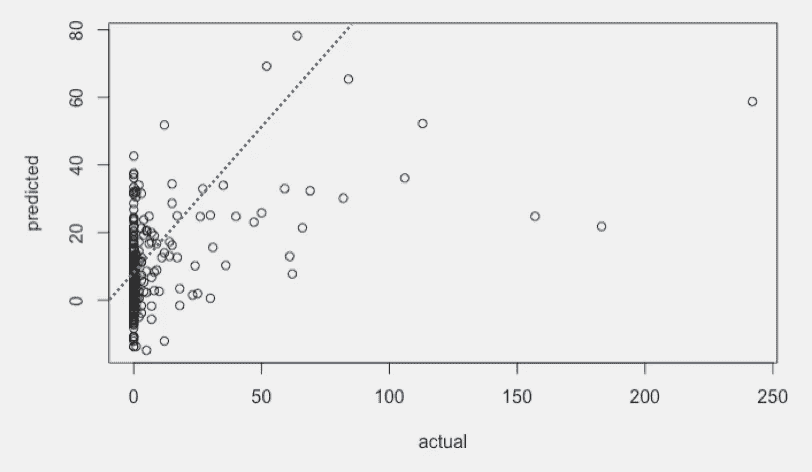

因此，考虑使用逻辑回归模型。

**逻辑回归**

各国获得的奖牌数转化为一个二元变量，1 代表“53 块奖牌及以上”，0 代表“53 块奖牌以下”。“穷尽”模型选择方法为逻辑回归提供了相同的变量子集，即公共卫生支出、预期寿命、log(国内生产总值/人均)和 log(人口),具有最低 AIC 值。

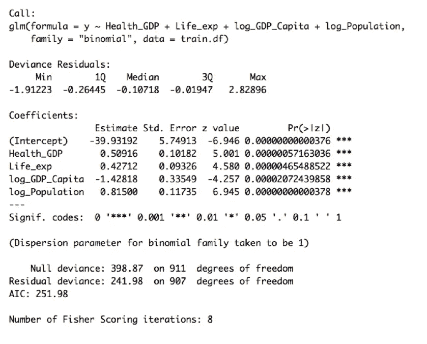

负截距意味着当所有自变量都为 0 时，印度获得 53 枚以上奖牌的几率不到 50%。公共卫生支出每增加 1%,获得 53 枚以上奖牌的几率就会增加 0.50916，即增加 66%。同样，预期寿命增加 1 岁，赢得 53 枚以上奖牌的概率对数可能增加 0.42712，即增加 53%。此外，人均 GDP 每增加 k 倍，k^1.42818 时报获得超过 53 枚奖牌的几率就会降低；人口每增加 k 倍，k^0.815 时报获得超过 53 枚奖牌的几率就会增加。

回归诊断表明，logit 与数据拟合得很好，没有自相关，并且伪 R 平方度量更好(比线性模型更好)。然而，VIF 值高于多元线性回归，表明可能存在自相关。删除诊断揭示了要删除的 9 个观察值，并且逻辑回归模型被重新拟合到训练数据。构建混淆矩阵以基于二进制结果的值对数据进行分类，优化的截止值为 0.60。

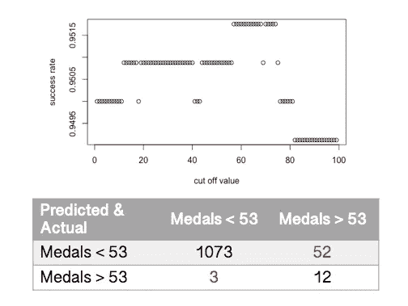

**预测分析**

下一步是预测至少两届奥运会的变量，即直到 2026 年。不同的预测模型适用于 4 个变量(公共卫生支出、预期寿命、人均国内生产总值和人口)。这些方法包括移动平均、霍尔茨温特(乘法和加法)、指数和双指数方法，使用水平、趋势和季节性(α、β和γ)的默认参数值以及优化值。将每个模型的预测值与实际值进行对比，以确定最适合每个变量的模型。

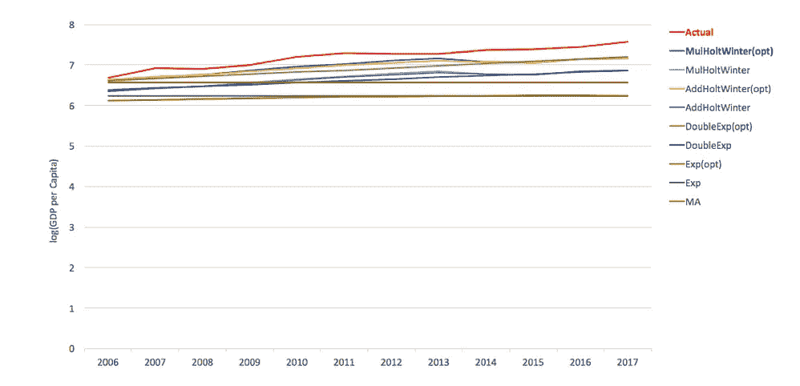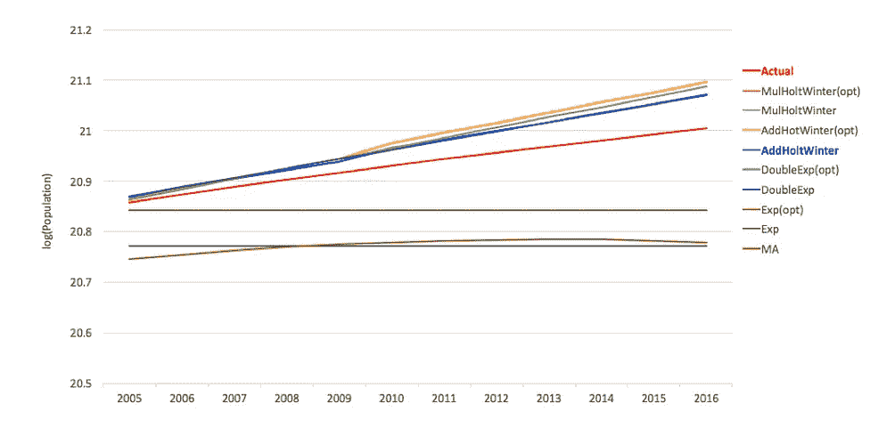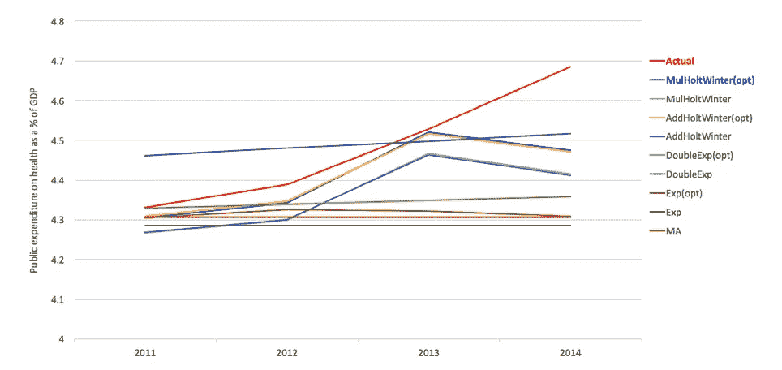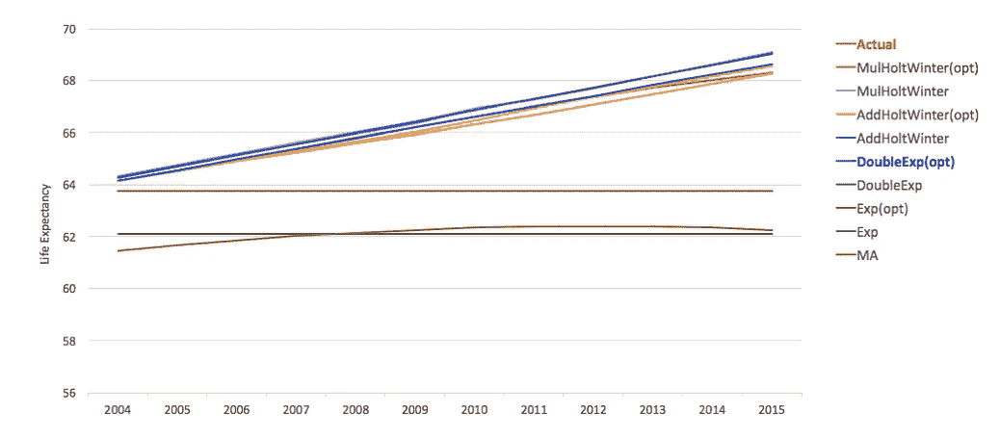

基于训练和验证数据集的结果平均百分比误差(MAPE)来选择模型。然后对印度的变量进行预测，直到 2026 年。

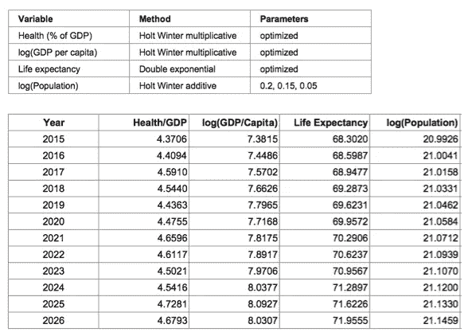

研究发现，在未来 12 年，印度可能达到 72 岁的预期寿命，15.6 亿以上的人口和 3000 美元的人均国内生产总值(目前 2016 年)。

**结果分类**

逻辑回归模型用于对印度获得超过 53 枚奖牌的几率进行分类。基于对这 4 个变量的预测，尽管概率随着时间的推移而增加，但这种增加不足以得出印度将在 2020 年或 2024 年奥运会上进入第 2 组(黄色组)的结论。

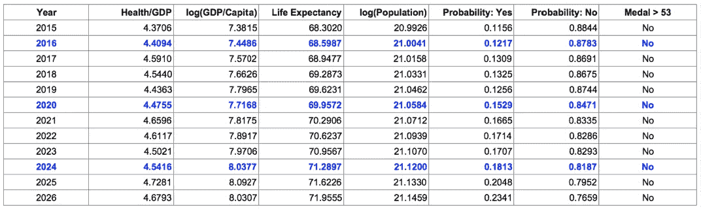

将印度的增长与其他两个集群(即美国和竞争对手)的*当前*水平进行比较，以得出政策建议。

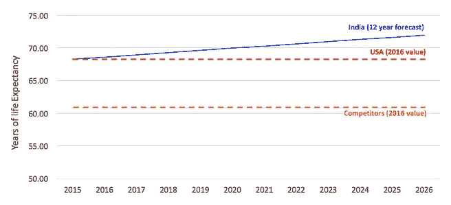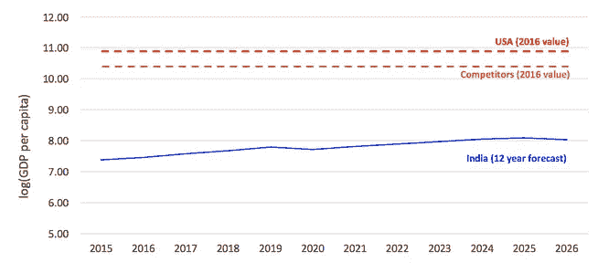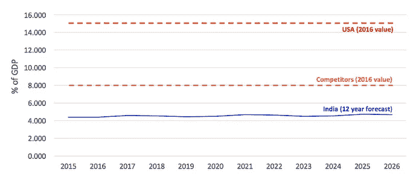

**推荐**

印度正以指数速度增长，但公共卫生支出却没有增长。国民的整体健康水平需要提高。此外，印度经济似乎不是为培养世界级运动员而设计的。印度落后于其他两个集群，为了提高印度在奥运会上的机会，政府干预是必要的。政府。印度政府需要将公共卫生支出增加一倍(占 GDP 的百分比)。青年事务和体育部需要为鼓励体育运动提供更多支持。这可以采取与第二组国家建立体育合作的形式(即“竞争者”)，鼓励运动员在第二组国家(即“竞争者”)，在城镇和乡村发展世界级的体育训练设施，并向现有的体育团体等提供财政援助。

**面临的挑战**

互联网上关于奥运会的数据集相互矛盾。我假设奖牌数是由参加比赛的“运动员”来计算的。国家一级的体育和运动员数据不容易获得。决定运动员在奥运会上表现的因素需要更多的研究。

**使用的工具**

Google Chrome 用于背景研究和下载基础数据；用于数据预处理和初步清理的电子表格软件；r 用于处理数据和得出统计见解；用于可视化结果的表格；苹果 QuickTime，用于演示代码工作流程；iMovie 用于编辑影片剪辑，YouTube 用于托管视频

**参考文献**

弗里皮克(2018)“弗里皮克的图标”，[www.flaticon.com，](http://www.flaticon.com,)2018 年 9 月 20 日访问。

奥运会(2018)“结果”，[https://www.olympic.org/olympic-results](https://www.olympic.org/olympic-results)，2018 年 9 月 12 日访问。

数据中的世界(2018)“健康”，[https://ourworldindata.org/health-meta](https://ourworldindata.org/health-meta)，2018 年 9 月 11 日访问

联合国数据(2018)"雇员"，[http://data.un.org/Data.aspx?q=sport&d = UNIDO&f = table code % 3a 04% 3 bisic code % 3a 3693](http://data.un.org/Data.aspx?q=sport&d=UNIDO&f=tableCode:04;isicCode:3693)，于 2018 年 9 月 12 日获取。

维基百科(2018)“教育指数”，[https://en.wikipedia.org/wiki/Education_Index](https://en.wikipedia.org/wiki/Education_Index)，2018 年 8 月 20 日访问。

维基百科(2018)《按人口统计的国家列表(联合国)》，[https://en . Wikipedia . org/wiki/List _ of _ countries _ by _ population _(联合国)](https://en.wikipedia.org/wiki/List_of_countries_by_population_(United_Nations))，2018-8-20 访问。

维基百科(2108)，“亚运会上的印度”，【https://en.wikipedia.org/wiki/India_at_the_Asian_Games ，于 2018 年 9 月 17 日访问

维基百科(2108)，“英联邦运动会上的印度”，[https://en . Wikipedia . org/wiki/India _ at _ the _ Commonwealth _ Games](https://en.wikipedia.org/wiki/India_at_the_Commonwealth_Games)，2018 年 9 月 17 日访问

维基百科(2108)，“奥运会上的印度”，[https://en.wikipedia.org/wiki/India_at_the_Olympics](https://en.wikipedia.org/wiki/India_at_the_Olympics)，于 2018 年 9 月 17 日访问

世界银行集团(2018)“国内生产总值(现值美元)”，[https://data.worldbank.org/indicator/NY.GDP.MKTP.CD](https://data.worldbank.org/indicator/NY.GDP.MKTP.CD)，2018 年 8 月 12 日获取。