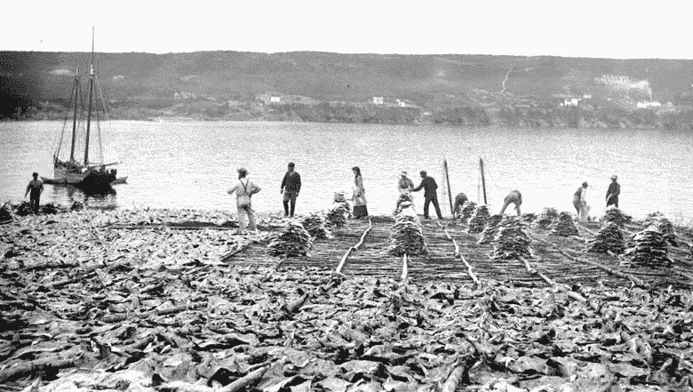
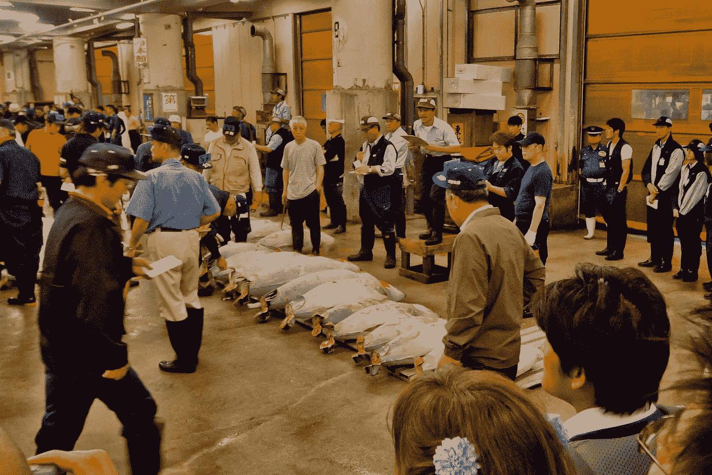
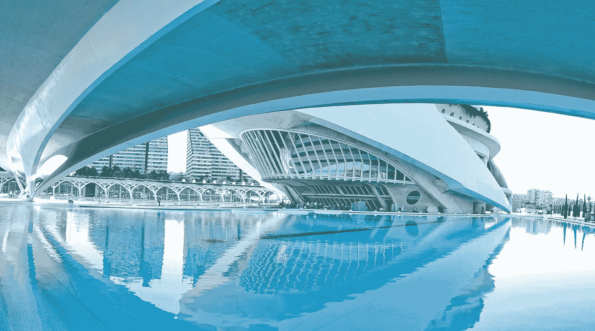
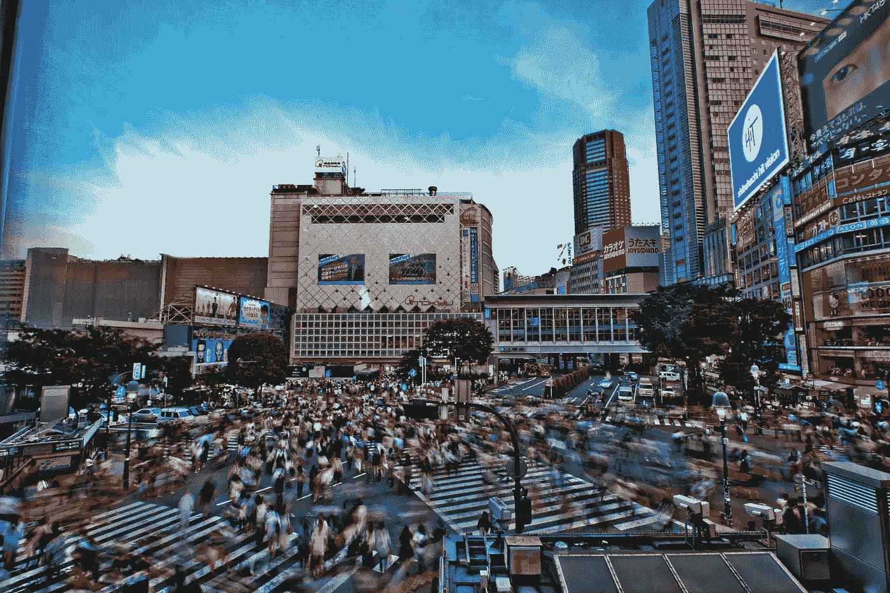

# 个人利益与公共利益:人工智能玩家的公地悲剧

> 原文：<https://towardsdatascience.com/individual-gain-vs-the-common-good-tragedy-of-the-commons-with-ai-players-77ffb40f0c6a?source=collection_archive---------18----------------------->

Panorama photo I took at Lake Cochabamba on a trip to Bolivia in 2017

对于社会科学专业的学生来说，公地悲剧将是一个熟悉的例子，说明理性的个人行为如何对整个社会产生负面影响。公地悲剧的最初例子发生在 1833 年，当时英国经济学家威廉·福雷斯特·劳埃德讨论了在公共土地上放牧的问题。从那以后，个人过度利用公共土地/物品的想法被应用到不同的主题中。另一个经典的例子是新英格兰鳕鱼渔场的过度捕捞。

New England Cod fishing

公地悲剧的基本前提是，以理性方式行事的个人会耗尽公共资源，因为他们最大化了自己的效用，即使可以说保留这些公共资源供未来使用符合他们的最佳利益。这是因为未来是不确定的，个人有动机最大化自己的个人效用。在没有任何外部监管/行动的情况下，这意味着他们应该利用现有资源，而不是为了不确定的未来而抑制消费。

社会科学提出的避免这种公地悲剧的解决方案是制定法规或措施来帮助抑制即期消费，这将有助于所讨论的资源在未来生存。这方面的一些例子是将资源放在私人手中，对其使用附加费用/许可，或者对其施加法律/法规以供政府/社会执行。

这一切都很好，但我是一名数据科学家，喜欢构建人工智能。那这和这里有什么关系？我认为数据科学和深度学习通常是朝着某个目标优化的过程。这个目标可以是最大化胜率或准确率，这是很好的，也是非常令人满意的。然而，随着人工智能越来越多地融入我们的社会，我们选择优化的目标将会产生越来越多的社会后果。为了说明选择优化什么是重要的，这篇文章将讲述我如何建立一个环境，让强化学习机器人的训练上演公地悲剧，以及调整它们的奖励如何改变游戏的社会影响。

Another Lake Cochabamba photo, glad I am getting mileage out of this part of my photo portfolio

# 教机器人钓鱼

第一步是建立一个游戏环境来模拟公地悲剧。我的例子是基于我在网上为经济学课程找到的一个版本。

游戏由两个玩家和渔场中的一些起始数量的鱼初始化，当渔场数量下降到某个阈值以下时，游戏结束，该阈值代表由于过度捕捞导致的种群崩溃。最后吃到最多鱼的人获胜。每个回合玩家同时宣布他们将捕获多少鱼，如果总捕获量没有迫使种群低于阈值，每个玩家获得他们的捕获量，并且剩余的鱼都有一个后代，最大数量永远不会超过最初的鱼数量。在最后一个回合，剩下的鱼根据玩家在该回合宣称要拿多少鱼来分配。因此，如果我声明 10 条鱼，你声明 8 条鱼，剩下 9 条，我将得到 5 条，你将得到 4 条。

游戏本身是一个循环，只有当渔业人口崩溃(低于 8 的阈值)或游戏达到 100 回合时才会打破。我添加了 100 转的限制，以避免循环无限运行。

在游戏中，鱼的起始数量是 20 条，我有两个玩家，一个是“电脑玩家”，它会根据当前的渔业水平随机选择鱼的价值，还有一个 Keras 强化学习机器人。这个 Keras 机器人将是这篇文章的重点，通过测试调整其奖励结构如何影响游戏的结果。

作为上下文输入到神经网络中的游戏状态是 5 节点输入的当前计算机得分、机器人得分、总渔业计数、过去计算机得分、过去机器人得分。网络的输出层是 20 个节点，代表在给定的回合中要申报的不同数量的鱼，1-20 条鱼。为了更好地了解机器人的训练周期，我认为有必要回顾一下强化学习，特别是深度 q 学习。

> 游戏详情见[悲剧. py](https://github.com/sugi-chan/tragedy-of-the-commons-RL/blob/master/tragedy.py) 。TOC 类包含游戏函数和其他一些运行游戏和报告结果的实用函数。
> 
> 网络位于 [netlearner.py](https://github.com/sugi-chan/tragedy-of-the-commons-RL/blob/master/netlearner.py) 文件中

# 快速深度 Q-学习回顾

这一部分是为了展示机器人是如何被训练的，以及它们是如何学习它们所展示的特定游戏行为的。从高层次上来说，机器人的条件是基于它们对结果的奖励和惩罚。为一个神经网络机械地做这件事显然和为一个生物做这件事不太一样，所以最好把它展示出来。基本流程如下:

1.  代理(在这种情况下是网络)被告知游戏的当前状态。这可能是 atari pong 游戏的像素，也可能是你选择的任何表示。这是当前鱼的数量，玩家和电脑的分数，玩家和电脑最近的拍摄。我的想法是，这是一个人类玩家在玩游戏时会有的环境类型。
2.  代理从动作空间中选择一个动作。在 Pong 的例子中，Andrej Karpathy 把它作为上升的概率。在本例中，这意味着选择 20 个输出节点中的一个，对应于声明捕获 1-20 条鱼。这里需要注意的一点是，这里有探索与开发的概念。本质上是说，有时应该随机选择一个动作，而不是简单地做代理认为最好的事情。这有助于代理探索和发现额外的奖励，否则如果它只是利用它知道的奖励，它将不会发现。
3.  行动被归入环境，任何奖励被收集，环境进入下一个状态、框架或回合。机械地，我这样做是通过将奖励添加到网络输出的卡槽组合中。对于正的奖励，该类别在输出数组中的值增加，并且网络将再次看到给定该输入，该特定类别是有益的。
4.  代理根据其收到的奖励进行更新。在奖励被用于修改输出阵列之后，网络以修改后的输出阵列为目标在初始输入状态上被训练。这有助于巩固好的选择，同时也考虑到坏的选择。
5.  冲洗并重复。

> 参见前面提到的 [netlearner.py](https://github.com/sugi-chan/tragedy-of-the-commons-RL/blob/master/netlearner.py) 和[harvest . py](https://github.com/sugi-chan/tragedy-of-the-commons-RL/blob/master/tragedy.py)文件之间的交互

Photo from Tsukiji bluefin tuna auction in Tokyo from a 2014 trip. Seems appropriate for a tragedy of the commons writeup

# 以公共利益为代价的胜利

我发现奖励的标准配置创造了非常“贪婪”的机器人。通过标准配置，我的意思是我把奖励放在赢的时候，负奖励放在输的时候，没有奖励放在两者之间。通常这样做是为了让机器人能够了解什么行为导致他们获胜，并允许他们最大限度地提高胜率。这种行为在像 Atari Pong、Cartpole 或其他以胜利为目标的游戏中很有用。但这种获胜的最大化并不一定意味着它有良好的社会后果。

我甚至尝试根据回合数来调整输赢奖励(我在一些测试中使用了回合数的 sqrt ),以激励在较长的游戏中获胜，但结果仍然相同，机器人玩的是非常贪婪的游戏风格。

那么我说的“贪心打法”是什么意思呢？…基本上，当我用这些奖励训练机器人时，机器人赢得了大约 99%的时间，这很酷！基本上，机器人已经想出了如何最大化他们对我编写的小电脑玩家的胜率。然而，他们平均在一个回合中达到 99%的胜率。

机器人陷入的策略是宣布在第一轮捕获更多数量的鱼，这导致渔场的数量立即崩溃。然后，因为在最后一轮的条件下，种群是根据每个玩家申报的鱼的数量来划分的，如果机器人申报的鱼多，它会自动击败对手。即使机器人可以通过玩更长时间来获得额外的奖励，即使它设置为在 10%或 20%的回合中探索，它仍然落入相同的策略，并且不学习玩更长时间的游戏。

这很有趣，因为这种类型的机器人具有共同的回报结构和最大化获胜的行为几乎与经典公地悲剧中的代理人完全相同。机器人可以通过在更长的时间内保持资源来获得更大的回报，但相反，它决定现在消耗资源以最大化其短期收益，因为它可能会也可能不会在未来获胜。因此，虽然这个机器人已经学会了如何赢，并且赢得很好，但它也过度消耗并破坏了有问题的资源。

现在让我们用一行代码来捣乱…

2017 photo from Valencia, Spain. I liked the futuristic look of this part of the city.

# **一个提高公共效用的机器人**

所以我在上一节中列出了机器人的奖励结构，现在如果我调整奖励结构的一部分会怎么样。把胜利和失败的奖励留在原地，我进行了多次测试，其中对继续转弯的奖励在 1.5、5 和 10 之间的正值之间变化。我发现它创造了“利他”的机器人，可以玩更长时间的游戏，但机器人的胜率因此受到影响。

从技术角度来看，我正在测试这个想法，即设置 1.5 的奖励意味着机器人会发现学习玩长度大于 2 的游戏对自己有益(因为奖励是获胜回合数的 sqrt)。我对机器人如何玩 1000 多个游戏窗口进行了基准测试，发现根据迭代，机器人的胜率在 85-91%之间，平均游戏持续 2-4 轮。

在奖励为 5 的情况下，机器人以相当低的 36%的胜率和 7 的回合数开始，但是以 59%的胜率和 11 的游戏长度结束了它的训练，并且来自训练的最后部分的一些测试游戏是长度为 100 的游戏，机器人以 406 到 401 的分数获胜。

在奖励为 10 的情况下，机器人的胜率不会超过 30-40%，但它们的游戏会进行到 100 轮。所以他们学习对游戏继续有用的行为。但不一定会赢。由于机器人会非常专注于简单地让游戏继续，很多时候他们遵循的策略是每回合简单地拿走 4-5 条鱼。因此，如果我试图优化这些机器人来获胜，这是一个非常糟糕的训练它们的方式。

然而，我们不只是想让机器人获胜，所以让我们退后一步，想想机器人的行为！

Shibuya X photo from a trip to Tokyo, I had my family sit in a second story of a Starbucks for an hour so I could take short timelapse photos of the crossing… Things like this are why it is hard to travel with photographers I think.

# 确定的胜利或为共同利益而优化

在一个未受监管的公地悲剧版本中，作为理性代理人的参与者应该试图最大化他们的短期收益，而不是希望一个不确定的未来。“贪婪”的机器人反映了这种行为，它们采取接近 100%胜率的策略，在第一个回合就获胜。

然而，如果我们考虑资源的消耗。立即烧掉所有的资源很少是我们的目标，相反，资源的继续存在对每个人都有好处。因此，如果我们能够建立激励机制，允许可持续的捕捞，这将导致比一轮捕捞更多的鱼。

从机械/游戏理论的角度来看，玩这个游戏的可持续方式是让两个玩家每个回合拿 5 条鱼，总共拿 10 条。这使得渔业数量从 20 下降到 10。因为渔业数量不低于 8，所以人口翻倍，从 10 到 20。这意味着渔业可以无限期地维持下去。

这种平衡在实际操作中很难保持，因为参与者之间没有交流，并且需要参与者放弃短期收益(一定的胜利)而不是让所有参与者收集更多的鱼(增加集体效用)。在现实世界中，这可能会随着监管/监控/文化规范/私有化之类的事情而发生。

因此，当“贪婪的”机器人为快速获胜而优化时，那些因继续游戏而获得更多奖励的“利他的”机器人开始为行为而不是简单的获胜而优化。事实上，机器人开始表现得非常类似于我上面提出的这种更可持续的最佳游戏。

在奖励为 10 的情况下，机器人玩这种保守游戏的更安全版本，并且每回合只玩 4-5 条鱼，基本上放弃任何获胜的机会。至于平衡胜率和平均回合数，奖励 5 机器人保持更具竞争力的姿态，每回合吃 4-6 条鱼。这种额外的竞争力反映在他们更高的胜率，同时仍然试图不耗尽渔业。

所有更无私的机器人都被优化来尝试并赢得比赛，但是是在更长的比赛中。这种多部分优化意味着有一些权衡，在这种情况下，这意味着他们赢得了更低的百分比的时间，但如果在更大的背景下，你可能会认为这是没问题的。

在玩更长时间的游戏时，机器人有时会赢，但有时也会落后很多，例如一些 100 回合的游戏以 350-400 到 600+的分数结束。虽然就胜利或失败而言，这是一个相当惊人的损失，但如果你考虑到鱼类的继续存在为整个社区带来了额外的效用，那么即使机器人没有为自己赢得那么多，这仍然是一个非常有利的结果。

通过比较一个模拟生成的鱼的总数，这个惊人的损失可能是一个好的结果。“贪婪”机器人的胜利使双方玩家总共收获了 20 条鱼。机器人赢了，资源没了。“利他”机器人玩 100 场游戏，可能会输，但双方玩家会收集 800-1000 条鱼。

Photo from back home on Maui, Hawaii

# 最后的想法

作为一名经济学家/社会科学家，这篇文章直截了当地展示了如何使用深度学习/强化学习对偏好的修改进行建模，以说明达到更高水平的整体社会效用的方法。

作为一名数据科学家，这篇文章是我拐弯抹角的评论，随着人工智能与社会的融合程度越来越高，我们选择如何优化人工智能以及我们在构建人工智能时所做的权衡将会产生更多后果。

我可能会改进我在这篇文章中应用的 RL 方法，并尝试让机器人学习更强的策略来增加他们的胜率，无论回合数是多少。截至目前，连续回合奖励较高的机器人牺牲了胜利，陷入了非常弱的整体策略。通过更多的实验，机器人可能会学会如何维持鱼的数量，但也会采取行动缩小它们与对手之间的差距，或增加对对手的领先优势。这可以是另一个时间的项目。

感谢阅读！

> Github 回购[此处](https://github.com/sugi-chan/tragedy-of-the-commons-RL)

One last picture taken on the way to Honolua Bay on Maui, Hawaii