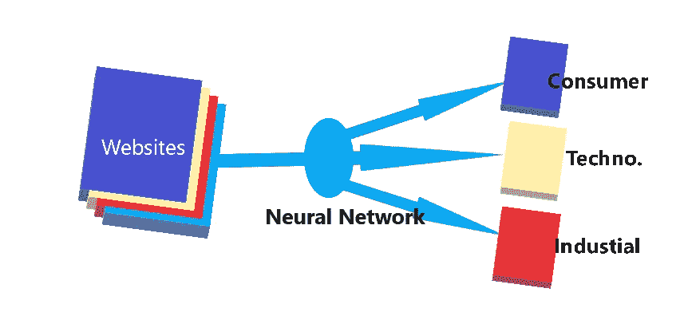

# 用机器学习和动手 Python 对网站进行行业分类

> 原文：<https://towardsdatascience.com/industrial-classification-of-websites-by-machine-learning-with-hands-on-python-3761b1b530f1?source=collection_archive---------2----------------------->

嘿伙计们，欢迎来到我的第一个技术教程。在本教程中，我想解释提取，清理和分类网站到不同的类别。我会用 python 环境运行我的代码进行数据抓取，用神经网络对网站进行分类。


Text classification

文本分类是在数据科学的许多不同领域中广泛使用的自然语言处理任务之一。一个有效的文本分类器可以使用 NLP 算法有效地自动将数据分类。

**文本分类**是监督机器学习任务的一个例子，因为包含文本文档及其标签的标记数据集用于训练分类器。

一些常见的文本分类技术有:

1.  [朴素贝叶斯分类器](https://en.wikipedia.org/wiki/Naive_Bayes_classifier)
2.  [线性分类器](https://en.wikipedia.org/wiki/Linear_classifier)
3.  [支持向量机](https://en.wikipedia.org/wiki/Support_vector_machine)
4.  [装袋模型](https://en.wikipedia.org/wiki/Bootstrap_aggregating)
5.  [增压车型](https://en.wikipedia.org/wiki/Gradient_boosting)
6.  [深度神经网络](https://en.wikipedia.org/wiki/Deep_learning)


[**网页抓取**](https://en.wikipedia.org/wiki/Web_scraping) 、**网页抓取**或**网页数据提取**是用于从网站中提取数据的数据抓取。一般来说，这是通过模拟人类网上冲浪的软件从不同的网站收集特定的信息来完成的。

可用于网页抓取的一些技术有:

1.  人类复制粘贴
2.  文本模式匹配
3.  HTTP 编程
4.  HTML 解析
5.  DOM 解析
6.  垂直聚集
7.  语义标注识别
8.  计算机视觉网页分析

在本教程中，我们将尝试将完整的模型实现为三个不同的模块:

1.  数据抓取
2.  用于创建训练数据集的基于关键字的分类
3.  将神经网络应用于实际测试模型

# 模块 1:数据搜集

在本模块中，我将使用 Python 3.5 环境来实现我的脚本。因此，请跟随以获取完整的参考资料。

## 步骤 1:从网站请求数据

为了提取 web 数据，可以使用许多不同的包，但是在本教程中，我将使用 [*请求*](https://pypi.org/project/requests/) *。*

```
**import** **requests
url='**https://medium.com/**'
try:** page = requests.get(url)        #to extract page from website
    html_code = page.content        #to extract html code from page
except **Exception** **as** e:
    print(e)
```

在上面的代码中，requests.get()方法将使用 *https* 协议从网站请求页面，并将页面加载到对象“ *page”中。*下一行代码将把 HTML 代码移动到字符串 *html_code 中。*因此，到目前为止，我们已经从网站上提取了数据，但它仍然是 HTML 格式，与实际文本相差甚远。

## 步骤 2:从 HTML 页面中提取文本

为了从 HTML 页面中提取完整的文本数据，我们有两个非常受欢迎的包，[**beautiful soup**](https://www.crummy.com/software/BeautifulSoup/bs4/doc/)和 [**html2text**](https://pypi.org/project/html2text/) 。使用上一步找到的 html_code 字符串，我们可以应用下面两种方法中的任何一种。

```
**from** **bs4** **import** BeautifulSoup
try:
    soup = BeautifulSoup(html_code, 'html.parser')  #Parse html code
    texts = soup.findAll(text=**True**)                 #find all text
    text_from_html = ' '.join(texts)                   #join all text
except **Exception** **as** e:
    print(e)
```

在上面的代码片段中， **BeautifulSoup** 包将解析 HTML 代码并将数据分配给 *soup* 对象。findall *()* 函数从代码中找到所有可见的文本，并返回一个字符串列表，我们将它存储在*文本中。*最后，我们使用 *join()* 函数将所有单独的文本连接成一个公共字符串。

```
**import** **html2text** h = html2text.HTML2Text()                 #Initializing object
h.ignore_links = **True** #Giving attributes **try:** text = h.handle(html_code)            #handling the HTML code 
    text_from_html=text.replace("**\n**"," ") #replacing next line char
except **Exception** **as** e:
    print(e)
```

在这个替换块中，我们使用 package **html2text** 来解析字符串，并直接从 html 代码中获取文本。我们还需要用空格替换空行，最后找到 *text_from_html。*

类似地，我们可以在大约 1000 多个 URL 上使用循环，并从这些站点提取数据，并将它们存储为 csv(逗号分隔文件)格式，我们可以在分类模块中进一步使用该格式。

# **模块 2:基于关键字的分类**

对于任何机器学习算法，我们都需要一些训练集和测试集来训练模型和测试模型的准确性。因此，为了创建模型的数据集，我们已经有了来自不同网站的文本，我们将根据关键字对它们进行分类，然后在下一个模块中应用结果。

在本教程中，我们将把网站分为三类，即:

1.  技术、办公和教育产品网站(Class_1)
2.  消费品网站(Class_2)
3.  工业工具和五金产品网站(Class_3)

这里的方法是，我们将拥有属于特定类别的某些关键字，我们将这些关键字与文本进行匹配，并找到具有最大 *Matching_value 的类别。*

> *Matching_value* =(与一个行业匹配的关键字数)/(匹配的关键字总数)

因此，相应地，我们有一个单独类别的关键字列表，如下所示:

```
Class_1_keywords = ['Office', 'School', 'phone', 'Technology', 'Electronics', 'Cell', 'Business', 'Education', 'Classroom']Class_1_keywords = ['Restaurant', 'Hospitality', 'Tub', 'Drain', 'Pool', 'Filtration', 'Floor', 'Restroom', 'Consumer', 'Care', 'Bags', 'Disposables']Class_3_keywords = ['Pull', 'Lifts', 'Pneumatic', 'Emergency', 'Finishing', 'Hydraulic', 'Lockout', 'Towers', 'Drywall', 'Tools', 'Packaging', 'Measure', 'Tag ']keywords=Class_1_keywords + Class_2_keywords + Class_3_keywords
```


现在，我们将使用 [**关键字处理器**](https://pypi.org/project/flashtext/) 来查找从 URL 接收的文本中的关键字。

[**关键字处理器**](https://pypi.org/project/flashtext/) 在 pypi 上的 flashtext 包中有。

```
**from** **flashtext.keyword** **import** KeywordProcessor
kp0=KeywordProcessor()
**for** word **in** keywords:
    kp0.add_keyword(word)kp1=KeywordProcessor()
**for** word **in** Class_1_keywords:
    kp1.add_keyword(word)kp2=KeywordProcessor()
**for** word **in** Class_2_keywords:
    kp2.add_keyword(word)kp3=KeywordProcessor()
**for** word **in** Class_3_keywords:
    kp3.add_keyword(word)
```

在上面的代码中，我们将使用关键字加载 **KeywordProcessor** 对象，我们将进一步使用这些关键字来查找匹配的关键字。

为了找到*匹配值*的百分比值，我们定义一个函数百分比如下:

```
**def** percentage1(dum0,dumx):
    **try**:
        ans=float(dumx)/float(dum0)
        ans=ans*100
    **except**:
        **return** 0
    **else**:
        **return** ans
```

我们现在将使用 extract_keywords(string)方法来查找文本中出现的关键字。我们将查找该列表的长度，以找到文本中匹配关键字的数量。以下函数将查找百分比，并选择百分比最大的类。

```
def find_class:
    x=str(text_from_html)
    y0 = len(kp0.extract_keywords(x))
    y1 = len(kp1.extract_keywords(x))
    y2 = len(kp2.extract_keywords(x))
    y3 = len(kp3.extract_keywords(x))
    Total_matches=y0   
    per1 = float(percentage1(y0,y1))
    per2 = float(percentage1(y0,y2))
    per3 = float(percentage1(y0,y3))
    **if** y0==0:
        Category='None'
    **else**:
        **if** per1>=per2 **and** per1>=per3:
            Category='Class_1'
        **elif** per2>=per3 **and** per2>=per1:
            Category='Class_2'
        **elif** per3>=per1 **and** per3>=per2:
            Category='Class_3'
    return Category
```

在上面的函数中使用一个循环，我们可以根据关键字找到所有网站的类别。我们将分类数据保存到文件 *Data.csv* 中，我们将进一步使用该文件。因此，现在我们已经为应用神经网络进行分类准备好了数据集。

# 模块 3:应用神经网络



Classification of websites

在下面的实现中，我们将从头开始创建一个神经网络，并将使用 NLTK 单词标记化器进行预处理。首先，我们需要导入从上述步骤中获得的数据集，并将其加载到一个列表中。

```
**import** **pandas** **as** **pd** data=pd.read_csv('Data.csv')
data = data[pd.notnull(data['tokenized_source'])]
data=data[data.Category != 'None']
```

上面的代码将加载和清理分类数据。空值将被删除。

下面的代码将根据它的类创建一个数据字典。

```
**for** index,row **in** data.iterrows():
    train_data.append({"class":row["Category"], "sentence":row["text"]})
```

为了应用神经网络，我们需要将语言文字转换成数学符号，用于计算。我们将列出所有字符串中的所有单词。

```
words = []
classes = []
documents = []
ignore_words = ['?']
*# loop through each sentence in our training data*
**for** pattern **in** training_data:
    *# tokenize each word in the sentence*
    w = nltk.word_tokenize(pattern['sentence'])
    *# add to our words list*
    words.extend(w)
    *# add to documents in our corpus*
    documents.append((w, pattern['class']))
    *# add to our classes list*
    **if** pattern['class'] **not** **in** classes:
        classes.append(pattern['class'])

*# stem and lower each word and remove duplicates*
words = [stemmer.stem(w.lower()) **for** w **in** words **if** w **not** **in** ignore_words]
words = list(set(words))

*# remove duplicates*
classes = list(set(classes))

print (len(documents), "documents")
print (len(classes), "classes", classes)
*print (len(words), "unique stemmed words", words)*
```

例如，输出将是:

> 1594 个文档
> 3 个类['Class_1 '，' Class_3 '，' Class_2']
> *唯一词干 40000 个*

现在，我们将为该模式创建一个*单词列表，并使用 NLTK Lancaster 斯特梅尔创建一个单词包。*

```
**from** **nltk.stem.lancaster** **import** LancasterStemmerstemmer = LancasterStemmer()
*# create our training data*
training = []
output = []
*# create an empty array for our output*
output_empty = [0] * len(classes)

*# training set, bag of words for each sentence*
**for** doc **in** documents:
    *# initialize our bag of words*
    bag = []
    *# list of tokenized words for the pattern*
    pattern_words = doc[0]
    *# stem each word*
    pattern_words = [stemmer.stem(word.lower()) **for** word **in** pattern_words]
    *# create our bag of words array*
    **for** w **in** words:
        bag.append(1) **if** w **in** pattern_words **else** bag.append(0)

    training.append(bag)
    *# output is a '0' for each tag and '1' for current tag*
    output_row = list(output_empty)
    output_row[classes.index(doc[1])] = 1
    output.append(output_row)

print ("# words", len(words))
print ("# classes", len(classes))
```

输出:

> # word 41468
> # class 3

现在，我们对数据进行最后的预处理，并创建一些函数。

**乙状结肠功能**

```
**def** sigmoid(x):
    output = 1/(1+np.exp(-x))
    **return** output

*# convert output of sigmoid function to its derivative*
**def** sigmoid_output_to_derivative(output):
    **return** output*(1-output)
```

**清洁功能**

```
**def** clean_up_sentence(sentence):
    *# tokenize the pattern*
    sentence_words = nltk.word_tokenize(sentence)
    *# stem each word*
    sentence_words = [stemmer.stem(word.lower()) **for** word **in** sentence_words]
    **return** sentence_words
```

**包话功能**

```
**def** bow(sentence, words, show_details=**False**):
    *# tokenize the pattern*
    sentence_words = clean_up_sentence(sentence)
    *# bag of words*
    bag = [0]*len(words)  
    **for** s **in** sentence_words:
        **for** i,w **in** enumerate(words):
            **if** w == s: 
                bag[i] = 1
                **if** show_details:
                    print ("found in bag: **%s**" % w)

    **return**(np.array(bag))
```

最终将用于神经网络的函数:**思考函数**

```
**def** think(sentence, show_details=**False**):
    x = bow(sentence.lower(), words, show_details)
    **if** show_details:
        print ("sentence:", sentence, "**\n** bow:", x)
    *# input layer is our bag of words*
    l0 = x
    *# matrix multiplication of input and hidden layer*
    l1 = sigmoid(np.dot(l0, synapse_0))
    *# output layer*
    l2 = sigmoid(np.dot(l1, synapse_1))
    **return** l2
```

现在我们已经准备好训练我们的神经网络模型。我们将通过 scratch 实现它，并将对每个神经元使用逻辑回归。只有一层，但有 50000 个历元，我们将训练我们的模型。完整的训练示例将在 CPU 上运行。

```
**def** train(X, y, hidden_neurons=10, alpha=1, epochs=50000, dropout=**False**, dropout_percent=0.5):

    print ("Training with **%s** neurons, alpha:**%s**, dropout:**%s** **%s**" % (hidden_neurons, str(alpha), dropout, dropout_percent **if** dropout **else** '') )
    print ("Input matrix: **%s**x**%s**    Output matrix: **%s**x**%s**" % (len(X),len(X[0]),1, len(classes)) )
    np.random.seed(1)

    last_mean_error = 1
    *# randomly initialize our weights with mean 0*
    synapse_0 = 2*np.random.random((len(X[0]), hidden_neurons)) - 1
    synapse_1 = 2*np.random.random((hidden_neurons, len(classes))) - 1

    prev_synapse_0_weight_update = np.zeros_like(synapse_0)
    prev_synapse_1_weight_update = np.zeros_like(synapse_1)

    synapse_0_direction_count = np.zeros_like(synapse_0)
    synapse_1_direction_count = np.zeros_like(synapse_1)

    **for** j **in** iter(range(epochs+1)):

        *# Feed forward through layers 0, 1, and 2*
        layer_0 = X
        layer_1 = sigmoid(np.dot(layer_0, synapse_0))

        **if**(dropout):
            layer_1 *= np.random.binomial([np.ones((len(X),hidden_neurons))],1-dropout_percent)[0] * (1.0/(1-dropout_percent))

        layer_2 = sigmoid(np.dot(layer_1, synapse_1))

        *# how much did we miss the target value?*
        layer_2_error = y - layer_2

        **if** (j% 10000) == 0 **and** j > 5000:
            *# if this 10k iteration's error is greater than the last iteration, break out*
            **if** np.mean(np.abs(layer_2_error)) < last_mean_error:
                print ("delta after "+str(j)+" iterations:" + str(np.mean(np.abs(layer_2_error))) )
                last_mean_error = np.mean(np.abs(layer_2_error))
            **else**:
                print ("break:", np.mean(np.abs(layer_2_error)), ">", last_mean_error )
                **break**

        *# in what direction is the target value?*
        *# were we really sure? if so, don't change too much.*
        layer_2_delta = layer_2_error * sigmoid_output_to_derivative(layer_2)

        *# how much did each l1 value contribute to the l2 error (according to the weights)?*
        layer_1_error = layer_2_delta.dot(synapse_1.T)

        *# in what direction is the target l1?*
        *# were we really sure? if so, don't change too much.*
        layer_1_delta = layer_1_error * sigmoid_output_to_derivative(layer_1)

        synapse_1_weight_update = (layer_1.T.dot(layer_2_delta))
        synapse_0_weight_update = (layer_0.T.dot(layer_1_delta))

        **if**(j > 0):
            synapse_0_direction_count += np.abs(((synapse_0_weight_update > 0)+0) - ((prev_synapse_0_weight_update > 0) + 0))
            synapse_1_direction_count += np.abs(((synapse_1_weight_update > 0)+0) - ((prev_synapse_1_weight_update > 0) + 0))        

        synapse_1 += alpha * synapse_1_weight_update
        synapse_0 += alpha * synapse_0_weight_update

        prev_synapse_0_weight_update = synapse_0_weight_update
        prev_synapse_1_weight_update = synapse_1_weight_update

    now = datetime.datetime.now()

    *# persist synapses*
    synapse = {'synapse0': synapse_0.tolist(), 'synapse1': synapse_1.tolist(),
               'datetime': now.strftime("%Y-%m-**%d** %H:%M"),
               'words': words,
               'classes': classes
              }
    synapse_file = "synapses.json"

    **with** open(folder_path+synapse_file, 'w') **as** outfile:
        json.dump(synapse, outfile, indent=4, sort_keys=**True**)
    print ("saved synapses to:", synapse_file)
```

最后，我们将训练模型:

```
import time
X = np.array(training)
y = np.array(output)

start_time = time.time()

train(X, y, hidden_neurons=10, alpha=0.1, epochs=50000, dropout=**False**, dropout_percent=0.2)

elapsed_time = time.time() - start_time
print ("processing time:", elapsed_time, "seconds")
```

输出:

> 用 10 个神经元训练，alpha:0.1，dropout:False
> 输入矩阵:1594x41468 输出矩阵:1 x3
> 10000 次迭代后的 delta:0.0665105275385
> 20000 次迭代后的 delta:0.0610711168863
> 30000 次迭代后的 delta:0.0561908365355
> 40000 次迭代后的 delta

正如我们所看到的，训练这个模型花了将近 11 个小时。在如此密集的计算之后，我们准备测试数据。

测试数据的函数:

```
*# probability threshold*
ERROR_THRESHOLD = 0.2
*# load our calculated synapse values*
synapse_file = 'synapses.json' 
**with** open(synapse_file) **as** data_file: 
    synapse = json.load(data_file) 
    synapse_0 = np.asarray(synapse['synapse0']) 
    synapse_1 = np.asarray(synapse['synapse1'])

**def** classify(sentence, show_details=**False**):
    results = think(sentence, show_details)

    results = [[i,r] **for** i,r **in** enumerate(results) **if** r>ERROR_THRESHOLD ] 
    results.sort(key=**lambda** x: x[1], reverse=**True**) 
    return_results =[[classes[r[0]],r[1]] **for** r **in** results]
    *#print ("\n classification: %s" % ( return_results))*
    **return** return_results
```

让我们测试模型的准确性:

```
classify("Switchboards Help KA36200 About Us JavaScript seems to be disabled in your browser You must have JavaScript enabled in your browser to utilize the functionality of this website Help Shopping Cart 0 00 You have no items in your shopping cart My Account My Wishlist My Cart My Quote Log In BD Electrical Worldwide Supply Remanufacturing the past SUSTAINING THE FUTURE Hours and Location Michigan Howell")
```

输出:

> [['Class_3 '，0.9766343788614435]]

```
classify("  New Website Testimonial Policies Parts Catalog Contact Support Forum Documentation Themes WordPress Blog Products Spindle Parts Latest News Kennard Parts Suggest Ideas Legal/Disclaimers WordPress Planet News About CDT Home Latest News Testimonial Products Parts Catalog About CDT History Staff Policies Centrum Legal Disclaimers Contact About CDT Custom Drilling Technologies established in 1990 has been providing superior customer service to the printed circuit board industry for almost 20 years We specialize in Excellon Drilling and Routing Equipment Parts and Service Our staff has over sixty years of combined experience in the design building troubleshooting operation programming")
```

输出:

> [['Class_1 '，0.96297535870017]]

如你所见，我们在这些测试中获得了相当高的准确度。我在不同的数据上尝试了这个模型，发现它有相当高的准确性。

在这种只有一层的模型中，大约 95%以上的精度被认为是非常准确的。对于不同模型的进一步分类，我们可以使用 Keras 或 Tensorflow。为了减少训练模型的时间，我们可以使用 NVIDIA GPU。

现在，借助反向传播的深度神经网络，我们可以很容易地收集数据并对其进行分类。

在后续教程中，我将尝试解释 Keras 和 Tensorflow 的工作和实践。

请在下面的评论区或通过我的 LinkedIn 页面分享您对本教程的反馈:[https://www.linkedin.com/in/ridhamdave/](https://www.linkedin.com/in/ridhamdave/)。也分享一下你对这个教程的疑惑。