# 推断统计学基础

> 原文：<https://towardsdatascience.com/inferential-statistics-basics-294512909a33?source=collection_archive---------6----------------------->

# 简介:

统计是数据科学家需要的最重要的技能之一。统计学涉及大量的数学知识，很难掌握。因此，在本教程中，我们将浏览一些统计学的概念，以学习和理解推断统计学并掌握它。

# 为什么我们需要推断统计学？

考虑这样一种情况，你对孩子们每天看电视的平均时间感兴趣。现在你知道你所在地区的儿童平均每天看 1 小时电视。你如何为所有的孩子找到这个？

有两种方法可以用来计算结果:

1.  收集每个孩子的数据。
2.  使用我们掌握的数据来计算总体平均值。

第一种方法是极其困难和令人生畏的任务。完成这项任务所需的努力和资源将是巨大的。

第二种方法简单得多，也更容易实现。但是有一个问题。你不能把从有限的数据集中得到的平均值等同于整个人口。考虑这样一种情况，你所在地区的儿童对体育运动更感兴趣，因此他们花在电视上的时间明显少于总人口。我们如何着手寻找人口平均数？这就是推理统计学帮助我们的地方。

# 推理统计:

推理统计学帮助我们回答以下问题:

*   从样本中对总体进行推断
*   推断样本是否与总体显著不同。让我们看看前面的例子，我指出样本与总体不同，因为孩子们对体育更感兴趣，而不是看电视。
*   从模型中添加或删除一个特征是否有助于改进它。
*   如果一个模型明显不同于另一个。
*   假设检验。

这向我们展示了为什么推断统计学是重要的，以及为什么值得投入时间和精力来学习这些概念。

# 正态分布和 z 统计量:

正态分布也称为钟形曲线，具有以下特性:

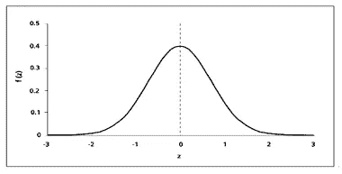

1.  均值=中位数=众数。
2.  曲线是对称的，一半的值在左边，一半的值在右边。
3.  曲线下的面积是 1。

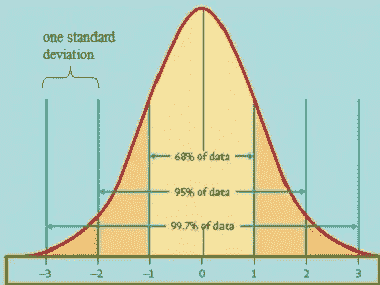

Image credit: University of Virginia

在正态分布中:

*   68%的数据在平均值的一个标准偏差范围内
*   95%的数据落在平均值的两个标准偏差内
*   99.7 %的数据落在平均值的三个标准偏差内。

为了计算事件发生的概率，我们需要 z 统计量。计算 z-统计量的公式为

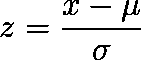

其中 x 是要计算 z 值的值。μ和σ分别是总体均值和标准差。基本上，我们在这里做的是通过将平均值移动到 0 并将标准偏差转换为 1 来标准化正态曲线。z-统计量实际上是以标准差形式计算的值与平均值的距离。因此，z 值 1.67 意味着该值在正方向上偏离平均值 1.67 个标准偏差。然后，我们通过从 z 表中查找相应的 z 值来找到概率。

# 中心极限定理；

正态分布的主要重要性来自中心极限定理。中心极限定理表明，无论总体分布的形状如何，随着样本量的增加，样本均值的抽样分布都接近正态分布。让我们通过一个例子来看这个问题。考虑这样一种情况，我们查看一个人一周内的推文数量(随机生成的数据在 0 到 200 之间)。数据的频率分布如下所示:

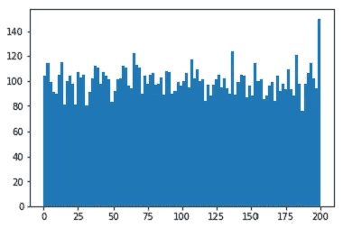

这与我们所知的任何一种分布都不相似。

现在，让我们从这些数据中随机抽取 1000 个大小为 50 的样本，并计算每个样本的平均值。当我们绘制这些平均值时，我们得到一个正态分布曲线，也称为**采样曲线**或**采样分布**。

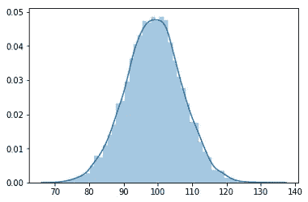

**平均值= 98.78(人口平均值= 98.87)**

中心极限定理有一些重要的性质:

1.  总体的平均值大约等于抽样分布的平均值。我们可以在上面的例子中看到这一点，其中总体平均值(98.87)大约等于抽样分布的平均值(98.78)。
2.  抽样分布的标准偏差也称为**标准误差**，等于总体标准偏差除以样本大小的平方根。因此，样本量越大，标准偏差越低，从总体平均值确定样本平均值的准确度越高。

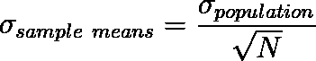

1.  不管总体分布的形状如何，样本均值的分布都是正态分布。这意味着，即使我们的原始分布是偏态或双峰分布或其他分布，样本均值始终是正态分布。这就是中心极限定理如此强大的原因。

为了使中心极限定理成立，样本量应该足够大(一般大于 30)

# 置信区间:

就像我之前说过的，我们找到了样本平均值，并且想要估计总体平均值。样本统计对潜在人口的估计有多准确一直是个问题。置信区间解决了这个问题，因为它提供了可能包含总体参数的一系列值。

image credit: Luis Fok, Oregon State University

有单侧或双侧置信区间。在双侧置信区间中，如果我们选择 95%的置信区间，我们在尾部的每一侧选择 2.5%，然后计算范围。在单侧置信区间中，我们通过在分布的左边或右边取整个 5%来计算置信区间。上图显示了一个双侧置信区间。我们用来计算置信区间的公式是:

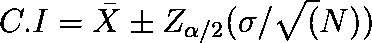

这些符号代表什么

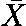

**Sample Mean**

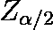

**Z value for the desired confidence level**

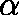

**confidence level**

**the standard deviation of the population**

置信区间概念中的另一个重要术语是**误差幅度**。它是置信区间的一半。它被称为抽样误差，这意味着如果样本平均值在误差范围内，那么它的实际值就是总体平均值，差异只是偶然出现的。否则，结果被认为具有统计学意义。我们将在后面的教程中再次讨论这个概念。

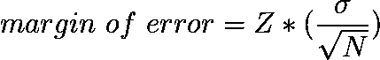

当我们取 95%的置信区间时，并不意味着总体均值在我们以 95%的概率得出的范围内。置信区间表示包含未知总体参数真值的可能置信区间的频率(即比例)。因此，如果我们取无限多的样本，并找出每个样本的置信区间范围，那么包含总体参数的区间数就等于置信区间。如果我们取 95%的置信区间，那么这意味着总体参数存在于所有可能的置信区间范围的 95%中。

这些是继续前进所需的一些基本概念。