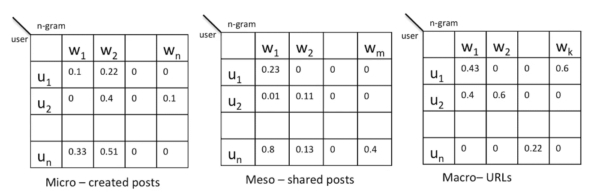
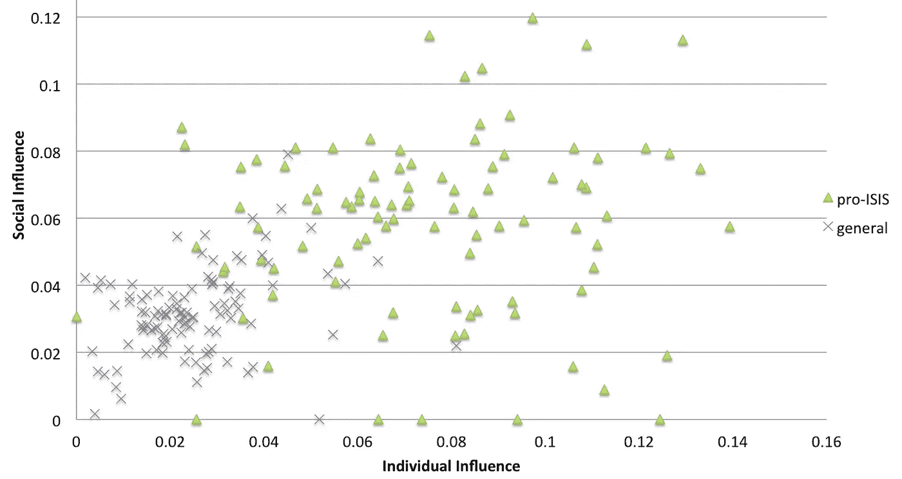

# 激进化对社交媒体的影响模型

> 原文：<https://towardsdatascience.com/influence-models-of-radicalization-on-social-media-a762fbc35c36?source=collection_archive---------9----------------------->

## 数据科学在工作中发现 ISIS 极端分子和恐怖主义在网上传播

Photo by [Tom Roberts](https://unsplash.com/@tomrdesigns?utm_source=medium&utm_medium=referral) on [Unsplash](https://unsplash.com?utm_source=medium&utm_medium=referral)

考虑到当前激进思维和激进主义的趋势，理解激进主义如何在在线社交网络上发挥作用至关重要。

一个数据科学项目基于取自社会科学模型的“激进化的根源”模型，研究了 [**激进化影响**](https://dl.acm.org/citation.cfm?id=3201082) 的问题。这项工作围绕着被认为具有影响力的三个层面:

*   **微观影响:**内部的、个人的影响，由该人在 Twitter 上发布的帖子来表示。
*   **中观影响力:**小群体影响力，以他人帖子为代表，分享。
*   **宏观影响:**全球影响，以公共网站为代表(这部分未被涵盖，因为大多数网站实际上都被执法机构屏蔽了)。

通过分析**部首语音风格** (n-gram 模型)研究了部首化，并通过语言的余弦相似性将人与部首化进行了比较。

Kaggle 上有一个数据集，包含 112 名普通(非激进)用户和 112 名亲 ISIS 的激进用户。

进行了两项主要分析。

## 1.我能理解一个用户是否真的激进了吗？

第一个分析是关于**激进和非激进用户的分类**，基于个人和社会(中观层次)。结果表明，这两个方面密切相关:

因此，即使使用非常简单的分类器，用户也可以很容易地被分为两类。朴素贝叶斯分类已经达到 90%的精度。

## 2.我能预测用户是否会受到影响从而变得激进吗？

第二项分析着眼于对激进化的预测。为了做到这一点，用户的时间表被分成两个依赖于时间的集合，帖子的前 80%用于培训，最新的 20%用于测试。因此，对于激进化预测，中性用户组的精度更高，亲 ISIS 激进组的召回率更高。在这两种情况下，准确率和召回率都不是很高。这可能是因为在激进化的时间窗口中应该考虑到可能的灵活性。因此，可以应用进一步的研究来改进这种现象的检测。

这项关于 [**激进化影响**](https://dl.acm.org/citation.cfm?id=3201082) 的研究已经由 [Miriam Fernandez](http://kmi.open.ac.uk/people/member/miriam-fernandez) 、Moizzah Asif、Harith Alani(英国 KMI 开放大学)在阿姆斯特达姆[网络科学大会 2018](https://websci18.webscience.org/) 上发表。

关于这项研究的[全文可在线获取](https://dl.acm.org/citation.cfm?id=3201082)。

这篇论文在 WebSci2018 上获得了**最佳论文奖**！