# 信息图营销:10 件小事可以带来巨大变化

> 原文：<https://towardsdatascience.com/infographic-marketing-10-small-things-that-can-make-a-big-difference-92f18951f54a?source=collection_archive---------10----------------------->

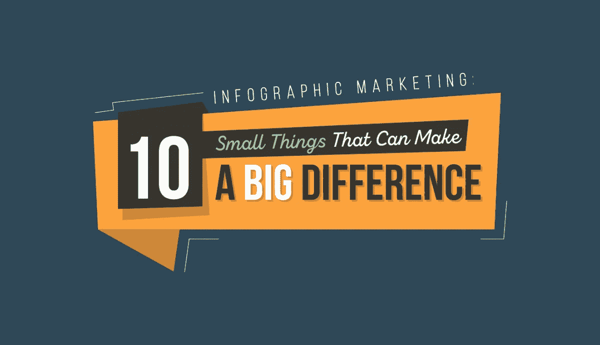

人类是视觉生物。这或许可以解释为什么猜图法已经成为最近数字营销人员使用的最有效的病毒式营销技术之一。

那么，什么是猜图？ [Backlinko](https://backlinko.com/how-to-get-backlinks) 的 Brian Dean 将访客画像定义为三种强大的数字营销策略的结合:信息图、访客发帖和链接建设。他甚至称之为他有史以来“最喜欢的”SEO 策略之一。

作为一种搜索引擎优化策略，使用[猜测图](http://blog.visme.co/guestographics/)包括在权威网站上重新利用和重新发布你的信息图作为客座博文——因此有了术语“猜测图”通过简单地编写独特的介绍来配合你的访客照片，你可以毫不费力地将这些图片发布在多个网站上。

需要一些灵感和技巧来开展你自己的猜图活动吗？这里有五个正确使用猜图法的案例研究。

***你可以在下面查看这篇文章的视觉摘要或者*** [***点击这里***](http://blog.visme.co/guestographics/#skipahead) ***阅读每一个推广猜谜技巧的详细解释。***

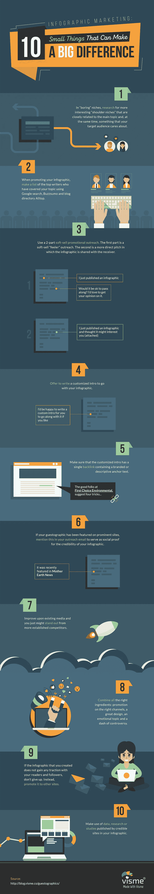

在你的网站上嵌入:

```
<script src="//my.visme.co/visme.js"></script><div class="visme_d" data-url="pv0go3jo-10-small-things-that-can-make-a-big-difference" data-w="800" data-h="4615" data-domain="my"></div><p style="font-family: Arial; font-size: 10px; color: #333333" >Created with <a href="http://www.visme.co/make-infographics" target="_blank" style="color: #30a0ea"><strong>Visme</strong></a></p>
```

# **5 家成功推出 Guestographics 的公司**

# 1.如何将“无聊”的小众生活化

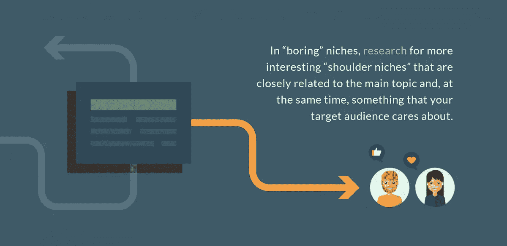

你可以想象为像害虫控制这样无聊的话题制造轰动是多么具有挑战性。但是 SEO 战略家 Mike Bonadio 通过巧妙策划的猜测活动做到了这一点，他不太可能的成功是如此有趣，以至于它被发表在 Backlinko 上。

以下是他的竞选结果:

*   超过 1000 份社交分享
*   在《班戈每日新闻》和《地球母亲新闻》等高权威出版物上发表
*   有机交通增长 15.5%

以下是他使用的猜测照片的部分截图:

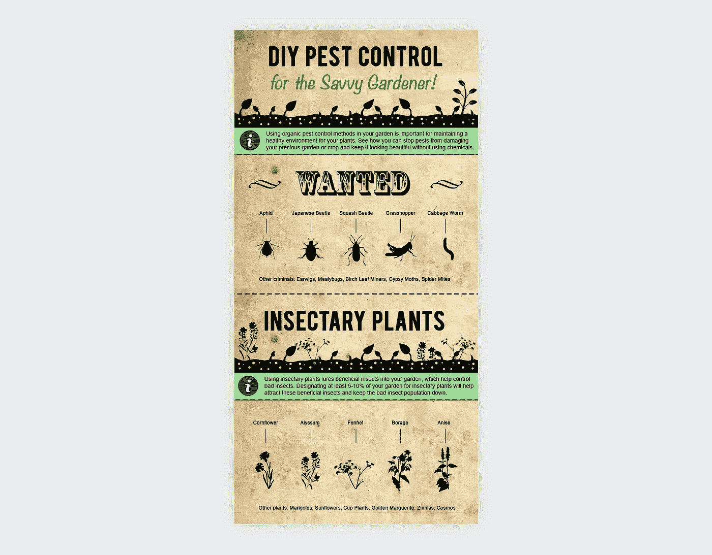

[Image Source](https://visual.ly/community/infographic/how/diy-organic-garden-pest-control)

下面是迈克是如何做到的简要概述:

*   由于“害虫控制”是一个相当无聊的话题，迈克研究了更有趣的“肩膀壁龛”，他可以用它来启动他的活动。这些话题与他的主题密切相关，同时也是他的目标受众感兴趣和关心的事情。
*   迈克围绕“害虫控制”创建了一张**思维导图**,其中他确定了理想的“壁龛”,他的主题“害虫控制”可以借用这些壁龛，例如园艺、家庭装修、自己动手等等。
*   一旦他有了“肩膀龛”的列表，他就运行**搜索与这些次要话题相关的热门或趋势帖子**。在“园艺”这个案例中，Mike 发现大多数著名的园艺博客都非常关心(并且写了)如何消灭花园害虫。答对了。


*   在 Mike 发现他的主要主题和肩膀小生之间的完美重叠后，他开始创作关于“园丁的自然害虫控制”的内容，并以此作为他的猜测摄影的基础。然后他创造了另一个**思维导图**来帮助他的设计师将他的想法充实到一个完成的信息图中。
*   到了推广他的信息图的时候，迈克用谷歌搜索、内容研究工具 Buzzsumo 和博客目录 Alltop 列出了 40 个顶级园艺博客和博客作者。然后，他确定了这些网站背后的合适人选，并向多达 97 名潜在客户发送了推广信息。

# 其他提示

# 提示 1:分为两部分的软销售推广比直接的更有效。

当 Mike 启动他的猜图推广时，他测试了两种类型的推广。一种是软推销的“试探性”接触，在发送信息图之前，他先判断接收者的兴趣。

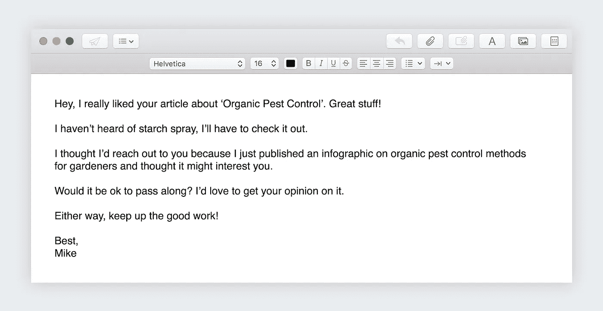

另一种是更直接的推销，他立即与接收者分享他的信息图。

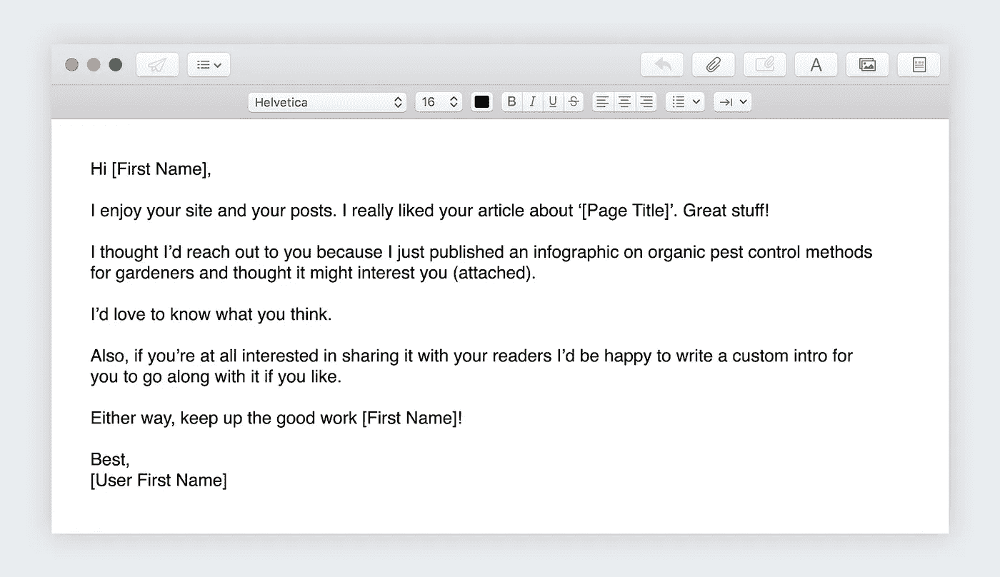

“试探”邮件的回复率为 40%，而直接推销邮件的回复率仅为 16%，因此了解这一点对未来的营销活动很有帮助。

# 提示 2:主动为你的信息图写一个定制的介绍。

对于那些反应良好的潜在客户，Mike 发送了一封电子邮件，其中包含了一个嘉宾照片的链接，并提供了一份定制的介绍。

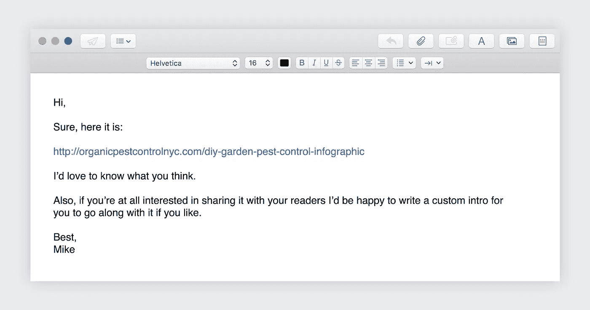

# 提示 3:确保定制的介绍必须有一个包含品牌或描述性锚文本的单一反向链接。

下面是 Mike 如何在他的 guestographics 简介中使用品牌锚文本:

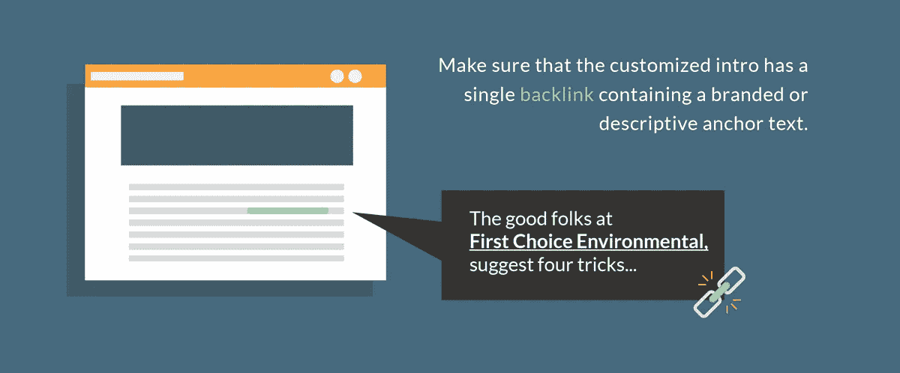

# 提示 4:如果你的猜测图出现在显著的网站上，在你的推广邮件中提到这一点，作为你的信息图可信度的社会证明。

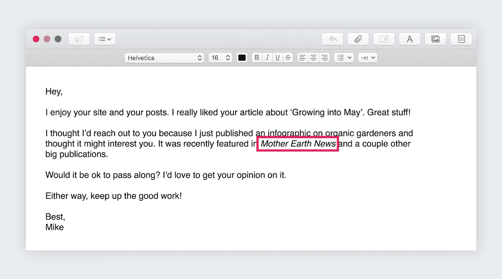

从那以后，迈克的信息图像病毒一样传播开来，并在 Flipboard 和 Pinterest 等网站上分享。不用说，他的害虫控制公司客户肯定得到了他们急需的流量提升，而这一切都来自于一个经过深思熟虑的猜图策略！

# 2.如何使用猜图法与更权威的网站竞争

当 HerePup 的 Perrin Carrell 决定推出一个宠物博客时，他知道自己进入了一个已经被 PetMD.com 等博客主宰的利基市场。尽管如此，他还是坚持了下来。

Perrin 开展了一项猜测活动，取得了显著优势，并取得了以下成果:

*   仅在 6 周内流量增加了 963%
*   超过 1k 的推荐访问者
*   《赫芬顿邮报》的一篇特写

以下是信息图的部分截图:

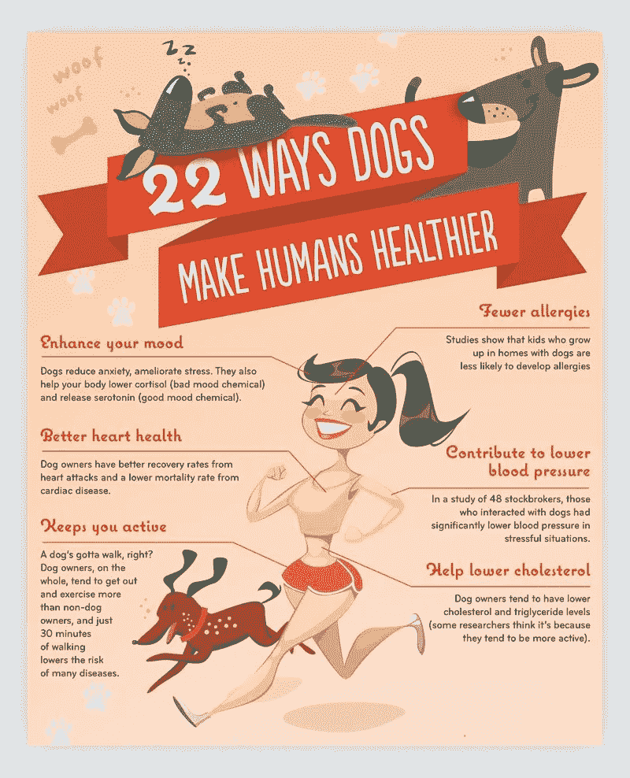

以下是 Perrin 如何使用猜图法超越竞争对手的:

*   首先，Perrin 选择了一个高需求的话题，同时也是他的目标读者关心的话题。因此，他在谷歌上搜索“狗和人类健康”，偶然发现了 WebMD 的一篇文章，“[宠物如何改善你的健康](https://pets.webmd.com/ss/slideshow-pets-improve-your-health)”，这篇文章获得了 228 个推荐域名。他看到它有相当大的流量，但仍然缺乏，他肯定能写出更好的东西。他找到了他的摩天大楼技术机会。
*   在此之后，佩兰做了更多关于“宠物如何改善人类健康”这一主题的研究，整理了他能找到的关于这一主题的最佳资料。
*   最后，他让一名自由设计师捕捉他收集的所有数据，并将其转化为引人注目的信息图。

# 其他提示

# 提示 1:改进现有媒体，你可能会超越你的竞争对手。

在 Perrin 的案例中，他发现顶级内容可以通过更多的研究和设计来改善，所以他开始创造比他从更有影响力的来源找到的内容更好的内容。

由于以视觉震撼的信息图形式添加了更多引人入胜的媒体，并将其推广到相关网站，Perrin 得以突破，并从更成熟的竞争对手中脱颖而出。

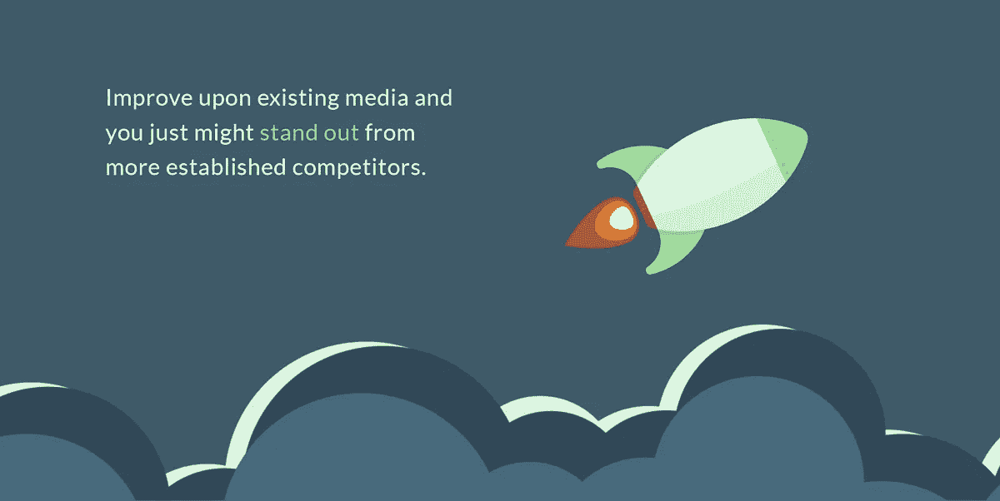

# 3.如何用病毒猜测恢复旧内容

争议可能是很好的宣传。以 Ahrefs 博客上的这个猜测性的[案例研究](https://ahrefs.com/blog/going-viral/)为例。

这个名为[的信息图“喝完一罐可乐一小时后会发生什么”最初发表在《叛离的药剂师》上。它是基于韦德·梅雷迪思 11 年前的一篇文章，关于可乐如何在饮用后一小时内对你的系统造成严重破坏。](https://therenegadepharmacist.com/what-happens-one-hour-after-drinking-a-can-of-coke/)

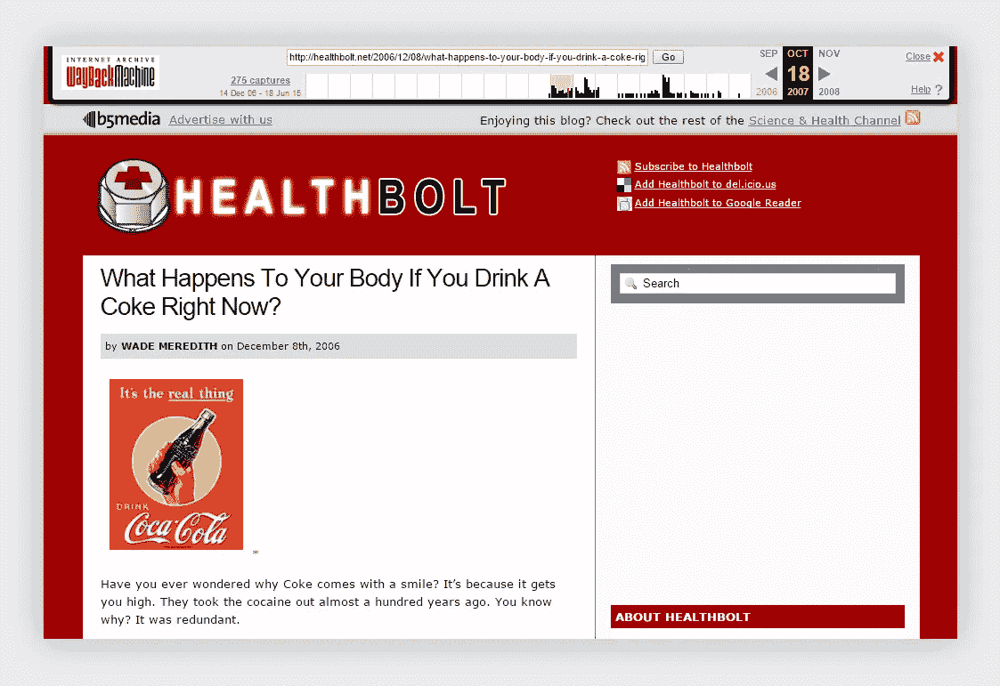

下面是信息图的截图:

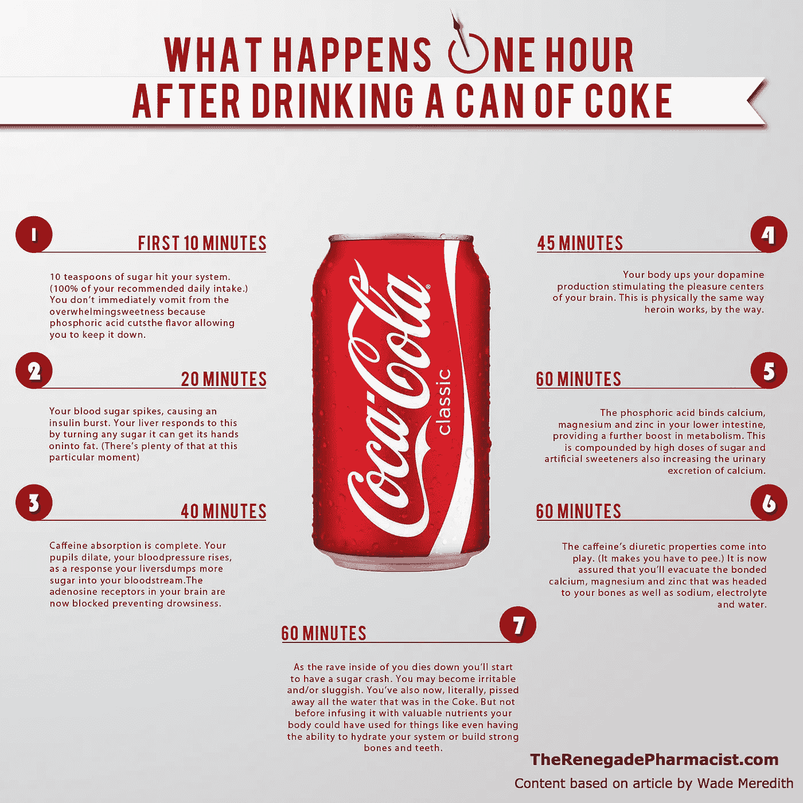

以下是这张信息图的表现:

*   收到差不多 1K 的反向链接。
*   在赫芬顿邮报、Reddit、雅虎、电讯报、Buzzfeed、Examiner、Indiatimes 等网站上发表。，这带来了更多的反向链接和评论。
*   增加了数百个关键字的 DA 和排名
*   仅在脸书就收到了超过 4.4 万股股票

那么，他们是怎么做到的呢？

显然，根据 Ahrefs 的说法，这张信息图完美地结合了以下成分，这导致了它的广泛传播:

*   伟大的设计
*   在正确的地方推广
*   令人激动的话题
*   一点争议
*   讨论了一个引起大品牌愤怒的话题


以下是每个属性与其他属性相结合对结果的影响:

*   这位叛逆的药剂师选择了一个他们擅长的话题，引发了情感上的回应。在他们的案例中，他们的信息图表谈到了可乐对健康的危害，这引发了读者的焦虑。
*   它打击了世界上最强大的饮料制造商之一可口可乐，这在很大程度上导致了它在网上产生的轰动和争议。
*   他们的信息图表首先在在线论坛 Reddit 上获得了势头。它的受欢迎程度像滚雪球一样越来越大，最终到达了权威网站，这些网站不失时机地链接回该信息图。即使 Reddit 上的原始帖子最终被删除，该信息图的受欢迎程度也已经飙升，来自权威网站的更新链接仍然存在。

Wordstream 已经成功推出了几个信息图表，如“谷歌最大的失败和失败”，以及他们最近的信息图表，题为“[谷歌在哪里赚钱:谷歌 Adwords 广告中最昂贵的 20 个关键词](https://www.wordstream.com/articles/most-expensive-keywords)”

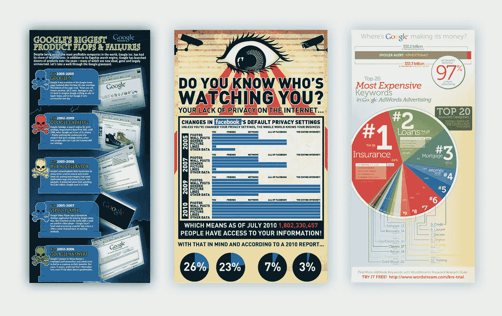

[Wordstream](https://www.wordstream.com/blog/ws/2010/08/25/infographic-case-study) 写了一个案例研究，概述了他们是如何通过信息图取得成功的。值得注意的是，这是在 2010 年制作的，但你可以从中学到很多东西。以下是他们猜测活动的惊人结果:

*   美国有线电视新闻网，这无疑是最权威的网站之一，导致了大量的反向链接
*   转载于《财富》、Techcrunch(美国和日本)、维基百科、赫芬顿邮报、Epic.org 和 Privacy.org
*   登上 Digg、Reddit 和 StumbleUpon 的首页，获得大量曝光
*   在脸书产生了 2K 个赞和 1.2K 条推文
*   赢得了 3500 个链接

尽管 Wordstream 承认信息图没有 2010 年那样的病毒效应，但快速搜索他们最新的博客帖子，包含“谷歌在哪里赚钱”的猜测图，仍然显示出这些令人惊叹的结果:

*   产生的社交分享:1 204 条推文、187 条脸书分享、13 条 Google+分享和 107 条 Instagram 分享

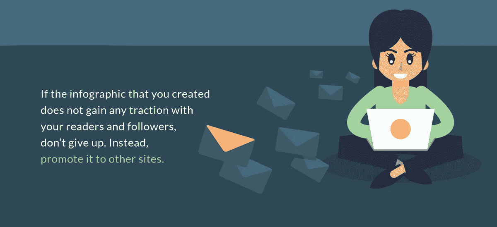

# 4.如何复活被低估的信息图

当知名的在线营销人员鼓吹搜索引擎优化策略时，你可以打赌它在大多数时候是有效的。

在一个[案例研究](https://neilpatel.com/blog/what-does-it-take-to-get-massive-social-shares-4-qualities-to-give-your-next-blog-post-wings/)中，尼尔在他的博客上发布了一张信息图，起初，几乎没有引起任何关注。

下面是该图的截图:

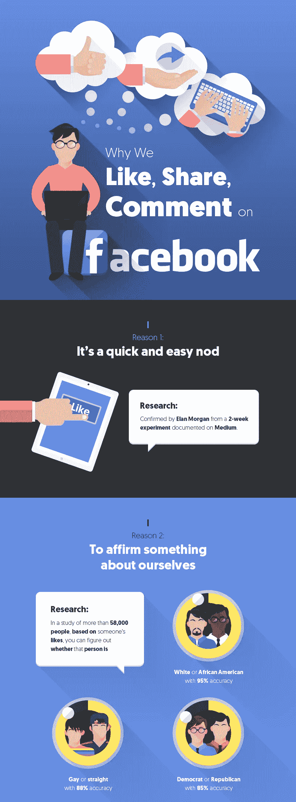

根据 Neil 的说法，他的信息图表在他的博客上首次发布时并没有获得太多的流量。

但是当他把它投给《企业家》杂志时，奇迹发生了。他的猜测最终产生了超过 [12K 股](https://neilpatel.com/blog/content-marketing-case-study-how-4-infographics-generated-over-10000-social-shares/)！


尼尔从恢复他被低估的猜测摄影中学到了什么:

*   如果你创建的信息图没有吸引你的读者和追随者，不要放弃。而是推广到其他网站。
*   将你的信息图表发布在权威网站上，尤其是你的目标受众经常光顾的网站。因为他已经是《企业家》的定期撰稿人，所以很容易就能在网站上发布他的信息图。
*   正如尼尔·帕特尔所说，数据驱动的博客帖子非常成功。当你做一个猜测图时，确保添加百分比、统计数据、案例研究和其他相关数据。在你的信息图中利用可信网站发布的数据、研究或调查。

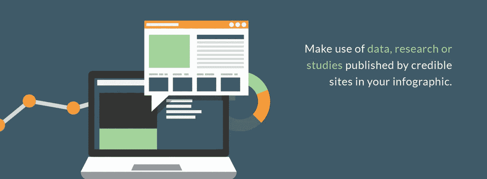

# 结论

现在你知道了:四个伟大的案例研究证明了猜图学的力量。

正如你所看到的，猜图是给你的网站带来急需的提升的最佳策略之一！

急于赶上潮流，但没有资源？然后，我推荐你试试 [Visme](https://www.visme.co/make-infographics/) ，它能让你在几分钟内制作信息图，而且不需要任何设计技巧。很好，对吧？

缺乏灵感？然后继续检查这个关于 19 个不同主题的 [101 个最佳信息图表示例](http://blog.visme.co/best-infographic-examples/)的庞大列表。

那么，猜图学是如何帮助你的博客成长的呢？请在下面的评论中告诉我！

*本帖* [*原版*](http://blog.visme.co/guestographics/) *最早出现在 Visme 的* [*视觉学习中心*](http://blog.visme.co/) *。*