# 信息图表 2.0:如何在信息图表疲劳的时代脱颖而出

> 原文：<https://towardsdatascience.com/infographics-2-0-how-to-make-yours-stand-out-in-the-age-of-infographic-fatigue-48d7163493dc?source=collection_archive---------12----------------------->

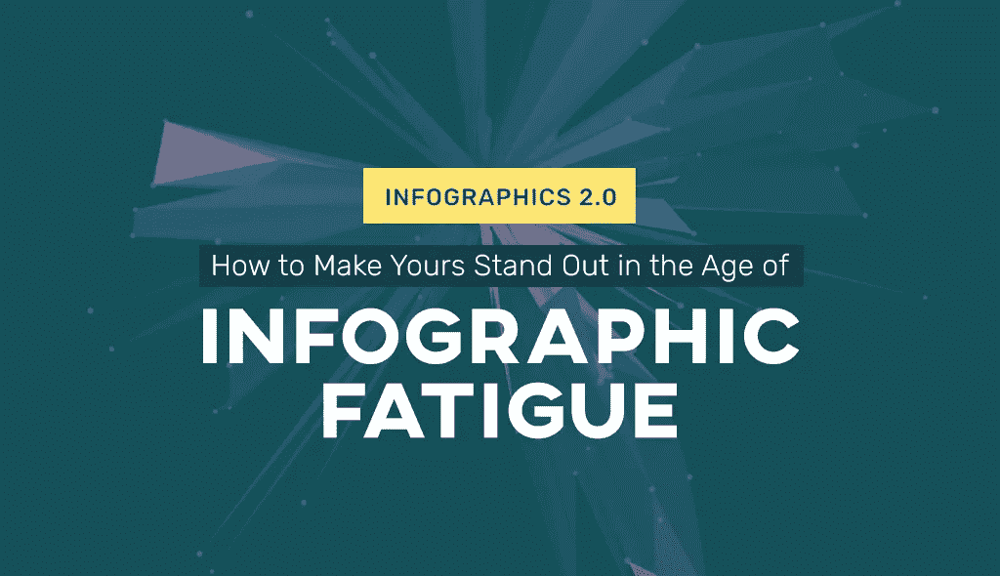

信息图是当今最有效的视觉交流形式之一。教育家们用它们来进行课堂教学和研究项目。项目经理和业务主管使用它们来创建可视化报告。营销人员和记者正利用它们更有效地与受众沟通。

为什么在过去的十年里受欢迎程度激增？因为有文字的图片几乎总是会比只有文字的图片更容易让人记住。事实上，[这项研究](https://link.springer.com/article/10.1007%2FBF02765184)得出的结论是，那些按照包含插图的说明去做的人**比那些按照纯文字说明去做的人**要好 323%。

然而，问题是:当互联网上充斥着成百上千的[信息图(有些设计得并不那么有效)时，你怎么能让这些信息图为你和你的品牌服务呢？](http://blog.visme.co/cool-infographics/)

让我们来看看信息图设计中一些最有创意的趋势，并向您展示如何将它们应用到您自己的视觉营销内容中，使其在视觉噪音的海洋中脱颖而出。我们还将看看信息图的未来，以及如何利用这些信息来改善信息图的内容。

# 什么是信息图疲劳？

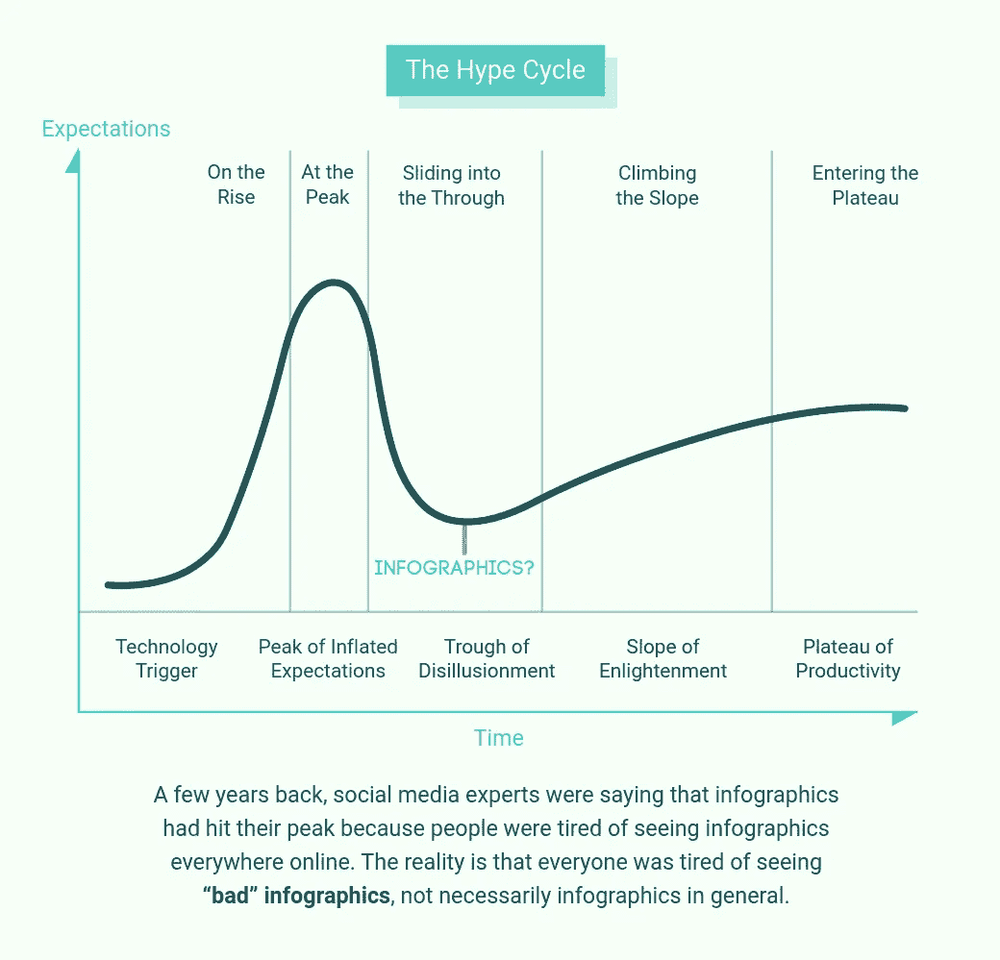

信息图表已经存在了很长时间，远在数字时代之前。但是，一般来说，当我们谈论信息图时，我们指的是那些遍布 Pinterest 并出现在博客帖子中的长垂直图形。自从 Visme 和 Piktochart 等简单的在线图形创建工具问世以来，信息图在网络世界变得非常流行。

几年前，社交媒体专家说，随着在线读者开始厌倦在互联网上看到信息图表，信息图表已经达到了顶峰。事实是，每个人都厌倦了看到**糟糕的信息图**，而不一定是一般的信息图。普通人只需要 8 秒钟就能对他们不感兴趣的内容失去兴趣。考虑到 93%的 Pinterest 用户利用该平台来研究和计划未来的购买，难以处理的信息图表将永远不会被第二次看到。

当信息图表疲劳开始出现时，品牌必须找到更多创新的方式来创建不会让读者厌烦的内容。信息图表开始包括互动元素，如动画、视频和 gif，以及引人注目的自定义视觉效果，如插图和照片。与此同时，设计师开始脱离通常的模板，创造新的和创新的设计。

# 信息图表仍然相关吗？

信息图表疲劳仍然存在，尽管我们应该称之为“糟糕的信息图表超载”。糟糕的信息图可以快速滚动，不会给浏览者留下任何印象。做得好、有创意的信息图仍然非常有意义，而且在未来许多年里都会如此。

你应该继续创建信息图表用于你的内容营销吗？

是的，只要你这样做是为了给你的内容增加独特的价值，而不仅仅是为了创建一个好看的信息图。确保信息准确，视觉效果不会令人不快，并且易于理解。你知道吗，在你的博客文章中包含一个精心设计的信息图表会使它的可分享性至少增加 12%？

为了避免“信息图失败”，你的视觉需要有一定的*质量。随着在线信息图创作者和 DIY 编辑多年来的发展，可以完成的事情的可能性也在发展。*

例如，许多信息图已经偏离了一般的垂直构成，以满足某些社交媒体渠道的大小要求。我们看到越来越多的方形和矩形信息图、微型信息图、动画和互动信息图等等。与此同时，一些信息图被制作得看起来像网站，而一些网站被设计成模仿滚动信息图。

以下是我们在过去一年中观察到的一些最值得注意的很酷的信息图表趋势:

# 微型信息图表

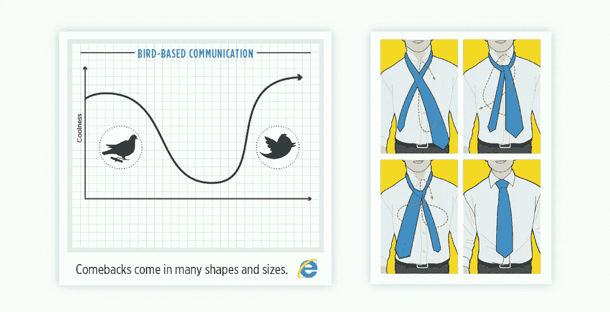

信息图并不总是充满信息的纵向作品。有时候，一个微型信息图就是你以视觉方式呈现一条信息所需要的全部。此外，方形或矩形的微型信息图更容易在社交媒体上分享。为了获得更惊人的效果，添加动画效果并将信息图保存为视频或 GIF。

# 信息图表风格的网站/滚动信息图表

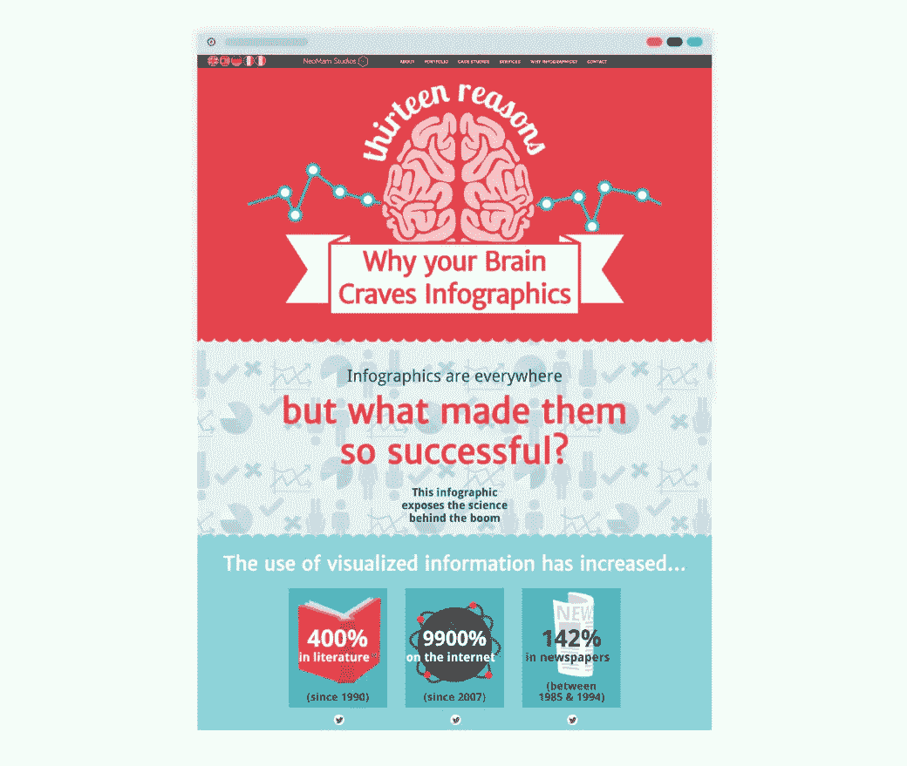

[Image Source](https://neomam.com/interactive/13reasons/)

随着信息图变得越来越具有交互性，它们也逐渐进入了网页设计的领域。因此，我们开始看到网络和应用程序开发工具被用来创建信息图表。(点击阅读更多关于用户界面设计(UID)、用户体验设计(UXD)和信息图表[之间的关系。](http://blog.visme.co/cool-infographics/#uxd)

在下面的例子中，有两种变体:以完整的网站格式呈现的信息图和看起来像信息图的网站。有些情况下，你甚至分不清！

如果您的企业有重要的信息需要可视化地解释，尝试这种格式是一个好主意(并且您也有额外的时间和资源来投资开发类似网站的信息图)。这种类型的可视内容通常具有交互式按钮和指向其他页面或信息图部分的超链接，以创建更好的用户体验。

# 滚动和交互式信息图

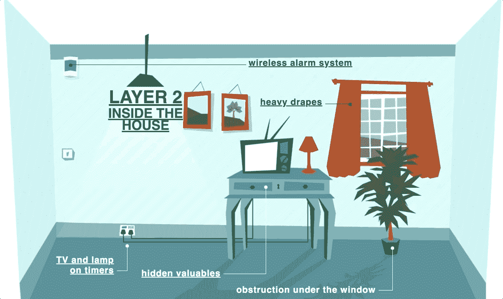

[Image Source](https://simplisafe.com/resource/layered-defense/)

这些是可以在滚动网页格式中欣赏的信息图表:

*   [咖啡来自哪里？](http://www.bizbrain.org/coffee/)
*   [天伦之乐](https://lemonly.com/marriott/family-fun-in-scottsdale/)
*   [信息图设计流程](http://www.copypress.com/infographicDesignProcess/#main-cont)

# 受信息图表启发的网站

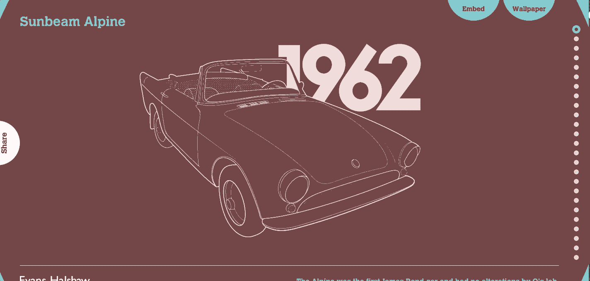

[Image Source](http://www.evanshalshaw.com/more/bondcars/)

这些网站被设计成类似信息图表:

*   [步入成年的千禧一代](http://www.goldmansachs.com/our-thinking/pages/millennials/)
*   [保证书:驾驶执照](http://www.evanshalshaw.com/more/bondcars/)
*   [棋子种类](http://species-in-pieces.com/#)

# 方形信息图

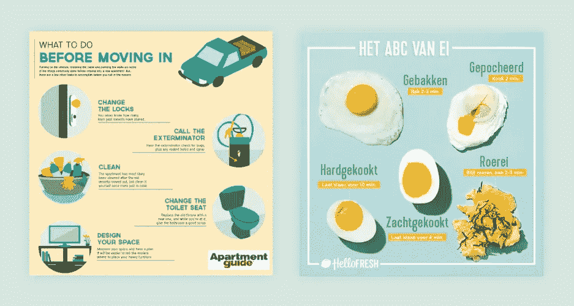

分享信息图的首选社交媒体渠道一直是 Pinterest，因为它的垂直特性。然而最近，越来越多的信息图被放到了 Instagram 上，并从那里被放到了脸书和 Twitter 上。这是一个非常新的趋势，我们认为它将在 2018 年起飞。由于这种趋势只涉及信息图的大小，所有其他趋势都可以应用于它。例如，3D 设计和动画可以用来创建非常创新的方形信息图。

方形信息图对于提供快速解释和促进快速社交媒体分享非常有用。公司和创业公司可以真正从这种信息图表趋势中受益，因为它更容易分享！

以上是我们目前在网上最喜欢的一些正方形信息图。如果你关注 Instagram 上的标签**#信息图**，你会看到一些非常惊人的例子，而且每天都有更多。

# 动画信息图

现在你在网上找到的一些很酷的信息图可以包含所有类型的动画效果。动画可以是一个焦点，也可以是设计的补充。制作信息图动画的最佳策略是知道何时使用它。

问问你自己:动画会促进信息的传递还是会分散读者的注意力？

我们上面展示的滚动信息图充满了动画和元素的进出效果，它们随着你的滚动而移动。但是这些并不是唯一可以添加到信息图中的动画。您可以制作图表和文本动画。

当信息图包含动画时，需要以向查看者显示动画的格式保存。其中包括可以在任何浏览器上查看的. html5。可以在任何设备上查看的 gif 和视频格式的. mp4。这实际上取决于您应用于信息图的动画类型，从而知道您需要哪种文件格式。

以上是保存在中的动画信息图示例。gif 格式。

# 互动信息图表

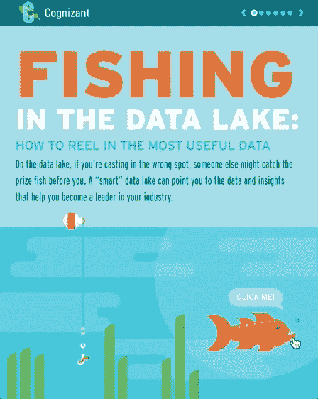

[Image Source](http://killerinfographics.com/project/fishing-in-the-data-lake/)

交互式信息图是用户可以与之交互的信息图。这可以通过点击、悬停甚至数据输入来实现。主要思想是，根据用户在信息图上的操作，信息会自我修改。

这些信息图可以是任何形状:正方形、长方形或长而垂直。它们的一个共同点是，它们需要是. html5 格式才能工作。这种风格的信息图还不能在社交媒体上分享。它们特殊的可点击特性最好在浏览器中体验。

以下是一些例子:

*   [大脑的基本功能](http://www.onlinecollegecourses.com/basic-brain-map/)
*   [学会像保卫城堡一样保卫自己的家园](https://simplisafe.com/resource/layered-defense/)
*   [来自外太空的火球](http://fireball.ahoi.in/)

# 多媒体信息图表

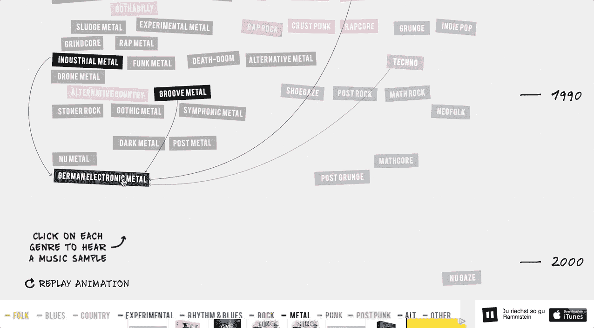

[Image Source](https://www.concerthotels.com/100-years-of-rock/)

当在线信息图制作者们整合了嵌入视频和 gif 的可能性时，他们向前迈出了一大步。只需一个 iframe 代码片段，任何视频或 GIF 都可以包含在信息图中。

这些交互式信息图表需要嵌入到网站或电子邮件中，以. html5 或。gif 文件格式。如果下载为. jpeg 或。png 文件，视频和 gif 显示为静态照片。因此，包含视频或 gif 的信息图不能发布在 Pinterest 上。

这些听起来像是挫折，但它们真的不是。这些很酷的信息图表可能不会在社交媒体上疯传，但它们肯定会让你的内容在竞争中胜出。它们也可以用作会议上的演示文稿或创新的数字简历。

信息图设计的可能性已经发展到如此的高度，信息图甚至可以被认为是多媒体设计的一个例子。例如，您可以使用 Visme 等在线信息图表制作工具将所有类型的互动和动画内容嵌入到您的视觉效果中，包括视频、音频、gif 和实时内容。

例如，有些信息图有不同部分的背景音乐和音频解释。点击可以产生声音效果并激活叙述。动画可以用来显示社交媒体渠道或电子商务网站在线销售柜台上的实时活动。

# 集成的第三方内容和实时信息

随着信息图变得越来越数字化，第三方内容的整合变得越来越普遍。第三方内容到底是什么？视频和 gif 是第三方内容，但来自 Twitter 和脸书的表格、地图和实时社交媒体反馈也是第三方内容。通过嵌入第三方内容，您的信息图表可以达到一个全新的水平。显示的信息可以有许多不同的表达渠道。

这里有一个例子:

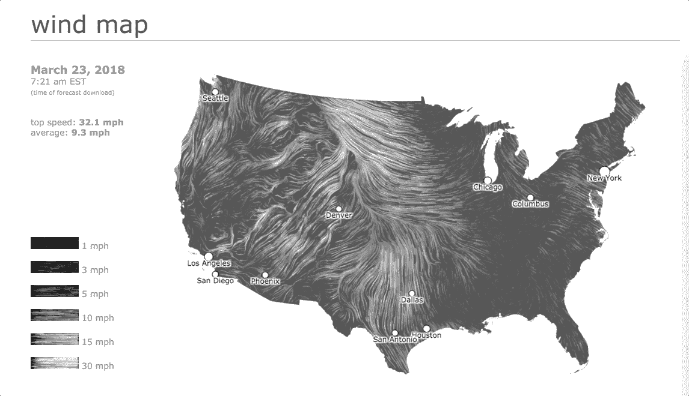

[Image Source](http://bostonography.com/bus/)

# 插图人物

我们看到的另一个有趣的趋势是使用插图人物。在信息图中，字符被用作解说员或演示者，而不是单独显示数据。使用插图人物的另一种方法是将他们作为视觉形象的一部分。字符可以赋予信息图额外的个性和亲切感，而不是依赖图表、箭头和流程图。

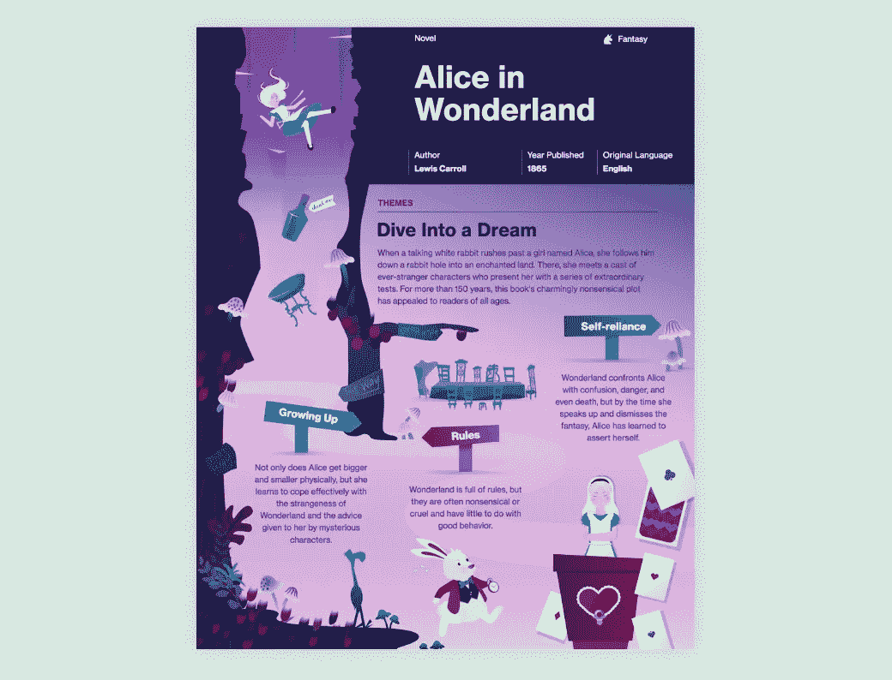

[Image Source](https://pin.it/o6atodwx4z55gr)

# 3D 插图/等距信息图

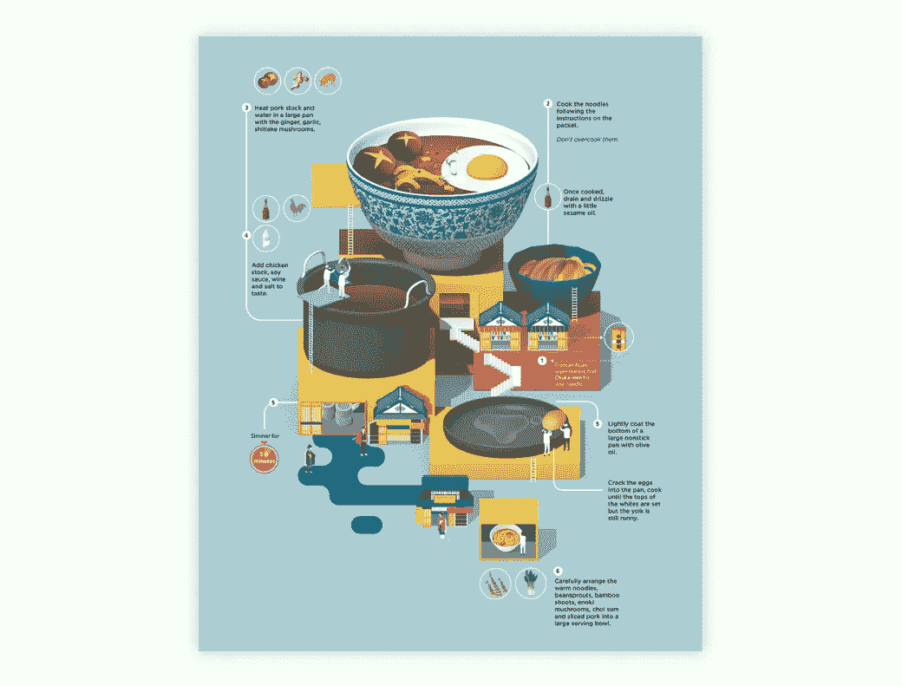

[Image Source](https://weandthecolor.com/recipe-infographics-jing-zhang/71688)

我们观察到的另一个趋势是 3D 插图的使用。使用 3D 元素的信息图被称为等轴信息图，具有真正不同的感觉。三维插图通常用于在等距信息图中创建一个完整的场景，模糊了我们习惯的经典部分的线条。这种风格的信息图将在 2018 年继续流行，但只有时间才能证明它是否会成为永恒。

# 手绘风格

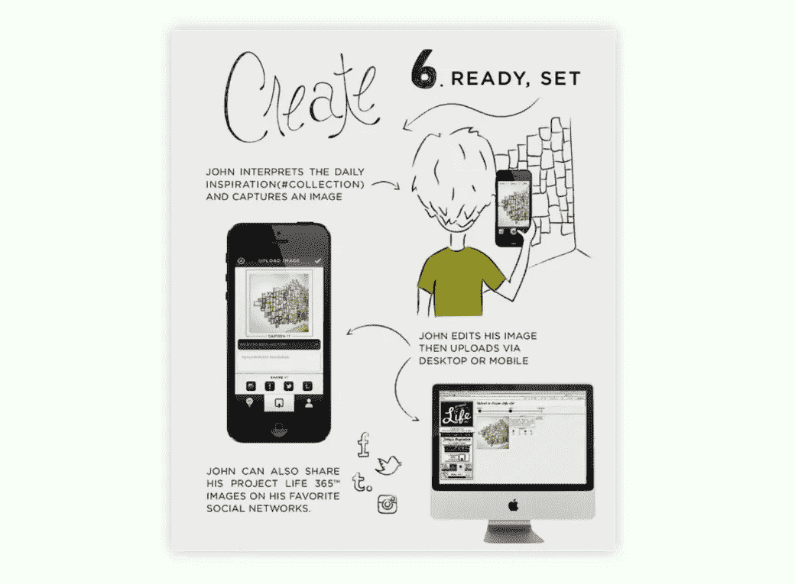

[Image Source](https://www.pinterest.com/pin/460211655643811484/)

手绘风格不仅仅是信息图设计中的一种趋势——我们在设计的各个方面都可以看到它。自从手绘刻字和脚本字体热潮以来，我们在内容营销的各个环节看到了越来越多的手绘风格设计。当在信息图表中使用时，这种样式赋予信息一种真正特殊的感觉。如果使用得当，手绘风格可以让你的酷信息图在浩瀚的互联网视觉海洋中更快地被看到和识别。

# 摄影

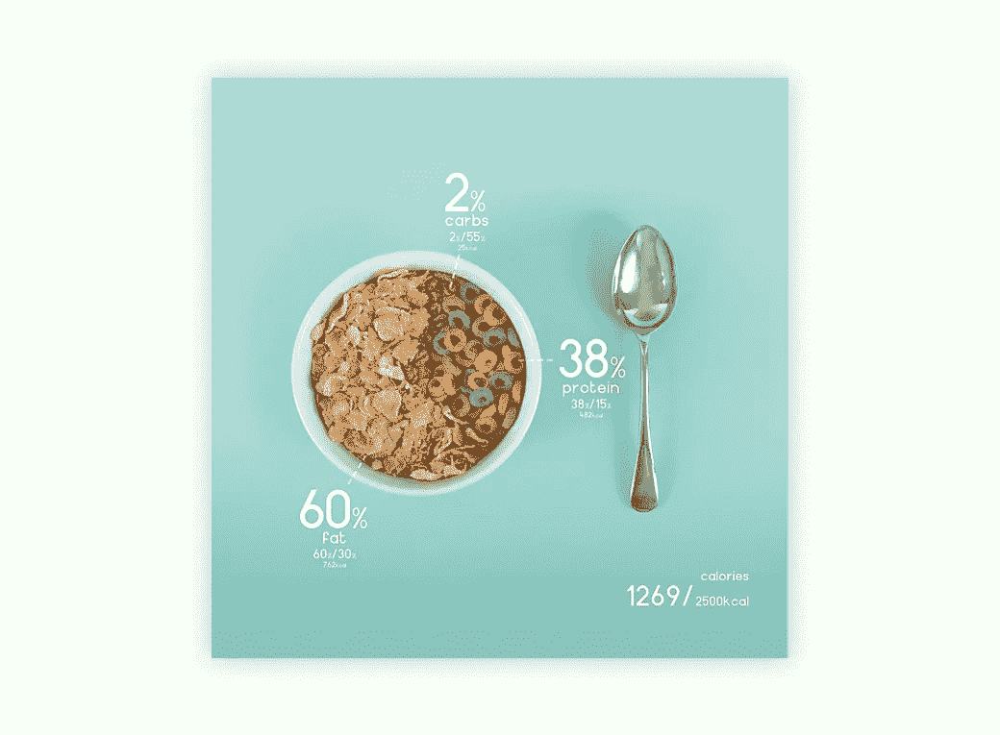

[Image Source](https://www.pinterest.com/pin/716494621941088147/)

在信息图中包含摄影一点都不新鲜，但是它的使用方式确实令人印象深刻。许多很酷的信息图混合了手绘风格的设计和摄影，创造出一些非常有创意的视觉效果。

# 你如何利用这些趋势让你的信息图脱颖而出？

没有必要用你自己的内容去尝试这些趋势中的每一个。挑选一些符合你品牌风格的，看看你是否喜欢它们，它们是否能给你带来效果。在我们提到的趋势中，有些集中在数字风格的信息图表上，比如使用动画和第三方内容。其他人更倾向于艺术方面，比如静态信息图。

你对内容数字化的选择很大程度上取决于你的品牌和产品。如果你的服务是面向连接、网络、响应设计和数字营销，那么数字风格趋势可能是一个更好的选择。如果你是设计烹饪书的艺术家或者打印材料的教育者，更有创造性和艺术性的趋势可能更适合你的视觉内容。

当然，两种不同的趋势可以在同一个信息图中一起使用。一个动画微型信息图在。gif 格式可以在 Twitter 和 Instagram 上产生很大的影响(转换成. mp4 格式时)。就像我们在上面看到的，手绘设计和摄影真的很好地结合在一起，所以想象一个视频嵌入在同一信息图中的电视或手持设备的绘图中。可能性是无限的。

# UXD 和 UID 如何帮助你制作更好的信息图？

当我们观察上述趋势时，我们提到了一些信息图是如何被视为网站的，以及一些网站是如何受到信息图的启发的。这种趋势的出现是因为网站和应用开发者使用的工具启发了信息图表的制作方式，反之亦然。

这些工具被称为**用户体验设计(UXD)** 和**用户界面设计(UID)** 。网站和应用程序设计人员和开发人员遵循 UXD 和 UID 规则来构建他们的项目。这两种实践是网站和应用程序运行的基础。

# UXD 和 UID 到底是什么？

**UXD**

来自 Beaker 的 Ben Ralph 说:“用户体验设计是研究用户行为和理解用户动机，目的是设计更好的数字体验。”UXD 适用于网站和应用程序对用户点击和操作做出反应的方方面面。这完全是关于用户对数字平台的体验。

**UID**

用户界面设计更多的是关于一个网站或应用程序如何符合 UXD。它遵循平台功能的视觉图形方面。

UXD 和 UID 一起工作，确保一个网站或应用程序不仅看起来不错，而且运行良好。随着信息图越来越数字化，了解 UXD 和 UID 的工作方式将有助于您创建更好的信息图，并从您的设计中获得更好的结果。

# 这里有一些关于如何应用 UXD 和 UID 来创建很酷的信息图的提示

创建信息图时，首先要考虑的是将会看到它并与之交互的人:

*   他们是谁？
*   你想用你的信息为他们解决什么问题？
*   你的信息图的目的是什么？是销售线索磁铁还是视觉支持？

一旦你决定了你是为谁设计，就该计划信息流了。

*   在文案和视觉效果方面，到底需要包含哪些信息？
*   你如何在信息呈现的方式上变得有创造性？
*   评估信息图的导航:什么应该是交互式内容？
*   使用讲故事的技巧来增强信息图的体验和可用性。

在解决了 UXD 方面的问题之后，是时候构建信息图了。这是用户界面设计。

UID 的首要规则是忠于你的品牌。采取必要的步骤遵循你的 UXD 大纲，同时在颜色、字体、形状和视觉策略方面保持品牌。

*   使用对齐、间距和大小调整等设计工具构建信息图。
*   整合支持信息流的动画，而不是分散信息的注意力。
*   评估您可以包含第三方内容的地方，并确保它在视觉上非常合适。

当您完成信息图的构建后，请考虑在发布或发布前对其进行测试。请你的同事测试信息图，并询问他们对信息图的看法。评估结果并调整你的设计。

# 为什么你的信息图应该是移动友好的？

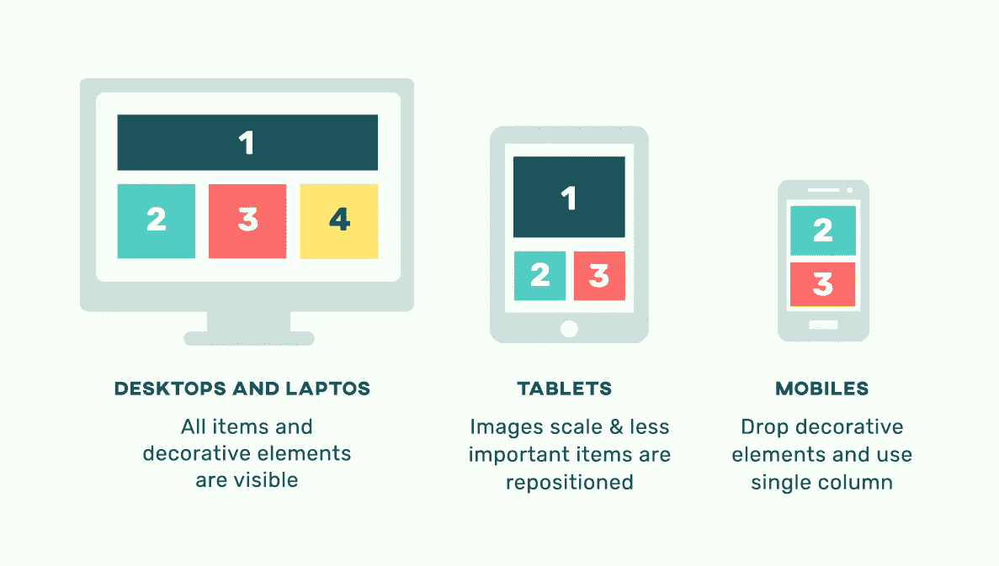

信息图表也应该是移动友好的，这并不奇怪，特别是因为人们平均在手机上花费 69%的媒体时间。他们很可能会先在智能手机上看到你的信息图，然后再在笔记本上看到。这就是为什么你的信息图在手机和桌面上都应该表现良好。它应该看起来不错，功能良好，易于滚动，可读，易于在所有设备上使用。UID 和 UXD 在这个意义上也可以帮助你的信息图。

让信息图在桌面和移动设备上都好看的最好方法是不要用过多的形状、颜色和字体。注意它在小屏幕上的大小。如果观众需要放大才能看到一条信息，那么这条信息就太小了。适合手机屏幕的信息图的理想宽度是 630 像素，比普通信息图的 800 像素略小。

# 结论:信息图表的未来是什么？

正如我们所见，信息图表的未来很大程度上取决于用户和观众。信息图比以往任何时候都更需要功能性和美观性。他们需要走得更远，探索比所呈现的信息更深远的可能性。

信息图表的未来在于数字和互动领域，用户将享受这一旅程，并记住它。

这就是为什么可以有把握地说，在 2018 年及以后，信息图表将更加数字化。随着时间的推移，多媒体信息图将变得越来越普遍。更多信息图表将保存为. html5，.gif 和. mp4 格式来维护动画和嵌入的第三方内容。我们甚至可能会看到虚拟现实中使用的信息图表，在虚拟现实中，用户可以用一种全新的方式与信息互动。

由于“糟糕的信息图表疲劳”的出现，静态信息图表的未来更加不确定我们相信，随着等距设计和品牌插图的使用，这种风格的信息图将会出现创造力和创新的激增。即使没有交互性，信息图也需要流畅并对用户产生影响。

将来你的信息图和其他的相比如何？这完全取决于你想在设计中承担的风险。

*本帖* [*原版*](http://blog.visme.co/cool-infographics/) *最早出现在 Visme 的* [*视觉学习中心*](http://blog.visme.co/) *。*