# 信息规划和朴素贝叶斯

> 原文：<https://towardsdatascience.com/information-planning-and-naive-bayes-380ee1feedc7?source=collection_archive---------1----------------------->

## 用更少的例子学得更好


信息规划包括基于信息度量做出决策。信息规划与主动学习[1]和最优实验设计[2]密切相关，其中标记数据的获得是昂贵的。

主动学习背后的关键思想是，如果仔细选择**训练样本以最大化特定任务**的信息增益，那么模型可以用更少的标记样本学习得更好。换句话说，给定大量未标记的数据，我们希望根据它们在学习模型参数中的有用性对未标记的例子进行排序。前 K 个信息量最大的训练样本由专家标注器标注，并添加到训练集中。

这里，我们将考虑使用朴素贝叶斯图形模型的文本分类任务。我们将着眼于两种信息度量[3]:熵和互信息，它们将被用于为信息规划对未标记的文档集进行排序。

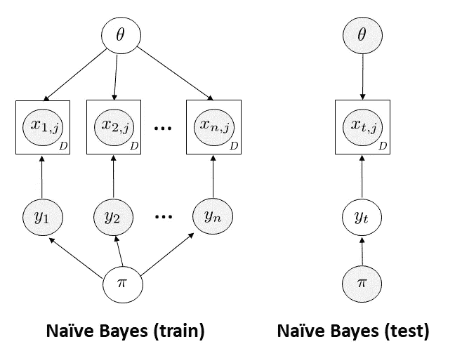

设 *x_ij* 为伯努利随机变量，指示{1，…，D}中的单词 *j* 对于{1，…，n}中的文档 *i* 的存在( *x_ij = 1* )或不存在( *x_ij=0* )，由θ_ JC 参数化(单词 *j* 出现在类 *c* 中的概率)

另外，设 pi 是代表类别标签上的先验的狄利克雷分布。因此，可学习参数的总数是|theta| + |pi| = O(DC) + O(C) = O(DC)，其中 *D* 是字典大小， *C* 是类别数。由于参数数量少，朴素贝叶斯模型不会过度拟合。

> 伯努利朴素贝叶斯公式的选择很重要，因为它导致了基于单词的信息规划。通过将字典中的每个单词与一个二进制随机变量相关联，我们能够计算单个单词对类别标签分布的影响。

我们可以将类条件密度写为:

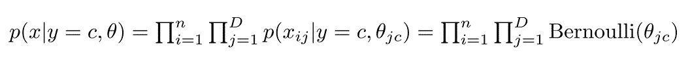

我们可以通过最大化对数似然来推导朴素贝叶斯推理算法。考虑单个文档中的单词*x _ I*I:

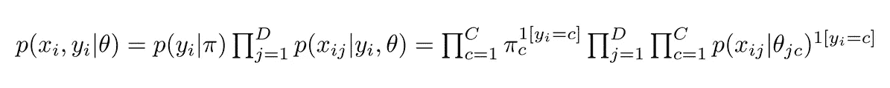

使用朴素贝叶斯假设，我们可以计算对数似然目标:


通过将 log p(D|theta)相对于模型参数 pi_c 和 theta_jc 的梯度设置为零，我们获得以下 MLE 更新:pi_c = N_c/N 和 theta_jc = N_jc / N_c 其中 N_c = sum(1[y_i = c])。

请注意，为伯努利随机变量添加β先验和为类密度添加 Dirichlet 先验以平滑 MLE 计数是很简单的:

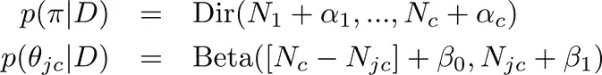

在测试期间，给定训练数据 *D* 和学习的模型参数，我们想要预测类别标签 *y* 。应用贝叶斯规则:

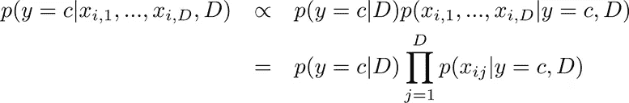

将分布代入 *p(y=c|D)* 和 *p(x_ij|y=c，D)* 并取对数，我们得到:

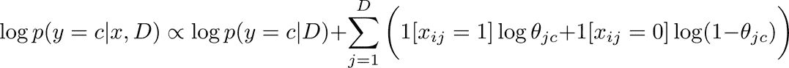

伯努利朴素贝叶斯的贝叶斯公式在 scikit-learn [5]中使用上述步骤实现。*虽然从零开始(用更快的语言，如 C++)派生和实现 ML 算法是一个很好的实践，但我们将使用 scikit-learn 实现，并专注于信息规划*。下面的 [ipython 笔记本](https://github.com/vsmolyakov/experiments_with_python/blob/master/chp01/info_planning.ipynb)中有全部代码。

我们将在[20 个新闻组](http://scikit-learn.org/stable/datasets/twenty_newsgroups.html)数据集的子集上训练我们的模型。特别是，我们将自己限制在 4 类:空间，图形，汽车和曲棍球。我们将使用计数矢量器来生成每个文档的字数矢量，同时过滤停用词和低频词。

# 熵规划

熵衡量随机变量中的不确定性。在基于熵的规划中，我们希望根据类别标签的熵对测试文档进行排序。这个想法是，通过注释对其类标签具有最高不确定性的文档，将能够用更少的注释示例更好地训练我们的模型。在类分布的情况下，熵可以以封闭形式计算:


```
*#rank test documents according to entropy of their class label*
top_K = 20
X_test_class_logp = nb_clf.predict_log_proba(X_test_vec)
X_test_class_entropy = -np.sum(np.exp(X_test_class_logp) * X_test_class_logp, axis=1)
planning_entropy_idx = np.argsort(X_test_class_entropy)[-top_K:]
```

# 相互信息规划

在交互信息的情况下，我们需要选择我们想要用于规划的随机变量。既然我们对文档分类感兴趣，选择 *y_i* (文档 *i* 的类标签)作为变量之一是有意义的。我们对第二个变量的选择取决于感兴趣的数量。我们可以选择一个全局变量 theta_jc(单词 *j* 出现在类 *c* 中的概率)或者 pi_c(类 c 的概率)。在这个例子中，我们考虑估计 MI(y _ I；theta)，即我们感兴趣的是在给定测试文档的类别标签 *y_i* 的情况下，测量关于单词分布 *theta* 的信息增益。因为两个变量都是离散的，所以可以以封闭形式估计互信息:

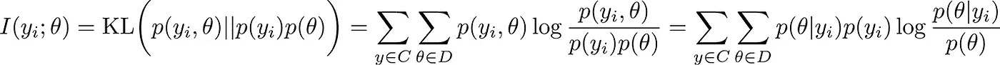

我们可以使用全概率法则计算*p(θ)*:

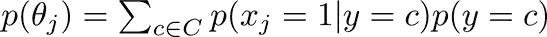

此外，我们计算 MI(x _ j；pi)来衡量每个单词 *x_j* 对全局标签分布 *pi* 的信息量。

```
*#rank test documents according to mutual information (MI) between class labels and theta*
log_pi = nb_clf.class_log_prior_              *#log pi(c) global*
log_py = nb_clf.predict_log_proba(X_test_vec) *#log py(c) per doc*
log_pxy = nb_clf.feature_log_prob_            *#log pxy(c,j) = log p(x_ij = 1 | y = c)*

[C,D] = log_pxy.shape
log_pi_tile = np.tile(log_pi.reshape(-1,1), log_pxy.shape[1])
*#log px(j) = log [\sum_c p(x_ij = 1 | y = c) x p(y = c)]*
*#          = log [\sum_c exp{log_pxy(c,j) + log_pi(c)}]*
log_px = logsumexp(log_pxy + log_pi_tile, axis=0)

*#MI between x_j and pi*
X_test_word_MI = np.zeros(D)
**for** class_idx **in** range(C):
    X_test_word_MI = X_test_word_MI + \
    np.exp(log_pi[class_idx]) * np.exp(log_pxy[class_idx,:]) * np.log(np.exp(log_pxy[class_idx,:])/np.exp(log_px)) + \
    np.exp(log_pi[class_idx]) * (1-np.exp(log_pxy[class_idx,:])) * np.log((1-np.exp(log_pxy[class_idx,:]))/(1-np.exp(log_px)))    
*#end for*

*#MI between y_j and theta*
logp_theta = logsumexp(log_pxy + log_pi_tile, axis=0)
X_test_docs_MI = np.zeros(X_test_vec.shape[0])
**for** doc_idx **in** range(X_test_vec.shape[0]):
    doc_MI = 0
    **for** class_idx **in** range(C):
        doc_MI += np.sum(np.exp(log_pxy[class_idx,:] +    
                  log_py[doc_idx, class_idx]) * \
                  (log_pxy[class_idx,:] - logp_theta), axis=-1)
    *#end for*
    X_test_docs_MI[doc_idx] = doc_MI
*#end for*

planning_MI_idx = np.argsort(X_test_docs_MI)[-top_K:]
```

让我们来看看每门课学习的单词概率:

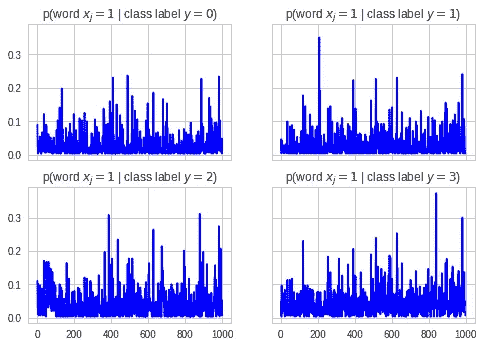

我们可以显示上面与每个类别相关的前 10 个(最高概率)单词:

> 课堂十大单词:0
> get 请像任何人一样使用感谢图形会知道
> 
> 课堂十大词汇:1
> 想想也知道汽车变得像一辆汽车
> 
> 班级十大单词:2
> 赛季年第一次打曲棍球
> 
> 课堂十大单词:3
> 美国国家航空和宇宙航行局可能知道得更多，就像太空一样

让我们来看看前 20 个(MI 最高的)信息词汇:

> 前 20 名 MI 单词:
> 球队计划联赛月球季后赛轨道球员地球游戏 nasa nhl 玩汽车赛季图形曲棍球队游戏汽车空间

还不错！考虑到地面真相标签是:

> 地面实况标签:
> 科学.空间.计算机.图形.记录.汽车.记录.运动.曲棍球

我们可以看到，最高 MI 的单词很好地反映了地面真相标签。

最后，让我们可视化基于熵和互信息的测试文档排序:

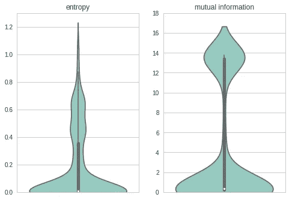

特别地，我们对离群值感兴趣，即具有最高熵和互信息的文档。从上面的 violin 图中，我们可以看到与高熵文档相比，高 MI 测试文档的密度更大，这表明 MI 可以更好地区分哪些文档最适合信息规划。

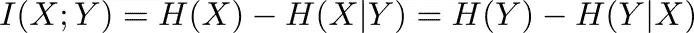

> *在离散 X 和 Y 的情况下，为了最大化信息增益 I(X；Y)，我们想要最大化 H(X)(关于 X 的不确定性)和最小化 H(X|Y)(即我们想要 Y 关于 X 的信息性)。*

为了可视化熵和基于 MI 的计划之间的差异，我们可以根据熵对文档进行排序，并使用相同的索引对 MI 进行排序。

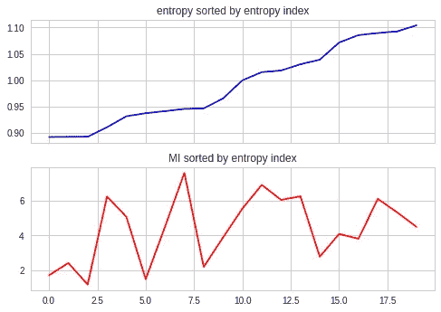

在上图中，具有高熵但低 MI 的文档是不确定的，但不是信息丰富的。因此，管理信息为信息规划提供了更好的手段。

# 密码

下面的 [ipython 笔记本](https://github.com/vsmolyakov/experiments_with_python/blob/master/chp01/info_planning.ipynb)中有全部代码。

# 结论

我们研究了两种用于选择训练样本的信息度量:简单朴素贝叶斯设置中的熵和互信息。虽然熵根据文档的不确定性对文档进行排序，但是 MI 也考虑了计划变量的信息量。通过主动选择训练样本，我们可以用更少的标记样本获得更高的准确率。信息规划可以在减少我们对大量训练数据的依赖方面发挥作用，尤其是在标签获取成本高昂的情况下。

# 参考

[1] B. Settles，“主动学习文献调查”，技术报告，2010 年
[2] K. Chaloner 和 I. Verdinelli，“贝叶斯实验设计:综述”，统计科学，1995 年
[3] T. Cover 和 J. Thomas，“信息理论的要素”，Wiley，2006 年
[4] K. Murphy，“机器学习:一种概率观点”，麻省理工学院出版社，2012 年
[5] F. Pedregosa 等人，“Scikit-learn:Python 中的机器学习:【T4