# 神经网络信息论

> 原文：<https://towardsdatascience.com/information-theory-of-neural-networks-ad4053f8e177?source=collection_archive---------3----------------------->

## 打开黑盒…稍微

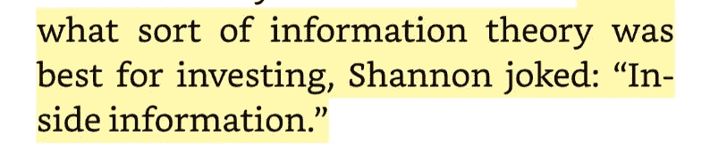

> "信息:概率的负倒数值."—克劳德·香农

这个博客的目的不是理解神经网络背后的数学概念，而是从信息处理的角度来看神经网络。

# 编码器-解码器

在我们开始之前:

> 编码器-解码器不是两个 CNN/rnn 组合在一起！事实上也不一定是神经网络！

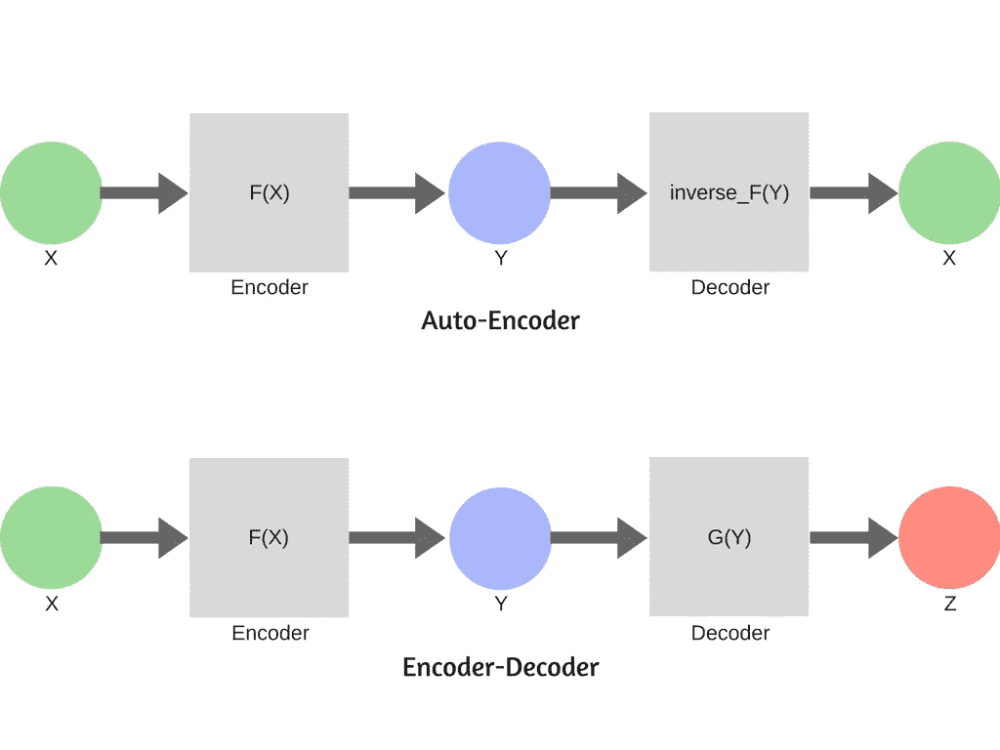

本来，信息论的一个概念。[编码器只是简单地压缩信息，而解码器扩展编码后的信息。](https://www.cs.toronto.edu/~hinton/science.pdf)

在机器学习的情况下，编码和解码都是完全丢失的过程，即一些信息总是丢失。

编码器的编码输出被称为*上下文向量*，这是解码器的输入。

有两种方法可以设置编码器-解码器设置:

1.  编码器反函数中的解码器。这样，解码器试图再现原始信息。这是用来消除数据噪声的。这个设置有一个特殊的名字，叫做自动编码器。
2.  编码器是压缩算法，解码器是生成算法。这有助于将上下文从一种格式转换为另一种格式。

> 示例应用:
> 
> 自动编码器:把英文文本压缩成矢量的编码器。解码器从向量生成原始英文文本。
> 
> 编码器-解码器:将英文文本压缩成向量的编码器。解码器从向量生成原文的法语翻译。
> 
> 编码器-解码器:将英文文本压缩成向量的编码器。从文本内容生成图像的解码器。

# 信息论

现在，如果我说每个神经网络，本身，是一个编码器-解码器设置；对大多数人来说，这听起来很荒谬。

**让我们重新想象一下神经网络。**

假设输入层是 X，它们的真实标签/类(存在于训练集中)是 y。现在我们已经知道神经网络找到了 X 和 y 之间的潜在函数。

*所以 X 可以看成是 Y 的高熵分布，高熵是因为 X 包含了 Y 的信息，但它也包含了很多其他信息。*

> 示例:
> 
> “这小子不错。”包含足够的信息来告诉我们它的“积极”情绪。
> 
> 酪
> 
> 它还包含以下内容:
> 
> 1.是一个特定的男孩
> 
> 2.只是一个男孩
> 
> 3.句子的时态是现在时
> 
> 这句话的非熵版本应该是“正的”。是的，这也是输出。我们过一会儿再回到这个话题。

现在想象每一个隐藏的层作为一个单一的变量 H(因此层将被命名为 H0，H1 …..H(n-1))

现在每一层都变成了变量，神经网络变成了[马尔可夫链](https://brilliant.org/wiki/markov-chains/)。因为每个变量只依赖于前一层。

所以本质上每一层都形成了一个信息的党派。

下面是一个神经网络的可视化马尔可夫链。

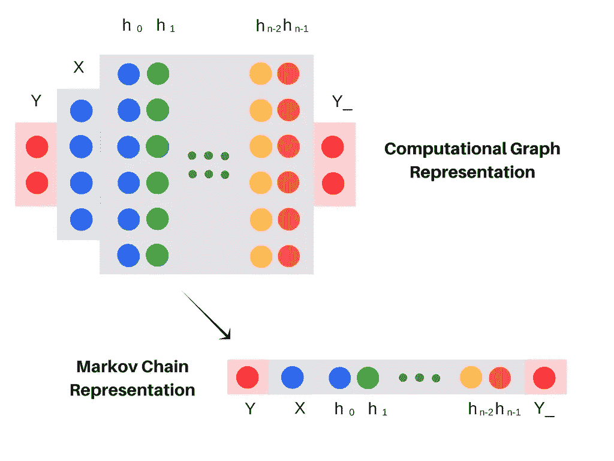

最后一层 Y_ 应该产生最小熵输出(相对于原始标签/类“Y”)。

*这个获取 Y_ 的过程就是在 X 层的信息流经 H 层的时候对其进行挤压，只保留与 Y 最相关的信息，这就是信息瓶颈。*

# 交互信息

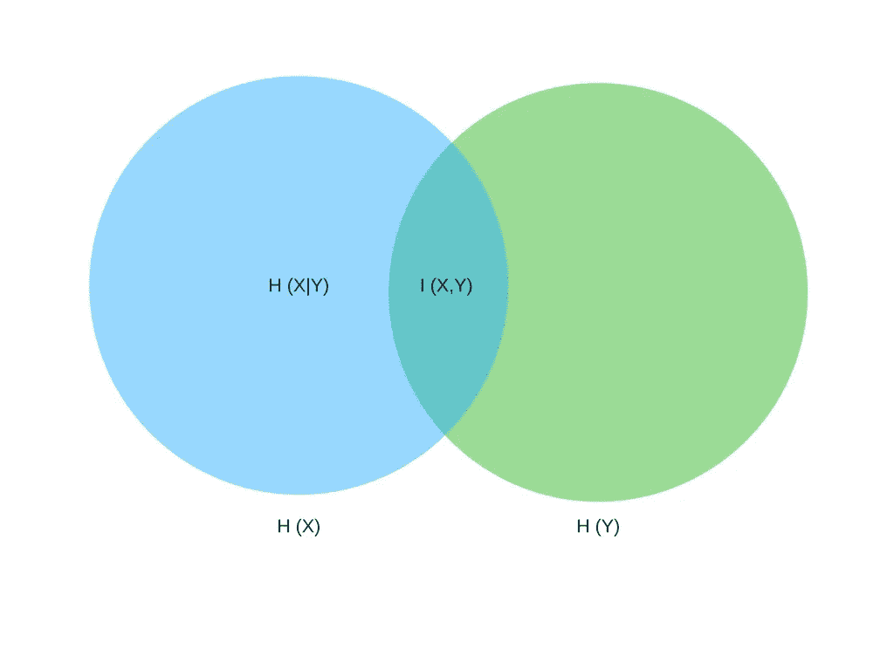

I(X，Y) = H(X) — H(X|Y)

H ->熵

h(X)-> X 的熵

H(X|Y) ->给定 Y 的 X 的条件熵

换句话说，H(X|Y)表示如果 Y 已知，从 X 中去除了多少不确定性。

## 互信息的性质

1.  当你沿着马尔可夫链移动时，互信息只会减少
2.  互信息对于重新参数化是不变的，即在图层中混排值不会改变输出

# 重温瓶颈

在神经网络的马尔可夫表示中，每一层都成为信息的一个分区。

在信息论中，这些划分被称为相关信息的连续细化。你不必担心细节。

另一种方式是将输入编码和解码成输出。

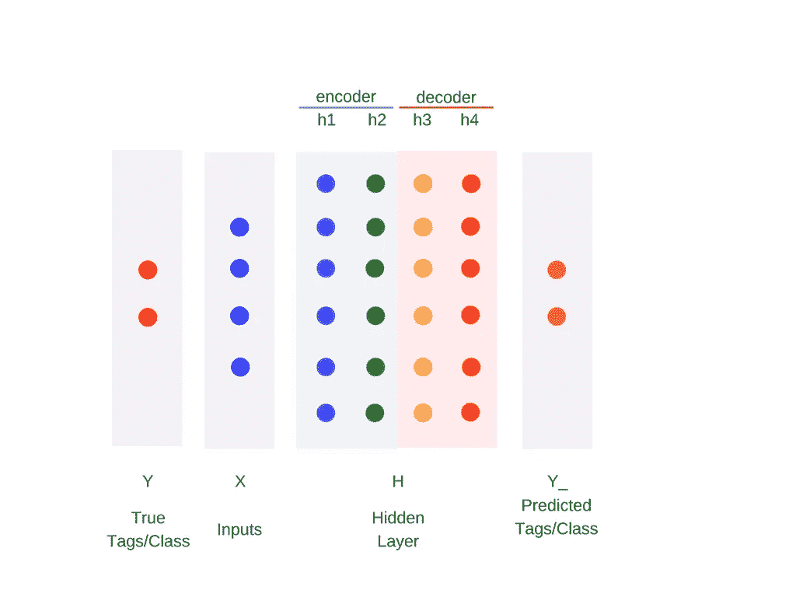

因此，对于足够的隐藏层:

1.  深度神经网络的样本复杂度由最后一个隐层的编码互信息决定
2.  精度由解码的最后一个隐藏层的互信息决定

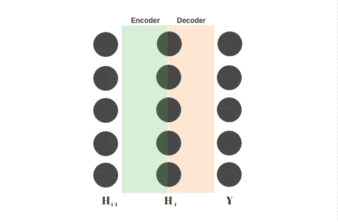

*样本复杂度是一个人需要获得一定准确度的样本的数量和种类。*

# 培训阶段的相互信息

我们计算相互之间的信息

1.  层和输入
2.  层和输出

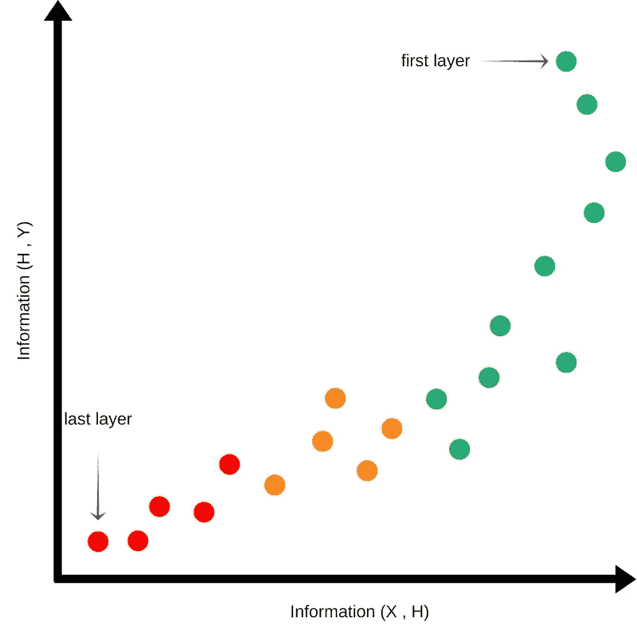

Initial Conditions

最初，权重是随机初始化的。因此，关于正确的输出几乎一无所知。对于连续层，关于输入的互信息减少，并且隐藏层中关于输出的信息也很少。

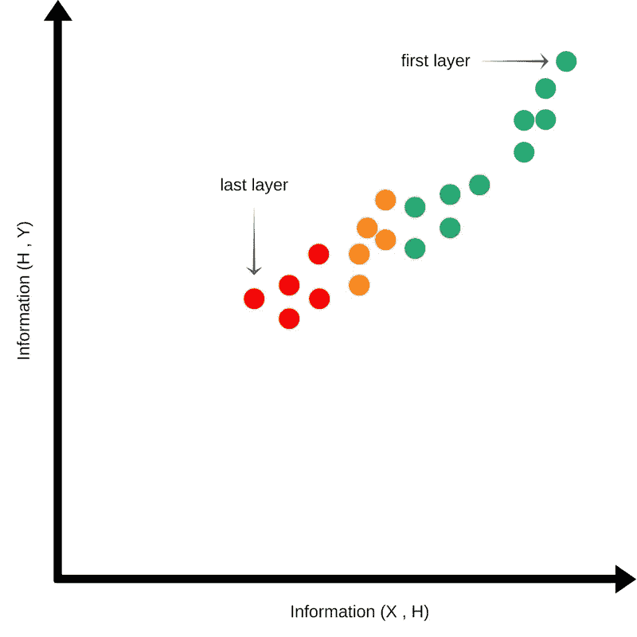

Compression Phase

当我们训练神经网络时，图开始向上移动，表示关于输出的信息的获得。

酪

图也开始向右侧移动，表示后面层中关于输入的信息增加。

这是他最长的阶段。这里，图的密度最大，图集中在右上方。这意味着与输出相关的输入信息的压缩。

这被称为压缩阶段。

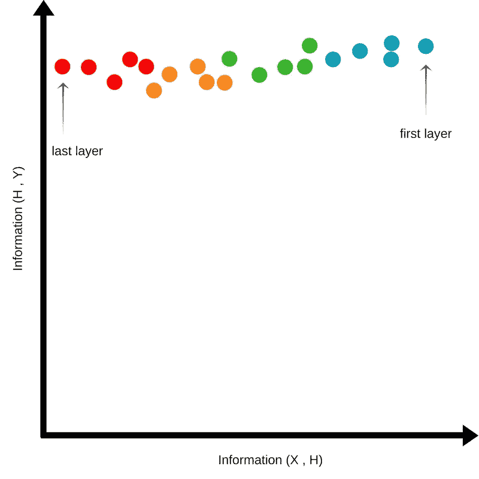

Expansion Phase

在压缩阶段之后，曲线开始向顶部移动，但也向左侧移动。

这意味着，在连续的层中，关于输入的信息会丢失，而在最后一层中保留的是关于输出的*最低熵信息*。

# 虚拟化

神经网络的马尔可夫链版本突出了一点，学习是从一层到另一层发生的。图层拥有预测输出所需的所有信息(外加一些噪声)。

所以我们用每一层来预测输出。这有助于我们窥视所谓黑盒的分层知识。

这给了我们一个视角，需要多少层才能对输出做出足够准确的预测。如果在较早的层达到饱和，则该层之后的层可以被修剪/丢弃。

这些层通常有数百或数千维。我们的进化不允许我们想象任何超越三维的事物。所以我们使用降维技术。

有各种方法来执行降维。克里斯托夫·奥拉有一个精彩的博客解释这些方法。我不会深入 t-SNE 的细节，你可以查看这个[博客](https://distill.pub/2016/misread-tsne/)了解详情。

为了保持简洁，SNE 霸王龙试图降低维数，将高维空间的邻居保留在低维空间。因此，这导致了相当准确的 2D 和三维绘图。

以下是具有两层的语言模型的层图。

关于情节:

1.  精选 16 个单词
2.  使用最终的语言模型找到上述 16 个单词的 N 个同义词(2D 的 N=200，3D 的 N=50)
3.  在每一层找到每个单词的表示向量
4.  使用 t-SNE 找出以上所选单词及其同义词的 2D 和三维简化表示
5.  绘制简化的表示

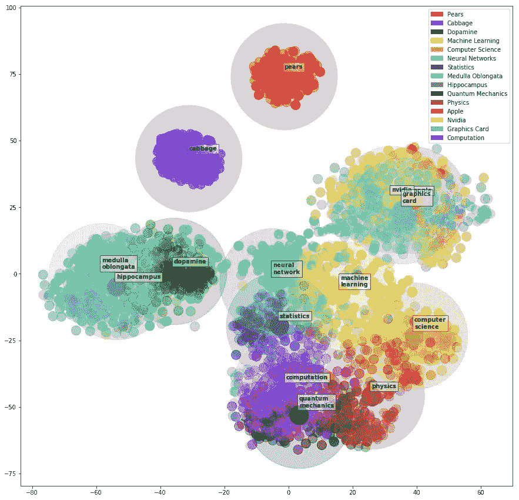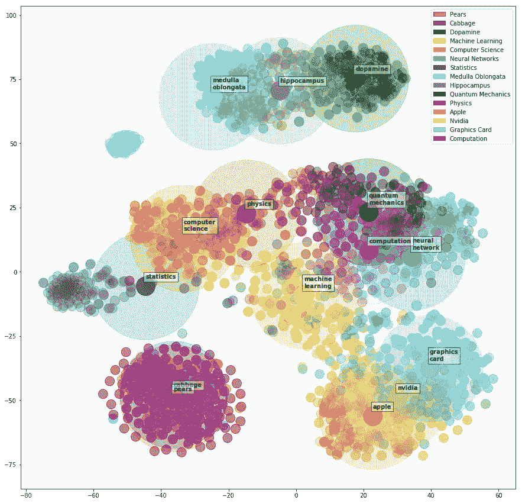

2D plots of Layer 1 and Layer 2

3D plots of Layer 1 and Layer 2

# 摘要

1.  几乎每个深度神经网络都像一个编码器-解码器
2.  大部分训练时间花在压缩阶段
3.  层是自下而上学习的
4.  在压缩阶段之后，神经网络对输入的遗忘越多，它就越准确(消除输入中不相关的部分)。

我已经把数学排除在这个博客之外了。如果你对信息论、博弈论、学习理论等数学足够熟悉，那么请观看 Mastero **Naftali Tishby** 的 [**视频**](https://www.youtube.com/watch?v=bLqJHjXihK8&t=856s) 。

> 谢谢\(-_- )/